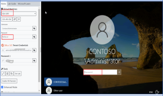
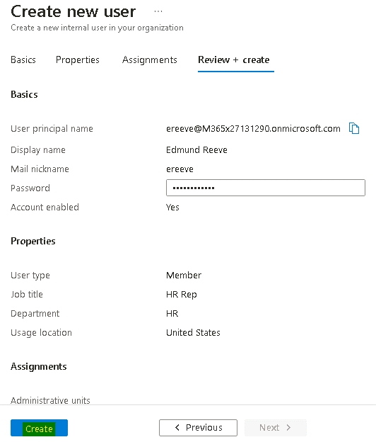
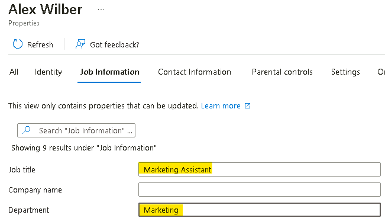
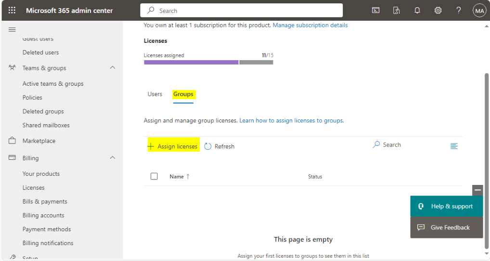

Lab01 - Verwalten von Identitäten in Microsoft Entra ID

**Zusammenfassung**

In dieser Übung verwenden Sie das Microsoft Entra Admin Center, um
Benutzer zu erstellen und zu ändern, Administratorrollen zuzuweisen,
Gruppen zu erstellen und zu ändern und Lizenzzuweisungen in Microsoft
Entra ID zu verwalten.

Übung 1: Erstellen von Benutzern in Microsoft Entra ID

**Szenario**

Sie müssen Benutzerkonten in Microsoft Entra ID für einige neue
Mitarbeiter erstellen, die nächste Woche beginnen. Neue Benutzer sind in
der folgenden Tabelle aufgeführt:

[TABLE]

**Hinweis**: Verwenden Sie für den Standort entweder Ihre lokale Region
oder die USA.

Ihnen wurde auch gesagt, dass in den nächsten Monaten mehrere weitere
Mitarbeiter eingestellt werden. Sie haben entschieden, dass die
Skripterstellung eine weitaus effizientere Methode ist, um eine große
Anzahl neuer Benutzer hinzuzufügen. Sie haben sich entschieden, ein
PowerShell-Skript zu erstellen und es beim Erstellen des Kontos von Cody
Godinez zu testen.

Aufgabe 1: Erstellen von Benutzern mithilfe des Microsoft Entra Admin
Centers

1.  Melden Sie sich [auf](urn:gd:lg:a:select-vm) ***SEA***-***SVR1***
    als [**Contoso\Administrator**](urn:gd:lg:a:send-vm-keys) mit dem
    Kennwort !\!! an.

> 

2.  Öffnen Sie den **Microsoft Edge-Browser,** und navigieren Sie zu. 

> !\!!

3.  Geben Sie an der Anmeldeaufforderung die **Office 365 Tenant
    credentials** auf der Registerkarte Start der Lab-Benutzeroberfläche
    ein.

> 

**Hinweis** – Wenn Sie für MFA heraufgestuft werden, schließen Sie den
MFA-Anmeldevorgang ab.

4.  Erweitern Sie im **Microsoft Entra Admin Center** die Option
    **Identity**, und wählen Sie im Navigationsbereich **User** aus.

> 
>
> Notieren Sie sich die Benutzer, die bereits als Mitglieder der
> Microsoft Entra ID-Domäne vorhanden sind. Jeder Benutzer ist
> aktiviert, wie in der Spalte **Account enabled** angegeben. In der
> Spalte **On-premises synced** **enabled** wird für alle aktuellen
> Benutzer No angezeigt. Dies gibt an, dass jeder Benutzer direkt in
> Microsoft Entra ID erstellt und nicht von einem lokalen
> Verzeichnisdienst synchronisiert wurde.
>
> 

5.  Klicken Sie auf der Seite **User | All User**, wählen Sie **New
    User** und dann **Create new User** aus.

> 

6.  Stellen Sie auf der Seite **New User** sicher, dass **Create User**
    ausgewählt ist, und geben Sie Folgendes ein:

    - User principal name: !\!!

    - Display Name: !\!!

    - Uncheck **Auto-generate password.**

    - Password **–** !!**P@55w.rd1234**!!

> 

7.  Geben Sie auf der Registerkarte **Properties** die folgenden
    Informationen ein und klicken Sie dann auf **Next Assignment.**

    - **Job title**, geben Sie !\!! ein.

    - **Department**, Geben Sie !!**H[R](urn:gd:lg:a:send-vm-keys)**!!
      ein

    - **Usage location - United States**

> 

8.  Klicken Sie auf der Registerkarte "Aufgaben" auf die Schaltfläche
    **Review + create.**

> 

9.  Überprüfen Sie die Details und klicken Sie dann auf die Schaltfläche
    **Create**.

> 
>
> 

10. Erstellen Sie auf ähnliche Weise das Benutzerkonto für Miranda
    Snider mit den folgenden Details.

    - User principal name:  !\!!

    - Display Name: !! [**Miranda Snider**](urn:gd:lg:a:send-vm-keys)!!

    - Uncheck **Auto-generate password.**

    - Password **–** !!**P@55w.rd1234**!!

    - Job title - !!**Helpdesk Manager**!!

    - Department **-** !!**Operations**!!

    - Usage location **- United States**

11. Wählen Sie das Benutzerkonto von **Allan Deyoung** aus und klicken
    Sie auf **Edit properties** und aktualisieren Sie die
    Jobinformationen mit den folgenden Details und klicken Sie dann auf
    die Schaltfläche **Save**.

    - Job title- !\!!

    -  Department - !\!!

> 

12. Wählen Sie das Benutzerkonto von **Joni Sherman** aus und klicken
    Sie auf **Edit properties** und aktualisieren Sie die
    Jobinformationen mit den folgenden Details und klicken Sie dann auf
    die Schaltfläche **Save**.

    - Job title- !!**ParaLegal**!!

    -  Department - !!**Legal**!!

> 

13. Wählen Sie das Benutzerkonto von **Alex Wilber** aus und klicken Sie
    auf **Edit properties** und aktualisieren Sie die Jobinformationen
    mit den folgenden Details und klicken Sie dann auf die Schaltfläche
    **Save**.

    - Job title - !!**Marketing Assistant**!!

    -  Department – !\!!

> 

Aufgabe 2: Erstellen von Benutzern mithilfe von PowerShell

1.  Klicken Sie auf [***SEA-SVR1***](urn:gd:lg:a:select-vm) auf der
    Taskleiste mit der rechten Maustaste auf **Start**, und wählen Sie
    dann **Windows PowerShell (Admin)** aus.

> 

2.  Geben Sie im **Windows PowerShell-Fenster** den folgenden Befehl
    ein, und drücken Sie dann **Enter**. Wenn. Wenn Sie dazu
    aufgefordert werden, geben Sie
    !\!! in den NuGet- und
    Repository-Nachrichten:

> !!**Install-Module MSOnline**!!
>
> 

3.  Geben Sie im **Windows PowerShell-Fenster** den folgenden Befehl
    ein, und drücken Sie dann **Enter**:

> !!**Connect-MsolService**!!
>
> 

4.  Melden Sie sich im Dialogfeld **Sign in to your account** mit den
    Anmeldeinformationen für den Office 365-Mandanten auf der
    Registerkarte Start an.

> **Hinweis – Wenn Sie aufgefordert wurden, das Kennwort für die
> Mandantenadministratoranmeldeinformationen zu ändern, stellen Sie
> sicher, dass Sie das aktualisierte Kennwort eingeben.**

5.  Geben Sie im **Windows PowerShell-Fenster** den folgenden Code ein,
    um einen neuen Benutzer zu erstellen, und drücken Sie dann
    **Enter**.

> Hinweis – Fügen Sie den folgenden Befehl in Editor ein, und ersetzen
> Sie die Mandantendetails, kopieren Sie dann den Befehl und fügen Sie
> ihn in Windows PowerShell ein, falls erforderlich, um sicherzustellen,
> dass die Mandanteninformationen korrekt sind
>
> !!**New-MsolUser -UserPrincipalName
> cgodinez@M365xXXXXXXXX.onmicrosoft.com -DisplayName "Cody Godinez"
> -FirstName "Cody" -LastName "Godinez" -Password ‘P@55w.rd1234’
> -ForceChangePassword $false -UsageLocation "US" -Title "Sales Rep"
> -Department "Sales"**!!
>
> 

1.  Geben Sie im **Windows PowerShell-Fenster** den folgenden Befehl
    ein, um die Kennwörter von Alew Wilber, Allan Deyoung und Joni
    Sherman zurückzusetzen

> !!**Get-MsolUser | Where-Object DisplayName -EQ "Alex Wilber" |
> Set-MsolUserPassword -NewPassword P@55w.rd1234 -ForceChangePassword
> $false**!!
>
> !!**Get-MsolUser | Where-Object DisplayName -EQ “Allan Deyoung” |
> Set-MsolUserPassword -NewPassword P@55w.rd1234 -ForceChangePassword
> $false**!!
>
> !!**Get-MsolUser | Where-Object DisplayName -EQ "Joni Sherman" |
> Set-MsolUserPassword -NewPassword P@55w.rd1234 -ForceChangePassword
> $false**!!
>
> 

6.  Geben Sie im **Windows PowerShell-Fenster** den folgenden Befehl
    ein, und drücken Sie dann **Enter**:

> !!**Get-MsolUser**!!

7.  Stellen Sie sicher, dass die Liste der Benutzer aus Ihrem Mandanten
    angezeigt wird. Achten Sie auch darauf, welchen Benutzern eine
    Lizenz zugewiesen ist. Keinem Benutzer mit dem **isLicensed-**Wert
    **False** wurde keine Lizenz zugewiesen.

> 

**Ergebnisse**: Nach Abschluss dieser Übung haben Sie erfolgreich neue
Benutzerkonten in Microsoft Entra ID erstellt.

Übung 2: Zuweisen von Administratorrollen in Microsoft Entra ID

**Szenario**

Sie müssen die aktuellen administrativen Rollen für Ihren Mandanten
überprüfen und ändern.

Ihnen wurde eine Liste von Benutzern zur Verfügung gestellt, denen
Administratorrollen zugewiesen werden sollten, wie in der folgenden
Tabelle angegeben.

[TABLE]

Aufgabe 1: Überprüfen und Zuweisen von Administratorrollen

1.  Wechseln Sie auf [***SEA-SVR1***](urn:gd:lg:a:select-vm) zu
    **Microsoft Edge**.

2.  Erweitern Sie im **Microsoft Entra Admin Center** im
    Navigationsbereich **Roles & admin.**

3.  Wählen Sie **Roles & admin** und suchen Sie nach !!**Global
    administrator**!! und klicken Sie auf die Rolle **Globale
    Administrator**.

> 

4.  Klicken Sie auf **Add assignments**.

> 

5.  Auf der Add assignments Seite, wählen Sie **Allan Deyoung** und
    wählen Sie dann **Add** aus.

> 

6.  Wählen Sie oben auf der Seite im Navigationslink die Option **Roles
    and administrators**.

> 

7.  Suchen Sie auf der Seite **" Roles and administrators** nach
    !!**Benutzer-Administrator**!!. Stellen Sie sicher, dass
    **Assignment** ausgewählt ist.

> 
>
> Beachten Sie, dass derzeit keine Benutzer der Rolle User admin
> zugewiesen sind.

8.  Klicken Sie auf + **Add assignments**.

> 

9.  Auf der Add assignments Seite, wählen Sie **Edmund Reeve** und dann
    wählen Sie **Add** aus.

> 

10. Klicken Sie auf den Link **Roles and administrators**, suchen Sie
    und wählen Sie !!**Helpdesk administrator**!!.

> 
>
> 
>
> Beachten Sie, dass derzeit keine Benutzer der Rolle
> "Helpdesk-Administrator" zugewiesen sind.

11. Auf der **Helpdesk administrator | Assignments** Seite, wählen sie
    **Add assignments** aus.

> 

12. Auf der Add assignments Seite, wählen Sie **Miranda Snider** und
    wählen Sie dann **Add** aus.

> 

13. Wählen Sie oben auf der Seite im Navigationslink die Option**Roles
    and administrators**.

> 

**Ergebnisse**: Nach Abschluss dieser Übung sollten Sie Benutzern
erfolgreich Administratorrollen zugewiesen haben.

Übung 3: Erstellen und Verwalten von Gruppen und Überprüfen der
Lizenzzuweisung.

**Szenario**

Sie müssen die drei neuen Benutzer zu einer Sicherheitsgruppe hinzufügen
und Lizenzen zuweisen, wie in der folgenden Tabelle angegeben.

[TABLE]

Sie wurden auch aufgefordert, das Unternehmensbranding für die
Anmeldeseite zu ändern.

Aufgabe 1: Erstellen von Gruppen mithilfe des Microsoft Entra Admin
Centers

1.  Erweitern Sie auf [***SEA-SVR1***](urn:gd:lg:a:select-vm) im
    **Microsoft Entra Admin Center** im Navigationsbereich die Option
    **Identity,** wählen Sie **Group** aus**,** und klicken Sie dann auf
    **New Group.**

> 

2.  Geben Sie auf der Seite **New Group** Folgendes ein:

    - Group type: **Security**

    - Group name: !\!!

    - Membership type: **Assigned**

3.  Klicken Sie unter Mitglieder auf **No members selected**.

4.  Fügen Sie auf der Seite Add members, **Edmund Reeve**, **Miranda
    Snider** hinzu, und klicken Sie dann auf **Select**.

> 

5.  Wählen Sie **Create** aus.

Aufgabe 2: Erstellen von Gruppen mithilfe von PowerShell

1.  Wechseln Sie auf [***SEA-SVR1***](urn:gd:lg:a:select-vm) zu Windows
    PowerShell.

2.  Geben Sie im Windows PowerShell-Fenster den folgenden Code ein, um
    eine neue Gruppe zu erstellen, und drücken Sie dann **Enter**:

> !!**New-MsolGroup -DisplayName "Contoso_Sales" -Description "Contoso
> Sales team users"**!!
>
> 

3.  Geben Sie im **Windows PowerShell-Fenster** den folgenden Befehl
    ein, und drücken Sie dann **Enter**:

> !!**Get-MsolGroup**!!
>
> 

4.  Stellen Sie sicher, dass Sie die Liste der Gruppen in Ihrem
    Mandanten abrufen, einschließlich der **Contoso_Sales Gruppe,** die
    Sie gerade erstellt haben.

> 

5.  Geben Sie im **Windows PowerShell-**Fenster den folgenden Code ein,
    um eine Variable als Contoso_Sales Gruppe zu definieren, und drücken
    Sie dann **Enter**:

> !!**$group = Get-MsolGroup | Where-Object {$\_.DisplayName -eq
> "Contoso_Sales"}**!!

6.  Geben Sie im **Windows PowerShell-**Fenster den folgenden Code ein,
    um eine andere Variable als Benutzer zu definieren, und drücken Sie
    dann **Enter**:

> !!**$user = Get-MsolUser | Where-Object {$\_.DisplayName -eq "Cody
> Godinez"}**!!

7.  Geben Sie im **Windows PowerShell-**Fenster den folgenden Code ein,
    um eine andere Variable als Benutzer zu definieren, und drücken Sie
    dann **Enter**:

> !!**Add-MsolGroupMember -GroupObjectId $group.ObjectId
> -GroupMemberType "User" -GroupMemberObjectId $user.ObjectId**!!

8.  Geben Sie im **Windows PowerShell-Fenster** den folgenden Code ein,
    und drücken Sie dann **Enter**:

> !! **Get-MsolGroupMember -GroupObjectId $group.ObjectId**!!

9.  Vergewissern Sie sich, dass **Cody Godinez** im Ergebnis der
    Befehlsausgabe angezeigt wird.

> 

10. Schließen Sie Windows PowerShell.

Aufgabe 3: Überprüfen von Lizenzen und Ändern des Unternehmensbrandings

1.  Erweitern Sie im Microsoft Entra Admin Center im Navigationsbereich
    die Option **Identity**, dann **Billing**, und wählen Sie
    **Licenses** aus.

> https://admin.microsoft.com/Adminportal/Home?referrer=entra#/licenses
>
> 

2.  Suchen Sie auf der Seite **Licenses** unter Subscriptions nach allen
    verfügbaren Lizenzen.

> 
>
> Hinweis: Notieren Sie sich die aktuell verfügbaren und zugewiesenen
> Lizenzen für **Enterprise Mobility + Security E5** und **Office 365 E5
> (ohne Teams)**
>
> 

3.  Wählen Sie im Microsoft 365 Admin Center im linken
    Navigationsbereich **Users** und dann **Active users**.

> 

4.  Wählen Sie in der Benutzerliste **Cody Godinez**.

> 

5.  Wählen Sie auf der Seite Cody Godinez die Option **Licenses and
    apps**

> 
>
> Beachten Sie, dass Cody keine aktuellen Lizenzzuweisungen hat.

6.  Aktivieren Sie auf der Seite **Licenses and apps** das
    Kontrollkästchen neben **Enterprise Mobility + Security
    E5** und **Office 365 E5 (no Teams)** und klicken Sie auf **Save
    changes**.

> 
>
> 

**Hinweis**: Wiederholen Sie die Schritte 4 bis 8 für die Zuweisung der
Lizenzen Enterprise Mobility + Security E5 und Office 365 E5 (keine
Teams) an Joni Sherman, Alex Wilber und Allan Deyoung, falls ihnen die
Lizenzen nicht zugewiesen sind.

7.  Erweitern Sie im Microsoft Entra Admin Center im Navigationsbereich
    die Option **Identity,** und wählen Sie **Group** aus.

> 

8.  Klicken Sie auf der Seite **Groups | All groups**, wählen Sie
    **Contoso_Managers**.

> 

9.  Wählen Sie auf der Seite **Contoso_Managers** \> **Licenses**.

> 
>
> **Beachten Sie, dass die Contoso_Managers Gruppe über keine aktuellen
> Lizenzzuweisungen verfügt.**

10. Navigieren Sie zum Microsoft 365 Admin Center, und scrollen Sie nach
    unten zu Lizenzen, wählen Sie **Enterprise Mobility + Security E5.**

> 

11. Klicken Sie auf die Registerkarte **Group** und klicken Sie auf
    **Assign licenses.**

> 

12. Wählen Sie Contoso_Mangers aus der Liste aus und klicken Sie auf
    **Assign.**

13. Erweitern Sie im Microsoft Entra Admin Center im Navigationsbereich
    die Option **Identity**, dann **Billing**, und wählen Sie
    **Licenses**.

> 
>
> 

14. Klicken Sie auf der Seite **Licenses|Overview**, wählen Sie unter
    **Manage** die Option **All products**.

> 
>
> 

15. Wiederholen Sie den gleichen Vorgang, und weisen Sie
    Contoso_Managers Team die Office 365 E5-Lizenz (ohne Teams) zu.

> Notieren Sie sich die Benutzer, denen die Office 365 E5-Lizenz (kein
> Teams) zugewiesen ist. Beachten Sie die Spalte Zuweisungspfade, die
> angibt, wie die Lizenzzuweisung für jeden Benutzer konfiguriert wird.
> Edmund und Miranda erhalten beide ihre Lizenzzuweisung durch ihre
> Mitgliedschaft in der Contoso_Managers Gruppe. Möglicherweise müssen
> Sie einige Male **Refresh** auswählen, um die Spalte Zuweisungspfad zu
> aktualisieren.
>
> 

16. Schließen Sie Microsoft Edge.

**Ergebnisse**: Nach Abschluss dieser Übung sollten Sie erfolgreich
Gruppen erstellt und verwaltet und Lizenzen zugewiesen haben.
