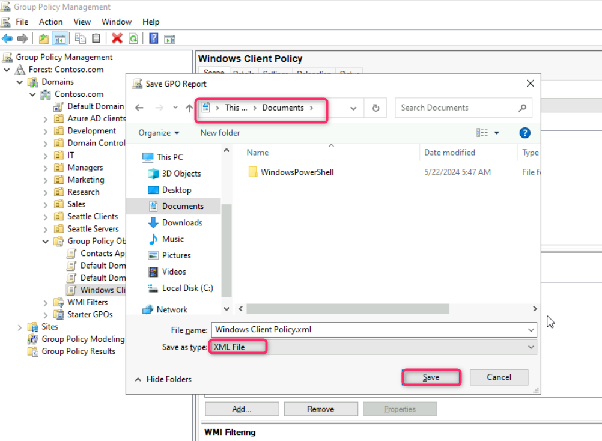
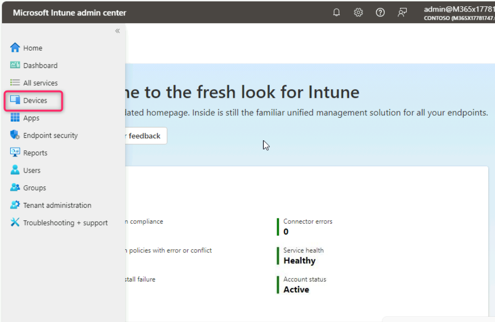
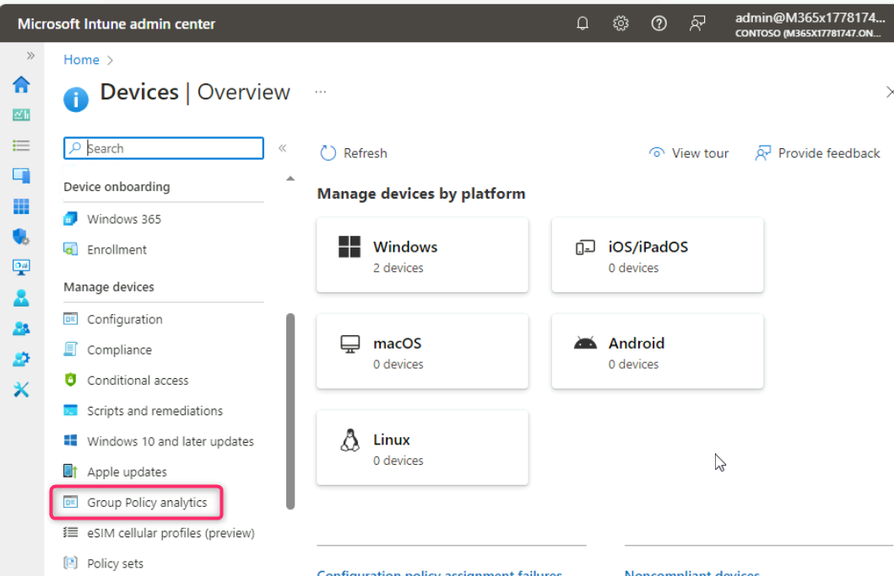

**실습 10 - 그룹 정책 분석을 사용하여 Microsoft Intune에서 GPO 지원
검증**

**요약**

이 실습에서는 그룹 정책 분석을 사용하여 Active Directory Group Policy
Object(그룹 정책 개체)(GPO)를 가져오고 동등한 Microsoft Intune MDM
정책을 지원하는 설정을 식별합니다.

**시나리오**

Contoso는 기존에 Active Directory GPO를 사용하여 도메인 전체에 컴퓨터 및
사용자 정책 설정을 배포해 왔습니다. 지원되는 모든 GPO 설정을 Microsoft
Intune 구성 프로필로 이동할 계획입니다. Windows 클라이언트 정책이라는
GPO가 있습니다. 그룹 정책 분석을 사용하여 Windows 클라이언트 정책 GPO의
설정을 검증하고 Intune으로 성공적으로 마이그레이션할 수 있는 설정을
파악해야 합니다.

**작업 1: Windows 클라이언트 정책 GPO를 XML 파일로 내보내기**

1.  제공된 자격 증명 검색 창을 사용하여 에 로그인하고 !!**Server
    Manager**!!를 입력한 다음 선택합니다.

> 

2.  **Server Manager - Dashboard**에서 **Tools** 를 선택한 다음 **Group
    Policy Management**를 선택합니다.

> 

3.  그룹 정책 관리 콘솔에서 **Forest:Contoso.com**을 확장한 다음
    **Domains**, **Contoso.com**을 차례로 확장하고 **Group Policy
    Objects**를 선택합니다.

> 여러 개의 그룹 정책 개체가 나열되어 있는지 확인하세요..

4.  세부 정보 창에서 **Windows Client Policy** GPO를 선택합니다.

> 

5.  **Windows Client Policy** 을 마우스 오른쪽 버튼으로 클릭한 다음
    **Save Report**을 선택합니다.

> 

6.  GPO 보고서 저장 대화 상자에서 **Documents**를 선택하고 **Save as
    type** 을 **XML file**로 변경한 다음 **Save를** 선택합니다.

> 

7.  그룹 정책 관리 콘솔을 닫습니다.

8.  서버 관리자를 닫습니다.

**작업 2: 그룹 정책 분석을 사용하여 Windows 클라이언트 GPO 분석**

1.  Microsoft Edge를 열고 주소 표시줄에
    !!**https://intune.microsoft.com**!!을 입력한 다음 **Enter**를
    누릅니다.

2.  메시지가 표시되면 Office 365 테넌트 자격 증명으로 로그인합니다.

3.  **Microsoft Intune admin center**에서 **Devices**를 찾아 선택합니다.

> 

4.  **Manage devices** 섹션으로 이동하여 **Group Policy analytics**을
    선택합니다.

> 

5.  **Devices | Group Policy analytics**  블레이드에서 **Import**를
    선택합니다.

> 

6.  **GPO file upload**탭에서 아래 이미지에 표시된 대로 **Select a
    file**검색 창 옆에 있는 폴더를 클릭합니다.

> 

7.  **Open** 상자에서 **Documents**를 선택한 다음 **Windows Client
    Policy.xml**을 선택합니다. 그런 다음 **Open** 버튼을 클릭합니다.

> 

8.  **Next** 버튼을 클릭합니다.

> 

9.  **Scope tags**에서 **Next** 버튼을 클릭합니다.

> 

10. **Review + create**탭에서 **Create** 버튼을 클릭합니다.

> 

11. Windows 클라이언트 정책 GPO가 즉시 가져와 분석됩니다. **Import GPO
    files**  페이지를 닫습니다.

> **Devices | Group Policy analytics**블레이드에서 **Windows Client
> Policy**옆에 있는 정보를 검토합니다.
>
> 설정의 89%가 MDM을 지원한다는 점에 유의하세요..
>
> 

12. MDM 지원에서 **89%**를 선택합니다.

> 각 **Setting Name**, **MDM Support** , **CSP Name**, 그리고 지원되는
> 각 설정의 **CSP Mapping** 을 확인하세요. 어떤 설정에 동일한 CSP 매핑이
> 없는지 확인하세요.
>
> 

13. **Windows Client Policy**  창을 닫습니다.

**작업 3: 그룹 정책 분석 요약 보고서 검토**

1.  **Microsoft Intune admin center** 탐색 메뉴에서 **Reports**를
    선택합니다.

> 

2.  **Reports** 페이지의 **Device management** 섹션에서 **Group Policy
    analytics**을 선택합니다.

> 

3.  세부 정보 창의 **Summary**에서 **Refresh**을 선택하세요. 새로 고침을
    여러 번 해야 할 수도 있습니다.

> 요약 보고서를 새로 고치고 작성하는 데 5~10분이 걸릴 수 있습니다.

4.  **Group policy migration readiness**  정보를 검토합니다.

> 
>
> 마이그레이션을 위해 준비된 정책이 여러 개 있고, 지원되지 않는 정책도
> 여러 개 있습니다.

5.  **Reports** 탭을 선택한 다음 **Group policy migration readiness**를
    선택합니다.

> 

6.  **Generate report**을 선택합니다.

> 

7.  그룹 정책 마이그레이션 준비 보고서는 각 설정과 관련된 정보와
    지원되는 프로필 유형을 제공합니다.

> 

8.  **Group policy migration readiness**창을 닫습니다.

**결과**: 이 연습을 완료하면 GPO를 성공적으로 내보내고 그룹 정책 분석을
사용하여 Intune에서 동등한 정책 설정을 검증할 수 있습니다.
