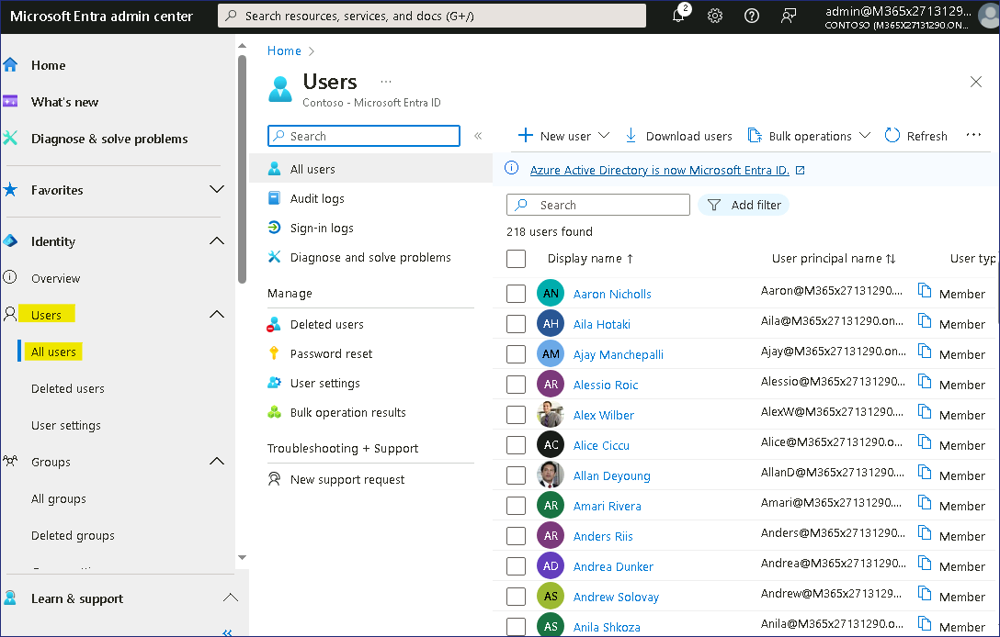
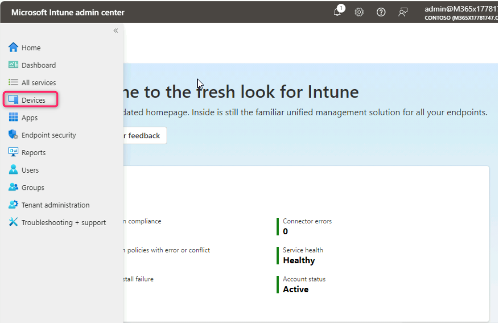
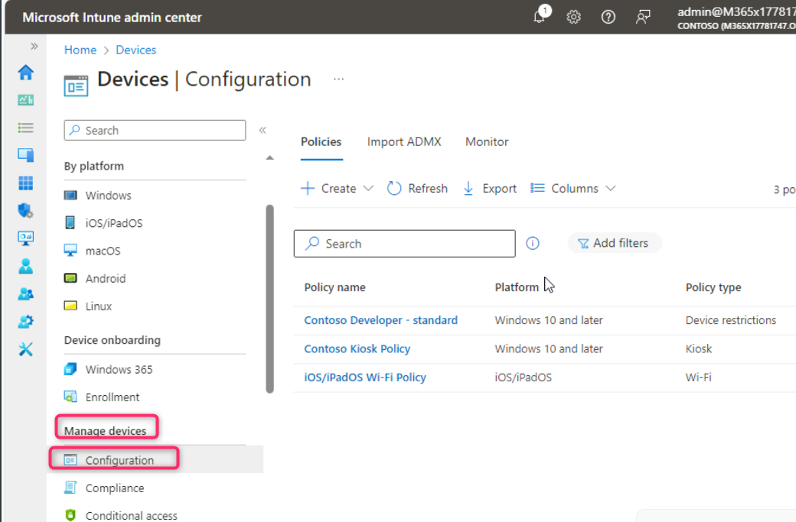
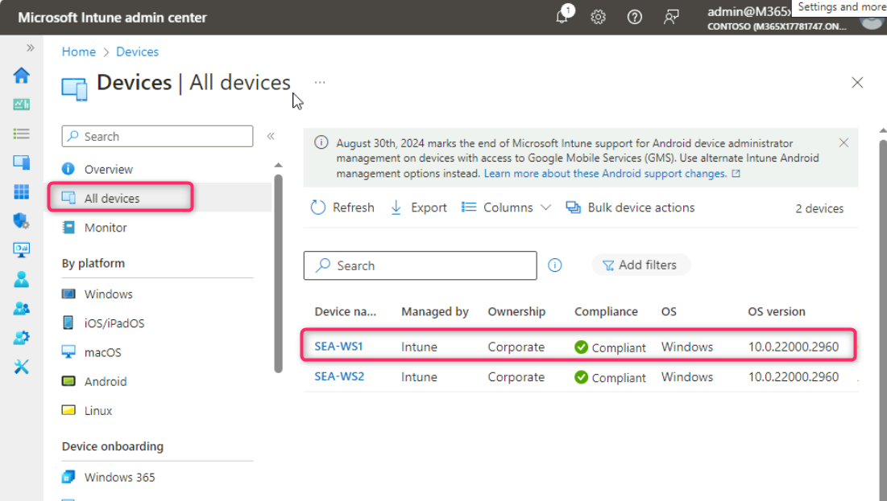
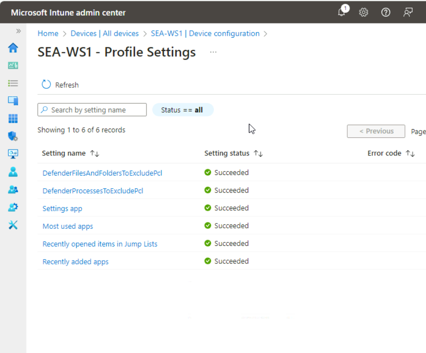

**실습11 - Intune에서 장치 및 사용자 활동 모니터링**

**요약**

이 실습에서는 사용자 로그인 활동, 감사 로그 및 장치 활동을
모니터링합니다.

**필수 조건**

이 실습을 시작하기 전에 다음 랩을 완료해야 합니다.

- 실습 1 - Microsoft Entra ID에서 ID 관리

- 실습 2 - Microsoft Entra Connect를 사용하여 ID 동기화

- 실습 5 - Microsoft Intune에 장치 등록 관리

- 실습 6 - Microsoft Intune에 장치 등록

- 실습 7 - 구성 프로필 생성 및 배포

**참고**: Microsoft Entra ID에 대한 Windows Hello 로그인 인증을 보호하는
데 사용되는 문자 메시지를 수신할 수 있는 휴대폰도 필요합니다.

**시나리오**

Cindy White의 로그인 활동과 감사 로그에서 제공하는 일반 정보를 검토해야
합니다. 또한
[*SEA-WS1*](https://labclient.labondemand.com/Instructions/e7cc4ae1-e3d9-4c55-accc-696f537e1e17?rc=10)의
하드웨어를 확인하고 이 장치에 할당된 구성 프로필이 성공적으로
적용되었는지 확인해야 합니다.

**작업 1: 사용자 활동 모니터링**

1.  [*SEA-SVR1*](https://labclient.labondemand.com/Instructions/e7cc4ae1-e3d9-4c55-accc-696f537e1e17?rc=10)로
    전환하고 필요한 경우 제공된 자격 증명으로 로그인합니다.

2.  **Microsoft Entra admin center** 페이지에서 **Users**를 찾아 선택한
    다음 **All users를** 클릭합니다.

> 

3.  **Users** 페이지에서 **Allan Deyoung**을 찾아 선택합니다.

> 

4.  **Allan Deyoung**사용자 페이지에서 **Sign-in logs**를 찾아
    클릭합니다.

> 

5.  **Allan Deyoung | Sign-in logs** 페이지에서 **User sign-ins
    (interactive)**탭 아래의 첫 번째 항목을 클릭합니다.

> 

6.  **Basic info**, **Location**, **Device info**, **Authentication
    Details**, **Conditional Access**를 포함한 각 주요 페이지를
    선택하세요. 아래로 스크롤하여 각 페이지의 정보를 확인하세요. 각
    페이지에 제공된 정보를 주의 깊게 검토한 후 창을 닫습니다.

> 
>
> 
>
> 
>
> 
>
> 

7.  사용자 탐색 창에서 **Audit logs**를 선택합니다.

8.  세부 정보 창에는 사용자 관리 변경 사항에 대한 감사 정보가
    표시됩니다. 다양한 항목을 선택하여 정보를 검토합니다.

> 
>
> 

**작업 2: 장치 활동 모니터링**

1.  **Microsoft Intune admin center** 창으로 전환하여 **Devices**를 찾아
    클릭합니다.

2.  장치 탐색 창에서 **Overview**를 선택합니다.

> 

3.  아래로 스크롤하여 다음 내용을 검토하세요.:

- Configuration policy assignment failures

- Noncompliant devices.

- Deployment status per Windows update ring.

> 

4.  **Manage devices**섹션까지 아래로 스크롤하여 **Configuration**을
    클릭하세요. 구성 세부 정보를 검토합니다.

> 

5.  위로 스크롤하여 **All devices**를 선택하세요. **Devices | All
    devices**페이지에는 장치 이름, 관리자, 소유권, 규정 준수, OS, OS
    버전 등 장치 정보가 표시됩니다. **SEA-WS1**을 클릭합니다.

> 

6.  SEA-WS1 ​​탐색 ​​창에서 **Hardware**를 선택하고 하드웨어 인벤토리를
    조사합니다.

> 

7.  SEA-WS1 ​​탐색 ​​창에서 **Discovered apps** 을 선택하고 앱 인벤토리를
    조사합니다.

> 

8.  SEA-WS1 ​​탐색 ​​창에서 **Device configuration** 을 선택하고 세부 정보
    창에서 해당 장치에 할당된 Device configuration profiles을
    확인합니다. **State**열에 **Succeeded가** 표시되어야 하며, 이는
    프로필이 장치에 성공적으로 적용되었음을 의미합니다.

> 

9.  **SEA-WS1 | Device configuration** 페이지에서 **Contoso Developer –
    standard**를 클릭합니다.

> 

10. **Contoso Developer – standard**블레이드에서 프로필에 구성한 각
    설정을 기록해 둡니다.

> **State**는 모든 항목 옆에 **Succeeded를** 표시해야 합니다.
>
> 

**결과**: 이 연습을 완료하면 사용자 로그인 활동, 감사 로그 및 장치
활동을 성공적으로 모니터링할 수 있습니다.
