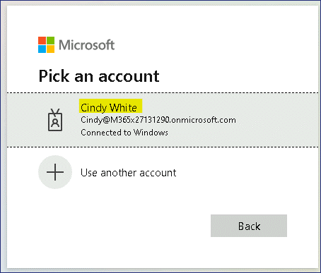
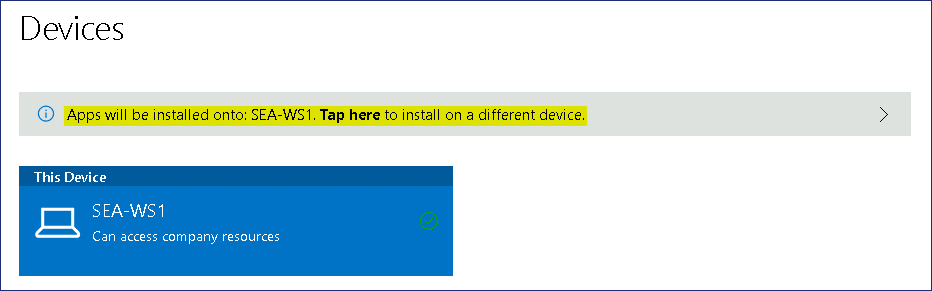

실습12 - Microsoft Intune을 사용하여 클라우드 앱 배포

**요약**

이 실습에서는 Intune과 회사 포털 웹사이트를 사용하여 클라우드 기반 앱을
만들고 배포합니다.

**필수 조건**

이 실습을 시작하기 전에 다음 실습을 완료해야 합니다.

- 실습 1 - Microsoft Entra ID에서 ID 관리

- 실습 2 - Microsoft Entra Connect를 사용하여 ID 동기화

- 실습 5 - Microsoft Intune에 장치 등록 관리

- 실습 6 - Microsoft Intune에 장치 등록

- 실습 7 - 구성 프로필 생성 및 배포

**참고**: Microsoft Entra ID에 대한 Windows Hello 로그인 인증을 보호하는
데 사용되는 문자 메시지를 수신할 수 있는 휴대폰도 필요합니다.

연습 1: Microsoft Intune에 Microsoft Store 앱 추가

**시나리오**

Contoso Corporation의 데스크톱과 앱을 관리하기 위해 Microsoft Intune을
사용하고 있습니다. 연구 부서는 업무 수행을 위해 다양한 서버에 자주
접속하며, 연구 팀원들이 필요에 따라 설치할 수 있도록 Microsoft 원격
데스크톱 앱을 제공해 달라고 요청했습니다. Microsoft 원격 데스크톱은
Microsoft Store에서 다운로드할 수 있지만, 사용자가 회사 포털
웹사이트에서 액세스할 수 있도록 Intune에 앱을 추가하기로 했습니다. Aaron
Nicholls라는 연구 팀원은 포털에 앱을 게시한 후 설치 과정을 테스트하기로
했습니다.

작업 1: Microsoft Intune에 Microsoft 원격 데스크톱 추가

1.  필요한 경우
    [***SEA-SVR1***](https://labclient.labondemand.com/Instructions/e7cc4ae1-e3d9-4c55-accc-696f537e1e17)에서
    [**Contoso\Administrator**](https://labclient.labondemand.com/Instructions/e7cc4ae1-e3d9-4c55-accc-696f537e1e17)로
    로그인하고 비밀번호는 !\!!
    입니다. **Server Manager**를 닫습니다.

2.  타스크바에서 **Microsoft Edge**를 선택합니다.

3.  Microsoft Edge에서 주소창에 !!
    [**https://Intune.microsoft.com**](urn:gd:lg:a:select-vm)!!을 입력한
    다음 **Enter**를 누릅니다.

4.  홈 탭에서 Office 365 테넌트 자격 증명을 사용하여 로그인합니다.

5.  **Microsoft Intune admin center** 페이지에서 **Apps**를 선택합니다.

> 

6.  **Apps**  페이지의 탐색 창에서 **All apps**을 선택합니다.

7.  세부 정보 창에서 **+Add**를 선택합니다.

> 

8.  **Select app type** 페이지에서 드롭다운 메뉴를 클릭한 다음
    **Microsoft store app (new)**선택합니다.

> 
>
> Microsoft Store 앱에 대한 정보를 읽고 **Select를** 클릭하세요. **Add
> App** 페이지가 열립니다.

9.  **App information**페이지에서 **Search the** **Microsoft Store app
    (new)** 링크를 클릭합니다.

> 

10. **Search the** **Microsoft Store app (new)** 탭에서 !! [**Microsoft
    Remote
    Desktop**](https://labclient.labondemand.com/Instructions/e7cc4ae1-e3d9-4c55-accc-696f537e1e17)!!을
    검색하여 선택한 다음 select 버튼을 클릭합니다.

> 

11. 앱 추가 탭으로 돌아가서 다음 정보를 입력한 후 **Next를** 선택합니다:

    - Category: **Business**

    - Show this as a featured app in the Company Portal: **Yes**

> 

12. **Assignments** 탭에서 + **Add group**를 클릭합니다.

> 

13. **Select groups** 페이지에서 **Research, Sales**  그룹을 선택한 다음
    **Select**를 클릭합니다.

> 

14. **Next** 버튼을 클릭합니다.

> 

15. Review + create탭에서 **Create** 버튼을 클릭합니다.

> 

16. Microsoft 원격 데스크톱 페이지가 열립니다.

> 속성, 장치 설치 상태 및 사용자 설치 상태 노드를 확인하세요.
>
> 

작업 2: Microsoft Intune 콘솔에서 정책 동기화 강제 실행

1.  **Microsoft Intune admin center**에서 **Devices**를 선택한 다음
    **All devices**를 선택합니다.

2.  세부 정보 창에서 **SEA-WS1**을 선택합니다.

> 

3.  **SEA-WS1**  ​​블레이드에서 **Sync** 를 선택하고 메시지가 표시되면
    **Yes**를 선택합니다.

> 
>
> Microsoft Intune이 장치에 연결하여 모든 정책을 동기화합니다. 이
> 작업에는 최대 5분이 소요될 수 있습니다.

작업 3: 회사 포털 웹사이트에서 앱 설치

1.  Cindy White라는 계정으로 SEA-WS1에 로그인하세요. 계정 정보는 !!
    **Cindy@M365xXXXXXX.onmicrosoft.com**!!이고, 비밀번호는 !!
    **P@55w.rd1234**!!이며, PIN은 !!**102938**!!입니다.

2.  작업 표시줄에서 **Microsoft Edge**를 선택합니다.

3.  필요한 경우 **Welcome to Microsoft Edge** 에서 **Confirm and
    continue**를 선택합니다. Welcome 페이지를 닫습니다.

4.  주소창에서 !!
    [**https://portal.manage.microsoft.com**](urn:gd:lg:a:send-vm-keys)!!으로
    이동합니다.

5.  !!**Cindy@M365xXXXXXX.onmicrosoft.com**!!으로 로그인합니다.

> 

6.  Contoso 웹 포털에서 **Devices**를 선택합니다.

> 

7.  장치 페이지에서 **Tap here to tell us which device you're using or
    add a new device**를 선택하거나 **New device**를 추가합니다.

> 

8.  **Which device are you using** 대화 상자에서 **SEA-WS1**​​옆에 있는
    옵션을 선택한 다음 **Select**버튼을 클릭합니다.

> 
>
> 이제 메시지가 앱이 **SEA-WS1**에 설치됩니다로 변경됩니다.
>
> 

9.  왼쪽 상단 모서리에서 탐색 버튼을 선택한 다음 **Downloads &
    updates**를 선택합니다.

> 

10. 나열된 결과에서 상태를 확인하세요. **Microsoft Remote Desktop** 앱이
    **Installed**으로 표시되어야 합니다.

> **참고** - 앱이 표시되는 데 최대 10~20분 정도 걸릴 수 있습니다.
>
> 

11. **Start** **Menu**를 클릭하고 시작 메뉴에 **Remote Desktop** 이
    표시되는지 확인합니다.

> 

**결과**: 이 연습을 완료하면 Microsoft Intune에서 Microsoft Store 앱을
성공적으로 추가하고 설치하게 됩니다.

연습 2: Microsoft Intune에서 Microsoft 365 앱 구성 및 배포

**시나리오**

Contoso 연구 부서의 모든 사용자에게 Microsoft 365 앱이 필요합니다.
64비트 버전의 Microsoft Excel, Outlook, PowerPoint, Word를 Windows
기기에 배포하라는 요청을 받았습니다. 또한 업데이트를 위해 현재 채널에
맞게 구성되었는지 확인해야 합니다.

작업 1: SEA-WS1에 설치된 앱 확인

1.  [***SEA-WS1***](urn:gd:lg:a:send-vm-keys)의 작업 표시줄에서
    **Start**를 선택한 다음 **Settings**  앱을 선택합니다.

> 

2.  **Settings** 앱에서 **Apps**를 선택한 다음 **Apps & features**을
    선택합니다.

> 
>
> **Microsoft 365 Apps for enterprise - en-us**가 나열되어 있지 않은지
> 확인하세요.
>
> 

3.  Close all open windows. 열려 있는 모든 창을 닫습니다.

작업 2: Microsoft Intune에 Microsoft 365 앱 추가

1.  **Microsoft Intune admin center**에서
    [***SEA-SVR1***](urn:gd:lg:a:send-vm-keys)로 전환하고 **Apps**를
    선택합니다.

2.  **Apps | Overview** 블레이드에서 **All Apps**를 선택합니다. 세부
    정보 창에서 **+Add**를 선택합니다.

> 

3.  **Select app type**블레이드의 **Microsoft 365 Apps**에서 **Windows
    10 and later**를 선택한 다음 **Select**를 클릭합니다.

> 

4.  **Add Microsoft 365 Apps** 블레이드에서 다음 옵션을 구성하고
    **Next**를 선택합니다:

    - Suite Name: !\!!

    - Suite Description: !\ !! (Select **Edit
      Description** to enter this information.)

> 

5.  **Configure app suite**  탭에서 **Select Office apps** 드롭다운을
    확장하고 다음 Office 앱을 선택합니다:

    - Excel

    - Outlook

    - PowerPoint

    - Word

> 

6.  **Configure app suite**  탭에서 다음 옵션을 구성하고 **Next**를
    선택합니다:

    - Architecture: **64-bit**

    - Default file format: **Office Open XML Format**

    - Update channel: **Current Channel**

    - Accept the Microsoft Software License Terms on behalf of
      users: **Yes**

> 

7.  **Assignments** 탭의 **Required** 섹션에서 **Add group를**
    선택합니다.

> 

8.  **Select groups** 블레이드에서 **Research**를 선택한 다음
    **Select**를 선택합니다.

> 

9.  **Next**를 선택합니다.

> 

10. **Review + Create** 탭에서 **Create**를 선택합니다.

> 

11. **Microsoft 365 Apps (Research)** 페이지에서 **Propertie**를
    선택합니다.

> 

12. 세부 정보 창에서 **Research** 가 **Assignments** 섹션의 **Required**
    항목에 나열되어 있는지 확인합니다.

> 

작업 3: Microsoft Intune 콘솔에서 정책 동기화 강제 실행

1.  **Microsoft Intune admin center**에서 **Devices**를 선택한 다음
    **All devices**를 선택합니다.

2.  세부 정보 창에서 **SEA-WS1**을 선택합니다.

> 

3.  **SEA-WS1** ​​블레이드에서 **Sync**를 선택하고 메시지가 표시되면
    **Yes**를 선택합니다.

> 
>
> Microsoft Intune이 장치에 접속하여 모든 정책을 동기화합니다. 이
> 작업에는 최대 5분이 소요될 수 있습니다.

작업 4: Microsoft 365 앱이 설치되었는지 확인

1.  이미 **Cindy White** 계정으로
    [*SEA-WS1*](urn:gd:lg:a:send-vm-keys?rc=10)에 로그인되어 있는 경우

> **참고** – Microsoft 365 Suite가 장치에 설치되려면 약 10~15분 정도
> 기다려야 할 수 있습니다.

2.  에서 로그아웃한 후 **Cindy White** 계정으로 다시 로그인합니다. 계정
    정보는 !! **Cindy@M365xXXXXXX.onmicrosoft.com**!!이고 비밀번호는 !!
    **P@55w.rd1234**!!입니다.

3.  [***SEA-WS1***](urn:gd:lg:a:send-vm-keys)의 작업 표시줄에서
    **Start**를 선택한 다음 **Settings** 앱을 선택합니다.

> 

4.  **Settings** 앱에서 **Apps** 을 선택하고 **Apps & features** 
    페이지를 선택합니다.

> 

5.  !! **Microsoft 365**!!를 검색하고 **Microsoft 365 Apps for
    enterprise - en-us** 가 나열되어 있는지 확인합니다.

> 

6.  **Settings**  앱을 닫고 **Start** 버튼을 선택합니다.

7.  **Recommended**섹션에서는 Microsoft Intune의 Microsoft 365 앱에서
    선택된 새로 설치된 앱을 볼 수 있습니다.

> 

작업 5: Microsoft Intune에서 앱 설치 상태 모니터링

1.  [***SEA-SVR1***](urn:gd:lg:a:select-vm)로 전환하고 **Microsoft
    Intune admin center**에서 **Apps**를 선택합니다.

> 

2.  **Apps | Overview**  블레이드에서 **Monitor**를 선택한 다음 **App
    install status**를 선택합니다.

> 

3.  세부 정보 창에서 **Microsoft 365 Apps (Research)**.을 선택합니다.

> 

4.  세부 정보 창의 **Device status** 및 **User status**에서 설치됨
    아래에 **1**이 표시되는지 확인합니다.

> 
>
> **참고**: 이는 앱이 한 기기에 한 명의 사용자용으로 설치되었음을
> 나타냅니다. 정보가 표시되는 데 시간이 걸릴 수 있으며, **Install
> Pending**로 표시될 수 있습니다.
>
> **참고** – **실습 13**을 시작한 후 **30~45**분 후에 다시 확인해
> 보세요.

5.  **Device install status**를 선택하세요.

> 세부 정보 창에서 앱이 설치된 기기와 사용자 이름을 확인할 수 있습니다.
> **Device Name** 열에는 **SEA-WS1**이, **Status** 열에는
> **Installed**가 표시되어야 합니다. 이는 앱이 **SEA-WS1**에 설치되어
> 있음을 의미합니다.
>
> 

6.  **Microsoft Intune admin center**에서 **Devices를** 선택합니다.

7.  **Devices | Overview** 블레이드에서 **All devices** 를 선택한 다음
    세부 정보 창에서 **SEA-WS1**을 선택합니다.

> 

8.  **SEA-WS1 ​​**블레이드에서 **Managed Apps**을 선택합니다.

9.  **SEA-WS1 | Managed Apps**  블레이드의 세부 정보 창에서 **Microsoft
    365 Apps (Research)**을 선택합니다.

> 
>
> **Microsoft 365 Apps (Research) - Installation details** 창에서는
> 애플리케이션의 전체 수명 주기를 볼 수 있습니다. 즉, 생성, 할당, 설치
> 시간 및 상태, 마지막으로 장치가 체크인된 시간(Microsoft Intune과
> 동기화됨)을 볼 수 있습니다.
>
> 

10. 열려 있는 모든 창을 닫습니다

**결과**: 이 연습을 완료하면 Microsoft Intune에서 Microsoft 365 앱을
성공적으로 구성하고 배포할 수 있습니다.
