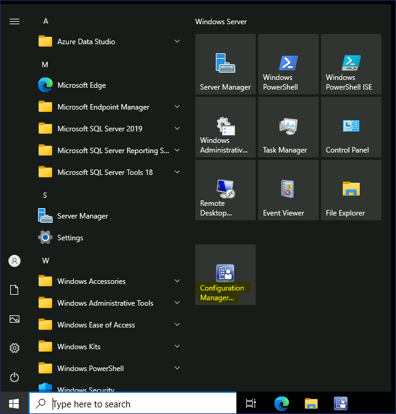

실습14 - Endpoint Configuration Manager를 사용하여 앱 배포

**요약**

이 실습에서는 Microsoft Endpoint Configuration Manager를 사용하여
데스크톱 클라이언트 워크스테이션에 애플리케이션을 배포합니다.

**시나리오**

Contoso는 Microsoft Endpoint Configuration Manager를 사용하여 온프레미스
Active Directory 네트워크 환경 내의 데스크톱 워크스테이션을 관리합니다.
Windows 11 Configuration Manager 클라이언트에 Microsoft Power BI
Desktop이라는 새 애플리케이션을 배포해야 합니다. Endpoint Configuration
Manager 관리자가 이미 애플리케이션 개체를 생성해 놓았습니다. 작업에는
대상 장치용 컬렉션을 만들고, 애플리케이션 콘텐츠를 배포 지점에 배포하고,
대상 컬렉션에 할당된 배포를 만드는 작업이 포함됩니다. SEA-CL1의
소프트웨어 센터에 애플리케이션이 표시되는지 확인하여 프로세스를
확인합니다.

작업 1: 장치 컬렉션 만들기

1.  [***SEA-CFG1***](urn:gd:lg:a:select-vm)로 전환하고
    [**Contoso\Administrator**](urn:gd:lg:a:send-vm-keys) 로 로그인하고
    비밀번호는 !! [**Pa55w.rd**](urn:gd:lg:a:send-vm-keys)!!입니다.

2.  작업 표시줄에서 **Configuration Manager Console**을 선택합니다.
    Microsoft Endpoint Configuration Manager 콘솔이 열립니다.

> 

3.  **Assets and Compliance**  작업 영역에서 **Device Collections**를
    선택합니다.

> 

4.  **Device Collections** 을 마우스 오른쪽 버튼으로 **Create Device
    Collection**를 선택합니다. Create Device Collection Wizard가
    열립니다.

> 

5.  **General** 페이지에서 다음을 구성한 후 **Next**를 선택합니다:

    - Name: !\!!

    - Comment: !\!!

    - Limiting collection: **All Windows 11 Workstations**

> 

6.  **Membership Rules** 페이지에서 **Next**를 선택합니다. 구성 관리자
    경고 메시지가 나타나면**OK**를 선택합니다. 이후 단계에서 직접 멤버를
    추가합니다.

> 
>
> 

7.  **Summary**페이지에서 **Next**를 선택한 다음 **Completion**
    페이지에서 **close**를 선택합니다.

> 
>
> **Power BI App Deployment**  컬렉션이 장치 컬렉션 목록에 표시됩니다.
>
> 

작업 2: 기존 컬렉션에 장치 할당

1.  **Assets and Compliance**  작업 영역에서 **Devices**를 선택합니다.

> 목록에 나열된 장치를 확인합니다. 녹색 원 안에 흰색 확인 표시가 있는
> 장치는 현재 활성화되어 있습니다.
>
> 

2.  세부 정보 창에서 **SEA-CL1**을 선택합니다.

3.  [***SEA-CL1***](urn:gd:lg:a:select-vm)을 마우스 오른쪽 버튼으로
    클릭하고 ' **Add Selected Items**를 가리킨 다음 **Add Selected Items
    to Existing Device Collection**를 선택합니다.

> 

4.  **Select Collection** 대화 상자에서 **Power BI App Deployment**를
    선택한 다음 **OK**를 선택합니다.

> 

5.  확인하려면 **Assets and Compliance**  작업 영역에서 **Device
    Collections** 을 선택한 다음 **Power BI App Deployment**를 두 번
    클릭합니다.

> 
>
> [***SEA-CL1***](urn:gd:lg:a:select-vm) 은 이 컬렉션의 멤버로
> 나열되어야 합니다.
>
> 

작업 3: 배포 유형 구성

1.  Microsoft Endpoint Configuration Manager 콘솔에서 **Software
    Library** 작업 영역을 선택합니다.

> 

2.  **Software Library** 작업 영역에서 **Application Management** 를
    확장한 다음 **Applications**을 선택합니다.

> 
>
> 
>
> Endpoint Configuration Manager 관리자가 만든 애플리케이션을
> 확인합니다.

3.  세부 정보 **Microsoft Power BI Desktop (x64)**을 선택합니다.

> 

4.  결과 창에서 **Deployment Types** 탭을 선택합니다. Windows Installer
    기반 배포 유형이 하나 있습니다.

> 

5.  **Microsoft Power BI Desktop (x64) - Windows installer**  배포
    유형을 마우스 오른쪽 버튼으로 클릭한 다음 **Properties**를
    선택합니다.

> 

6.  **Properties**  대화 상자에서 **Programs**탭을 선택합니다. 응용
    프로그램 설치 방식을 확인하세요. msiexec 명령에 /q 스위치를 사용하면
    자동으로 설치됩니다.

> 

7.  **Properties** 대화 상자에서 **Requirements**탭을 선택한 다음
    **Add**를 선택합니다.

> 

8.  **Create Requirement**  대화 상자에서 다음을 구성한 다음 **Ok**를
    선택합니다:

    - Category: **Device**

    - Condition: **Operating System**

    - Rule type: **Value**

    - Operator: **One of Windows 11 (Select the check box next to
      Windows 11)**

> 

9.  **Properties** 대화 상자에서 **OK**를 선택합니다. 이 요구 사항을
    충족하면 Windows 11을 제외한 모든 운영 체제에 앱이 설치되지
    않습니다.

> 

작업 4: 배포 지점에 콘텐츠 배포

1.  **Software Library**  작업 영역에서 **Microsoft Power BI Desktop
    (x64)**을 선택합니다.

2.  **Microsoft Power BI Desktop (x64)** 을 마우스 오른쪽 버튼으로
    클릭하고 **Distribute Content**를 선택합니다.

> 

3.  **General** 페이지에서 **Next**를 선택합니다.

> 

4.  **Content** 페이지에서 **Next**를 선택합니다.

> 

5.  **Content Destination**  페이지에서 **Add**를 선택한 다음
    **Distribution Point**를 선택합니다.

> 

6.  **Add Distribution Points**  대화 **SEA-CFG1.CONTOSO.COM**옆에 있는
    확인란을 선택한 다음 **OK**를 선택합니다.

> 

7.  **Content Destination**페이지에서 **Next를** 선택합니다.

> 

8.  **Summary**페이지에서 **Next**를 선택한 다음 **Close**를 선택합니다.

> 
>
> 

9.  **Summary** 탭에서 **Content Status**를 선택합니다.

> 
>
> Microsoft Power BI Desktop의 콘텐츠 상태 페이지가 열립니다. 결과
> 창에서 녹색 원이 표시되고 원 옆에 Success:1이 표시되는지 확인하세요.
> 이는 콘텐츠가 배포 지점에 배포되었으며 이제 장치에 배포할 수 있음을
> 나타냅니다. 리본에서 새로 고침 버튼을 선택해야 할 수도 있습니다.
>
> 

10. 왼쪽 상단 모서리에서 " **Back to Applications**  화살표를 선택하여
    소프트웨어 라이브러리 애플리케이션 노드로 돌아갑니다.

작업 5: 배포 만들기

1.  **Software Library**작업 영역에서 **Microsoft Power BI Desktop
    (x64)**.을 선택합니다.

2.  **Microsoft Power BI Desktop (x64)**을 마우스 오른쪽 버튼으로
    클릭하고 **Deploy**를 선택합니다. **Deploy Software Wizard**가
    열립니다.

> 

3.  **General** 페이지에서 **Collection**옆에 있는 **Browse**를
    선택합니다.

> 

4.  **Select Collection**페이지에서 **User Collections** 을 선택한 다음
    **Device Collections**을 선택합니다.

5.  **Device Collections** 목록에서 **Power BI App Deployment** 를
    선택한 다음 **OK**를 선택합니다.

> 

6.  **General**  페이지에서 **Next**를 선택합니다.

> 

7.  **Content** 페이지에서 **Next**를 선택합니다.

> 

8.  **Deployment Settings** 페이지에서 **Action**이 **Install**로,
    **Purpose**가 **Available**으로 설정되어 있는지 확인합니다.
    **Next**를 선택합니다.

> 

9.  **Scheduling**페이지에서 **Next**를 선택하세요. 기본적으로
    애플리케이션은 최대한 빨리 사용할 수 있습니다.

> 

10. **User Experience**페이지에서 **User notifications**옆의 **Display
    in Software Center and show all notifications**를 선택합니다.
    **Next**를 선택합니다.

> 

11. **Alerts**  페이지에서 **Next**를 선택합니다.

> 

12. **Summary**  페이지에서 **Next**를 선택한 다음 **Close**를
    선택합니다. 

> 

13. 결과 창의 **Deployments** 탭에서 배포가 표시되는지 확인합니다.

> 

14. Microsoft Endpoint Configuration Manager 콘솔을 닫습니다.

15. [***SEA-CFG1***](urn:gd:lg:a:select-vm)에서 로그아웃합니다.

작업 6: 소프트웨어 센터를 사용하여 배포된 앱 설치

1.  [***SEA-CL1***](urn:gd:lg:a:select-vm)로 전환하고
    [**Contoso\Administrator**](urn:gd:lg:a:send-vm-keys) 계정으로
    로그인하고 비밀번호는 !!
    [**Pa55w.rd**](urn:gd:lg:a:send-vm-keys)!!입니다.

2.  **Start Menu** 를 클릭한 다음 **Control Panel**을 선택합니다.

3.  검색 결과에서 **Control Panel**을 선택합니다.

> 

4.  **Control panel**에서 **System and Security**를 선택합니다.

> 

5.  **System and Security**에서 **Configuration Manager**.를 선택하세요.
    Configuration Manager 속성이 표시됩니다.

> 

6.  **Configuration Manager Properties**  대화 상자에서 **Actions** 탭을
    선택합니다.

> 

7.  **Actions**탭에서 **Machine Policy Retrieval & Evaluation Cycle**를
    선택한 다음 **Run Now**를 선택합니다. 메시지가 나타나면 **OK**를
    선택합니다.

> 
>
> 

8.  **OK** 를 선택하여 **Configuration Manager Properties**를 닫은 다음
    제어판을 닫습니다.

> 

9.  알림 영역에서 **New Software is Available** 을 선택한 다음 **Open
    Software Center**를 선택합니다. 아이콘을 표시하려면 알림 영역
    화살표를 확장해야 할 수도 있습니다.

> 
>
> 소프트웨어 센터가 실행되지 않으면 시작 메뉴를 클릭하고 아래로
> 스크롤하여 !!Software Center!!를 클릭하세요.
>
> 

10. **Software Center**의 **Applications** 페이지에서 **Microsoft Power
    BI Desktop (x64)**이라는 새 응용 프로그램을 확인할 수 있습니다. 이
    응용 프로그램은 이전에 만든 **Power BI App Deployment**  컬렉션에
    속한 모든 기기에서 사용할 수 있습니다.

> 

11. **Microsoft Power BI Desktop (x64)** 을 선택한 다음 **Install**를을
    선택합니다.

> 
>
> 
>
> 사용자 입력 없이 애플리케이션이 다운로드되고 설치됩니다. 바탕 화면에
> **Power BI Desktop** 바로 가기가 표시되면 설치가 성공적으로 완료된
> 것입니다.
>
> 

12. Software Center.를 닫습니다.

13. [***SEA-CL1***](urn:gd:lg:a:select-vm)에서 로그아웃합니다.

**결과**: 이 연습을 완료하면 Microsoft Endpoint Configuration Manager를
사용하여 데스크톱 클라이언트 워크스테이션에 애플리케이션을 배포하는 데
성공하게 됩니다..
