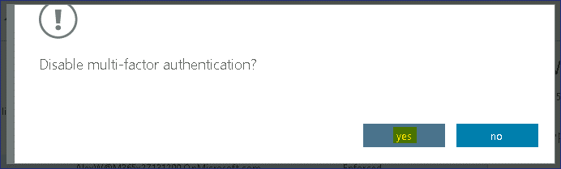
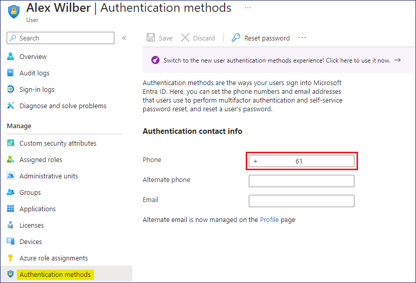

실습 15 - 다중 요소 인증 구성

**요약**

이 실습에서는 사용자별 다중 요소 인증(MFA)을 구성하고 조건부 액세스
정책을 사용하여 MFA를 적용합니다.

연습 1: 사용자별 다중 요소 인증을 구성

**시나리오**

사용자 로그인 이벤트에 대한 보안을 강화하려면 다중 요소 인증(MFA)을
구성하고 테스트해야 합니다. 먼저 사용자별 MFA를 테스트해 보기로
했습니다. Alex Wilber가 설정 검증을 대신해 드리겠습니다.

작업 1: MFA를 활성화하기 전에 로그인을 검증

1.  [**SEA-WS3**](urn:gd:lg:a:select-vm) 에 !!Admin!! 계정으로
    로그인하고, 비밀번호는 !!
    [**Pa55w.rd**](urn:gd:lg:a:send-vm-keys)!!입니다.

2.  작업 표시줄에서 **Microsoft Edge**를 선택하세요. 주소 표시줄에 !!
    [**outlook.office.com**](urn:gd:lg:a:send-vm-keys)!!을 입력하고
    Enter 키를 누릅니다.

3.  At the **Sign in** page,
    enter !!**AlexW@M365xXXXXXXX.onmicrosoft.com**!!  and then
    select **Next**. **Sign in** 페이지에서 !!
    **AlexW@M365xXXXXXXX.onmicrosoft.com**!!을 입력하고 **Next**를
    선택합니다.

4.  **Enter password** 페이지에서 !! **P@55w.rd1234**!!를 입력하고
    **Sign in**을 선택합니다. Edge 비밀번호 저장 메시지가 나타나면
    **Save**를 선택합니다.

> 웹용 Outlook이 열립니다. 웹용 Outlook에 로그인할 때는 비밀번호만
> 필요했습니다.

5.  오른쪽 상단 모서리에서 **Account manager for Alex Wilber** 를 선택한
    다음 **Sign out**을 선택합니다.

> 

6.  Microsoft Edge를 닫습니다.

작업 2: 사용자에 대한 MFA 활성화

1.  [**SEA-SVR1**](urn:gd:lg:a:select-vm).로 전환합니다. 필요한 경우
    [**SEA-SVR1**](urn:gd:lg:a:select-vm).에서
    [**Contoso\Administrator**](urn:gd:lg:a:send-vm-keys)로 로그인하고
    비밀번호는 !! [**Pa55w.rd**](urn:gd:lg:a:send-vm-keys)!!입니다.
    **Server Manager**를 닫습니다.

2.  타스크바에서 **Microsoft Edge**를 선택하고 **Microsoft Entra admin
    center** !! **https://Entra.Microsoft.com**!!로 이동합니다.

3.  **Office 365 Tenant admin**으로 로그인합니다.

> 
>
> **Microsoft Entra admin center가 열립니다.**

4.  **Microsoft Entra admin center**의 탐색 창에서 **Identity**를 확장한
    다음 **Users**를 선택합니다.

5.  모든 사용자를 선택한 다음 결과 창 상단에서 **Per-user MFA**를
    선택합니다. **Per-user MFA**옵션을 보려면 먼저 줄임표를 선택해야 할
    수도 있습니다.

> 

6.  다중 요소 인증 페이지에서 **service settings**를 선택합니다.

> 

7.  **verification options**섹션까지 아래로 스크롤합니다.

> 사용자 확인을 위해 구성할 수 있는 다양한 방법을 확인합니다.

8.  **remember multi-factor authentication on trusted device** 섹션에서
    **Allow users to remember multi-factor authentication on devices
    they trust** 옆의 확인란을 선택합니다.

9.  **Number of days users can trust devices for** 옆에 **30**을 입력한
    후 ' **save**.을 선택하세요. 메시지가 표시되면 **close** 를
    선택합니다.

> 
>
> 

10. 페이지 상단의 **multi-factor authentication**에서 **users**를
    선택합니다.

> 

11. 사용자 목록에서 **Alex Wilber**옆의 확인란을 선택합니다.

12. Alex Wilber 페이지에서 **Enable**를 선택합니다.

> 

13. **About enabling multi-factor auth** 메시지에서 **enable
    multi-factor auth**를 선택합니다.

> 

14. **Updates successful** 메시지가 표시되면 **close**를 선택합니다.
    Alex Wilber의 **Multi-Factor Auth Status**가 이제 활성화되어
    있습니다.

> 
>
> 

15. Microsoft Edge를 닫습니다.

작업 3: MFA 등록 및 검증

1.  [**SEA-WS3**](urn:gd:lg:a:select-vm)으로 전환합니다. 작업 표시줄에서
    **Microsoft Edge**를 선택합니다.

2.  주소 표시줄에
    !\!!  을 입력하고
    **Enter** 키를 누릅니다.

3.  **Pick an account** 페이지에서 !!
    [**AlexW@M365xXXXXXXX.onmicrosoft.com**](mailto:AlexW@M365xXXXXXXX.onmicrosoft.com)!!을
    선택합니다.

> 

4.  **Enter password** 페이지에서 !! **P@55w.rd1234**!!를 입력하고
    **Sign in**을 선택합니다.

5.  **More information required**  페이지에서 **Next**를 선택합니다.
    계정 보안 유지 페이지가 열립니다.

> 
>
> 일반적으로 다단계 인증을 관리하려면 Microsoft Authenticator 앱을
> 사용합니다. 하지만 이 실습 시나리오에서는 문자 메시지를 사용합니다.

6.  **Keep your account secure**페이지에서 **I want to set up a
    different method**를 선택합니다.

> 

7.  **Choose a different method**  대화 상자에서 **Phone**를 선택한 다음
    **Confirm**을 선택합니다.

> 

8.  **Phone** 페이지에서 문자 메시지를 받을 수 있는 휴대폰 번호를
    입력하고 **Next**.를 선택합니다.

> 

9.  문자 메시지로 인증 코드를 받으면 **Phone**  페이지에 표시된 곳에
    코드를 입력하고 **Next**를 선택합니다.

> 

10. SMS 확인 메시지에서 **Next**를 선택한 후 **Done**를 선택합니다.

> 
>
> 

11. 로그인 상태 유지 메시지가 나타나면 **No**를 선택하세요.

> 
>
> 웹용 Outlook에서 Alex Wilber의 받은 편지함이 열립니다.

12. 오른쪽 상단에서 **Account manager for Alex Wilber** 를 선택한 다음
    **Sign out**을 선택합니다.

> 
>
> **참고**: 사용자는 MFA를 처음 사용할 때만 등록하면 됩니다. 이후 로그인
> 시에는 등록 시 입력한 전화번호로 문자 메시지로 전송된 인증 코드만
> 입력하면 됩니다.

13. 주소창에 !\!!을
    입력하고 Enter 키를 누릅니다.

14. **Pick an account** 페이지에서 !!
    **AlexW@M365xXXXXXXXX.onmicrosoft.com**!!을 선택합니다.

15. **Enter password**  페이지에서 !! **P@55w.rd1234**!!를 입력하고
    **Sign in**을 선택합니다.

> 
>
> **Verify your identity**  메시지가 나타납니다. 전화번호의 마지막 두
> 자리 숫자가 포함되어 있습니다.

16. **Verify your identity** 메시지에서 문자 메시지 수신 전화번호를
    선택하세요.

17. **Enter code**페이지에서 휴대폰으로 전송된 코드를 입력하고
    **Verify**를 선택합니다.

> 
>
> 30일 동안 다시 인증을 요청하지 않으려면 확인란을 선택합니다.

18. **Microsoft Authenticator App**은 보안 강화와 원활한 사용자 경험을
    위해 동일한 설정을 구성하라는 메시지가 표시됩니다. **Skip for
    now**를 클릭하세요.

> 

19. 로그인 상태 유지 메시지에서 **No**를 선택합니다. 웹용 Outlook에서
    Alex Wilber의 받은 편지함이 열립니다.

> 

20. 오른쪽 상단 모서리에서 **Account manager for Alex Wilber** 를 선택한
    다음 **Sign out**을 선택합니다.

> 

21. Microsoft Edge를 닫습니다.

작업 3: 사용자별 MFA 제거

1.  [**SEA-SVR1**](urn:gd:lg:a:select-vm)로 전환합니다. 필요한 경우
    [**SEA-SVR1**](urn:gd:lg:a:select-vm)에서
    [**Contoso\Administrator**](urn:gd:lg:a:send-vm-keys)로 로그인하고
    비밀번호는 !!Pa55w.rd!!입니다. **Server Manager**를 닫습니다.

2.  타스크바에서 **Microsoft Edge**를 선택하고 **Microsoft Entra admin
    cente**!! **https://Entra.Microsoft.com**!!로 이동합니다.

3.  **Office 365 Tenant admin**자격 증명으로 로그인합니다.

> 
>
> **Microsoft Entra admin center**가 열립니다.

4.  **Microsoft Entra admin center**의 탐색 창에서 **Identity**를 확장한
    다음 **Users**를 선택합니다.

5.  **All users** 를 선택한 다음 결과 창 상단에서 **Per-user MFA**를
    선택합니다. **Per-user MFA**옵션을 보려면 먼저 줄임표를 선택해야 할
    수도 있습니다.

> 

6.  페이지 상단의 **multi-factor authentication**아래에서 **users**를
    선택합니다.

7.  사용자 목록에서 **Alex Wilber** 옆의 확인란을 선택합니다.

> Alex Wilber의 Multi-Factor Auth Status 가 이제 **Enforced**으로
> 설정되어 있습니다(이전에는 "활성화"로 설정되어 있었습니다). 이는
> Alex가 MFA를 등록하고 사용하고 있기 때문입니다.
>
> 

8.  Alex Wilber 페이지에서 **Manage user settings**를 선택합니다.

> 

9.  사용자 설정 관리 상자에서 세 가지 옵션 옆에 있는 확인란을 모두
    선택하고 **save**를 선택한 다음 **close**를 선택합니다.

> 
>
> 이 옵션을 선택하면 Alex에 대해 저장된 모든 MFA 설정이 제거됩니다.
>
> 

10. 사용자 목록에서 **Alex Wilber** 옆의 확인란을 선택합니다.

11. Alex Wilber 페이지에서 **Disable**을 선택합니다.

> 

12. **Disable multi-factor authentication**  메시지가 나타나면 **yes**를
    선택합니다.

> 

13. **Updates successful** 라는 메시지가 나타나면 **close**를
    선택합니다.

> 
>
> Alex Wilber의 Multi-Factor Auth Status 가 이제 비활성화되었습니다.
>
> 

14. Microsoft Edge를 닫습니다.

**결과:** 이 연습을 완료하면 사용자별 다단계 인증을 성공적으로 구성하게
됩니다.

연습 2: 조건부 액세스를 사용하여 다단계 인증 구성

**시나리오**

사용자 로그인 이벤트에 대한 보안을 강화하려면 다단계 인증(MFA)을
구성하고 테스트해야 합니다. 조건부 액세스 정책을 사용하면 MFA 요구
사항에 대한 유연성이 향상된다고 판단합니다. Alex Wilber가 설정 검증을
대신해 드리겠습니다.

작업 1: MFA를 사용하여 조건부 액세스를 활성화하기 전에 로그인 확인

1.  [**SEA-WS3**](urn:gd:lg:a:select-vm)에 !!Admin!! 계정으로 로그인하고
    비밀번호는 !! [**Pa55w.rd**](urn:gd:lg:a:send-vm-keys)!!입니다.

2.  타스크바에서 **Microsoft Edge**를 선택합니다. 주소 표시줄에 !!
    [**outlook.office.com**](urn:gd:lg:a:send-vm-keys)!!을 입력하고
    Enter 키를 누릅니다.

3.  **Sign in**  페이지에서 !! **AlexW@M365xXXXXXXX.onmicrosoft.com**
    !!을 입력하고 **Next**를 선택합니다.

4.  **Enter password** 페이지에서 !! **P@55w.rd1234**!!를 입력하고
    **Sign in**을 선택합니다. Edge 비밀번호 저장 메시지가 나타나면
    **Save**을 선택합니다.

> 웹용 Outlook이 열립니다. 웹용 Outlook에 로그인할 때는 비밀번호만
> 필요했습니다.

5.  오른쪽 상단에서 **Account manager for Alex Wilber** 를 선택한 다음
    **Sign out**을 선택합니다.

> 

6.  Microsoft Edge를 닫습니다.

작업 2: MFA를 사용하여 조건부 액세스 구성

1.  [**SEA-SVR1**](urn:gd:lg:a:select-vm)로 전환합니다. 필요한 경우
    [**SEA-SVR1**](urn:gd:lg:a:select-vm)에서
    [**Contoso\Administrator**](urn:gd:lg:a:send-vm-keys) 로 로그인하고
    비밀번호는 !! [**Pa55w.rd**](urn:gd:lg:a:send-vm-keys)!!입니다.
    **Server Manager를** 닫습니다.

2.  타스크바에서 **Microsoft Edge**를 선택하고 **Microsoft Entra admin
    center** !! **https://Entra.Microsoft.com**!!로 이동합니다.

3.  **Office 365 Tenant admin** 자격 증명으로 로그인합니다.

> 
>
> **Microsoft Entra admin center가 열립니다.**

4.  **Microsoft Entra admin center**의 탐색 창에서 **Identity**,
    **Protection**, **Conditional Access**를 차례로 확장합니다.

> 

5.  **Conditional Access** 페이지에서 **Policies**를 선택한 다음 **+ New
    policy**을 선택합니다.

> 

6.  **New Conditional access policy** 페이지의 **Name** 상자에 !!
    [**Contoso MFA Policy**](urn:gd:lg:a:send-vm-keys)!!를 입력합니다.

7.  **Assignments**아래에서 **0 users or workload identities
    selected**선택합니다.

> 

8.  사용자 및 그룹 창에서 **Select users and groups** 옆의 옵션을 선택한
    다음 **Users and groups**옆의 확인란을 선택합니다.

9.  **Select** 페이지에서 **Alex Wilber**를 선택한 다음 **Select**를
    클릭합니다.

> 
>
> 일반적으로 그룹을 지정하지만, 이 연습에서는 Alex Wilber의 설정만
> 테스트해 보겠습니다.

10. Target resources에서 **No target resources selected** 을 선택한 다음
    **Select apps를** 클릭합니다.

> 

11. **Select** 페이지에서 **Office 365** 옆에 있는 확인란을 선택한 다음
    **Select**를 클릭합니다.

> 

12. **Access controls**의 **Grant**섹션에서 **0 controls selected**를
    선택합니다.

> 

13. **Grant**페이지에서 **Grant access**를 선택하고 **Require
    multi-factor authentication**옆에 있는 확인란을 선택한 다음
    **Select**.를 클릭합니다.

> 

14. **Enable policy**에서 **On**를 선택합니다.

15. **Create** 를 선택하여 Contoso MFA 정책을 만듭니다. 정책의 상태가
    **On으**로 표시됩니다.

> 
>
> 

16. **Microsoft Entra admin center**에서 **Users**를 선택하세요. 사용자
    목록에서 **Alex Wilber**를 선택합니다.

> 

17. Alex Wilber 페이지에서 **Authentication methods**를 선택합니다.

> 
>
> Alex에 대한 전화번호가 이미 구성되어 있음을 확인하십시오.

18. Microsoft Edge를 닫습니다.

작업 3: 조건부 액세스 MFA 확인

1.  [**SEA-WS3**](urn:gd:lg:a:select-vm)으로 전환합니다. 타스크바에서
    **Microsoft Edge**를 선택합니다.

2.  주소 표시줄에 !!
    [**outlook.office.com**](urn:gd:lg:a:send-vm-keys)!!을 입력하고
    Enter 키를 누릅니다.

3.  **Pick an account**  페이지에서
    [!!**AlexW@M365xXXXXXXX.onmicrosoft.com**](mailto:!!AlexW@M365xXXXXXXX.onmicrosoft.com)!!를
    선택합니다.

> 

4.  **Enter password**  페이지에서 !! **P@55w.rd1234**!!를 입력하고
    **Sign in**을 선택합니다.

5.  **Verify your identity** 메시지에서 문자 메시지 전화번호를
    선택합니다.

> 

6.  **Enter code** 페이지에서 휴대폰으로 전송된 코드를 입력한 다음
    **Verify**를 선택하세요.

> 
>
> 30일 동안 확인을 다시 요청하지 않으려면 확인란을 선택할 수 있습니다.

7.  로그인 상태 유지 메시지가 나타나면 **No**를 선택합니다. 웹용
    Outlook에서 Alex Wilber의 받은 편지함이 열립니다.

> 

8.  오른쪽 상단에서 **Account manager for Alex Wilber** 를 선택한 다음
    **Sign out**을 선택합니다.

> 

9.  Microsoft Edge를 닫습니다.

작업 4: 조건부 액세스 MFA 제거

1.  [**SEA-SVR1**](urn:gd:lg:a:select-vm)로 전환합니다. 필요한 경우
    [**SEA-SVR1**](urn:gd:lg:a:select-vm)에서
    [**Contoso\Administrator**](urn:gd:lg:a:send-vm-keys)로 로그인하고
    비밀번호는 !! [**Pa55w.rd**](urn:gd:lg:a:send-vm-keys)!!로 설정한 후
    **Server Manager를** 닫습니다.

2.  On the taskbar select **Microsoft Edge**, navigate to **Microsoft
    Entra admin center**  !!**https://Entra.Microsoft.com**!!
    타스크바에서 **Microsoft Edge**를 선택하고 **Microsoft Entra admin
    center**  !! **https://Entra.Microsoft.com**!!로 이동합니다.

3.  **Office 365 Tenant admin**자격 증명으로 로그인합니다.

> 
>
> **Microsoft Entra admin center가 열립니다.**

4.  **Microsoft Entra admin center**의 탐색 창에서 **ID, Protection,
    Conditional Access**를 차례로 확장합니다.

> 

5.  **Conditional Access** 페이지에서 **Policies** 를 선택한 다음
    **Contoso MFA Policy**를 선택합니다.

6.  **Contoso MFA Policy**  페이지에서 **Delete**를 선택한 다음
    **Delete**를 선택합니다.

> 
>
> 

7.  삭제 확인을 위해 삭제 버튼을 클릭합니다.

> 
>
> 

8.  Microsoft Edge를 닫습니다.

**결과**: 이 연습을 완료하면 조건부 액세스 정책을 사용하여 다단계 인증을
성공적으로 구성하게 됩니다.
