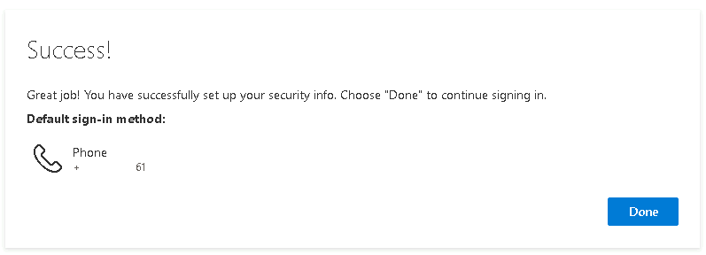

Lab 16 - Konfigurieren der Self-Service-Kennwortzurücksetzung für
Benutzerkonten in Microsoft Entra

**Zusammenfassung**

In dieser Übung konfigurieren und validieren Sie die
Self-Service-Kennwortzurücksetzung (Self-Service Password Reset, SSPR)
für Benutzerkonten in **Microsoft Entra ID**.

**Voraussetzungen**

Die folgenden Übungen müssen vor diesem Lab abgeschlossen werden:

1.  Lab \#2 - Synchronisieren von Identitäten mit Microsoft Entra
    Connect

2.  Lab \#5 - Verwalten der Geräteregistrierung bei Microsoft Intune

**Szenario**

Der Helpdesk hat darauf hingewiesen, dass eine große Anzahl von
Support-Tickets mit dem Zurücksetzen von Passwörtern zusammenhängt. Sie
wurden gebeten, eine Lösung vorzuschlagen, mit der Benutzer ihr eigenes
Passwort zurücksetzen können. Bei Konten, die von AD DS synchronisiert
werden, sollte der Prozess sowohl das Microsoft Entra als auch das AD
DS-Kennwort zurücksetzen.

Aufgabe 1: Konfigurieren des Kennwortrückschreibens

1.  Melden Sie sich bei [***SEA-SVR1***](urn:gd:lg:a:select-vm) an als
    !!**[Contoso\Administrator](urn:gd:lg:a:send-vm-keys)!!** mit dem
    Passwort !!**[Pa55w.rd](urn:gd:lg:a:send-vm-keys)!!** an und
    schließen Sie den **Server Manager**.

2.  Doppelklicken Sie auf dem Desktop auf **Azure AD Connect**.

> 

3.  Wählen Sie auf der Seite **Welcome to Azure AD Connect** die Option
    **Configure**.

> 

4.  Auf der Seite **Additional tasks**, wählen Sie **Customize
    synchronization options**, und wählen Sie dann **Next**.

> 

5.  Geben Sie auf der Seite **Connect to Azure AD** bei Bedarf
    [!!**admin@M365xXXXXXXX.onmicrosoft.com**](mailto:!!admin@M365xXXXXXXX.onmicrosoft.com)**!!**
    ein und geben Sie im Textfeld **USERNAME** das **PASSWORD** ein, und
    wählen Sie dann **Next**.

> 

6.  Auf der Seite **Connect to your directories**, wählen Sie **Next**.

7.  Auf der Seite **Domain and OU filtering**, wählen Sie **Next**.

8.  Auf der Seite **Optional features**, wählen Sie **Password
    writeback**, und wählen Sie dann **Next**.

> 

9.  Auf der Seite **Ready to configure**, wählen Sie **Configure**.

> 
>
> 
>
> **Hinweis**: Die Konfiguration kann einige Minuten dauern.

10. Auf der Seite **Configuration complete**, wählen Sie **Exit**.

> 

Aufgabe 2: Aktivieren der Self-Service-Kennwortzurücksetzung.

1.  Wählen Sie auf der Taskleiste **Microsoft Edge** aus, navigieren Sie
    zum **Microsoft Entra Admin Center https://Entra.Microsoft.com**.

2.  Melden Sie sich mit den Anmeldeinformationen des **Office
    365-Mandantenadministrators** an.

> 
>
> Das **Microsoft Entra Admin Center** wird geöffnet.

3.  Erweitern Sie im **Microsoft Entra Admin Center** im
    Navigationsbereich **Identity**, und wählen Sie dann **Users**.

4.  Wählen Sie im Navigationsbereich **Users** die Option **Password
    reset**.

> 

5.  Im Fenster **Password reset | Properties**, wählen Sie **All**, um
    die Self-Service-Kennwortzurücksetzung für alle Benutzer zu
    aktivieren. Wählen Sie **Save** aus.

> 
>
> 

6.  Klicken Sie auf die Seite **Password reset | Properties**, wählen
    Sie **Authentication methods**.

> 

7.  Stellen Sie für die Methoden, die Benutzern zur Verfügung stehen,
    sicher, dass **Mobil phone** und **Email** ausgewählt sind, und
    wählen Sie dann **Security Questions**.

8.  Für **Number of questions required to register**, wählen Sie **3**.

9.  Für **Number of questions required to reset**, wählen Sie **3**.

> 

10. Im Abschnitt **Select security questions**, wählen Sie **No security
    questions configured**, dann wählen Sie **Predefined**. Wählen Sie
    drei Fragen Ihrer Wahl aus, und wählen Sie dann zweimal **OK** aus.

> 
>
> 

11. Wählen Sie **Save** aus.

> 

12. Wählen Sie **Registrierung** aus. Wählen Sie **Yes** für **Require
    users to register when signing in**, und **Number of days before
    users are asked to re-confirm their authentication information**,
    legen Sie den Wert auf **90** fest**,** und wählen Sie dann **Save**
    aus.

> 

13. Wählen Sie im Navigationsbereich **On-premises integration**.

14. Stellen Sie sicher, dass Ihr lokaler Rückschreibeclient ausgeführt
    wird, und stellen Sie sicher, dass das Kontrollkästchen für **Enable
    password write back for synced users**. Wählen Sie bei Bedarf
    **Save**.

> 

15. Schließen Sie Microsoft Edge.

Aufgabe 3: Überprüfen der Self-Service-Kennwortzurücksetzung

1.  Wechseln Sie zu [***SEA-WS3***](urn:gd:lg:a:select-vm). Melden Sie
    sich bei Bedarf an als !!**[Admin](urn:gd:lg:a:send-vm-keys)!!** mit
    dem Passwort !!**[Pa55w.rd](urn:gd:lg:a:send-vm-keys)!!**an.

2.  Wählen Sie auf der Taskleiste **Microsoft Edge aus**. Navigieren Sie
    zu !!**https://mysignins.microsoft.com/!!**

3.  Wählen Sie auf der Seite **Pick an account** die Option **Use
    another account**.

> 

4.  Geben Sie auf der **Sign in** Seite
    [!!**Cindy@M365xXXXXXX.onmicrosoft.com**](mailto:!!Cindy@M365xXXXXXX.onmicrosoft.com)**!!**
    an und wählen Sie dann **Next**.

5.  Geben Sie auf der Seite **Enter password** **!! P@55w.rd1234!!** ein
    und wählen Sie dann **Sign i** aus. Wenn Microsoft Edge Sie
    auffordert, das Kennwort zu speichern, wählen Sie **Save**.

> 

6.  Sie werden aufgefordert **More information required** auszuwählen,
    klicken Sie auf **Next.**

> 

7.  Geben Sie die Details ein und klicken Sie auf **Next.**

> 

8.  Geben Sie den 6-stelligen Code ein und klicken Sie auf **Next**

> 

9.  Klicken Sie erneut auf **Next**.

> 

10. Klicken Sie auf **Done**.

> 

11. Sie sollten in der Lage sein, auf die Seite **My Account** zu
    klicken.

> 

12. Um das **Passwort** zu ändern**,** besuchen Sie den Link - **!!
    https://mysignins.microsoft.com/security-info!!**

13. Schließen Sie die Verifizierung ab, indem Sie auf den Text
    +XXXXXXXXXXXXXX

> 

14. Geben Sie den 6-stelligen Code ein und klicken Sie dann auf
    Überprüfen.

> 

15. Klicken Sie auf **Skip for now.**

> 

16. Klicken Sie auf der Seite **Security Info** auf **Change** um das
    Passwort zu ändern.

> 

17. Geben Sie auf der Seite **Change your password** die folgenden
    Informationen ein, und wählen Sie dann **Submit**:

    - Create new password: **!!P@55w.rd12345!!**

    - Confirm new password: **!!P@55w.rd12345!!**

> 

18. Klicken Sie auf die Schaltfläche **Done**.

> 

19. Schließen Sie Microsoft Edge, und melden Sie sich bei
    [***SEA-WS3***](urn:gd:lg:a:select-vm) ab.

Aufgabe 4: Ausführen der Azure AD Connect-Synchronisierung

Beachten Sie, dass dieser Schritt normalerweise nicht für das
Kennwortrückschreiben erforderlich ist, aber empfohlen wird, um Probleme
in Laborumgebungen zu beheben und sicherzustellen, dass AD DS mit
Microsoft Entra synchronisiert wird.

1.  Wechseln Sie zu [***SEA-SVR1,***](urn:gd:lg:a:select-vm) klicken Sie
    mit der rechten Maustaste auf **Start** und wählen Sie dann
    **Windows PowerShell (Admin)**.

> 

2.  Geben Sie an der **Windows PowerShell-Eingabeaufforderung** den
    folgenden Befehl ein, und drücken Sie dann **Enter**:

> **!!Start-ADSyncSyncCycle -PolicyType Delta!!**
>
> 

3.  Schließen Sie Windows PowerShell, und warten Sie dann ca. 3 bis 4
    Minuten.

Aufgabe 5: Überprüfen des Kennwortrückschreibens

1.  Wechseln Sie zu [***SEA-CL1***](urn:gd:lg:a:select-vm) und melden
    Sie sich ggf. ab. Wählen Sie auf
    [***SEA-CL1***](urn:gd:lg:a:select-vm) Other Users aus**,** und
    versuchen Sie dann, sich als !!**Contoso\Cindy!!** mit dem Passwort
    von !!**P@55w.rd1234!!** an**.**

> 

2.  Stellen Sie sicher, dass Sie die Meldung erhalten, dass der
    Benutzername oder das Kennwort falsch ist.

> 

3.  Melden Sie sich jetzt an als !!**Contoso\Cindy!!** mit dem Passwort
    [!!**P@55w.rd12345**](mailto:!!P@55w.rd12345)**!!** an, dem
    Kennwort, das mit der SSPR-Funktion festgelegt wurde.

4.  Sie sollten dieses Mal erfolgreich angemeldet sein mit dem **new
    password**.

Dadurch wird bestätigt, dass das Kennwort, das Sie im Portal My Sign in
geändert haben, in das lokale Active Directory Domain Services (AD DS)
-Konto zurückgeschrieben wird.

> Hinweis – Wenn Sie die obige Meldung während der Anmeldung erhalten,
> wird bestätigt, dass ***authentication was successful***, das Konto
> jedoch aufgrund eines Problems mit der Gruppenmitgliedschaft keine
> Berechtigung zur Anmeldung auf dem SEA-CL1 hatte.

**Ergebnisse**: Nach Abschluss dieser Übung haben Sie die
Self-Service-Kennwortzurücksetzung erfolgreich konfiguriert und
validiert.
