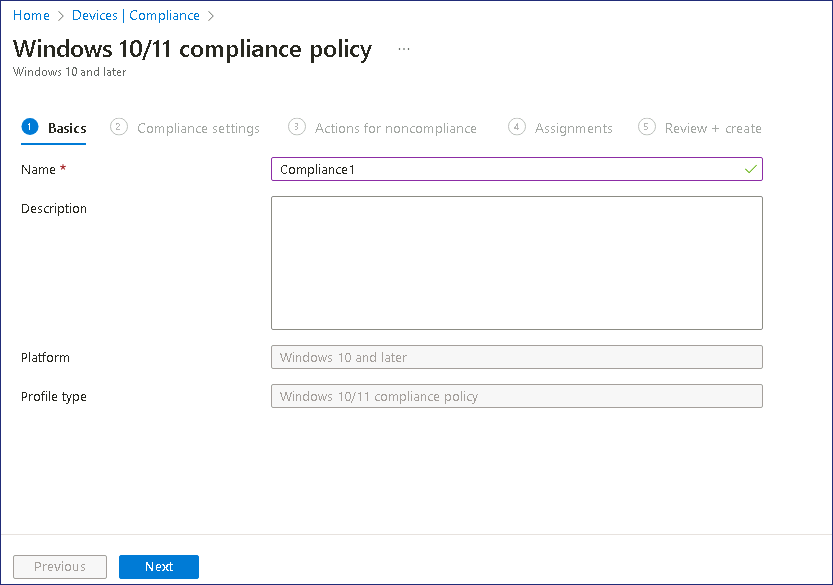
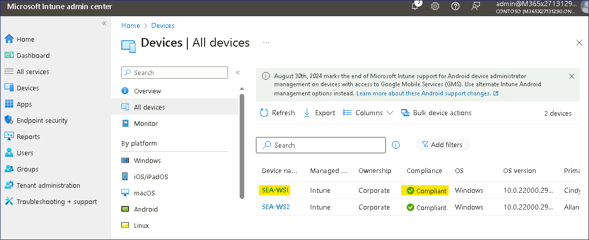

Lab17 - Konfigurieren und Überprüfen der Gerätekonformität

**Zusammenfassung**

In dieser Übung überprüfen Sie die Gerätekonformität, indem Sie eine
Konformitätsrichtlinie und die zugehörige Regel für bedingten Zugriff
konfigurieren, die zum Bestimmen des Status eines verwalteten Geräts
verwendet werden.

**Voraussetzungen**

Die folgenden Übungen müssen vor diesem Lab abgeschlossen werden:

1.  Lab \#1-Verwalten von Identitäten in Microsoft Entra ID

2.  Lab \#2 - Synchronisieren von Identitäten mit Microsoft Entra
    Connect

3.  Lab \#5 - Verwalten der Geräteregistrierung bei Microsoft Intune

4.  Lab \#6 - Registrieren von Geräten bei Microsoft Intune

5.  Lab \#7 - Erstellen und Bereitstellen von Konfigurationsprofilen

Übung 1: Konfigurieren von Konformitätsrichtlinien.

**Szenario**

Contoso möchte sicherstellen, dass Windows-Geräte, die bei Microsoft
Intune registriert sind, eine Mindestkonfigurationsspezifikation
erfüllen. Folgende Spezifikationen sind erforderlich:

1.  Mindestversion des Windows-Betriebssystems: 10.0.19041.329

2.  Microsoft Defender Antimalware erforderlich.

Wenn ein Gerät diese Anforderungen erfüllt, wird es als konform
markiert. Wenn das Produkt diese Anforderungen nicht erfüllt, sollte das
Produkt als nicht konform gekennzeichnet werden.

Aufgabe 1: Erstellen und Zuweisen einer Konformitätsrichtlinie

1.  Melden Sie sich bei [***SEA-SVR1***](urn:gd:lg:a:select-vm) an als
    !!**[Contoso\Administrator](urn:gd:lg:a:send-vm-keys)!!** mit dem
    Passwort !!**[Pa55w.rd](urn:gd:lg:a:send-vm-keys)!!** an. 

2.  Wählen Sie auf der Taskleiste **Microsoft Edge** aus. Geben Sie in
    Microsoft Edge !!**https://Intune.microsoft.com!!** in der
    Adressleiste ein, und drücken Sie dann **Enter**.

3.  Melden Sie sich an mit **Office 365 Tenant Admin credentials**.

> 

4.  Wählen Sie im Navigationsbereich **Devices**, wählen Sie dann
    **Compliance** unter Manage devices aus.

> 

5.  Über **Compliance | Policies**, wählen Sie im Detailbereich die
    Option **+ Create Policy**.

> 

6.  Über **Create a policy**, geben Sie den folgenden Wert ein, und
    wählen Sie **Create**:

    - Platform: **Windows 10 and later**

> 

7.  Geben Sie auf der Registerkarte **Basics** den folgenden Wert an,
    und wählen Sie **Next**:

    - Name: !!**[Compliance1](urn:gd:lg:a:send-vm-keys)!!**

> 

8.  Erweitern Sie auf der Registerkarte **Compliance settings** die
    Option **Device Health,** und überprüfen Sie die verfügbaren
    Einstellungen.

> 

9.  Erweitern Sie auf der Registerkarte **Compliance settings** die
    Option **Device Properties**. Im Feld **Minimum OS version**, geben
    Sie !!**[10.0.19041.329](urn:gd:lg:a:send-vm-keys)!!** ein.

> 

10. Erweitern Sie auf der Registerkarte **Compliance settings** die
    Option **System Security**. Legen Sie die **Microsoft Defender
    Antimalware** Einstellung auf **Require** und wählen Sie dann
    **Next**.

> 

11. Notieren Sie sich auf der Registerkarte **Actions for
    noncompliance** die Aktion zu **Mark device noncompliant** die
    Standardeinstellung ist **immediately**.

> 
>
> Review how you can configure the number of days after which the device
> is marked as noncompliant, and configuration additional actions.

12. Wählen Sie **Next** aus. Auf der Registerkarte **Assignments**,
    wählen Sie **Add groups** aus. Wählen Sie **Windows Devices**,
    wählen Sie **Select**, und wählen Sie dann **Next**.

> 
>
> **Hinweis**: Die Gruppe **Windows Devices** wurde in Create und
> Deployment von Konfigurationsprofilen – Lab erstellt.

13. Wählen Sie **Create** aus.

> 

14. Wählen Sie im Navigationsmenü **Devices** und dann im
    Navigationsbereich Devices die Option **Compliance**.

> 

15. Wählen Sie auf der Seite **Compliance** die Option **Compliance
    settings**.

> 

16. Wählen Sie auf der Seite **Compliance policy settings** neben **Mark
    devices with no compliance policy assigned as** die Option **Not
    Compliant** und dann **Save** aus.

> 
>
> Mit dieser Einstellung wird sichergestellt, dass jedes Gerät, dem
> keine Konformitätsrichtlinie zugewiesen ist, auf **Not compliant**.

**Ergebnisse**: Nach Abschluss dieser Übung haben Sie erfolgreich eine
Konformitätsrichtlinie konfiguriert.

Übung 2: Erstellen einer Richtlinie für bedingten Zugriff zum Erzwingen
der Konformität.

**Szenario**

Wenn ein Benutzer ein Gerät verwendet, das als nicht konform markiert
ist, sollte er nicht auf seine E-Mails zugreifen können. Sie wurden
aufgefordert, eine Richtlinie für bedingten Zugriff zu konfigurieren,
die diese Regel erzwingt, und zu überprüfen, ob sie wie erwartet
funktioniert.

Aufgabe 1: Erstellen einer Richtlinie für bedingten Zugriff

1.  Wählen Sie [auf](urn:gd:lg:a:select-vm) ***SEA-SVR1*** im
    **Microsoft Intune Admin Center \>Device** und dann **Conditional
    access** aus.

> 

2.  Klicken Sie auf **Policies** und wählen Sie dann **+ New policy**
    aus.

> 

3.  Geben Sie auf dem Blatt **New** im Textfeld **Name** den Namen
    !\ und wählen Sie
    dann **0 users or workload identities selected** aus.

> 

4.  Wählen Sie auf dem Blatt **Users and groups** das Optionsfeld **All
    Users** aus.

> 

5.  Wählen Sie auf dem Blatt **New** die Option **No target resources
    selected** aus, wählen Sie das Optionsfeld **Select Apps** aus, und
    wählen Sie !!**Office 365 Exchange Online!!**, und klicken Sie dann
    auf **Select**.

> 

6.  Wählen Sie auf dem Blatt **New** im Abschnitt **Conditions** die
    Option **0 conditions selected**.

> 

7.  Wählen Sie in der Liste der Bedingungen unter **Device platforms**
    die Option **Not cofigured** aus. Wählen Sie im Abschnitt
    **Configure** die Option **Yes** aus, aktivieren Sie das Optionsfeld
    **Select device platforms**, aktivieren Sie das Kontrollkästchen
    **Windows**, und wählen Sie dann **Done** aus.

> 

8.  Wählen Sie auf dem Blatt **New** unter **Access** im Abschnitt
    **Grant** die Option **0 controls selected** aus.

9.  Wählen Sie das Kontrollkästchen **Require device to be marked as
    compliant** aus, und wählen Sie dann **Select**.

> 

10. Wählen Sie auf dem Blatt **New** die Option **On** für die Option
    **Enable Policy** aus, und wählen Sie dann **Create**.

> 

11. Schließen Sie Microsoft Edge.

Aufgabe 2: Überprüfen, ob die Richtlinie für bedingten Zugriff
funktioniert

1.  Wechseln Sie zu [***SEA-WS3***](urn:gd:lg:a:select-vm) und melden
    Sie sich an als !!**[Admin](urn:gd:lg:a:send-vm-keys)!!** mit dem
    Passwort von !!**[Pa55w.rd](urn:gd:lg:a:send-vm-keys)!!** an.

2.  Wählen Sie auf [***SEA-WS3***](urn:gd:lg:a:select-vm) auf der
    Taskleiste **Microsoft Edge aus**. Geben Sie in Microsoft Edge
    !\!! ein, und
    drücken Sie dann Enter.

3.  Wählen Sie im Dialogfeld Konto auswählen die
    Option!!**Cindy@M365xXXXXXXX.onmicrosoft.com!!**

4.  Geben Sie auf der Seite **Enter password** !!**P@55w.rd12345!!** Ein
    und wählen Sie **Sign in** aus. Wenn die Eingabeaufforderung zum
    Speichern des Kennworts in Microsoft Edge angezeigt wird, wählen Sie
    **Update**.

> 

5.  Vergewissern Sie sich, dass Sie die Nachricht erhalten haben.**"**
    **Sign in with your work account"**.

> 

6.  Wählen Sie **More details** aus. Es sollten weitere Informationen
    darüber angezeigt werden, warum Sie blockiert wurden.

> 
>
> **Hinweis**: Dies liegt daran, dass SEA-WS3 nicht mit Microsoft Entra
> ID verknüpft ist und nicht von Microsoft Intune verwaltet wird und
> daher nicht als konform markiert ist.

7.  **Schließen** Sie das Browserfenster.

8.  Wechseln Sie zu [***SEA-WS1***](urn:gd:lg:a:select-vm) und melden
    Sie sich an als !!**Cindy@M365xXXXXXXX.onmicrosoft.com!!** mit **dem
    Passwort**!!**P@55w.rd12345!!**

> **Hinweis**: SEA-WS1 ist ein verwaltetes Windows 11-Gerät, das bei
> Intune registriert ist.

9.  Wählen Sie auf der Taskleiste **Microsoft Edge aus**. Geben Sie in
    Microsoft Edge Outlook.office.com ein, und drücken Sie dann
    **Enter**.

10. Stellen Sie sicher, dass Sie auf Cindys Postfach zugreifen können.

> 
>
> **Hinweis**: Dies liegt daran, dass **SEA-WS1** ein verwaltetes Gerät
> ist und als konform gekennzeichnet ist.

11. Schließen Sie Microsoft Edge, und melden Sie sich ab
    [***SEA-WS1***](urn:gd:lg:a:select-vm).

Aufgabe 3: Deaktivieren der Richtlinie für bedingten Zugriff

1.  Auf [***SEA-SVR1***](urn:gd:lg:a:select-vm), im **Microsoft Intune
    Admin Center** !\!<https://intune.microsoft.com>!! Wählen Sie
    **Devices** und dann **All devices**.

> 
>
> Beachten Sie, dass **SEA-WS1** konform ist, weshalb Cindy auf sein
> Postfach zugreifen durfte.

2.  Wählen Sie im Navigationsbereich **Devices** und dann **Conditional
    access** aus.

> 

3.  Auf der Seite **Conditional Access**, wählen Sie **Policies**, und
    dann klicken Sie auf **Conditional1**.

> 

4.  Auf der Seite **Conditional1**, unten auf der Seite, wählen Sie
    **Off** und dann **Save**.

> 

5.  Schließen Sie Microsoft Edge.

**Ergebnisse**: Nach Abschluss dieser Übung haben Sie erfolgreich eine
Richtlinie für bedingten Zugriff konfiguriert, um die Gerätekonformität
zu bestimmen.
