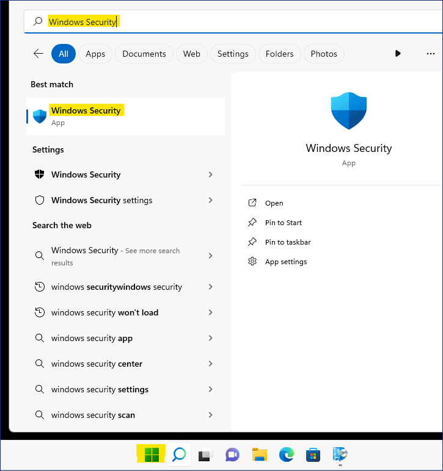
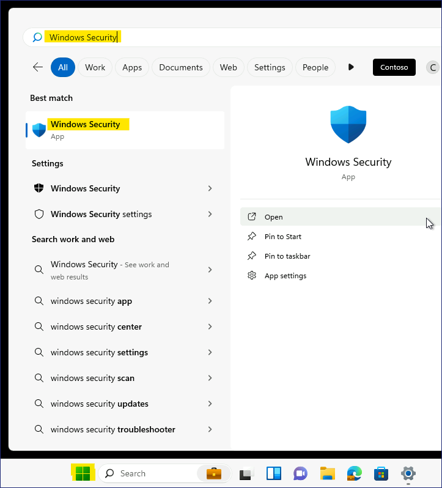

Lab 18 - Konfigurieren der Endpunktsicherheit mit Microsoft Intune

**Zusammenfassung**

In dieser Übung erstellen Sie eine Richtlinie zum Konfigurieren von
Microsoft Defender für verwaltete Geräte in Microsoft Intune.

**Voraussetzungen**

Die folgenden Übungen müssen vor diesem Lab abgeschlossen werden:

1.  Lab \#5 - Verwalten der Geräteregistrierung bei Microsoft Intune

2.  Lab \#6 - Registrieren von Geräten bei Microsoft Intune

3.  Lab \#7 - Erstellen und Bereitstellen von Konfigurationsprofilen

**Szenario**

Sie wurden aufgefordert, sicherzustellen, dass Microsoft Defender für
die Contoso Developers Group ordnungsgemäß konfiguriert ist. Es wurde
darum gebeten, dass:

1.  Manipulationsschutz verhindert wird.

2.  Blenden Sie die Bereiche Kontoschutz, App- und Browsersteuerung,
    Gerätesicherheit, Geräteleistung und -zustand sowie Familienoptionen
    in der Windows-Sicherheit-App aus

3.  Der Firmenname und die Telefonnummer müssen hinzugefügt werden.

- Einstellungen für Echtzeitschutz, Behebung und Überprüfung müssen
  ebenfalls konfiguriert werden.

Die Einstellungen werden durch Tests auf einem registrierten Gerät,
SEA-WS1, und einem nicht registrierten Gerät, SEA-CL1, überprüft.

Aufgabe 1: Konfigurieren der Windows-Sicherheitserfahrung in Intune

1.  Wechseln Sie und melden Sie sich bei
    [***SEA-SVR1***](urn:gd:lg:a:select-vm) an als
    !!**[Contoso\Administrator](urn:gd:lg:a:send-vm-keys)!!** mit dem
    Passwort !!**[Pa55w.rd](urn:gd:lg:a:send-vm-keys)!!** an.

2.  Wählen Sie in der Taskleiste **Microsoft Edge** aus.

3.  Geben Sie in Microsoft Edge !!**https://Intune.microsoft.com!!** in
    der Adressleiste ein, und drücken Sie dann **Enter**.

4.  Melden Sie sich als Office 365-Mandantenadministrator an.

> 

5.  Wählen Sie im Navigationsbereich Endpoint **security** und dann
    **Antivirus**.

> 

6.  Auf der Seite **Endpoint security |Antivirus**, wählen Sie **+
    Create Policy**.

> 

7.  Auf der Seite **Create a profile**, für die **Platform**, wählen Sie
    **Windows 10, Windows 11, and Windows Server** aus.

8.  Wählen Sie in der Liste **Profile** die Option **Windows Security
    experience**. Wählen Sie dann **Create** aus.

> 

9.  Geben Sie auf der Registerkarte Basics im Feld **Name** den Namen
    !!**[Windows Security Settings](urn:gd:lg:a:send-vm-keys)!!** ein.
    Wählen Sie dann **Next** aus.

> 

10. Unter Defender konfigurieren Sie die folgenden Einstellungen:

    - TamperProtection (Device): **On**

> 

11. Unter **Windows Defender Security Center**, konfigurieren Sie die
    folgenden Einstellungen:

    - Disable Account Protection UI: **Enable**

    - Disable App Browser UI: **Enable**

    - Disable Device Security UI: **Enable**

    - Disable Family UI: **Enable**

    - Disable Health UI: **Enable**

> 

12. Neben **Enable Customized Toasts** wählen Sie **Enable** aus.

13. Im Bereich **Company name**, wählen Sie **Configured**, und geben
    Sie dann !!**[Contoso IT](urn:gd:lg:a:send-vm-keys)!!** ein.

14. Fü **Phone**, wählen Sie **Configured** und geben Sie dann
    !!**[555-1234](urn:gd:lg:a:send-vm-keys)!!** Ein und wählen Sie
    **Next** aus.

> 

15. Auf der Seite **Scope tags**, wählen Sie **Next** aus.

> 

16. Auf der Schaltfläche **Assignments**, unter **Included
    groups** wählen Sie **Add groups**. Wählen Sie die Drucktaste
    **Contoso Developer Devices** group, klicken Sie auf **Select** und
    wählen Sie dann **Next**.

> 

17. Überprüfen Sie auf der Registerkarte **Review + create** die
    Informationen, und wählen Sie **Save**.

> 

Aufgabe 2: Konfigurieren der Microsoft Defender Antivirus-Richtlinie in
Intune

1.  Auf der Seite **Endpoint security |Antivirus** wählen Sie **Create
    Policy**.

> 

2.  Im Bereich **Create a profile**, für **Platform**, wählen Sie
    **Windows 10, Windows 11, and Windows Server** aus.

3.  In der **Profile** Liste, wählen Sie **Microsoft Defender
    Antivirus**, und dann wählen Sie **Create** aus.

> 

4.  Geben Sie auf der Registerkarte **Basics** im Feld **Name** !!
    **[Microsoft Defender Antivirus
    Settings](urn:gd:lg:a:send-vm-keys)!!** ein. Wählen Sie dann
    **Next** aus.

> 

5.  Im **Configuration settings** Bereich, konfigurieren Sie die
    folgenden Einstellungen:

    - Allow Intrusion Prevention System: **Allowed**

    - Allow scanning of all downloaded files and
      attachments: **Allowed**

    - Allow Realtime Monitoring: **Allowed**

> 

- Check For Signatures Before Running Scan: **Enabled**

- Days to Retain Cleaned Malware: !!**[60](urn:gd:lg:a:send-vm-keys)!!**

> 

- Schedule Quick Scan
  Time: !!**[60](urn:gd:lg:a:send-vm-keys)!!** (represents 1:00AM)

> 

- Submit samples consent: **Send safe samples automatically**

> 

6.  Im Bereich **Configuration settings**, wählen Sie **Next** aus.

7.  Auf der Seite **Scope tags**, wählen Sie **Next** aus.

> 

8.  Im Bereich **Assignments**, unter **Included groups** wählen Sie
    **Add groups** aus.

9.  Wählen Sie die Gruppe **Contoso Developer Devices** aus, wählen Sie
    dann **Select** und dann wählen Sie **Next** aus.

> 

10. Überprüfen Sie auf der Registerkarte **Review + create** die
    Informationen, und wählen Sie **Save**.

> 

Aufgabe 3: Synchronisieren der verwalteten Geräte

1.  Im **Microsoft Intune admin center**, wählen Sie **Devices** und
    wählen Sie dann **All devices** aus.

2.  Auf der Seite **Devices | All devices**, wählen Sie **SEA-WS1** und
    dann auf dem **SEA-WS1**, wählen Sie **Sync** auf der Symbolleiste,
    und wählen Sie dann **Yes**.

> 
>
> Warten Sie 3-4 Minuten, bis die Synchronisierung abgeschlossen ist.

3.  Schließen Sie Microsoft Edge.

Aufgabe 4: Überprüfen der Konfiguration

1.  Wechseln Sie zu [***SEA-CL1***](urn:gd:lg:a:select-vm). Melden Sie
    sich bei Bedarf an als
    !!**[Contoso\Administrator](urn:gd:lg:a:send-vm-keys)!!** mit dem
    Passwort von !!**[Pa55w.rd](urn:gd:lg:a:send-vm-keys)!!** an.

2.  Wählen Sie [auf ***SEA-CL1***](urn:gd:lg:a:select-vm) **Start**,
    geben Sie !!**[Windows Security](urn:gd:lg:a:send-vm-keys)!!** ein
    und wählen Sie dann unter dem Symbol Windows-Sicherheit die Option
    **Open**.

> 
>
> Beachten Sie, dass alle Sicherheitsoptionen angezeigt werden. Dies
> liegt daran, dass SEA-CL1 nicht bei Intune registriert ist.
>
> 

3.  Schließen Sie **die Windows Security**, und melden Sie sich bei
    [***SEA-CL1***](urn:gd:lg:a:select-vm) ab.

4.  Wechseln Sie zu [***SEA-WS1***](urn:gd:lg:a:select-vm) und melden
    Sie sich an als **!! Cindy@M365x27131290.onmicrosoft.com!!** mit
    Passwort **!! P@55w.rd12345!!** ein.

5.  Wählen Sie **Start**, geben Sie !!**[Windows
    Security](urn:gd:lg:a:send-vm-keys)!!**, ein und wählen Sie dann
    unter dem Windows-Sicherheitssymbol **Open**.

> 
>
> Beachten Sie, dass nicht alle eingeschränkten Bereiche angezeigt
> werden, die in der Intune-Richtlinie konfiguriert sind.
> [***SEA-WS1***](urn:gd:lg:a:select-vm) ist bei Intune registriert, die
> Sicherheitseinstellungen angewendet hat.
>
> 

6.  Schließen Sie **Windows Security** und melden Sie sich bei
    [***SEA-WS1***](urn:gd:lg:a:select-vm) ab.

**Ergebnisse**: Nach Abschluss dieser Übung haben Sie erfolgreich eine
Richtlinie zum Konfigurieren von Microsoft Defender für verwaltete
Geräte in Intune erstellt und angewendet.
