# **실습 19 - Microsoft 배포 도구 키트를 사용하여 Windows 11 배포**

**요약**

이 실습에서는 Microsoft 배포 도구 키트를 사용하여 Windows 11 운영 체제
이미지를 만들고 배포합니다.

**시나리오**

SEA-WS4라는 새 Windows 11 가상 머신을 배포해야 합니다. Microsoft 배포
도구 키트를 사용하여 Hyper-V에서 생성된 가상 머신에 운영 체제를
배포하기로 합니다. MDT에서 새 배포 공유를 구성한 다음, SEA-WS4 배포
단계를 수행하는 작업 순서를 구성합니다.

### **작업 1: 새 배포 공유 만들기**

1.  [**SEA-SVR2**](urn:gd:lg:a:select-vm)로 전환하고 !!
    [**Contoso\Administrator**](urn:gd:lg:a:send-vm-keys)!! 계정으로
    로그인하고 비밀번호는 !!
    [**Pa55w.rd**](urn:gd:lg:a:send-vm-keys)!!입니다.

> 

2.  작업 표시줄에서 **File Explorer** 를 선택한 다음 !!
    [**E:\Labfiles\ISOs**](urn:gd:lg:a:send-vm-keys)!!로 이동합니다.

> 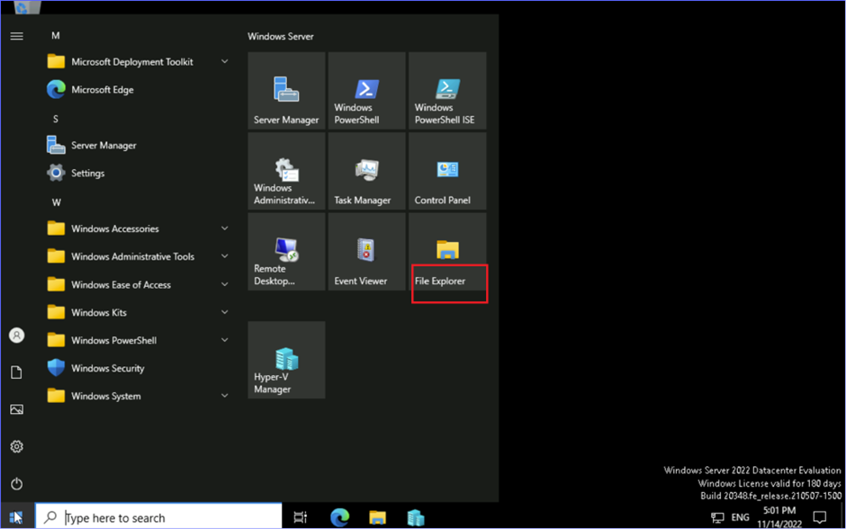

3.  **Win11_21H2_Eval.iso**  파일을 마우스 오른쪽 버튼으로 클릭하고
    **Mount**를 선택합니다. ISO가 DVD 드라이브 **D**로 탑재됩니다.

> 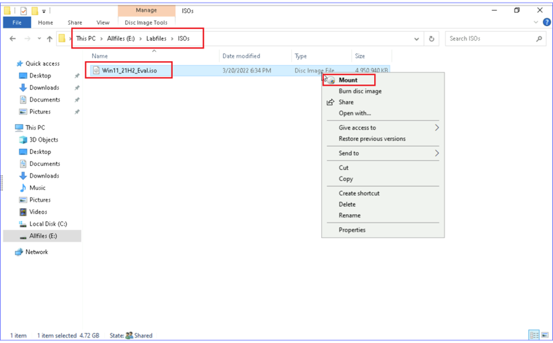
>
> 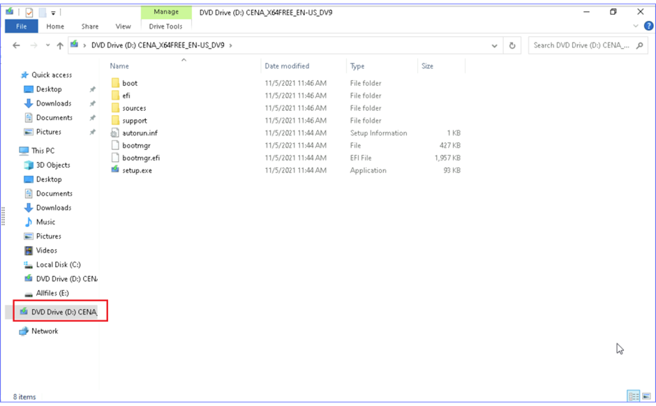

4.  **File Explorer**를 닫습니다.

5.  **Start menu**를 선택하고 **Microsoft Deployment Toolkit**를 확장한
    다음 **Deployment Workbench**를 선택합니다.

> 

6.  **Deployment Workbench**에서 배포 공유를 마우스 오른쪽 버튼으로
    클릭한 다음 **New Deployment Share**를 선택합니다.

> 
>
> **New Deployment Share Wizard** 가 열립니다.

7.  **Path**페이지의 **Deployment share path**에서 값을 !!
    [**E:\DeploymentShare**](urn:gd:lg:a:send-vm-keys)!!로 변경하고
    **Next**를 선택합니다.

> 

8.  **Share** 페이지에서 **Share name**을 기록해 두되 변경하지 마세요.
    **Next**를 선택합니다.

> 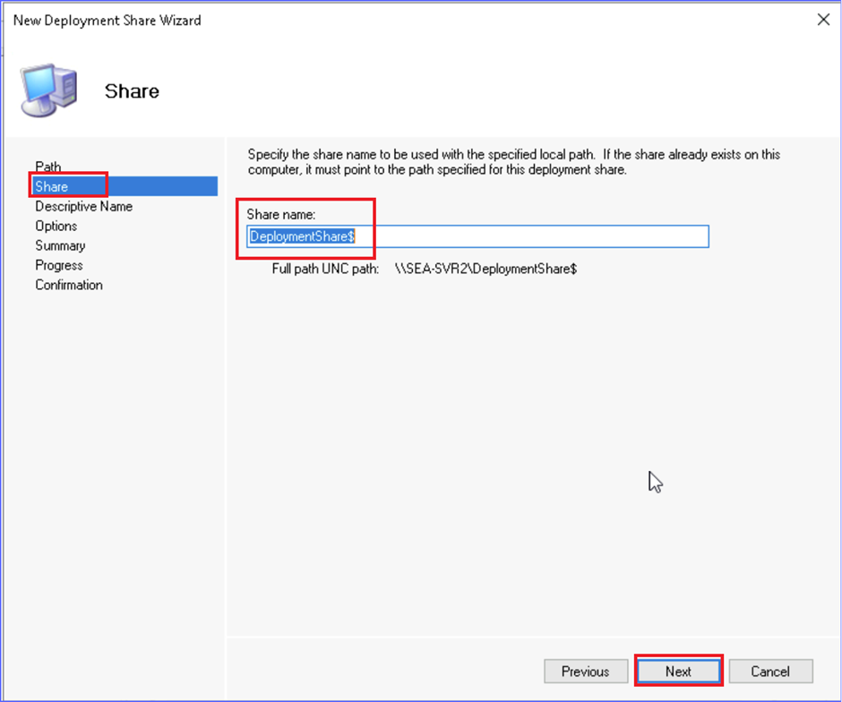

9.  **Descriptive Name**페이지에서 기본값을 그대로 사용하고 **Next**를
    선택합니다.

> 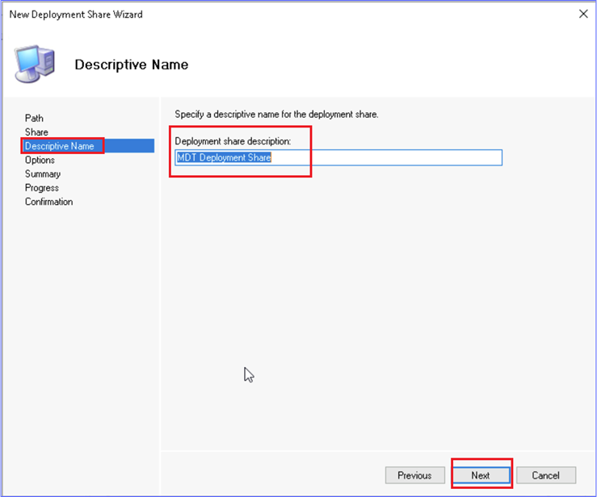

10. **Options** 페이지에서 **next를** 구성한 후 **Next**를 선택합니다.

    - Ask to set the local Administrator password: **Enabled**

    - All other check boxes: **Disabled**

> 

11. **Summary**  페이지에서 정보를 검토한 후 **Next**를 선택합니다.

> 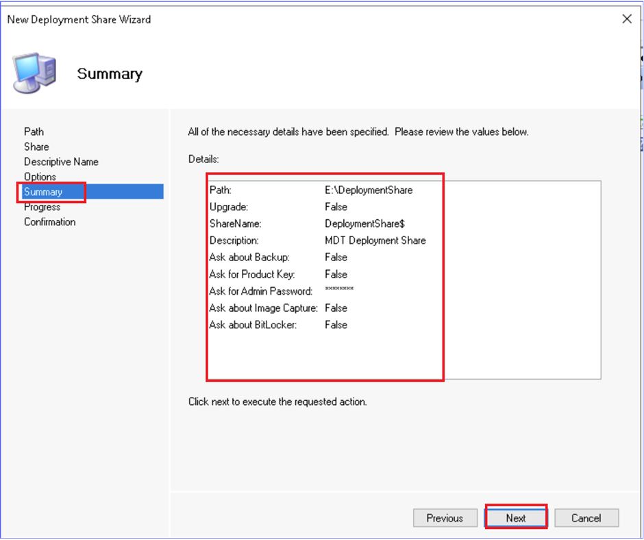

12. **Confirmation** 페이지에서 프로세스가 성공적으로 완료되었는지
    확인한 후 **Finish**를 선택합니다.

> 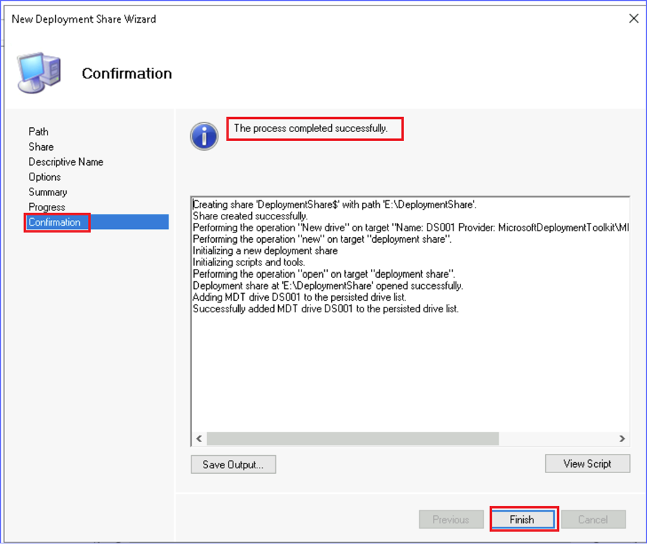

13. **Deployment Shares**아래에서 **MDT Deployment Share**  폴더를
    확장합니다.

> 배포 공유에 대해 구성할 수 있는 다양한 노드를 확인합니다.

### **작업 2: 배포 공유에 운영 체제 파일 추가**

1.  배포 워크벤치에서 **Deployment Shares**, **MDT Deployment Share**를
    차례로 확장한 다음 **Operating Systems**를 선택합니다.

> 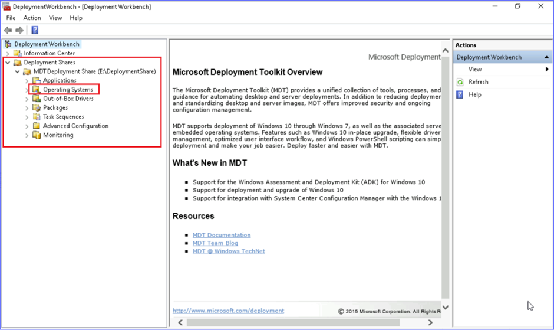

2.  **Operating Systems** 를 마우스 오른쪽 버튼으로 클릭하고 **Import
    Operating System**를 선택합니다. 운영 체제 가져오기 마법사가
    열립니다.

> 

3.  **Import Operating System Wizard**의 **OS Type** 페이지에서 **Full
    set of source files** 를 선택한 후 **Next**를 선택합니다.

> 

4.  **Source** 페이지의 **Source Directory**에
    !!**[D:\\](urn:gd:lg:a:send-vm-keys)!!**를 입력하고 **next를**
    선택합니다.

> 

5.  **Destination** 페이지에서 기본 대상 디렉터리 이름을 !! [**Windows
    11 Enterprise x64**](urn:gd:lg:a:send-vm-keys)!!로 변경한 후
    **Next**를 선택합니다.

> 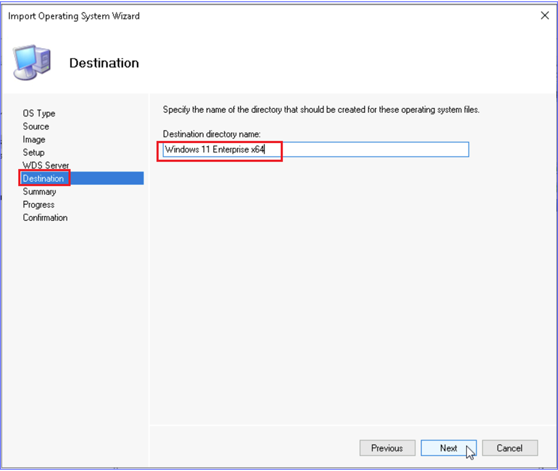

6.  **Summary** 페이지에서 정보를 검토한 후 **Next**를 선택합니다.

> 
>
> 운영 체제 소스 파일이 배포 공유에 복사됩니다.

7.  **Confirmation** 페이지에서 프로세스가 성공적으로 완료되었는지
    확인한 후 **Finish**를 선택합니다.

> 

8.  **Deployment Workbench**에서 **Operating Systems** 를 선택하고 운영
    체제가 표시되는지 확인합니다.

### **작업 3: 배포 공유에 애플리케이션 추가**

1.  Deployment Workbench에서 **Deployment Shares**, **MDT Deployment
    Share**를 차례로 확장한 다음, **Applications**을 선택합니다.

2.  **Applications**을 마우스 오른쪽 버튼으로 클릭하고 **New
    Application**을 선택합니다. New Application Wizard가 열립니다.

> 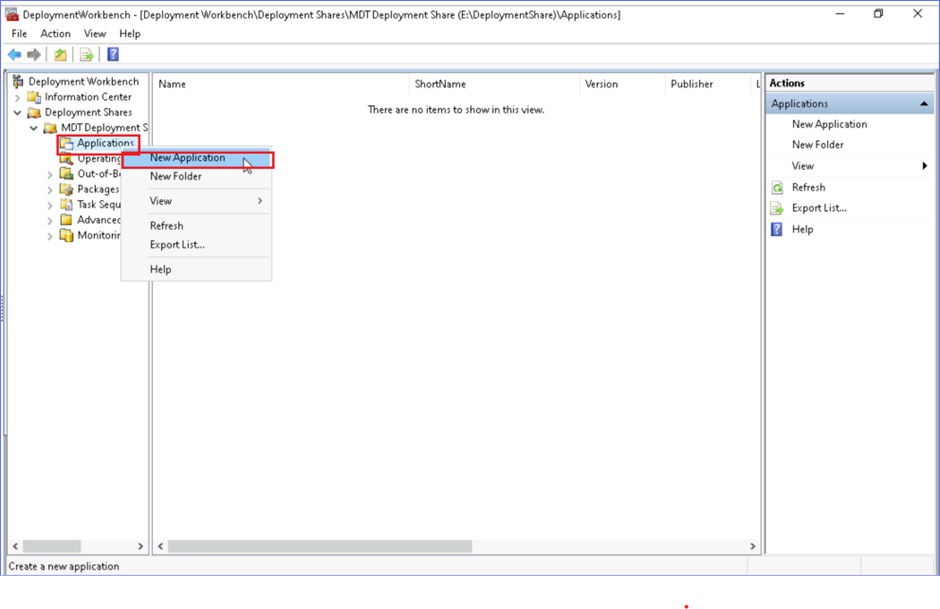

3.  **New Application Wizard**의 **Application Type** 페이지에서
    **Application with source files**을 선택한 후 **next를** 선택합니다.

> 

4.  **Details**페이지에서 **next를** 구성한 후 **Next**를 선택합니다:

    - Publisher: !!**[Microsoft](urn:gd:lg:a:send-vm-keys)!!**

    - Application Name: !!**[XML Notepad](urn:gd:lg:a:send-vm-keys)!!**

> 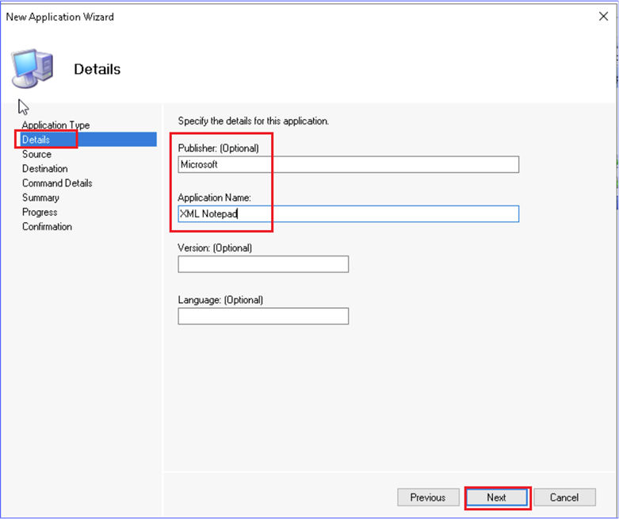

5.  **Source** 페이지의 **Source directory**에 !!
    [**E:\Labfiles\Apps**](urn:gd:lg:a:send-vm-keys)!!를 입력하고
    **Next**를 선택합니다.

> 

6.  **Destination** 페이지에서 기본 대상 디렉터리 이름을 적용한 후
    **Next**를 선택합니다.

> 

7.  **Command Details** 페이지의 **Command line** 에 !!
    [**XmlNotepadSetup.msi /q**](urn:gd:lg:a:send-vm-keys)!!를 입력하고
    **Next**를 선택합니다.

> 

8.  **Summary** 페이지에서 정보를 검토한 후 **Next**를 선택합니다.

> 

9.  **Confirmation** 페이지에서 프로세스가 성공적으로 완료되었는지
    확인한 후 **Finish**를 선택합니다.

### **작업 4: MDT 작업 시퀀스 만들기**

1.  배포 워크벤치에서 **Deployment Shares**, **MDT Deployment Share**를
    차례로 확장한 다음 **Task Sequences**를 선택합니다.

2.  **Task Sequences** 를 마우스 오른쪽 버튼으로 클릭하고 **New Task
    Sequence**를 선택합니다. **New Task Sequence Wizard**가 열립니다.

> 

3.  **General Settings** 페이지에서 **next를** 구성한 후 **Next**를
    선택합니다**:**

    - Task sequence ID: !!**[001](urn:gd:lg:a:send-vm-keys)!!**

    - Task sequence name: !!**[Deploy Windows 11
      Enterprise](urn:gd:lg:a:send-vm-keys)!!**

> 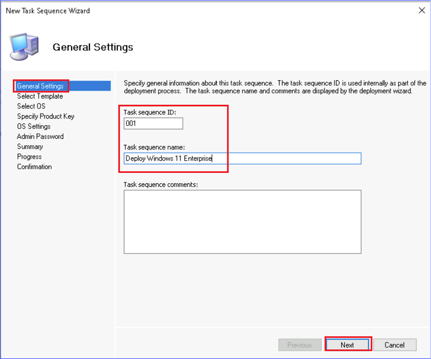

4.  **Select Template** 페이지에서 **Standard Client Task Sequence**를
    선택한 후 **Next**를 선택합니다.

> 

5.  **Select OS**  페이지에서 **Windows 10 Enterprise Evaluation**을
    선택한 후 **Next**를 선택합니다.

> 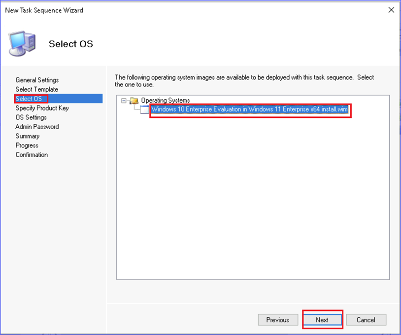

6.  **Specify Product Key**  페이지에서 **Do not specify a product key
    at this time**를 선택한 후 **Next를** 선택합니다.

> 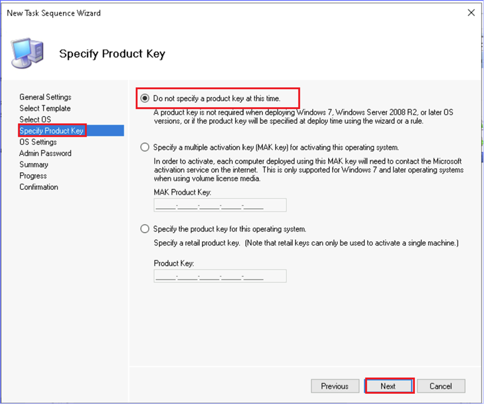

7.  **OS Settings** 페이지에서 **next를** 구성한 후 **Next**를
    선택합니다:

    - Full Name: !!**[User](urn:gd:lg:a:send-vm-keys)!!**

    - Organization: !!**[Contoso
      Corporation](urn:gd:lg:a:send-vm-keys)!!**

    - Internet Explorer Home
      Page: !!**[about:blank](urn:gd:lg:a:send-vm-keys)!!**

> 

8.  **Admin Password**  페이지에서 **Use the specified local
    Administrator password**을 선택한 후 두 텍스트 상자에 모두 !!
    [**Pa55w.rd**](urn:gd:lg:a:send-vm-keys)!!를 입력합니다. **Next**를
    선택합니다.

> 

9.  요약 페이지에서 정보를 검토한 후 **next를** 선택합니다. 페이지에서
    정보를 검토한 후 **Next**를 선택합니다.

> 

10. **Confirmation** 페이지에서 프로세스가 성공적으로 완료되었는지
    확인한 후 **Finish**를 선택합니다.

> 

11. **Deployment Workbench**에서 **Task Sequences** 를 선택한 상태에서
    **Deploy Windows 11 Enterprise**작업 순서가 표시되는지 확인합니다.

> 

12. **Deploy Windows 11 Enterprise**  작업 시퀀스를 마우스 오른쪽
    버튼으로 클릭한 다음 **Properties**를 선택합니다

> 

13. **Task Sequence** 탭을 선택합니다.

14. **Validation**노드를 확장한 다음 **Validate**를 선택합니다.

15. **Properties** 페이지에서 **Ensure minimum memory** 및 **Ensure
    minimum processor speed** 옆의 확인란을 해제합니다.

> 다른 설정은 변경하지 마세요.

16. On the **Deploy Windows 11 Enterprise Properties** window,
    select **OK**. **Deploy Windows 11 Enterprise
    Properties** 창에서**OK**.를 선택합니다.

> 

### **작업 5: 배포 공유 속성 및 Windows PE 설정 구성**

1.  배포 워크벤치에서 **Deployment Shares**를 확장하고 **MDT Deployment
    Share**를 선택합니다.

2.  **MDT Deployment Share** 를 마우스 오른쪽 버튼으로 클릭한 다음
    **Properties**를 선택합니다.

> 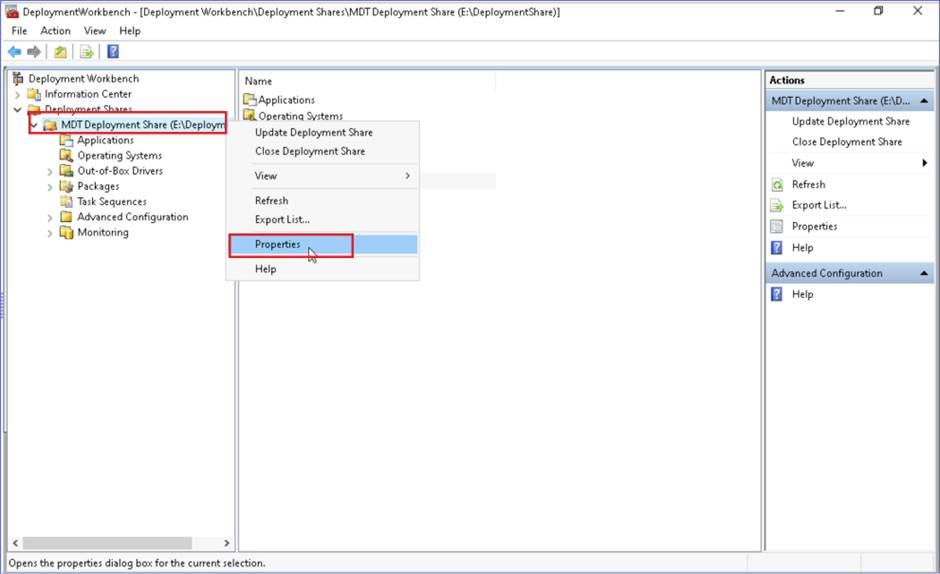

3.  **MDT Deployment Share Properties**  창의 **General**  탭에서 배포
    공유가 생성될 때 제공된 정보를 기록해 둡니다.

> 

4.  **Rules** 탭을 선택합니다.

> Rules탭에는 CustomSettings.ini 파일의 내용이 표시됩니다. 이 값은 배포
> 공유 생성 시에도 제공되었습니다.
>
> 

5.  **Windows PE** 탭을 선택합니다.

> Windows PE 탭은 Windows PE 부팅 디스크를 만드는 옵션을 제공합니다.

6.  **Windows PE** 탭의 **Platform** 옆에서 **x64**를 선택합니다.

7.  **Windows PE Customizations**  섹션의 **Scratch space siz** 옆에서
    **64**를 선택합니다.

> 

8.  **Features** 탭을 선택한 다음 다음 기능 팩 옆에 있는 확인란을
    선택합니다:

    - DISM Cmdlets

    - Windows PowerShell

    - Microsoft Data Access Components (MDAC/ADO) support

> 
>
> 

9.  **Monitoring** 탭을 선택합니다.

10. **Monitoring** 탭에서 **Enable monitoring for this deployment
    share**옆의 확인란을 선택합니다.

11. **MDT Deployment Share Properties**  창에서 **OK**를 선택합니다.

> 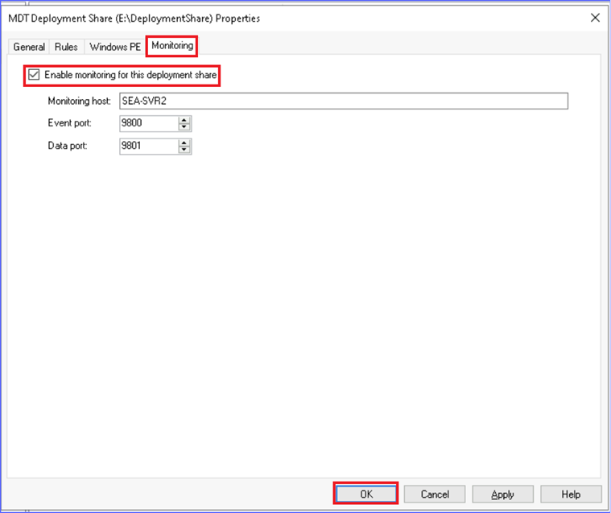

12. **MDT Deployment Share** 를 마우스 오른쪽 버튼으로 클릭하고 **Update
    Deployment Share**를 선택합니다. 배포 공유 업데이트 마법사가
    열립니다.

> 

13. **Options** 페이지에서 **Optimize the boot image updating
    process** 를 선택한 후 **Next**를 선택합니다.

> 

14. **Summary** 페이지에서 **Next**를 선택합니다.

> 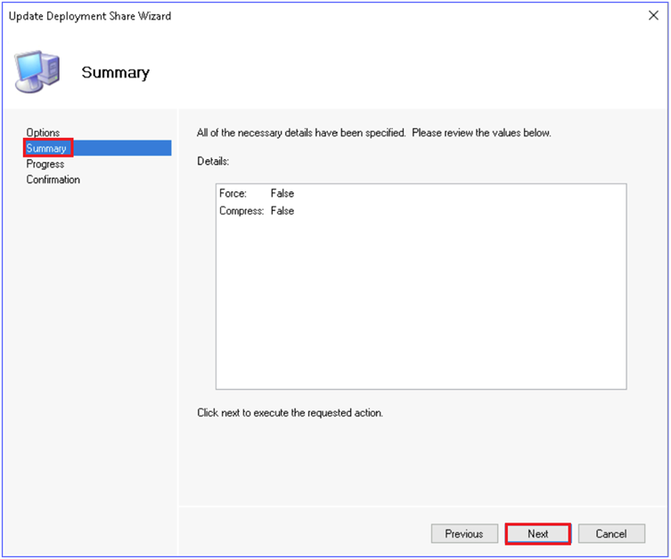
>
> Deployment Share가 Windows PE 파일을 업데이트하고 생성하기 시작합니다.
> 완료하는 데 몇 분 정도 걸립니다.

15. **Confirmation**  페이지에서 프로세스가 성공적으로 완료되었는지
    확인한 후 **Finish**를 선택합니다.

> 

### **작업 6: MDT를 사용하여 Windows 11 배포**

1.  [**SEA-SVR2**](urn:gd:lg:a:select-vm)의 작업 표시줄에서 **Hyper-V
    Manager**를 선택합니다.

> 

2.  Hyper-V Manager에서 **Virtual Switch Manager**를 선택합니다.

> 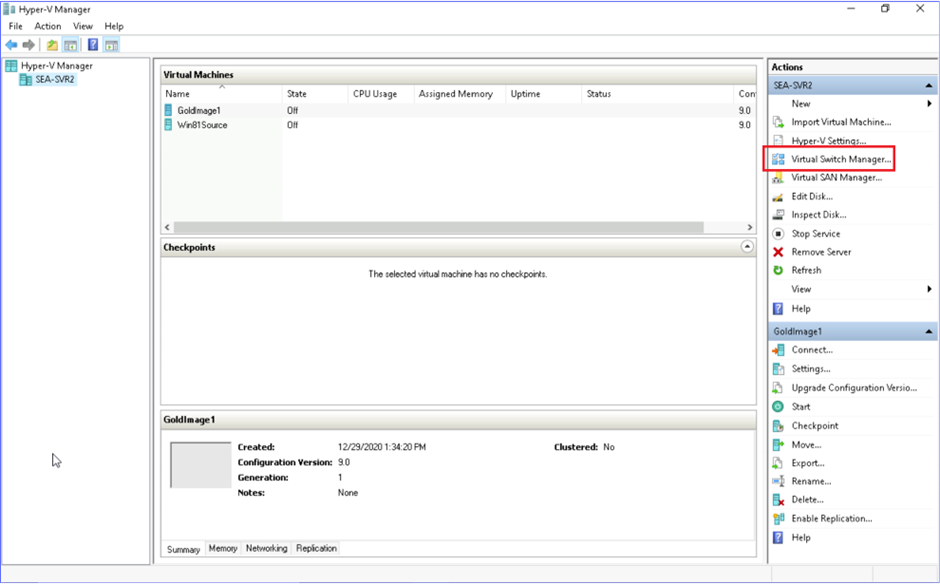

3.  목록에서 **External**를 선택한 다음 **Create Virtual Switch**를
    클릭합니다.

> 

4.  **Virtual Switch Properties** 페이지의 **Name**에 [**External
    network**](urn:gd:lg:a:send-vm-keys)를 입력하고 **OK**를 선택한 다음
    **Yes**를 선택합니다.

> 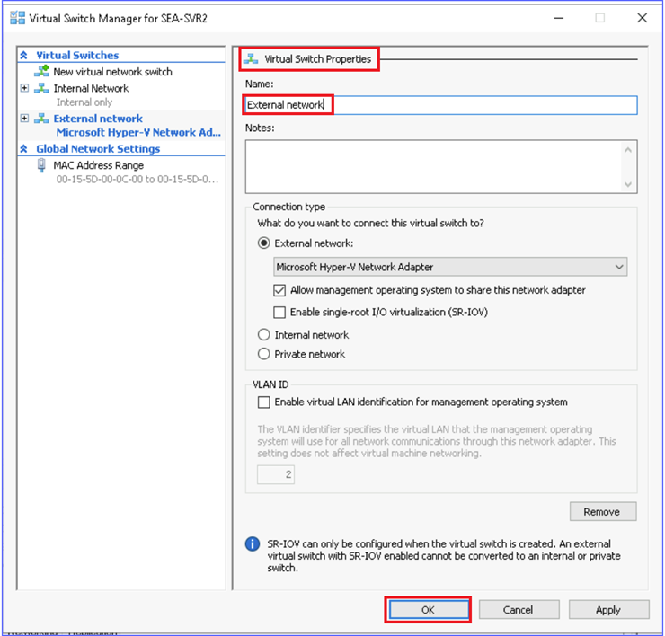
>
> 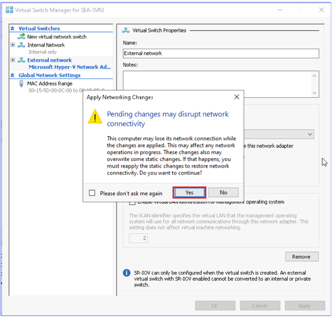

5.  Hyper-V 관리자에서 **SEA-SVR2** 를 선택한 다음 작업 창에서 **new**를
    선택하고 **Virtual Machine**을 선택합니다.

> 

6.  **Before you Begin** 페이지에서 **Next**를 선택합니다.

> 

7.  **Specify Name and Location** 페이지에서 **Name**상자에 !!
    [**SEA-WS4**](urn:gd:lg:a:send-vm-keys)!!를 입력합니다.

8.  **Store the virtual machine in a different location** 옆의 확인란을
    선택하고 **Location** 옆에
    !!**[E:\Labfiles\VirtualMachines](urn:gd:lg:a:send-vm-keys)!!**를
    입력합니다. **Next**를 선택합니다.

> 

9.  **Specify Generation** 페이지에서 **Generation 2** 가 선택되었는지
    확인한 후 **Next**를 선택합니다.

> 

10. **Assign Memory** 페이지에서 **Startup memory** 옆에 !!
    [**8192**](urn:gd:lg:a:send-vm-keys)!!를 입력하고 **Next**를
    선택합니다.

> 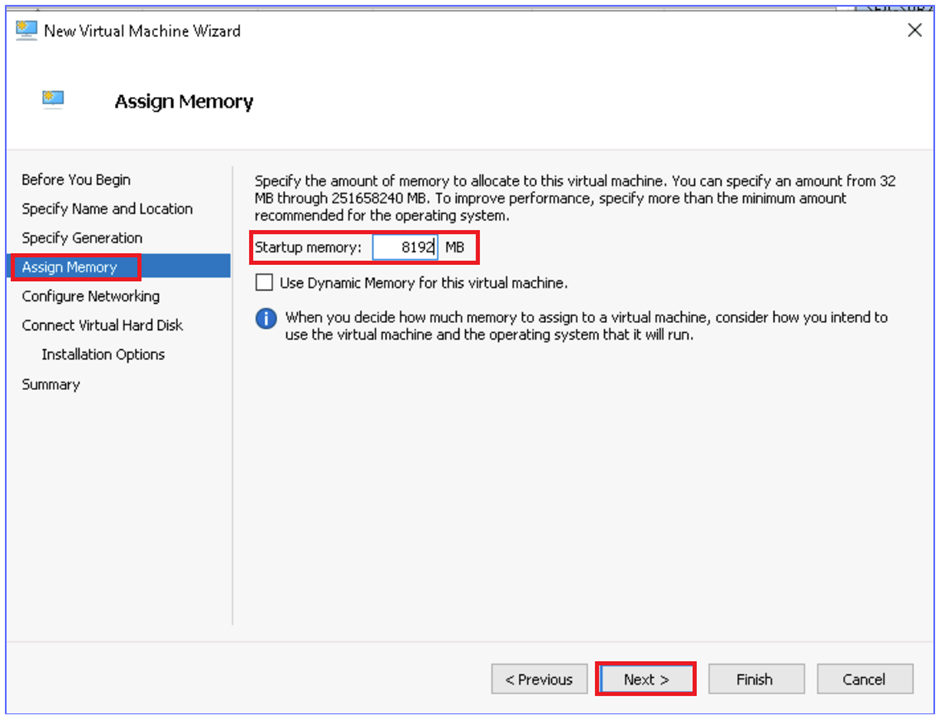

11. **Configure Networking**  페이지에서 **Connection**옆에 있는
    **External Network** 를 선택한 후 **Next**를 선택합니다.

> 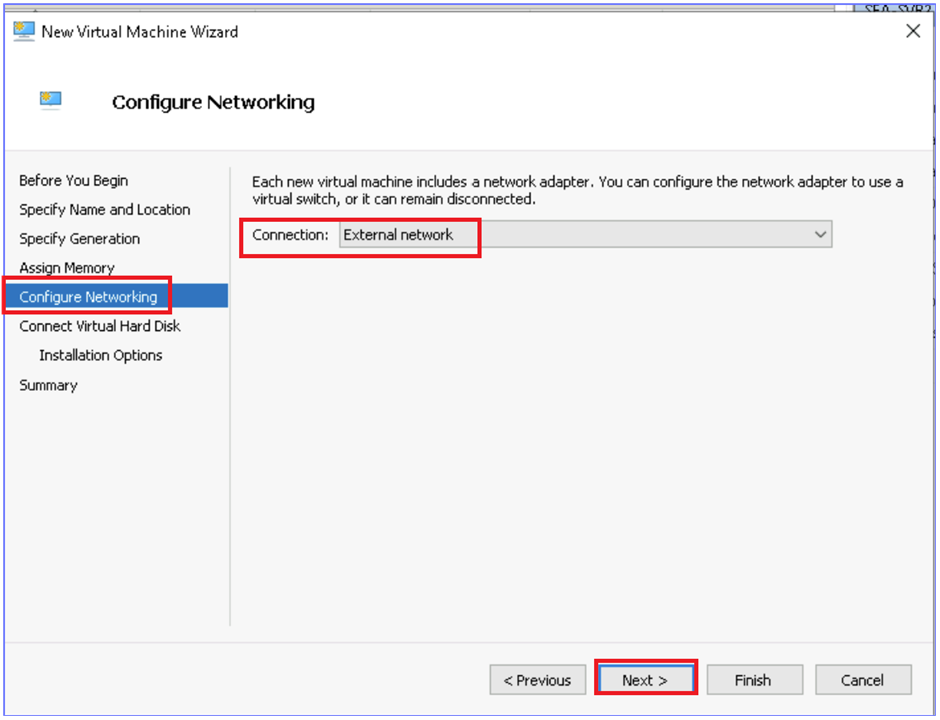

12. **Connect Virtual Hard Disk**  페이지에서 **Create a virtual hard
    disk** 를 선택하고 **next를** 입력한 후 **Next**를 클릭합니다.

    - Name: !!**[SEA-WS4.vhdx](urn:gd:lg:a:send-vm-keys)!!**

    - Location: !!**[E:\Labfiles\VirtualMachines](urn:gd:lg:a:send-vm-keys)!!**

    - Size: !!**[60](urn:gd:lg:a:send-vm-keys)!!**

> 

13. **Installation Options**  페이지에서 **Install an operating system
    from a bootable image file** 를 선택하고 **next를** 구성합니다:

    - Image file
      (.iso): !!**[E:\DeploymentShare\Boot\LiteTouchPE_x64.iso](urn:gd:lg:a:send-vm-keys)!!**

> 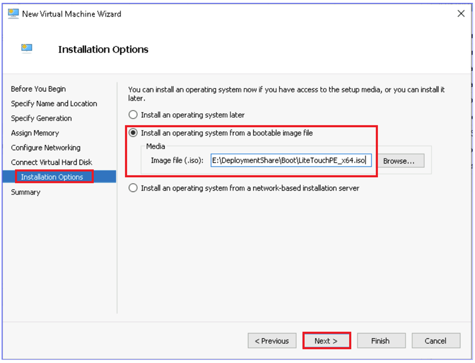

14. **Next** 를 선택한 후 **Finish**를 선택합니다.

> 

15. Hyper-V 관리자에서 **SEA-WS4**를 마우스 오른쪽 버튼으로 클릭한 다음
    **Settings**를 선택합니다.

> 

16. **Security**를 선택한 다음 **Enable Trusted Platform Module**옆에
    있는 확인란을 선택합니다.

> 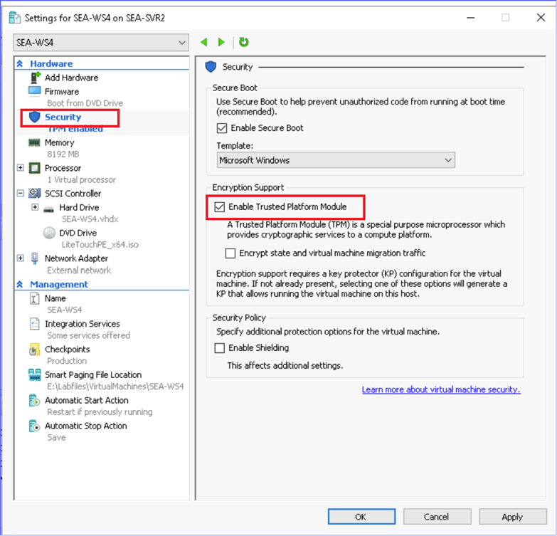

17. **Processor**를 선택한 다음 가상 프로세서 수를 !!
    [**2**](urn:gd:lg:a:send-vm-keys)!!로 변경합니다.

18. **OK**를 선택하여 설정 대화 상자를 닫습니다.

> 

19. Hyper-V 관리자에서 **SEA-WS4**를 선택하고 **Connect**을 선택한 다음
    **Start**를 선택합니다.

> 
>
> 

20. 컴퓨터가 시작되면 키보드의 아무 키나 눌러 MDT 배포 Wizard를
    실행합니다. 필요에 따라 창을 최대화합니다.

> 

21. **Welcome** 페이지에서 **Run the Deployment Wizard to install a new
    Operating System**를 설치합니다.

> 

22. **Specify credentials for connecting to network shares**  창에서
    **next를** 입력한 다음 **OK**를 선택합니다.

    - User Name: !!**[Administrator](urn:gd:lg:a:send-vm-keys)!!**

    - Password: !!**[Pa55w.rd](urn:gd:lg:a:send-vm-keys)!!**

    - Domain: !!**[Contoso](urn:gd:lg:a:send-vm-keys)!!**

> 

23. **Task Sequence** 페이지에서 **Deploy Windows 11 Enterprise** 를
    선택한 후 **Next**를 선택합니다.

> 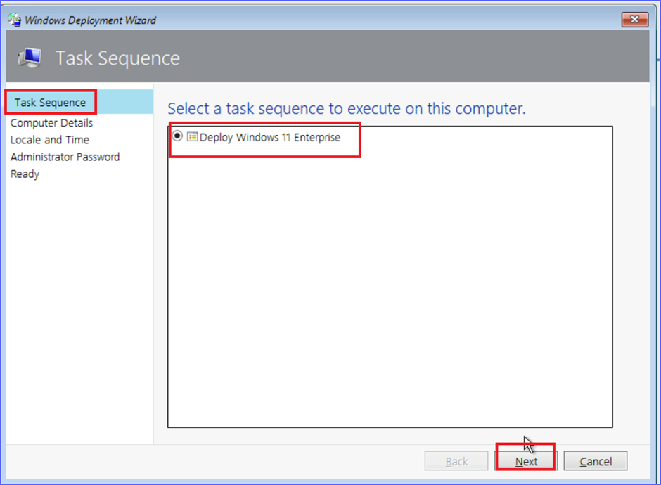

24. **Computer Details** 정보 페이지에서 **Computer name** 옆에 !!
    [**SEA-WS4**](urn:gd:lg:a:send-vm-keys)!!를 입력하고 **Next**를
    선택합니다.

> 

25. On the **Move Data and Settings** page, select **Next**. **Move Data
    and Settings**  페이지에서 **next**를 선택합니다.

> 

26. **User Data (Restore)**페이지에서 **Next**를 선택합니다.

> 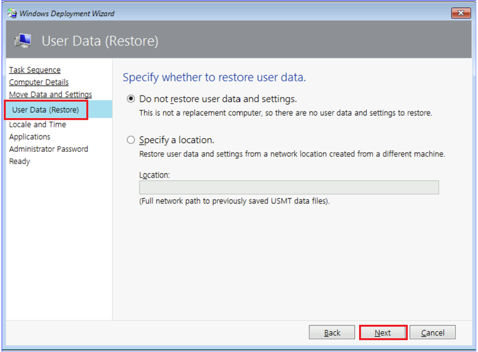

27. **Locale and Time** 페이지에서 **Next**를 선택합니다.

> 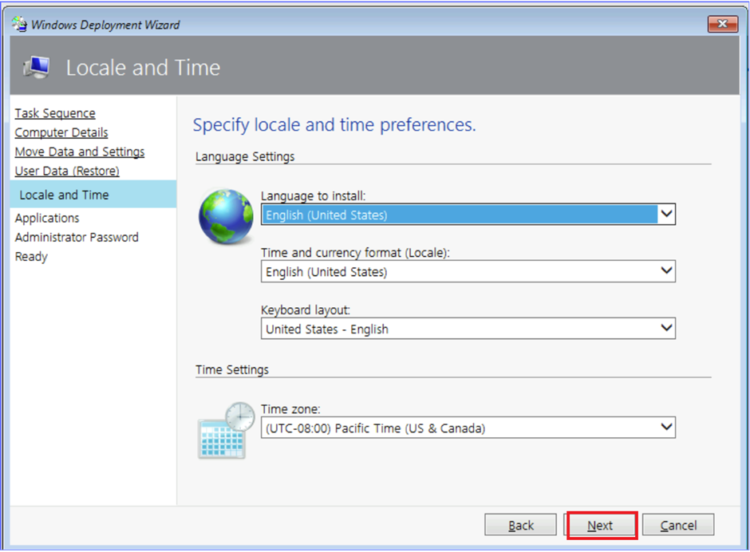

28. **Applications**  페이지에서 **Next**를 선택합니다.

> 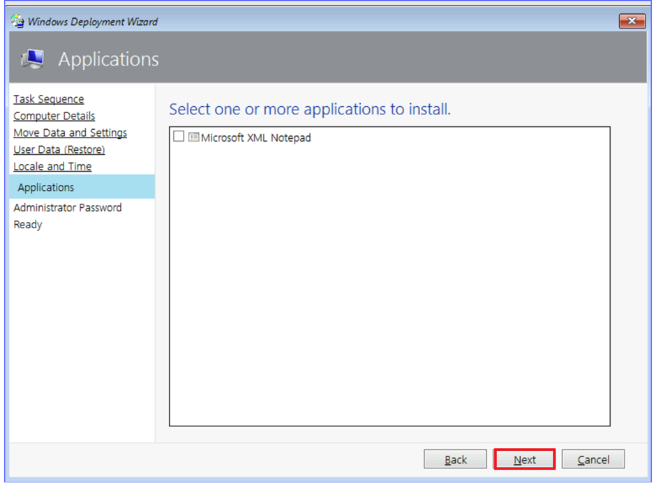

29. **Administrator Password**페이지에서 두 텍스트 상자에 !!
    [**Pa55w.rd**](urn:gd:lg:a:send-vm-keys)!!를 입력한 후 **Next**를
    선택합니다.

> 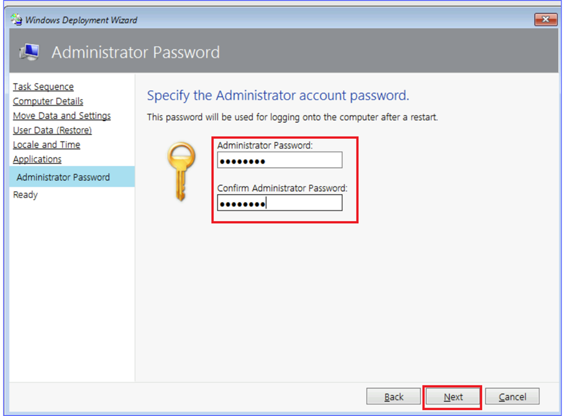

30. **Ready**  페이지에서 **Begin을** 선택합니다.

> 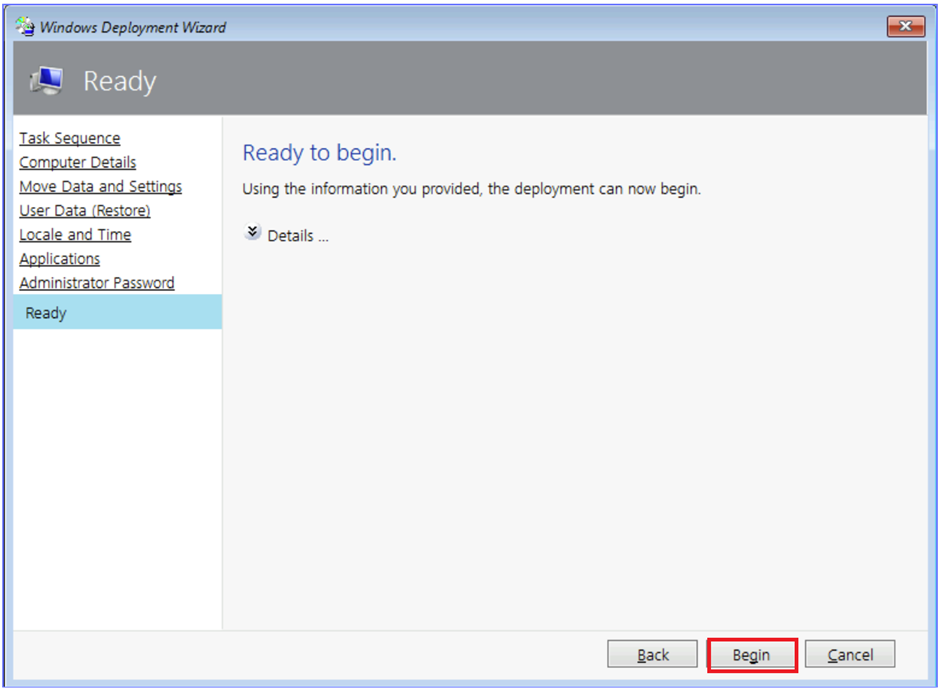
>
> 설치가 시작됩니다. 완료하는 데 시간이 다소 소요되며, 필요에 따라 설치
> 중에 **SEA-WS4**가 재부팅됩니다.

31. **Deployment Workbench**로 전환합니다.

32. 배포 워크벤치에서 **Deployment Shares**를 확장하고 **MDT Deployment
    Share**를 확장합니다.

33. **Monitoring**을 선택한 다음 세부 정보 창에서 **SEA-WS4**를 두 번
    클릭합니다.

> 
>
> 배포 중에 모니터링 상태를 검토합니다.
>
> 

34. **SEA-WS4**로 전환합니다.

35. 설치가 완료되면 데스크톱이 열리고 배포가 완료됩니다. 배포 요약에서
    **Finish**를 선택합니다.

> 

36. **SEA-WS4**를 종료하고 가상 머신 연결 창을 닫습니다.

> 

37. Hyper-V 관리자에서 **SEA-WS4**를 마우스 오른쪽 버튼으로 클릭한 다음
    **Settings**를 선택합니다.

> 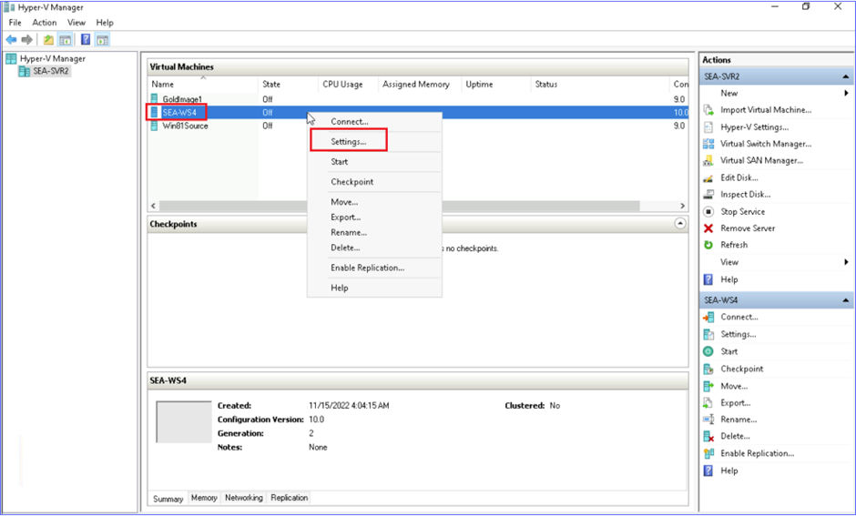

38. **Settings for SEA-WS4**에서 **SCSI Controller** 를 확장한 다음
    **DVD Drive**를 선택합니다.

39. 세부 정보 창의 **Media**에서 **None**을 선택한 다음 **OK**를
    선택합니다.

> 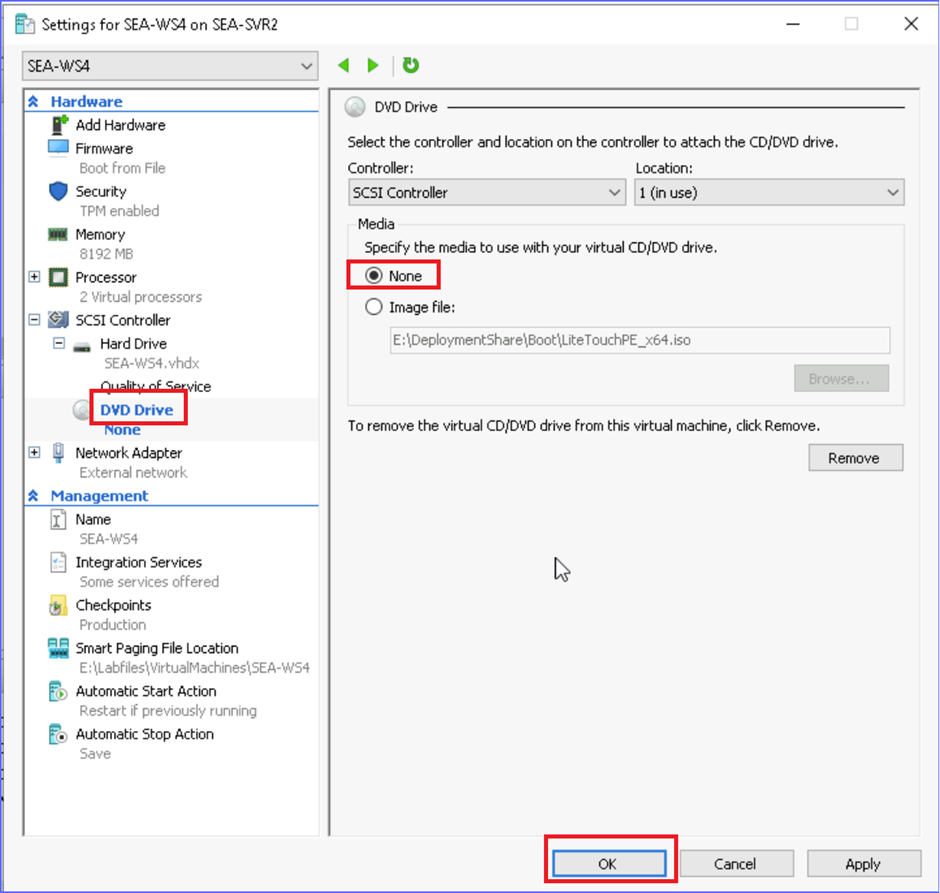

40. **SEA-WS4**를 마우스 오른쪽 버튼으로 클릭한 다음 **Checkpoint**을
    선택하여 SEA-WS4의 현재 상태에 대한 검사점을 만듭니다.

> 
>
> 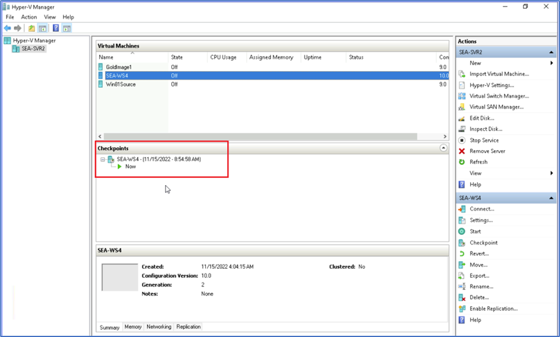

41. [**SEA-SVR2**](urn:gd:lg:a:select-vm)에서 **Hyper-V Manager** 를
    닫고 **Deployment Workbench**를 닫습니다.

42. **File Explorer**를 열고 **DVD Drive D** 를 마우스 오른쪽 버튼으로
    클릭한 다음 **Eject**를 선택합니다.

> 
>
> 

43. **File Explorer**를 닫고 **SEA-SVR2**에서 로그아웃합니다.

**결과**: 이 연습을 완료하면 Microsoft 배포 도구 키트를 사용하여 Windows
11 워크스테이션을 만들고 배포하는 데 성공하게 됩니다.
