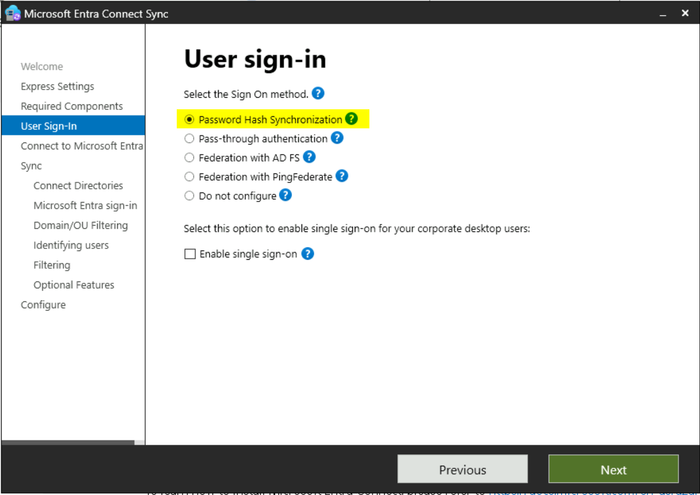
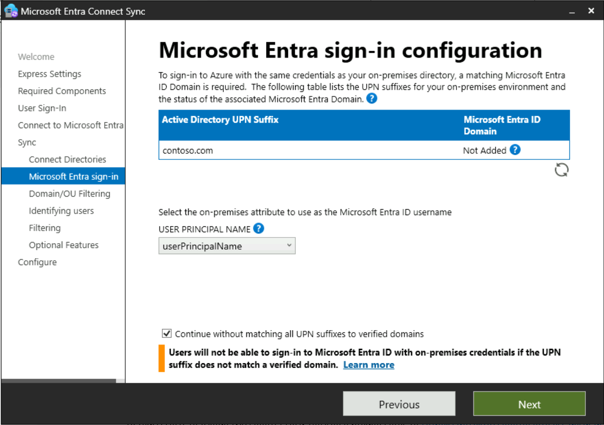

실습 02 - Microsoft Entra Connect를 사용하여 ID 동기화

**요약**

이 실습에서는 Active Directory 도메인 서비스에서 Microsoft Entra ID로의
동기화를 구성합니다.

**시나리오**

Contoso Corporation은 현재 AD DS와 Microsoft Entra ID의 사용자를 별도의
프로세스로 관리하고 있습니다. 이러한 방식은 시간이 많이 소요되고 정보
일관성이 떨어지는 결과를 초래했습니다. Microsoft Entra Connect 동기화
도구를 사용하여 두 디렉터리를 연결하여 이 문제를 해결하라는 과제를
받았습니다.

## 작업 0: PowerShell 스크립트를 사용하여 TLS 1.2 활성화

1.  **SEA-SVR1**에서 **Pa55w.rd**비밀번호를 사용하여
    **Contoso\Administrator** 로 로그인합니다.

2.  시작 메뉴에서 [**PowerShell**](urn:gd:lg:a:send-vm-keys)을 입력하고
    PowerShell을 마우스 오른쪽 버튼으로 클릭한 후 **run as
    administrator**을 선택합니다.

3.  PowerShell에서 다음 스크립트를 실행합니다.

**If** (-Not (Test-Path
'HKLM:\SOFTWARE\WOW6432Node\Microsoft\\NETFramework\v4.0.30319'))

{

New-Item 'HKLM:\SOFTWARE\WOW6432Node\Microsoft\\NETFramework\v4.0.30319'
-Force | Out-Null

}

New-ItemProperty -Path
'HKLM:\SOFTWARE\WOW6432Node\Microsoft\\NETFramework\v4.0.30319' -Name
'SystemDefaultTlsVersions' -Value '1' -PropertyType 'DWord' -Force |
Out-Null

New-ItemProperty -Path
'HKLM:\SOFTWARE\WOW6432Node\Microsoft\\NETFramework\v4.0.30319' -Name
'SchUseStrongCrypto' -Value '1' -PropertyType 'DWord' -Force | Out-Null

**If** (-Not (Test-Path
'HKLM:\SOFTWARE\Microsoft\\NETFramework\v4.0.30319'))

{

New-Item 'HKLM:\SOFTWARE\Microsoft\\NETFramework\v4.0.30319' -Force |
Out-Null

}

New-ItemProperty -Path
'HKLM:\SOFTWARE\Microsoft\\NETFramework\v4.0.30319' -Name
'SystemDefaultTlsVersions' -Value '1' -PropertyType 'DWord' -Force |
Out-Null

New-ItemProperty -Path
'HKLM:\SOFTWARE\Microsoft\\NETFramework\v4.0.30319' -Name
'SchUseStrongCrypto' -Value '1' -PropertyType 'DWord' -Force | Out-Null

**If** (-Not (Test-Path
'HKLM:\SYSTEM\CurrentControlSet\Control\SecurityProviders\SCHANNEL\Protocols\TLS
1.2\Server'))

{

New-Item
'HKLM:\SYSTEM\CurrentControlSet\Control\SecurityProviders\SCHANNEL\Protocols\TLS
1.2\Server' -Force | Out-Null

}

New-ItemProperty -Path
'HKLM:\SYSTEM\CurrentControlSet\Control\SecurityProviders\SCHANNEL\Protocols\TLS
1.2\Server' -Name 'Enabled' -Value '1' -PropertyType 'DWord' -Force |
Out-Null

New-ItemProperty -Path
'HKLM:\SYSTEM\CurrentControlSet\Control\SecurityProviders\SCHANNEL\Protocols\TLS
1.2\Server' -Name 'DisabledByDefault' -Value '0' -PropertyType 'DWord'
-Force | Out-Null

**If** (-Not (Test-Path
'HKLM:\SYSTEM\CurrentControlSet\Control\SecurityProviders\SCHANNEL\Protocols\TLS
1.2\Client'))

{

New-Item
'HKLM:\SYSTEM\CurrentControlSet\Control\SecurityProviders\SCHANNEL\Protocols\TLS
1.2\Client' -Force | Out-Null

}

New-ItemProperty -Path
'HKLM:\SYSTEM\CurrentControlSet\Control\SecurityProviders\SCHANNEL\Protocols\TLS
1.2\Client' -Name 'Enabled' -Value '1' -PropertyType 'DWord' -Force |
Out-Null

New-ItemProperty -Path
'HKLM:\SYSTEM\CurrentControlSet\Control\SecurityProviders\SCHANNEL\Protocols\TLS
1.2\Client' -Name 'DisabledByDefault' -Value '0' -PropertyType 'DWord'
-Force | Out-Null

Write-Host 'TLS 1.2 has been enabled. You must restart the Windows
Server for the changes to take affect.' -ForegroundColor Cyan

4.  Windows Server VM을 다시 시작합니다.

작업 1: Microsoft Entra Connect를 사용하여 디렉터리 동기화 구성

1.  필요한 경우 [***SEA-SVR1***](urn:gd:lg:a:select-vm)에서
    [**Contoso\Administrator**](urn:gd:lg:a:send-vm-keys)로 로그인하고
    비밀번호는 !! [**Pa55w.rd**](urn:gd:lg:a:send-vm-keys)!!입니다.

2.  타스크바에서 **Microsoft Edge**를 선택합니다.

3.  주소창에
    !\!!를
    입력합니다.

4.  Microsoft Entra Connect 페이지에서 **Download**를 선택합니다.

> Microsoft Entra Connect는 자동으로 **SEA-SVR1**의 **Downloads** 폴더에
> 다운로드됩니다.
>
> 

5.  다운로드한 **AzureADConnect.msi**파일에 대해 **Open file**을
    클릭합니다.

> 

6.  **Microsoft Azure Active Directory Connect** wizard의 **Welcome to
    Azure AD Connect** 페이지에서 **I agree to the license terms and
    privacy notice** 확인란을 선택한 다음 **Continue**를 선택합니다.

> 

7.  **Express Settings** 페이지에서 **Customize**을 선택합니다.

> 

8.  **Install required components** 페이지에서 **Install**을 선택합니다.

> 

9.  **User sign-in** 페이지에서 **Password Hash Synchronization** 가
    선택되어 있는지 확인한 후 **Next**를 선택합니다.

> 

10. **Connect to Azure AD**페이지에서 사용자 **USERNAME**  및
    **PASSWORD**상자에 **Office 365 Tenant credentials**을 입력한 후
    **Next**를 선택합니다.

> 

11. **Connect your directories**  페이지에서 **Contoso.com** 이
    **FOREST**에 나열되어 있는지 확인한 다음 **Add Directory**를
    선택합니다.

> 

12. **AD forest account**  창에서 **AD forest account** 옵션을 선택하고
    **ENTERPRISE ADMIN USERNAME**  필드에
    [**Contoso\Administrator**](urn:gd:lg:a:send-vm-keys)를 입력한 후
    "암호" 필드에 !! [**Pa55w.rd**](urn:gd:lg:a:send-vm-keys)!!를
    입력합니다. **OK**를 선택하고 **Next**를 클릭합니다.

> 
>
> 

13. **Azure AD sign-in configuration** 페이지에서 사용자 주체 이름
    드롭다운 목록에서 **userPrincipalName** 값이 선택되어 있는지
    확인합니다.

> 

14. **Continue without matching all UPN suffixes to verified
    domains** 을 선택한 후 **Next**을 선택합니다.

15. **Domain and OU filtering**  페이지에서 **Sync selected domains and
    OUs**를 선택합니다.

16. Select **Next**. **Contoso.com**을 확장하고 **Contoso.com** 옆의
    확인란을 선택 취소한 후,
    **IT**, **Managers**, **Marketing**, **Research**, 및 **Sales**
    확인란만 선택되어 있는지 확인합니다. \[다음\]을 클릭합니다.

> 

17. **Uniquely identifying your users** 페이지에서 **Next**를
    선택합니다.

18. **Filter users and devices** 페이지에서 **Next**을 선택합니다.

19. **Optional features**  페이지에서 사용 가능한 옵션을 검토하되
    변경하지 마세요. **Password hash synchronization** 가 선택되어
    있는지 확인하고 '**Next**을 선택하세요.

> 

20. **Ready to configure**페이지에서 **Start the synchronization process
    when configuration completes** 선택되어 있는지 확인한 다음
    **Install을** 선택합니다.

> 

21. 구성이 완료되면 **Exit**를 선택합니다.

> 
>
> **Note**: At this time, synchronization of objects from your local
> Active Directory Domain Services (AD DS) and Microsoft Entra ID
> begins. You should wait approximately 3-4 minutes for this process to
> complete.

22. 열려 있는 모든 창문을 닫습니다.

작업 2: Microsoft Entra ID에서 동기화 확인

1.  **Microsoft Edge**에서 새 탭을 열고 Microsoft Entra 관리 센터 사용자
    페이지로
    이동합니다.!\!!
    로그인하라는 메시지가 표시되면 랩 인터페이스의 홈 탭에서 Office 365
    테넌트 자격 증명을 사용하세요.

2.  로컬 AD DS의 사용자가 표시되는지 확인하세요. 해당 사용자의
    **On-premises sync enabled** 열에**Yes** 값이 있는지 확인합니다.

> 

3.  탐색 창에서 **Groups**확장을 선택한 다음 **All groups**을
    선택합니다.

> 

4.  로컬 AD DS()에서 그룹이 표시되는지 확인합니다.

> 

5.  **Managers** 그룹을 선택합니다.

> 

6.  **Managers** 그룹 페이지에서 **Members**를 선택한 다음 사용자가
    표시되는지 확인합니다.

> 
>
> 
>
> **이 그룹은 로컬 AD DS에서 생성되므로 그룹에 구성원을 추가하거나
> 제거할 수 없습니다.**

15. Microsoft Edge를 닫습니다.

**결과**: 이 연습을 완료하면 Active Directory 도메인 서비스에서
Microsoft Entra ID로 ID를 동기화하도록 Microsoft Entra Connect를
성공적으로 구성하게 됩니다.
