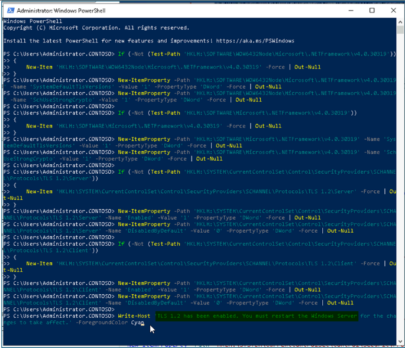

Lab 02 - Synchronisieren von Identitäten mithilfe von Microsoft Entra
Connect

**Zusammenfassung**

In dieser Übung konfigurieren Sie die Synchronisierung von Active
Directory Domain Services mit Microsoft Entra ID

**Szenario**

Die Contoso Corporation verwaltet derzeit Benutzer sowohl in AD DS als
auch in Microsoft Entra ID als separate Prozesse. Das ist zeitaufwendig
und hat zu widersprüchlichen Informationen geführt. Sie wurden
beauftragt, dieses Problem zu beheben, indem Sie die beiden
Verzeichnisse mithilfe des Microsoft Entra
Connect-Synchronisierungstools verbinden.

## Aufgabe 0: Aktivieren von TLS 1.2 mithilfe des PowerShell-Skripts

1.  Melden Sie **sich auf** SEA-SVR1 als **Contoso\Administrator** mit
    dem Kennwort **Pa55w.rd an.**

2.  Geben Sie im Startmenü [**PowerShell
    ein**](urn:gd:lg:a:send-vm-keys) , klicken Sie mit der rechten
    Maustaste auf PowerShell und wählen Sie **run as administrator**.

3.  Führen Sie das folgende Skript in der PowerShell aus.

**If** (-Not (Test-Path
'HKLM:\SOFTWARE\WOW6432Node\Microsoft\\NETFramework\v4.0.30319'))

{

New-Item 'HKLM:\SOFTWARE\WOW6432Node\Microsoft\\NETFramework\v4.0.30319'
-Force | Out-Null

}

New-ItemProperty -Path
'HKLM:\SOFTWARE\WOW6432Node\Microsoft\\NETFramework\v4.0.30319' -Name
'SystemDefaultTlsVersions' -Value '1' -PropertyType 'DWord' -Force |
Out-Null

New-ItemProperty -Path
'HKLM:\SOFTWARE\WOW6432Node\Microsoft\\NETFramework\v4.0.30319' -Name
'SchUseStrongCrypto' -Value '1' -PropertyType 'DWord' -Force | Out-Null

**If** (-Not (Test-Path
'HKLM:\SOFTWARE\Microsoft\\NETFramework\v4.0.30319'))

{

New-Item 'HKLM:\SOFTWARE\Microsoft\\NETFramework\v4.0.30319' -Force |
Out-Null

}

New-ItemProperty -Path
'HKLM:\SOFTWARE\Microsoft\\NETFramework\v4.0.30319' -Name
'SystemDefaultTlsVersions' -Value '1' -PropertyType 'DWord' -Force |
Out-Null

New-ItemProperty -Path
'HKLM:\SOFTWARE\Microsoft\\NETFramework\v4.0.30319' -Name
'SchUseStrongCrypto' -Value '1' -PropertyType 'DWord' -Force | Out-Null

**If** (-Not (Test-Path
'HKLM:\SYSTEM\CurrentControlSet\Control\SecurityProviders\SCHANNEL\Protocols\TLS
1.2\Server'))

{

New-Item
'HKLM:\SYSTEM\CurrentControlSet\Control\SecurityProviders\SCHANNEL\Protocols\TLS
1.2\Server' -Force | Out-Null

}

New-ItemProperty -Path
'HKLM:\SYSTEM\CurrentControlSet\Control\SecurityProviders\SCHANNEL\Protocols\TLS
1.2\Server' -Name 'Enabled' -Value '1' -PropertyType 'DWord' -Force |
Out-Null

New-ItemProperty -Path
'HKLM:\SYSTEM\CurrentControlSet\Control\SecurityProviders\SCHANNEL\Protocols\TLS
1.2\Server' -Name 'DisabledByDefault' -Value '0' -PropertyType 'DWord'
-Force | Out-Null

**If** (-Not (Test-Path
'HKLM:\SYSTEM\CurrentControlSet\Control\SecurityProviders\SCHANNEL\Protocols\TLS
1.2\Client'))

{

New-Item
'HKLM:\SYSTEM\CurrentControlSet\Control\SecurityProviders\SCHANNEL\Protocols\TLS
1.2\Client' -Force | Out-Null

}

New-ItemProperty -Path
'HKLM:\SYSTEM\CurrentControlSet\Control\SecurityProviders\SCHANNEL\Protocols\TLS
1.2\Client' -Name 'Enabled' -Value '1' -PropertyType 'DWord' -Force |
Out-Null

New-ItemProperty -Path
'HKLM:\SYSTEM\CurrentControlSet\Control\SecurityProviders\SCHANNEL\Protocols\TLS
1.2\Client' -Name 'DisabledByDefault' -Value '0' -PropertyType 'DWord'
-Force | Out-Null

Write-Host 'TLS 1.2 has been enabled. You must restart the Windows
Server for the changes to take affect.' -ForegroundColor Cyan

4.  Starten Sie die Windows Server-VM neu.

Aufgabe 1: Konfigurieren der Verzeichnissynchronisierung mit Microsoft
Entra Connect

1.  Melden [***Sie sich auf SEA-SVR1***](urn:gd:lg:a:select-vm) bei
    Bedarf als [**Contoso\Administrator**](urn:gd:lg:a:send-vm-keys) mit
    dem Kennwort !! [**Pa55w.rd**](urn:gd:lg:a:send-vm-keys)!!

2.  Wählen Sie auf der Taskleiste **Microsoft Edge aus**.

3.  Geben Sie in der Adressleiste
    !\!!

4.  Wählen Sie auf der Microsoft Entra Connect-Seite die Option
    **Downloads** aus.

> Microsoft Entra Connect wird automatisch in den Ordner **Downloads**
> auf **dem SEA-SVR1** heruntergeladen.
>
> 

1.  Klicken Sie für die heruntergeladene Datei auf **Open file**
    \>**AzureADConnect.msi**.

> 

2.  Aktivieren Sie im **Microsoft Azure Active Directory**
    Connect-Assistenten auf der Seite **Welcome to Azure AD Connect**
    das Kontrollkästchen **I agree to the license terms and privacy
    notice**, und wählen Sie dann **Continue** aus.

> 

3.  Wählen Sie auf der Seite **Express Settings** die Option
    **Customize**.

> 

4.  Wählen Sie auf der Seite **Install required components** die Option
    **Install**.

> 

5.  Stellen Sie auf der Seite **User sign-in** sicher, dass **K Password
    Hash Synchronization** ausgewählt ist, und wählen Sie dann **Next**
    aus.

> 

6.  Geben Sie auf der Seite **Connect to Azure AD** in den Feldern
    **USERNAME** und **PASSWORD** Ihre **Office 365 Tenant credentials**
    ein, und wählen Sie dann **Next** aus.

> 

7.  Stellen Sie auf der Seite **Connect your directories** sicher, dass
    **Contoso.com** unter **FOREST**, aufgeführt ist, und wählen Sie
    dann **Add Directory** aus.

> 

8.  Wählen Sie im Fenster **AD-Gesamtstrukturkonto** die Option **Create
    New AD Account** aus, geben Sie im Feld **ENTERPRISE ADMIN
    USERNAME** den Namen
    [**Contoso\Administrator**](urn:gd:lg:a:send-vm-keys) ein, und geben
    Sie dann !! ein.[**Pa55w.rd**](urn:gd:lg:a:send-vm-keys)!! im Feld
    **PASSWORd**. Wählen Sie **OK** und dann **Next** aus.

> 
>
> 

9.  Stellen Sie auf der **Azure AD sign-in configuration** sicher, dass
    in der Dropdownliste **USER PRINCIPAL NAME**  der Wert
    **userPrincipalName** ausgewählt ist.

> 

10. Wählen Sie **Continue without matching all UPN suffixes to verified
    domains**, und wählen Sie dann Next aus.

11. Wählen Sie auf der Seite **Domain and OU filtering** die Option
    **Sync selected domains and Ous** aus.

12. Erweitern Sie **Contoso.com**, deaktivieren Sie das Kontrollkästchen
    neben **Contoso.com,** und stellen Sie sicher, dass nur die
    folgenden Kontrollkästchen aktiviert sind:
    **IT**, **Managers**, **Marketing**, **Research** und **Sales**.
    Wählen Sie **Next** aus.

> 

13. Wählen Sie auf der Seite **Uniquely identifying your users** die
    Option **Next**.

14. Wählen Sie auf der Seite **Filter users and devices** die Option
    **Next**.

15. Überprüfen Sie auf der Seite **Optional features** die verfügbaren
    Optionen, nehmen Sie jedoch keine Änderungen vor. Stellen Sie
    sicher, dass **Password hash synchronization** ausgewählt ist, und
    wählen Sie dann **Next**.

> 

16. Stellen Sie auf der Seite **Ready to configure** sicher, dass
    **Start the synchronization process when configuration
    completes** ausgewählt ist, und wählen Sie dann **Install**.

> 

17. Wenn die Konfiguration abgeschlossen ist, wählen Sie **Exit**.

> 
>
> **Hinweis**: Zu diesem Zeitpunkt beginnt die Synchronisierung von
> Objekten aus Ihren lokalen Active Directory Domain Services (AD DS)
> und der Microsoft Entra ID. Sie sollten ca. 3-4 Minuten warten, bis
> dieser Vorgang abgeschlossen ist.

18. Schließen Sie alle geöffneten Fenster.

Aufgabe 2: Überprüfen der Synchronisierung in Microsoft Entra ID

1.  Öffnen Sie in **Microsoft Edge** eine neue Registerkarte, und
    navigieren Sie zur Benutzerseite des Microsoft Entra Admin Center -
    !\!!
    Wenn Sie aufgefordert werden, sich anzumelden, verwenden Sie die
    Anmeldeinformationen für den Office 365-Mandanten auf der
    Registerkarte "Start" der Lab-Benutzeroberfläche.

> 

2.  Stellen Sie sicher, dass Benutzer aus Ihrem lokalen AD DS angezeigt
    werden. Stellen Sie sicher, dass diese Benutzer in der Spalte
    **On-premises sync enabled** den Wert **Yes** aufweisen.

> 

3.  Wählen Sie im Navigationsbereich **Groups** erweitern und dann **All
    groups**.

> 

4.  Vergewissern Sie sich, dass Gruppen aus Ihrem lokalen AD DS
    angezeigt werden ()

> 

5.  Wählen Sie die Gruppe **Managers** aus.

> 

6.  Wählen Sie auf der Gruppenseite **Managers** die Option **Memebers**
    aus**,** und stellen Sie dann sicher, dass Benutzer angezeigt
    werden.

> 
>
> 
>
> **Beachten Sie, dass Sie dieser Gruppe keine Mitglieder hinzufügen
> oder daraus entfernen können, da sie aus dem lokalen AD DS stammt.**

1.  Schließen Sie Microsoft Edge.

**Ergebnisse**: Nach Abschluss dieser Übung haben Sie Microsoft Entra
Connect erfolgreich konfiguriert, um die Identität von Active Directory
Domain Services mit Microsoft Entra ID zu synchronisieren
