Lab 20: Deploying Windows 11 with Autopilot

**Zusammenfassung**

In diesem Lab erfahren Sie, wie Sie ein Windows 11-Gerät mit Autopilot
im benutzergesteuerten Modus bereitstellen.

**Voraussetzungen**

Die folgenden Übungen müssen vor diesem Lab abgeschlossen werden:

1.  Lab 01 – Verwalten von Identitäten in Microsoft Entra ID

2.  Lab 02 – Synchronisieren von Identitäten mithilfe von Azure AD
    Connect

3.  Lab 11 – Bereitstellen von Windows 11 mit dem Microsoft Deployment
    Toolkit

**Szenario**

Die IT-Abteilung von Contoso plant das Rollout einer Bereitstellung
neuer Windows 11-Geräte mithilfe von Autopilot. Die Geräte haben eine
Standardinstallation von Windows 11. Benutzer sollten in der Lage sein,
das Gerät während der Windows-Willkommensseite zu verbinden,
einzuschalten und minimale Fragen zu beantworten, indem sie ihre
Microsoft Entra ID-Anmeldeinformationen verwenden, um sich anzumelden.
Der Prozess sollte automatisch bei der Entra ID-Domain registriert und
ihr beigetreten werden. Sie wurden aufgefordert, die Benutzeroberfläche
mit dem SEA-WS4 zu konfigurieren und zu testen, den Sie kürzlich
installiert und mit Hyper-V konfiguriert haben.

Aufgabe 1: Erstellen einer Gruppe im Microsoft Entra Admin Center.

1.  Switch and Sign in to [***SEA-SVR1***](urn:gd:lg:a:select-vm) as
    !!  with the password [**Pa55w.rd**](urn:gd:lg:a:send-vm-keys) and
    close **Server Manager**.**Contoso\Administrator**!! with the
    password !!!!  and close **Server Manager**.

2.  Wählen Sie in der Taskleiste **Microsoft Edge**.

3.  Geben Sie in Microsoft Edge in der Adressleiste Folgendes ein
    !!﷟HYPERLINK
    "https://entra.microsoft.com"**ttps://entra.microsoft.com**!!, und
    drücken Sie dann **Enter**. Wenn Sie dazu aufgefordert werden,
    melden Sie sich mit Ihrem und dem Passwort
    .[**admin@M365xXXXXXXXX.onmicrosoft.com**](mailto:admin@M365xXXXXXXXX.onmicrosoft.com)!!
     an.

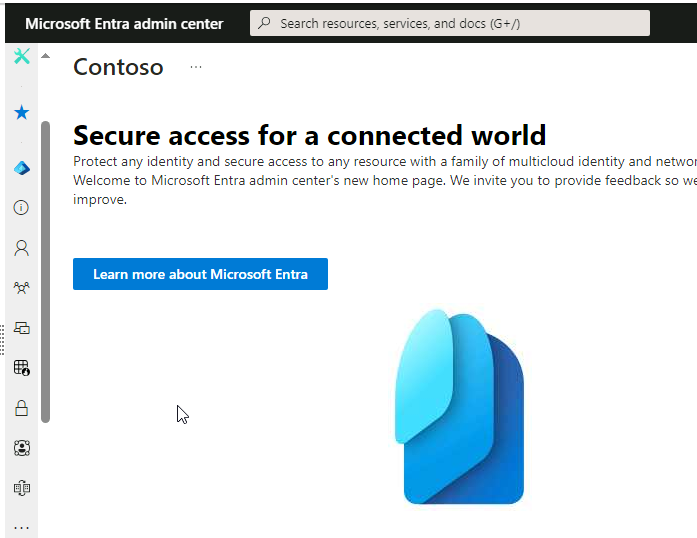

4.  Wählen Sie im Navigationsbereich **Identity.**

5.  Unter Identity wählen Sie **Groups**.

> 

6.  Im Menüband **Groups | All groups**, wählen Sie **New group** aus.

> 

7.  Im Menuband **New Group**, in der Liste **Group type**, wählen Sie
    **Security** aus.

8.  In der Box **Group name**, geben Sie!!﷟HYPERLINK
    "http://urn:gd:lg:a:send-vm-keys"**IT Devices**!! ein.

9.  In der Box **Group description**, geben Sie !!﷟HYPERLINK
    "http://urn:gd:lg:a:send-vm-keys"**IT Department Devices**!! ein.

10. Wählen Sie in der Liste **Membership type** die Option **Dynamic
    Device**.

11. Wählen Sie **Add dynamic query** aus.

> 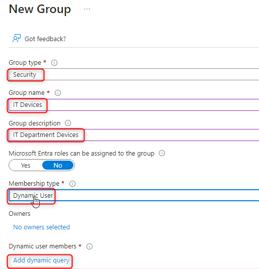

12. Wählen Sie auf dem Blatt **Dynamic membership rules** die Option
    **Edit** über dem **Rule syntax** box.

> 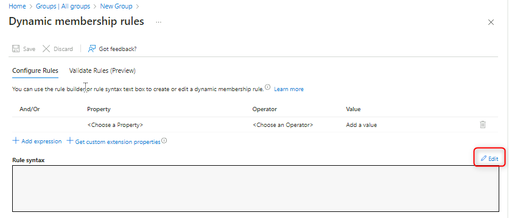

13. Fügen Sie im Textfeld Edit rule syntax die folgende einfache
    Mitgliedschaftsregel hinzu, und wählen Sie **OK**.

14. !!(device.devicePhysicalIDs -any (\_ -contains "\[ZTDId\]"))!!

> 

15. Wählen Sie **Save** aus um **Dynamic membership rules** zu schließe,
    und wählen Sie dann **Create,** um eine Gruppe zu erstellen.

> 
>
> 
>
> 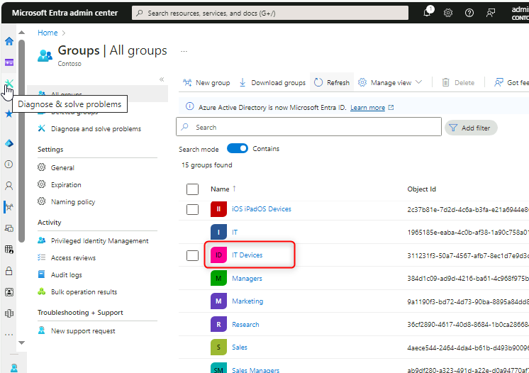

Aufgabe 2: Generieren einer gerätespezifischen CSV-Datei
(Comma-Separated Value)

1.  Wechseln Sie zu [***SEA-SVR2,***](urn:gd:lg:a:select-vm) und melden
    Sie sich als [**Contoso\Administrator**](urn:gd:lg:a:send-vm-keys)
    mit dem Kennwort !!﷟HYPERLINK
    "http://urn:gd:lg:a:send-vm-keys"**Pa55w.rd**!! an.

> 

2.  Wählen Sie in der Taskleiste **Hyper-V-Manager** aus.

> 

3.  Klicken Sie unter Virtual Machine mit der rechten Maustaste auf
    **SEA-WS4,** und wählen Sie **Connect** aus.

> 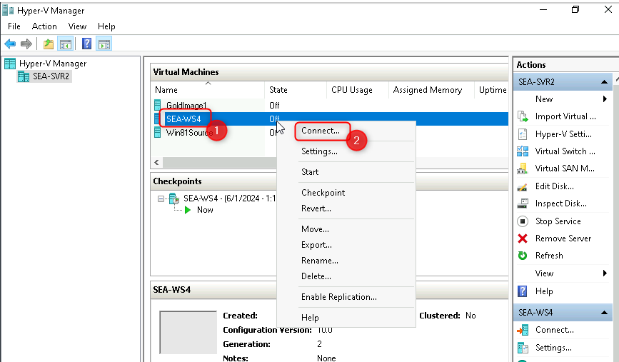

4.  Wählen Sie im Fenster **SEA-WS4** die Option **Start**. Wenn der
    Computer gestartet wird, maximieren Sie das Fenster.

> 

5.  Melden Sie sich bei **SEA-WS4** als
    [**Administrator**](urn:gd:lg:a:send-vm-keys) mit dem Kennwort
    !!﷟HYPERLINK "http://urn:gd:lg:a:send-vm-keys"**Pa55w.rd**!! an.

> 

6.  Klicken Sie mit der rechten Maustaste auf **Start**, wählen Sie
    **Windows Terminal (Admin)**, und wählen Sie dann an der
    Eingabeaufforderung **User Account Control** die Option **Yes** aus.

> 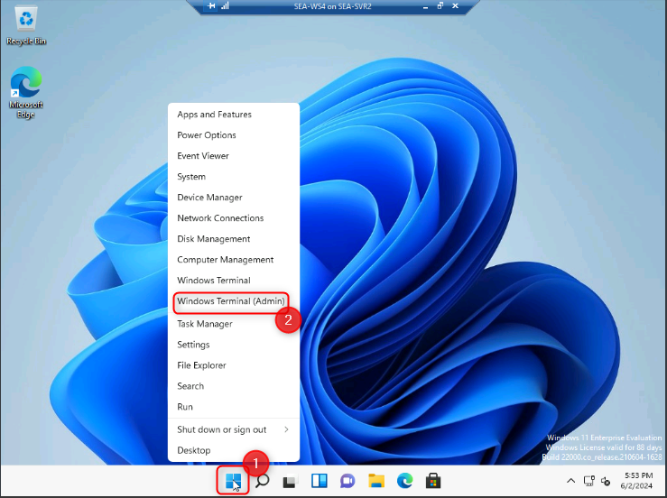
>
> 

7.  Geben Sie an der Windows PowerShell-Eingabeaufforderung das folgende
    Cmdlet ein, und drücken Sie dann **Enter**:

> !! Install-Script -Name Get-WindowsAutoPilotInfo!!

8.  Sie erhalten drei Eingabeaufforderungen. Geben Sie jedes Mal [**Y**
    ein](urn:gd:lg:a:send-vm-keys), und drücken Sie dann **Enter**.

> 

9.  Geben Sie an der Windows PowerShell-Eingabeaufforderung das folgende
    Cmdlet ein, und drücken Sie dann **Enter**:

> !!**Set**-ExecutionPolicy *RemoteSigned*!!

10. Wenn Sie dazu aufgefordert werden, geben Sie
    [**Y**](urn:gd:lg:a:send-vm-keys) ein, und drücken Sie dann Enter.

11. Geben Sie an der Windows PowerShell-Eingabeaufforderung das folgende
    Cmdlet ein, und drücken Sie dann **Enter**:

> !!Get-WindowsAutoPilotInfo.ps1 -OutputFile C:\Computer.csv!!
>
> 

12. Geben Sie an der Windows PowerShell-Eingabeaufforderung den
    folgenden Befehl ein, drücken Sie **Enter**, und überprüfen Sie dann
    den Dateiinhalt:

13. **type** !!C:\Computer.csv!!

> 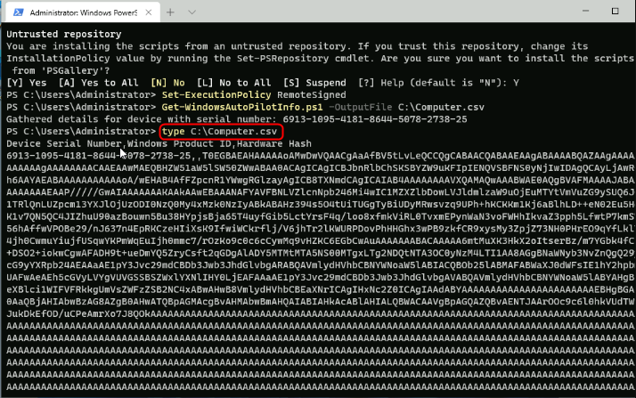

14. Geben Sie an der Windows PowerShell-Eingabeaufforderung den
    folgenden Befehl ein, und drücken Sie **Enter**. Dadurch wird die
    Datei auf **SEA-SVR2** kopiert:

15. copy !!c:\computer.csv \\sea-svr2\labfiles!!

> 

16. Schließen Sie die Windows PowerShell-Eingabeaufforderung.

Aufgabe 3: Arbeiten mit einem Windows Autopilot-Bereitstellungsprofil

1.  Wechseln Sie zu [***SEA-SVR1***](urn:gd:lg:a:select-vm).

> 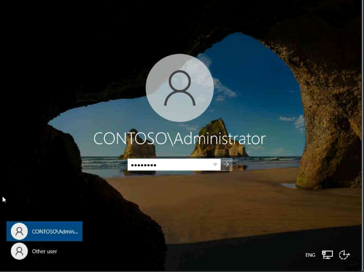

2.  Öffnen Sie in **Microsoft Edge** eine neue Registerkarte, und
    navigieren Sie zu !!﷟HYPERLINK
    "https://intune.microsoft.com"**https://intune.microsoft.com**!!
    Wenn Sie dazu aufgefordert werden, melden Sie sich mit einem
    Passwort
    ..[**admin@M365xXXXXXXX.onmicrosoft.com**](mailto:admin@M365xXXXXXXX.onmicrosoft.com)!!
    und Passwort an.

3.  Im **Microsoft Intune admin center**, wählen Sie **Devices**.

4.  In **Device enrollment** Bereich, wählen Sie **Enroll devices** aus.

5.  Scrollen Sie im Detailbereich nach unten zu **Windows Autopilot
    Deployment Program**, und wählen Sie dann **Devices**.

> 

6.  Im Menüband **Windows Autopilot devices**  in der Menüleiste, wählen
    Sie **Import**, Wählen Sie das **folder icon** aus und navigieren
    Sie dann zu !!﷟HYPERLINK
    "http://urn:gd:lg:a:send-vm-keys"**\\SEA-SVR2\Labfiles**!!, wählen
    Sie **Computer.csv**, wählen Sie **Open**, und wählen Sie dann
    **Import** aus.

> 
>
> 
>
> 
>
> 
>
> **Hinweis**: Der Importvorgang kann bis zu 15 Minuten dauern, dauert
> aber normalerweise etwa 5 Minuten.
>
> **Wichtig**: Nachdem der Vorgang abgeschlossen ist, wird das Gerät
> möglicherweise nicht angezeigt. Wenn dies der Fall ist, wählen Sie die
> Schaltfläche **Sync** aus, warten Sie einige Minuten, und wählen Sie
> dann **Refresh**.

7.  Wählen Sie **X** aus, um das Blatt **Windows Autopilot devices** zu
    schließen.

> 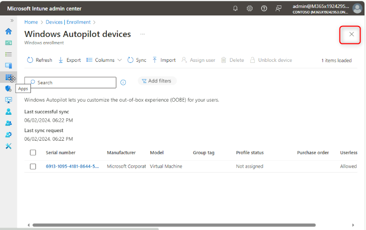

8.  Wählen Sie auf dem Blatt Windows-Registrierung im Detailbereich die
    Option **Deployment Profiles**.

> 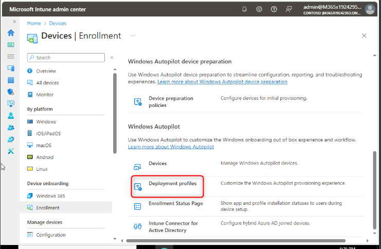

9.  Wählen Sie auf dem Blatt **Windows AutoPilot deployment profiles**
    die Option **Create Profil** und dann **Windows PC**.

> 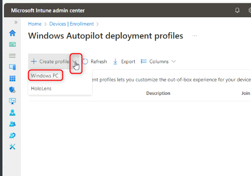

10. Geben Sie auf der Registerkarte **Basics** im Textfeld **Name** den
    Namen!!﷟HYPERLINK "http://urn:gd:lg:a:send-vm-keys"**Contoso
    profile1**!! an.

11. Wählen Sie **Convert all targeted devices to Autopilot** die Option
    **No** und dann **Next**.

> 

12. Auf der Schaltfläche **Out-of-box experience (OOBE)**, stellen sie
    sicher das **Deployment mode** auf **User-Driven** eingeschaltet
    ist.

13. Stellen Sie sicher, dass **Join to Microsoft Entra ID as** auf
    **Microsoft Entra Joined** eingestellt ist.

14. Stellen Sie sicher, dass die folgenden Optionen festgelegt sind:

    - Microsoft Software License Terms: **Hide**

    - Privacy Settings: **Hide**

    - Hide change account options: **Hide**

    - User account type: **Administrator**.

    - Allow pre-provisioned deployment: **No**

    - Language (Region): **Operating system default**

    - Automatically configure keyboard: **Yes**

    - Apply device name template: **No**

15. Wählen Sie **Next** aus.

> 

16. Klicken Sie auf der Registerkarte **Assignment** unter **Included
    groups** und wählen Sie **Add groups** aus.

17. Wählen Sie **IT Devices** group und klicken Sie auf **Select**.
    Wählen Sie **Next** aus.

> 
>
> 
>
> 

18. Überprüfen Sie auf dem Blatt **Review + create** die Informationen,
    und wählen Sie dann **Create**.

> 
>
> 

Aufgabe 4: Zurücksetzen des PCs

1.  Wechseln Sie zu [***SEA-SVR2***](urn:gd:lg:a:select-vm). Der
    **SEA-WS4 Computer** sollte noch maximiert sein.

> 

2.  Wählen Sie auf **SEA-WS4** **\>Start**, geben Sie !!﷟HYPERLINK
    "http://urn:gd:lg:a:send-vm-keys"**reset**!!  ein und wählen Sie
    **Reset this PC** aus.

> 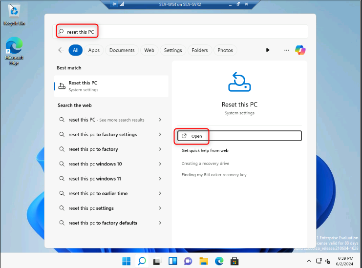

3.  Wählen Sie im Abschnitt **Reset this PC** die Option **Reset PC**.

> 

4.  Wählen Sie **Remove everything**, und wählen Sie dann **Local
    reinstall**.

> 
>
> 

5.  Wählen Sie **Next** aus und wählen Sie dann **Reset**.

> 
>
> 
>
> **Hinweis**: Normalerweise ist diese Aufgabe für die Neubereitstellung
> physischer Geräte nicht erforderlich. Die Autopilot-Informationen des
> Geräts werden entweder vom Hersteller bereitgestellt oder können vor
> der Windows-Willkommensseite vom Gerät abgerufen werden. Für die
> Zwecke dieser Übung müssen wir ein Zurücksetzen initiieren, um eine
> neue Geräte-Windows-Willkommensseite zu simulieren.
>
> **Hinweis**: Dieser Vorgang kann 45-60 Minuten dauern und wird während
> des Vorgangs mehrmals neu gestartet. Ihr Kursleiter kann mit dem
> nächsten Modul fortfahren, während diese Aufgabe abgeschlossen ist.
> Stellen Sie sicher, dass Sie in Ihrer nächsten Übungssitzung
> wiederkommen, um Aufgabe 5 abzuschließen.

Aufgabe 5: Überprüfen der Autopilot-Bereitstellung

1.  Geben Sie auf der **Anmeldeseite von Contoso Corp**. Folgendes ein
    !!﷟HYPERLINK
    "mailto:Cindy@M365x19242953.onmicrosoft.com"**Cindy@M365x19242953.onmicrosoft.com**!!und
    wählen Sie **Next**.

2.  Geben Sie auf der Seite Kennwort!!﷟HYPERLINK
    "mailto:P@55w.rd1234"**P@55w.rd1234**!! und wählen Sie **Sign in**.

3.  Unter **Use Windows Hello with your account**, wählen Sie **OK**
    aus.

> 

4.  Wählen Sie auf der Seite **Verify your identity** die Option
    "Textüberprüfungsmethode" aus.

> 

5.  Geben Sie auf der Seite **Enter code** den Code ein, der per SMS an
    Ihr Mobilgerät gesendet wurde, und wählen Sie dann **Verify**.

> 

6.  Klicken Sie im Dialogfeld **Setup up a PIN** in der Spalte **New
    PIN** und im **Confirm PIN** Feld, geben Sie
    [**102938**](urn:gd:lg:a:send-vm-keys) ein, und wählen Sie dann
    **OK**.

> 

7.  Auf der **All set!** Seite, wählen Sie **OK** aus.

8.  Wählen Sie **Start** und wählen Sie **Settings** aus.

> 

9.  Wählen Sie **Accounts** und dann **Access work or school**. Stellen
    Sie sicher, dass das Gerät mit dem Azure AD von Contoso verbunden
    ist.

> 

10. Wählen Sie **Connected to Contoso's Azure AD** und wählen Sie
    **Info** aus.

> 

11. Scrollen Sie auf der Seite **Managed by Contoso** nach unten, und
    wählen Sie dann **Sync**.

> 
>
> 

12. In **SEA-WS4**, schließen Sie das Fenster **Settings**.

13. Wechseln Sie zu [***SEA-SVR1***](urn:gd:lg:a:select-vm).

14. Wählen Sie im Microsoft Entra Admin Center die Option **Identity**,
    dann **Devices** und dann **All devices**.

> 
>
> Beachten Sie, dass das neue Gerät mit einem Namen angezeigt wird, der
> mit "**DESKTOP-"** beginnt. Beachten Sie auch, dass der Join-Typ
> **Microsoft Entra ID ist,** der mit Cindy White als Besitzer verbunden
> ist.

15. Wählen Sie die Schaltfläche Autopilot device. Überprüfen Sie die
    Verwaltungsoptionen in der oberen Menüleiste.

> Beachten Sie, dass Sie das Gerät **außer Betrieb nehmen, zurücksetzen,
> synchronisieren** und **neu starten** können.

16. Wählen Sie die Auslassungspunkte am Ende der Menüleiste aus und
    beachten Sie die zusätzlichen Verwaltungsfunktionen.

> 
>
> 
>
> Zu den zusätzlichen Funktionen gehören Neustart, Zurücksetzen des
> Autopiloten, Schnellscan, Vollständiger Scan und andere.

17. Schließen Sie Microsoft Edge.

**Ergebnisse**: Nach Abschluss dieser Übung haben Sie ein Windows
11-Gerät mit Autopilot im benutzergesteuerten Modus bereitgestellt.
