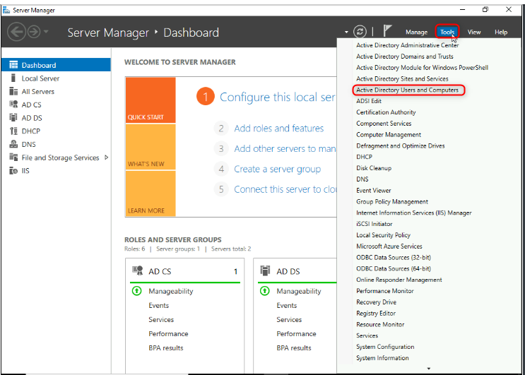
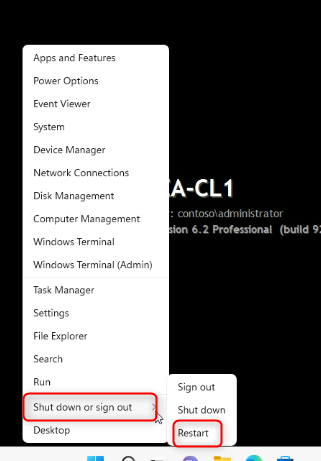
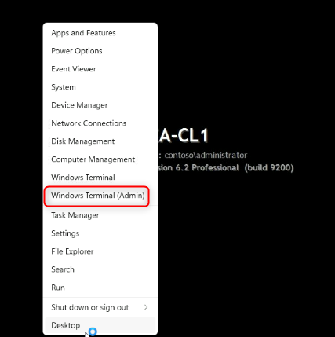
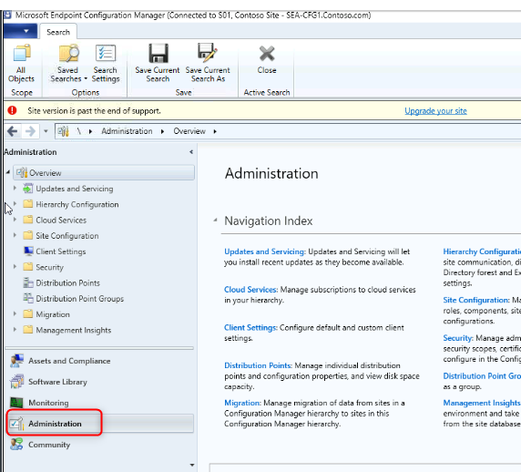
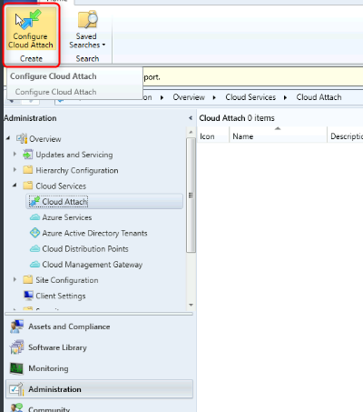
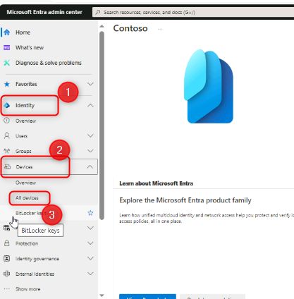

Lab 22: Konfigurieren von Cloud Attach und Co-Verwaltung mithilfe von
Configuration Manager

**Zusammenfassung**

In dieser Übung aktivieren Sie Cloud Attach und konfigurieren die
Co-Verwaltung mithilfe von Microsoft Endpoint Configuration Manager und
Microsoft Intune.

**Voraussetzungen**

Die folgenden Übungen müssen vor diesem Lab abgeschlossen werden:

1.  Lab 01 – Verwalten von Identitäten in Microsoft Entra ID

2.  Lab 02 – Synchronisieren von Identitäten mithilfe von Azure AD
    Connect

3.  Lab 03 - Konfigurieren und Verwalten der Microsoft Entra
    ID-Verknüpfung

4.  Lab 05 – Verwalten der Geräteregistrierung bei Intune

**Szenario**

Contoso verfügt sowohl über eine Microsoft Endpoint Configuration
Manager-Implementierung als auch über Microsoft Intune. Sie müssen die
Integration zwischen den beiden Diensten konfigurieren und die
Co-Verwaltung für Ihre verwalteten Windows-Geräte aktivieren. Sie
aktivieren Cloud Attach, konfigurieren die Co-Verwaltung und validieren
dann die Einstellungen mit SEA-CL1.

Aufgabe 1: Vorbereiten der Umgebung

1.  Wechseln Sie zu [***SEA-SVR1,***](urn:gd:lg:a:select-vm) und melden
    Sie sich als [**Contoso\Administrator**](urn:gd:lg:a:send-vm-keys)
    mit dem Kennwort !\!! an.

2.  Wählen Sie im Server-Manager **Tools** und dann **Active Directory
    Users and Computers**.

> 

3.  Wählen Sie im Navigationsbereich **Seattle Clients**.

> 

4.  Klicken Sie mit der rechten Maustaste auf **SEA-CL1**, und wählen
    Sie dann **Move**.

> 

5.  Wählen Sie im Dialogfeld **Move** die Option **Entra clients** und
    dann **OK**.

> 

6.  Schließen Sie das **Active Directory Users and Computers**.

7.  Klicken Sie in der Taskleiste mit der rechten Maustaste auf
    **Start,** und wählen Sie **Windows Powershell (Admin)**.

> 

8.  Geben Sie im **Windows PowerShell** Fenster den folgenden Befehl
    ein, und drücken Sie dann **Enter**:

> !!**Start**-ADSyncSyncCycle -PolicyType **Initial**!!
>
> 

9.  Schließen des PowerShell-Fensters.

10. Wechseln Sie zu [***SEA-CL1***](urn:gd:lg:a:select-vm).

11. Klicken Sie auf der Taskleiste mit der rechten Maustaste auf
    **Start**, wählen Sie **Shut down or sign out** aus, und wählen Sie
    dann **Restart**.

> 
>
> **Hinweis**: Der Neustart löst die Azure AD-Hybrideinbindung auf
> SEA-CL1 aus.

12. Melden [Sie sich nach dem Neustart von](urn:gd:lg:a:select-vm)
    ***SEA-CL1*** als
    [**Contoso\Administrator**](urn:gd:lg:a:send-vm-keys) mit dem
    Kennwort [**Pa55w.rd**](urn:gd:lg:a:send-vm-keys) an.

13. Klicken Sie in der Taskleiste mit der rechten Maustaste auf
    **Start,** und wählen Sie **Windows Terminal (Admin)**.

> 

14. In the **Windows PowerShell** window, type the following command,
    and then press **Enter**:

> !!dsregcmd /**status**!!

15. Überprüfen Sie in der Ausgabe unter **Device State**,
    **AzureAdJoined** angezeigt wird**: YES** und **DomainJoined:
    YES** werden angezeigt.

> 
>
> **Hinweis**: Wenn das Gerät noch nicht mit Azure AD verbunden ist,
> warten Sie, bis die Azure AD Connect-Synchronisierung abgeschlossen
> ist, und starten Sie SEA-CL1 erneut.

16. Close all windows on [***SEA-CL1***](urn:gd:lg:a:select-vm).

Aufgabe 2: Erstellen einer Gerätesammlung

1.  Wechseln Sie zu [***SEA-CFG1***](urn:gd:lg:a:select-vm), und melden
    Sie sich als [**Contoso\Administrator**](urn:gd:lg:a:send-vm-keys)
    mit dem Kennwort [**Pa55w.rd an.**](urn:gd:lg:a:send-vm-keys)an.

2.  Wählen Sie auf der Taskleiste **Configuration Manager Console** aus.
    Die Microsoft Endpoint Configuration Manager-Konsole wird geöffnet.

> 

3.  Wählen Sie im Workspace **Assets and Compliance** die
    Option **Device Collections** aus.

4.  Klicken Sie mit der rechten Maustaste auf **Device Collections**,
    und wählen Sie dann **Create Device Collection**. Der Assistent zum
    Erstellen von Gerätesammlungen wird geöffnet.

> 

5.  Konfigurieren Sie auf der Seite **General** folgendes, und wählen
    Sie dann **Next**:

    - Name: !\!!

    - Limiting collection: **All Desktop and Server Clients**

> 
>
> 
>
> 

6.  Wählen Sie auf der Seite **Membership Rules** die Option **Next**.

> 

7.  Wählen Sie in der Configuration Manager-Warnung die Option **OK**
    aus. Sie werden in einem späteren Schritt ein direktes Mitglied
    hinzufügen.

> 

8.  Wählen Sie auf der Seite **Summary** die Option **Next** aus, und
    wählen Sie dann auf der Seite **Completion** die Option **Close**.

> 
>
> 

Aufgabe 3: Zuweisen eines Geräts zu einer vorhandenen Sammlung

1.  Wählen Sie im Workspace **Assets and Compliance** die Option
    **Devices** aus.

> Notieren Sie sich die aufgelisteten Geräte. Alle Geräte, die einen
> grünen Kreis mit einem weißen Häkchen haben, sind derzeit aktiv.

2.  Wählen Sie im Detailbereich**SEA-CL1**.

3.  Klicken Sie mit der rechten Maustaste auf **SEA-CL1**, zeigen Sie
    auf **Add Selected Items**, und wählen Sie dann **Add Selected Items
    to Existing Device Collection** aus.

> 

4.  Wählen Sie im Dialogfeld **Select Collection** die Option
    **Co-managed Devices**, und wählen Sie dann **OK**.

> 

5.  Wählen Sie zur Überprüfung im Workspace **Bestand und
    Kompatibilität** die Option **Device Collecitons** aus**,** und
    doppelklicken Sie dann auf **Co-managed Devices**.

> 
>
> 
>
> **SEA-CL1** sollte als Mitglied dieser Sammlung aufgeführt werden.

Aufgabe 4: Konfigurations-Manager für Cloudanfügungsendpunkte

1.  Wählen Sie in der Microsoft Endpoint Configuration Manager-Konsole
    das Workspace **Administraiton** aus.

> 

2.  Erweitern Sie im Workspace **Administration** die Option **Cloud
    Services** und wählen Sie dann **Cloud Attach** aus.

> 

3.  Wählen Sie im Menüband **Configure Cloud Attach**. Der **Cloud
    Attach Configuration Wizard** öffnet sich.

> 
>
> 

4.  Wählen Sie im **Cloud Attach Configuration Wizard** auf der Seite
    **Cloud attach** die Option **Sign In** aus.

5.  Anmelden Sie sich als
    [**admin@M365x19242953.onmicrosoft.com**](mailto:admin@M365x19242953.onmicrosoft.com) mit
    dem Passwort [**9whL~;H8ke=D1^95%D**](urn:gd:lg:a:send-vm-keys) an.

6.  Wählen Sie auf der Seite **Cloud Attach** die Option **Customize
    settings**, und wählen Sie **Next** aus.

> 

7.  Wählen Sie in der **Create AAD Application** die Option **Yes**.

> 

8.  Übernehmen Sie auf der Seite **Configure upload** die
    Standardeinstellung, und wählen Sie **Next** aus.

> 

9.  Klicken Sie auf der Seite **Enablement** neben **Automatic
    enrollment in Intune**, wählen Sie **Pilot** aus.

10. Klicken Sie auf der Seite **Enablement** neben **Intune Auto
    Enrollment**, wählen Sie **Browse**.

> 

11. Wählen Sie im Dialogfeld **Select Collection** die Option
    **Co-managed Devices** aus, und wählen Sie dann **OK**. Wählen Sie
    **Next** aus.

> 

12. Wählen Sie auf der Seite **Summary** die Option **Next** und dann
    auf der Seite **Completion** \> **Close** aus.

> 

Aufgabe 5: Konfigurieren von Arbeitsauslastungen

1.  Wählen Sie in der Microsoft Endpoint Configuration Manager-Konsole
    den Workspace **Administration** aus.

2.  Erweitern Sie im Workspace **Administration** die Option **Cloud
    Services** und wählen Sie dann **Cloud Attach**.

3.  Wählen Sie im Detailbereich **CoMgmtSettingsProd** aus, und wählen
    Sie dann im Menüband **Properties**.

> 
>
> Das Feld **CoMgmtSettingsProd-Eigenschaften** wird geöffnet.

4.  Wählen Sie **Workloads**. Auf der **Workloads** Seite, ziehen Sie
    den Schieberegler auf **Pilot Intune** für die folgenden Workloads:

    - **Compliance policies**

    - **Client apps**

    - **Windows Update policies**

> 

5.  Wählen Sie die Schaltfläche **Staging page**. Auf Seite **Staging**,
    wählen Sie **Browse** neben **Compliance policies**, **Client
    Apps**, und **Windows Update Policies** und wählen Sie die
    Schaltfläche **Co-managed Devices** collection für jede Arbeitslast.

6.  Wählen Sie **OK** aus, um die **CoMgmtSettingsProd Properties** Box
    zu schließen.

> 

Aufgabe 6: Überprüfen, ob SEA-CL1 gemeinsam verwaltet wird

1.  Wechseln Sie zu [***SEA-SVR1***](urn:gd:lg:a:select-vm).

2.  Wählen Sie auf der Taskleiste **Microsoft Edge** aus, geben Sie in
    der Adressleiste [**https://entra.microsoft.com
    ein**](https://entra.microsoft.com), und drücken Sie dann **Enter**.

3.  Melden Sie sich als Benutzer
    [**admin@M365x19242953.onmicrosoft.com**](mailto:admin@M365x19242953.onmicrosoft.com)
    an, und verwenden Sie das Passwort.

4.  Wenn die **Stay signed in?** Eingabeaufforderung angezeigt wird,
    wählen Sie **No**.

> Das Microsoft Entra Admin Center wird geöffnet.

5.  Wählen Sie im Microsoft Entra Admin Center im Navigationsbereich die
    Option **Identity.**

> 

6.  Auf der Seite **Devices|All devices**, stellen Sie sicher, dass
    **SEA-CL1** aufgeführt ist und dass **Join-Typ** \>**Microsoft Entr
    hybrid Join**.

> 

7.  Öffnen Sie in Microsoft Edge eine andere Registerkarte, geben Sie
    [**https://intune.microsoft.com**](https://intune.microsoft.com) in
    die Adressleiste ein, und drücken Sie dann **Enter**.

8.  Wählen Sie im Navigationsbereich **Devices** und dann **All
    devices**.

9.  Stellen Sie sicher, dass **SEA-CL1** aufgeführt ist und die
    Einstellung **Managed to** auf **Co-managed** ist.

> 
>
> Es kann einige Zeit dauern, bis es angezeigt wird. Aktualisieren Sie
> den Detailbereich nach Bedarf. Das Gerät wird möglicherweise unter
> einem anderen Namen angezeigt, klicken Sie auf das Gerät, um zu
> bestätigen, dass es **SEA-CL1 anzeigt**.

10. Wählen Sie **SEA-CL1** aus, und scrollen Sie im Detailbereich nach
    unten, um Informationen zum Status der Co-Verwaltung anzuzeigen.

11. Schließen Sie Microsoft Edge.

**Ergebnisse**: Nach Abschluss dieser Übung haben Sie Cloud Attach
erfolgreich aktiviert und die Co-Verwaltung mit Microsoft Endpoint
Configuration Manager und Microsoft Intune konfiguriert.
