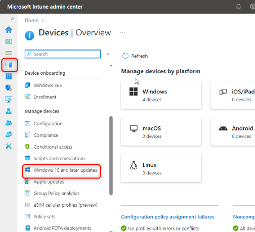
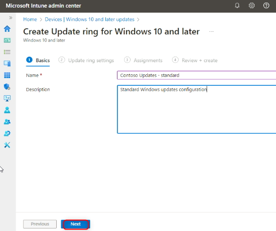
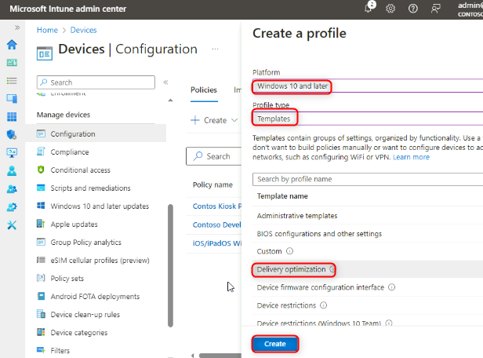
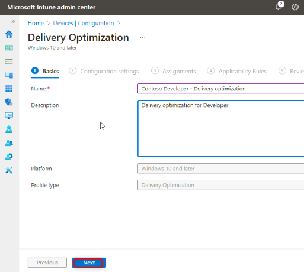
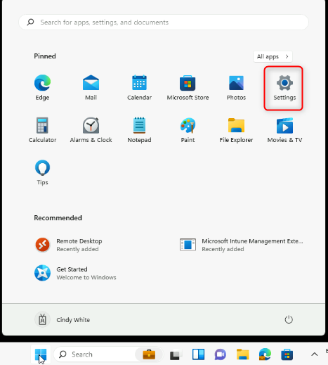
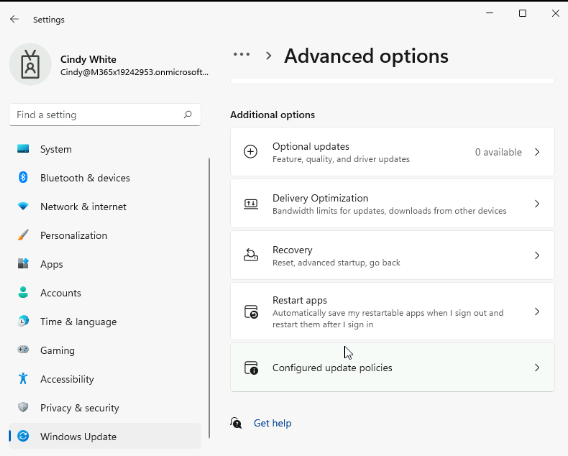

실습23: Windows 품질 및 기능 업데이트 관리

**요약**

이 실습에서는 Intune을 사용하여 Windows 품질 및 기능 업데이트 설정을
구성합니다.

**필수 조건**

이 실습을 시작하기 전에 다음 실습을 완료해야 합니다:

- 실습 1 - Intune에 장치 등록 관리

- 실습 6 - Intune에 장치 등록

- 실습 7 - 구성 프로필 만들기 및 배포

**참고**: Azure AD에 대한 Windows Hello 로그인 인증을 보호하는 데
사용되는 문자 메시지를 수신할 수 있는 휴대폰도 필요합니다.

**시나리오**

Contoso Developer Devices 그룹에 속한 장치에만 영향을 미치도록 업데이트
링을 구성하라는 요청을 받았습니다. 이 그룹은 다음 요구 사항을 충족해야
합니다:

> • 품질 업데이트 연기 기간(일): **15**
>
> • 기능 업데이트 연기 기간(일): **45**
>
> • Windows 업데이트 일시 중지 옵션: **Disable**
>
> • Windows 업데이트 확인 옵션: **Enable**
>
> • 전송 최적화: 다운로드 모드: **HTTP only, no peering** (0)

작업 1: 단일 장치의 현재 업데이트 설정 확인

1.  [***SEA-WS1***](urn:gd:lg:a:select-vm)로 전환하고 PIN 번호
    [**102938**](urn:gd:lg:a:select-vm)을 사용하여 **Cindy White**
    계정으로 로그인합니다.

2.  **Start를** 선택한 다음 **Settings** 아이콘을 선택합니다.

> 

3.  **Settings**에서 **Windows Update**를 선택하세요.

> 특정 시간 동안 업데이트를 일시 중지할 수 있는 옵션이 있습니다.

4.  **Windows Update** 페이지에서 **Advanced options**을 선택합니다.

> 

5.  **Advanced options** 페이지에서 **Delivery Optimization**을
    선택합니다.

> 

6.  **Delivery Optimization** 페이지에서 **Allow downloads from other
    PCs** 옵션이 활성화되어 있는지 확인하세요.

7.  **Devices on the internet and my local network**를 선택합니다.

> 

8.  **Settings**에서 **Windows Update**를 선택합니다.

> 

9.  **Advanced options**를 선택한 다음 **Configured update policies**를
    선택합니다.

> 
>
> 장치에 업데이트 정책이 설정되어 있지 않다는 점에 유의합니다.
>
> 

10. 탐색 창에서 **Windows Update**를 선택합니다.

작업 2: 적용된 설정 검토

1.  **Windows Update**페이지에서 **Update history**를 선택합니다.

> 

2.  나열된 업데이트를 검토한 다음 **Uninstall updates**를 선택합니다.

> 

3.  **Installed Updates** 에 나열된 업데이트를 검토합니다. **Installed
    Updates**를 닫습니다.

> 

4.  **Settings** 앱을 닫습니다.

작업 3: Intune을 사용하여 업데이트 설정 구성

1.  [***SEA-SVR1***](urn:gd:lg:a:send-vm-keys)로 전환하고
    [**Contoso\Administrator**](urn:gd:lg:a:send-vm-keys)로 로그인하고
    암호는 [**Pa55w.rd**](urn:gd:lg:a:send-vm-keys)입니다.

2.  타스크바에서 **Microsoft Edge**를 선택합니다.

3.  Microsoft Edge의 주소 표시줄에
    [**https://intune.microsoft.com**](urn:gd:lg:a:send-vm-keys)을
    입력하고 **Enter**. 키를 누릅니다.

4.  비밀번호를 사용하여
    [**admin@M365x19242953.onmicrosoft.com**](urn:gd:lg:a:send-vm-keys) 으로
    로그인합니다.

5.  탐색 창에서 **Devices**를 선택한 다음 **Windows 10 and later
    Updates**를 선택합니다.

> 

6.  **Devices | Update rings for Windows 10 and later** 블레이드에서
    **Create profile**를 선택합니다.

> 

7.  **Basics** 블레이드에서 다음 정보를 입력한 후 **Next**를 선택합니다.

    - Name: !\!!

    - Description: !\!!

> 

8.  **Update ring settings**  블레이드에서 다음 정보를 입력한 후
    **Next**를 선택합니다.

    - Quality update deferral period
      (days): [**15**](urn:gd:lg:a:send-vm-keys)

    - Feature update deferral period
      (days): [**45**](urn:gd:lg:a:send-vm-keys)

    - Option to pause Windows updates: **Disable**

    - Option to check for Windows updates: **Enable**

> 

9.  **Assignments** 블레이드의 **Included groups** 에서 **Add groups**를
    선택합니다.

10. **Select groups to include**  블레이드의 **Search** 상자에서
    **Contoso Developer devices** 를 선택한 다음 **Select**를
    선택합니다.

> 
>
> 

11. **Next를** 선택하고 **Review + create**블레이드에서 **Create**를
    선택합니다.

12. 탐색 모음에서 **Configuration profiles**을 선택합니다.

13. **Devices | Configuration** 블레이드의 세부 정보 창에서 **Create
    policy**를 선택합니다.

> 

14. **Create a profile** 블레이드에서 다음 옵션을 선택한 다음
    **Create**를 선택합니다:

    - Platform: **Windows 10 and later**

    - Profile type: **Templates**

    - Template name: **Delivery Optimization**

> 

15. **Basics** 블레이드에서 다음 정보를 입력한 후 **Next를** 선택합니다:

    - Name: !\!!

    - Description: !\!!

> 

16. **Configuration settings** 블레이드에서 다음 정보를 입력한 후
    **Next**를 선택합니다.

    - Download Mode: **HTTP only, no peering (0)**

> 

17. 할당 블레이드의 **Included groups** 에서 **Add groups**를
    선택합니다.

18. **Select groups to include**  블레이드에서 **Contoso Developer
    devices** 를 선택한 다음 **Select**를 선택합니다.

> 
>
> 

19. **Next** 를 두 번 선택하고 **Review + create** 블레이드에서 생성을
    선택합니다.

> 

작업 4: 장치의 업데이트 설정이 중앙에서 관리되는지 확인

1.  [***SEA-WS1***](https://intune.microsoft.com)로 전환합니다.

2.  **Start**를 선택한 다음 **Settings** 아이콘을 선택합니다.

> 

3.  **Settings** 앱에서 **Accounts** 을 선택한 다음 **Access work or
    school**를 선택합니다.

> 

4.  **Access work or school** 섹션에서 **Connected to Contoso's Azure
    AD** 링크를 선택한 다음 **Info**를 선택합니다.

> 

5.  **Areas Managed by Contoso**대화 상자에서 **Sync**를 선택합니다.
    동기화가 완료될 때까지 기다립니다.

> 

6.  **Settings**앱에서 **Windows Update**를 선택합니다.

> 업데이트는 일시 중지할 수 없습니다.

7.  **Advanced options**를 선택합니다.

> 

8.  **Delivery Optimization**를 선택합니다.

> 
>
> **Allow downloads from other PCs** 은 사용할 수 없습니다.

9.  **Settings**앱에서 **Windows Update**, **Advanced options**,
    **Configured update policies**를 차례로 선택합니다.

> 
>
> 기기에 설정된 모든 정책을 기록해 둡니다.

10. 열려 있는 모든 앱과 창을 닫습니다.

> **참고**: 실습 환경은 실습 진행 중 지연 및 의도치 않은 영향을 방지하기
> 위해 Windows 업데이트가 적용되지 않도록 구성되어 있습니다.
