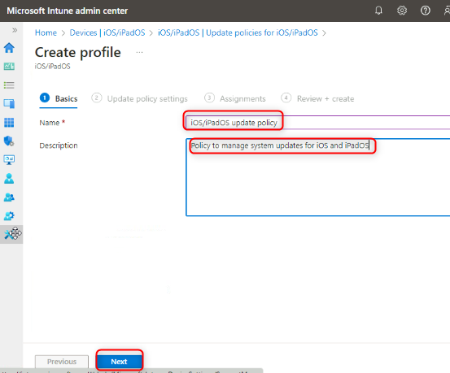
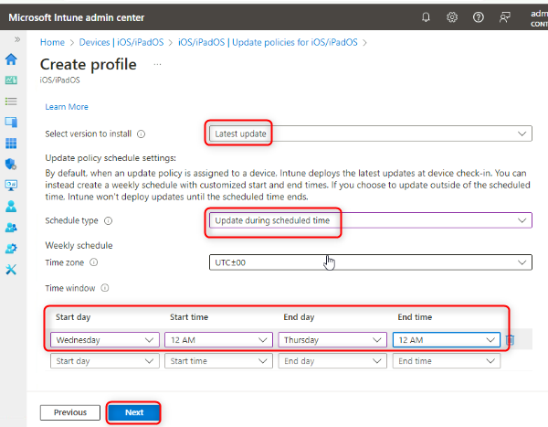

실습26: iOS 및 iPadOS 업데이트 정책 관리

**요약**

이 실습에서는 iOS 및 iPadOS 운영 체제 업데이트를 관리하는 데 사용할
업데이트 정책을 구성합니다.

**시나리오**

Contoso의 모든 개발자는 최신 iOS/iPadOS 버전을 실행하는 iPhone 및 iPad를
보유하고 있습니다. Apple의 자동 기기 등록을 통해 이러한 기기를
등록했으며, 기기 OS에 대한 업데이트 정책을 구성해야 합니다. 다음 사항을
확인해야 합니다:

- 설치할 버전: 최신 업데이트

- 수요일 오전 12시부터 목요일 오전 12시까지만 자동 업데이트를
  허용합니다.

작업 1: iOS/iPadOS 기기용 업데이트 정책 만들기

1.  필요한 경우 [***SEA-SVR1***](urn:gd:lg:a:select-vm)에서
    [**Contoso\Administrator**](urn:gd:lg:a:send-vm-keys)로 로그인하고
    암호 [**Pa55w.rd**](urn:gd:lg:a:send-vm-keys)를 입력한 후 **Server
    Manager**를 닫습니다.

2.  타스크바에서 **Microsoft Edge**를 선택합니다.

3.  Microsoft Edge의 주소 표시줄에
    [**https://intune.microsoft.com**](https://intune.microsoft.com)을
    입력하고 **Enter** 키를 누릅니다.

4.  비밀번호를 사용하여
    [**admin@M365x19242953.onmicrosoft.com**](urn:gd:lg:a:send-vm-keys)으로
    로그인합니다.

5.  **Microsoft Intune admin center** 페이지에서 **Devices**를
    선택합니다.

6.  **Devices|By platform** 블레이드의 **Policy**에서 'iOS/iPadOS'를
    선택합니다.

> 

7.  **iOS/iPadOS에 대한 업데이트 정책** 선택합니다.

> 

8.  세부 정보 창에서 **Create profile**를 선택합니다.

9.  **Basics**탭에서 다음 옵션을 구성하고 **Next**를 선택합니다:

    - Name: !\!!

    - Description: !\!!

> 

10. **Update policy settings**  탭에서 다음 옵션을 구성하고 **Next**를
    선택합니다.

    - Select version to install: **Latest update**

    - Schedule type: **Update during scheduled time**

    - Time zone: **UTC:00**

    - Time window:

    - Start day: **Wednesday**

      - Start time: **12 AM**

      - End day: **Thursday**

      - End time: **12 AM**

> 

11. **Assignments** 탭에서 **Next**를 선택합니다.

> 

12. **Review + create**  탭에서 설정을 검토하고 **Create**를 선택합니다.

13. **Devices | Update policies for iOS/iPadOS**블레이드의 세부 정보
    창에서 **iOS/iPadOS update policy** 가 나열되어 있는지 확인합니다.

> 

14. Microsoft Edge를 닫습니다.

**결과**: 이 연습을 완료하면 iOS 및 iPadOS에 대한 업데이트 정책을
성공적으로 구성하게 됩니다.
