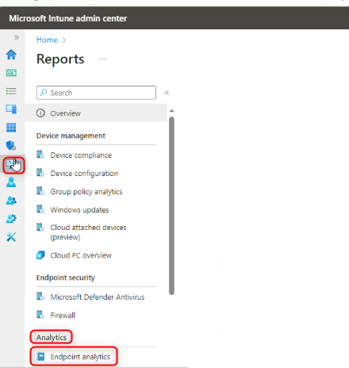

# 실습 25: Endpoint 분석을 통한 장치 성능 및 사용자 경험 모니터링

**요약**

이 실습에서는 Endpoint 분석을 활성화하여 기기 성능, 사용자 경험 점수 및
인사이트를 모니터링합니다.

**필수 조건**

이 실습을 시작하기 전에 다음 실습을 완료해야 합니다:

- 실습 5 - Intune에 장치 등록 관리

- 실습 6 - Intune에 장치 등록

- 실습 7 - 구성 프로필 생성 및 배포

**시나리오**

시작 성능, 애플리케이션 안정성, 그리고 사용자 경험(사용자가 기기를
재시작하는 빈도)을 모니터링해 달라는 요청을 받았습니다. 이 정보를
얻으려면 Endpoint 분석을 활성화해야 합니다.

### 작업 1: 엔드포인트 분석 활성화

1.  필요한 경우 [**SEA-SVR1**](urn:gd:lg:a:select-vm)에서
    [**Contoso\Administrator**](urn:gd:lg:a:send-vm-keys) 로 로그인하고
    비밀번호는 !! [**Pa55w.rd**](urn:gd:lg:a:send-vm-keys)!!입니다.
    **Server Manager**를 닫습니다.

2.  타스크바에서 **Microsoft Edge**를 선택합니다.

3.  Microsoft Edge에서 주소 표시줄에 !!
    [**https://intune.microsoft.com**](https://intune.microsoft.com)!!을
    입력하고 **Enter** 키를 누릅니다.

4.  비밀번호를 사용하여
    [**admin@M365x19242953.onmicrosoft.com**](urn:gd:lg:a:send-vm-keys) 으로
    로그인합니다.

5.  **Microsoft Intune admin center**  페이지에서 **Reports**를
    선택합니다.

6.  **Reports**블레이드의 **Analytics**에서 **Endpoint analytics**를
    선택합니다.

> 

7.  **Endpoint analytics** 페이지에서 **Collect device data from** 이
    **All cloud-managed devices**로 설정되어 있는지 확인한 다음
    **Start**를 선택합니다.

> 
>
> 개요 페이지 상단의 메시지를 확인하세요. 점수와 통계가 페이지에
> 표시되기까지 최대 24시간이 걸릴 수 있습니다.
>
> 

8.  [**SEA-WS1**](urn:gd:lg:a:select-vm)로 전환하고 기기를 다시
    시작합니다.

9.  **Cindy White**로 로그인하고 비밀번호는
    [**102938**](urn:gd:lg:a:send-vm-keys)입니다.

10. [**SEA-SVR1**](urn:gd:lg:a:select-vm)로 전환합니다.

11. **Microsoft Intune admin center**  페이지에서 **Devices**를 선택한
    다음 **All devices**를 선택합니다.

12. **SEA-WS1**을 선택합니다.

> 

13. **SEA-WS1** ​​페이지에서 **Sync**를 선택한 다음 **Yes**를 선택합니다.

> 

14. **SEA-WS1** 페이지의 **Monitor**에서 **User experience**를
    선택합니다.
     

16. **Endpoint analytics**, **Startup performance**, 및 **Application
    reliability** 탭을 검토합니다.

> 
>
> 
>
> 
>
> 시간 지연으로 인해 보고되는 정보가 없을 수 있지만, 각 탭에 표시되는
> 내용에 대한 자세한 내용을 확인합니다.

16. **Microsoft Intune admin center** 페이지에서 **Reports**를
    선택합니다.

17. **Reports**블레이드의 **Analytics**에서 **Endpoint analytics**를
    선택합니다.

> 
>
> Endpoint 분석에서도 동일한 유형의 정보를 사용할 수 있지만, 이 정보는
> 등록된 모든 장치를 기반으로 합니다.
>
> 

18. Endpoint 분석 페이지에서 제공되는 보고서를 살펴봅니다.

19. Microsoft Edge를 닫습니다.

**결과**: 이 연습을 완료하면 Endpoint 분석을 통해 기기 성능, 사용자 경험
점수 및 인사이트를 모니터링할 수 있게 됩니다.
