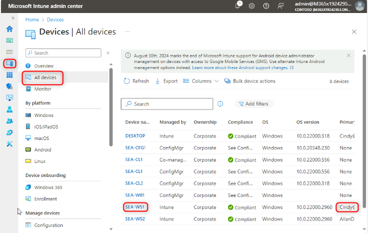

# Lab 25: Überwachen der Geräteleistung und der Benutzererfahrung mit Endpoint Analytics

**Zusammenfassung**

In diesem Lab aktivieren Sie die Endpunktanalyse, um die Geräteleistung
sowie die Bewertungen und Erkenntnisse der Benutzererfahrung zu
überwachen.

**Voraussetzungen**

Die folgenden Übungen müssen vor diesem Lab abgeschlossen werden:

1.  Lab 05 – Verwalten der Geräteregistrierung bei Intune

2.  Lab 06 – Registrieren von Geräten bei Intune

3.  Lab 07 - Erstellen und Bereitstellen von Konfigurationsprofilen

**Szenario**

Sie wurden gebeten, die Startleistung, die Anwendungszuverlässigkeit und
die Benutzererfahrung zu überwachen, wie oft Benutzer ihre Geräte neu
starten. Um diese Informationen zu erhalten, müssen Sie die
Endpunktanalyse aktivieren.

### Aufgabe 1: Aktivieren der Endpunktanalyse

1.  Melden [Sie sich auf **SEA-SVR1**](urn:gd:lg:a:select-vm) bei Bedarf
    als [**Contoso\Administrator**](urn:gd:lg:a:send-vm-keys) mit dem
    Kennwort !\!! an und
    schließen Sie den **Server Manager**.

2.  Wählen Sie in der Taskleiste **Microsoft Edge**.

3.  Geben Sie in Microsoft Edge
    !\!!
    in der Adressleiste ein und dann drücken Sie **Enter**.

4.  Melden Sie sich als
    [**admin@M365x19242953.onmicrosoft.com**](urn:gd:lg:a:send-vm-keys)
    mit dem Passwort an.

5.  Wählen Sie auf der Seite **Microsoft Intune Admin Center** die
    Option **Reports**.

6.  Wählen Sie auf dem Blatt **Reports** unter **Analytics** die Option
    **Endpoint analytics**.

> 

7.  Stellen Sie auf der Seite **Endpoint analytics** sicher, dass
    **Collect device data from** auf **All cloud-managed devices**
    festgelegt ist, und wählen Sie dann **Start** aus.

> 
>
> Beachten Sie die Meldung oben auf der Übersichtsseite. Es kann bis zu
> 24 Stunden dauern, bis Bewertungen und Erkenntnisse auf der Seite
> angezeigt werden.
>
> 

8.  Wechseln Sie zu [**SEA-WS1**](urn:gd:lg:a:select-vm) und starten Sie
    das Gerät neu.

9.  Melden Sie sich als **Cindy White** mit dem Passwort:
    [**102938**](urn:gd:lg:a:send-vm-keys) an.

10. Wechslen Sie zu [**SEA-SVR1**](urn:gd:lg:a:select-vm).

11. Auf der Seite **Microsoft Intune admin center**, wählen Sie
    **Devices** und wählen Sie dann **All devices** aus.

12. Wählen Sie **SEA-WS1** aus.

> 

13. Wählen Sie auf der Seite **SEA-WS1** die Option **Sync** und dann
    **Yes**.

> 

14. Wählen Sie auf der Seite **SEA-WS1** unter **Monitor** die Option
    **User experience**. 

15. Überprüfen Sie **Endpoint analytics**, **Startup performance**,
    und **Application reliability**.

> 
>
> 
>
> 
>
> Aufgrund der Zeitverzögerung werden möglicherweise keine Informationen
> gemeldet, lesen Sie jedoch die Details darüber, was auf den einzelnen
> Registerkarten sichtbar sein wird.

16. Wählen Sie auf der Seite **Microsoft Intune Admin Center** die
    Option **Reports**.

17. Wählen Sie auf dem Blatt **Reports** unter **Analytics** die Option
    **Endpoint analytics**.

> 
>
> Beachten Sie, dass die gleiche Art von Informationen in Endpoint
> Analytics verfügbar ist, diese Informationen jedoch auf allen
> registrierten Geräten basieren.
>
> .

18. Durchsuchen Sie die Berichte, die auf der Seite Endpunktanalyse
    verfügbar sind.

19. Schließen Sie Microsoft Edge.

**Ergebnisse**: Nach Abschluss dieser Übung haben Sie die
Endpunktanalyse erfolgreich aktiviert, um die Geräteleistung sowie die
Bewertungen und Erkenntnisse der Benutzererfahrung zu überwachen.
