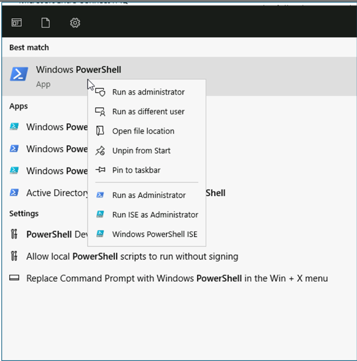
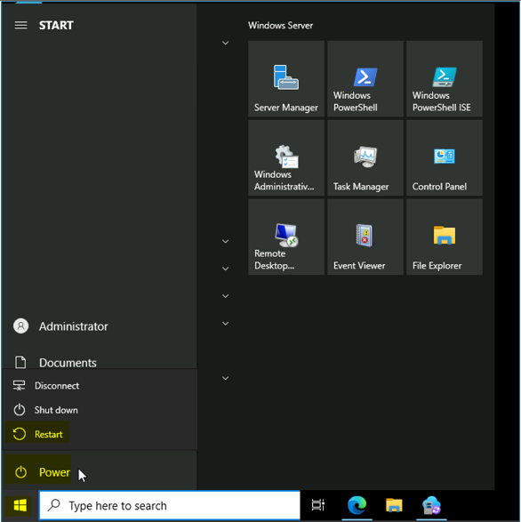
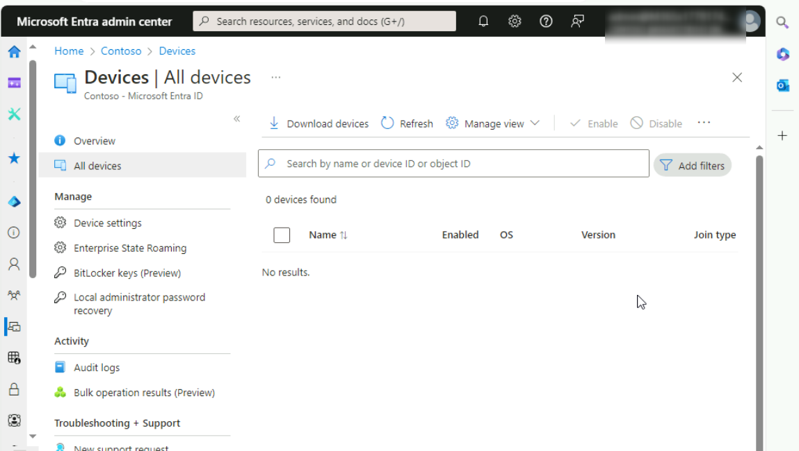
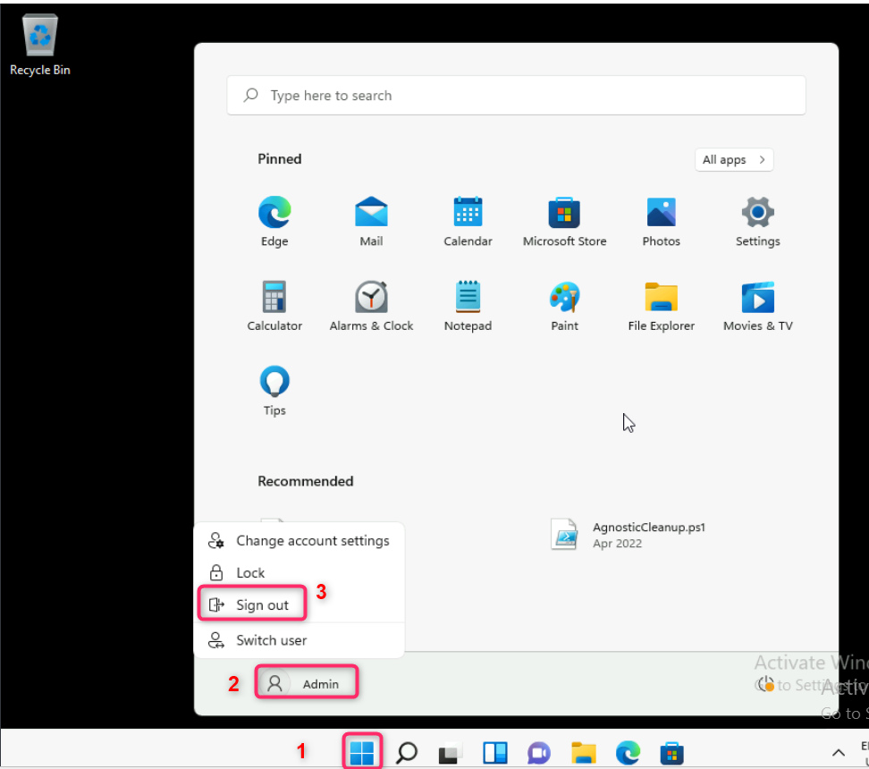
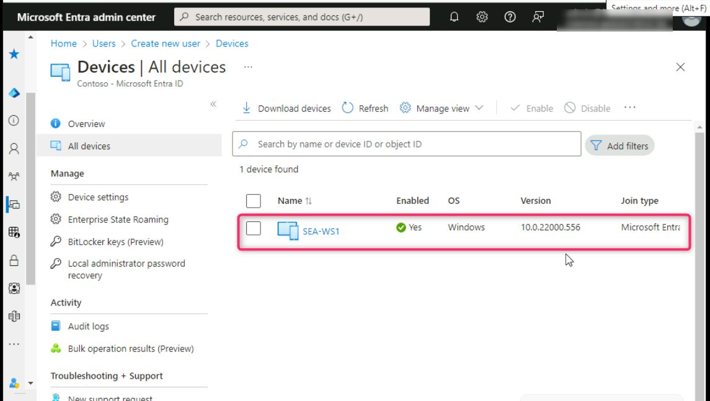
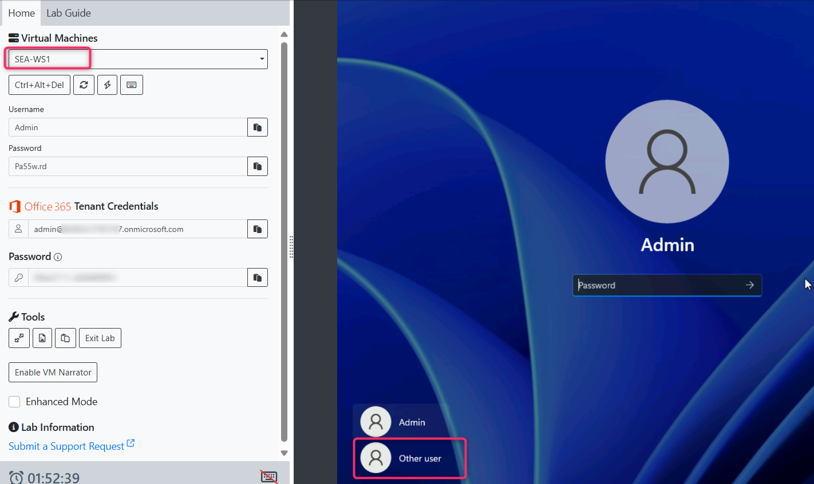
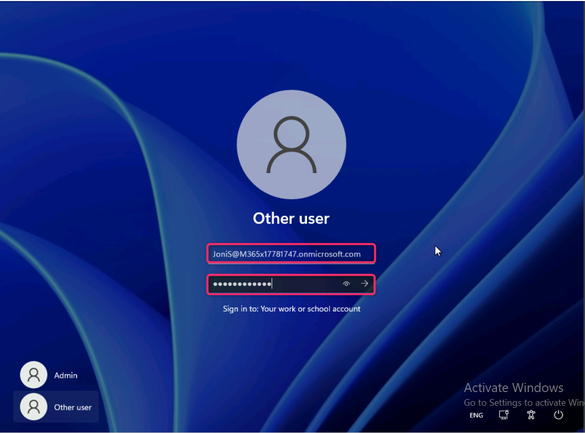
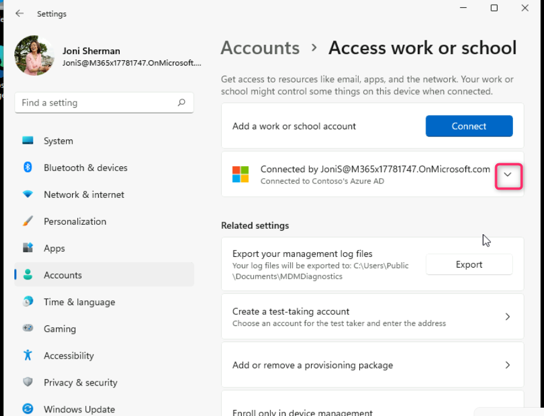
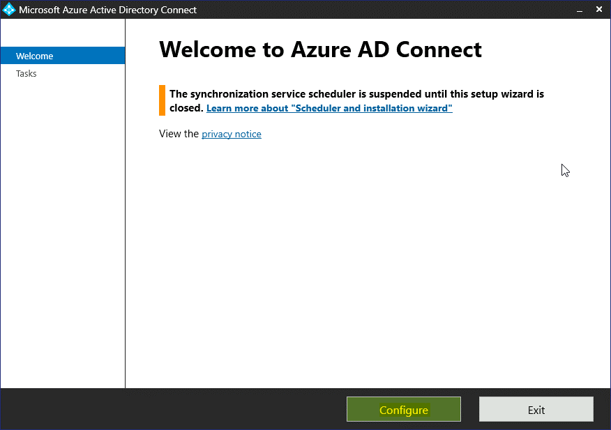

실습 03: Microsoft Entra ID Join 구성 및 관리

**요약**

이 실습에서는 Microsoft Entra ID 조인 설정을 구성하고 Windows 장치에
대한 표준 조인과 Microsoft Entra hybrid join 시나리오를 수행합니다.

**필수 조건**

이 실습을 시작하기 전에 다음 랩을 완료해야 합니다.

- 실습 \#2: Microsoft Entra Connect를 사용하여 ID 동기화

**참고**: Entra ID에 대한 Windows Hello 로그인 인증을 보호하는 데
사용되는 문자 메시지를 수신할 수 있는 휴대폰도 필요합니다.

**연습 1: Microsoft Entra Join 구성**

**시나리오**

모든 사용자가 Entra ID에 장치를 가입할 수 있도록 Entra ID 장치 설정을
구성해야 합니다. 또한 사용자가 최대 20대의 장치만 가입할 수 있도록 하고,
모든 Microsoft Entra 가입 장치에 Allan Deyoung이 로컬 관리자로
추가되었는지 확인해야 합니다. 마지막으로 Joni Sherman이 SEA-WS1을
테넌트에 가입하도록 하여 Microsoft Entra Join이 예상대로 작동하는지
확인합니다.

## 작업 0: PowerShell 스크립트를 사용하여 TLS 1.2 활성화

1.  SEA-WS1에서 Contoso\Administrator로 로그인하고 비밀번호는
    Pa55w.rd입니다.

2.  시작 메뉴에서 [**PowerShell**](urn:gd:lg:a:send-vm-keys) 을 입력하고
    **PowerShell**을 마우스 오른쪽 버튼으로 클릭한 후 **run as
    administrator**을 선택합니다.

3.  PowerShell에서 다음 스크립트를 실행합니다.

**If** (-Not (Test-Path
'HKLM:\SOFTWARE\WOW6432Node\Microsoft\\NETFramework\v4.0.30319'))

{

New-Item 'HKLM:\SOFTWARE\WOW6432Node\Microsoft\\NETFramework\v4.0.30319'
-Force | Out-Null

}

New-ItemProperty -Path
'HKLM:\SOFTWARE\WOW6432Node\Microsoft\\NETFramework\v4.0.30319' -Name
'SystemDefaultTlsVersions' -Value '1' -PropertyType 'DWord' -Force |
Out-Null

New-ItemProperty -Path
'HKLM:\SOFTWARE\WOW6432Node\Microsoft\\NETFramework\v4.0.30319' -Name
'SchUseStrongCrypto' -Value '1' -PropertyType 'DWord' -Force | Out-Null

**If** (-Not (Test-Path
'HKLM:\SOFTWARE\Microsoft\\NETFramework\v4.0.30319'))

{

New-Item 'HKLM:\SOFTWARE\Microsoft\\NETFramework\v4.0.30319' -Force |
Out-Null

}

New-ItemProperty -Path
'HKLM:\SOFTWARE\Microsoft\\NETFramework\v4.0.30319' -Name
'SystemDefaultTlsVersions' -Value '1' -PropertyType 'DWord' -Force |
Out-Null

New-ItemProperty -Path
'HKLM:\SOFTWARE\Microsoft\\NETFramework\v4.0.30319' -Name
'SchUseStrongCrypto' -Value '1' -PropertyType 'DWord' -Force | Out-Null

**If** (-Not (Test-Path
'HKLM:\SYSTEM\CurrentControlSet\Control\SecurityProviders\SCHANNEL\Protocols\TLS
1.2\Server'))

{

New-Item
'HKLM:\SYSTEM\CurrentControlSet\Control\SecurityProviders\SCHANNEL\Protocols\TLS
1.2\Server' -Force | Out-Null

}

New-ItemProperty -Path
'HKLM:\SYSTEM\CurrentControlSet\Control\SecurityProviders\SCHANNEL\Protocols\TLS
1.2\Server' -Name 'Enabled' -Value '1' -PropertyType 'DWord' -Force |
Out-Null

New-ItemProperty -Path
'HKLM:\SYSTEM\CurrentControlSet\Control\SecurityProviders\SCHANNEL\Protocols\TLS
1.2\Server' -Name 'DisabledByDefault' -Value '0' -PropertyType 'DWord'
-Force | Out-Null

**If** (-Not (Test-Path
'HKLM:\SYSTEM\CurrentControlSet\Control\SecurityProviders\SCHANNEL\Protocols\TLS
1.2\Client'))

{

New-Item
'HKLM:\SYSTEM\CurrentControlSet\Control\SecurityProviders\SCHANNEL\Protocols\TLS
1.2\Client' -Force | Out-Null

}

New-ItemProperty -Path
'HKLM:\SYSTEM\CurrentControlSet\Control\SecurityProviders\SCHANNEL\Protocols\TLS
1.2\Client' -Name 'Enabled' -Value '1' -PropertyType 'DWord' -Force |
Out-Null

New-ItemProperty -Path
'HKLM:\SYSTEM\CurrentControlSet\Control\SecurityProviders\SCHANNEL\Protocols\TLS
1.2\Client' -Name 'DisabledByDefault' -Value '0' -PropertyType 'DWord'
-Force | Out-Null

Write-Host 'TLS 1.2 has been enabled. You must restart the Windows
Server for the changes to take affect.' -ForegroundColor Cyan

4.  Windows Server VM을 다시 시작합니다.

## T 작업 1: Microsoft Entra ID join 장치 설정 구성

1.  **SEA-SVR1**로 전환합니다. **Microsoft Edge**브라우저 주소창에 다음
    URL을 입력합니다:
    !\!!
    그리고 **Enter** 버튼을 누르세요.

2.  O365 테넌트 ID: !! **admin@M365xXXXXXXXX.onmicrosoft.com**!!로
    로그인하고 테넌트 관리자 비밀번호를 사용합니다.

3.  **Stay signed in?** 대화 상자에서 **Yes** 버튼을 선택합니다.

4.  **Microsoft Entra admin center**창에서 **Identity**를 찾아
    클릭합니다.

5.  **Identity** 섹션에서 **Devices**를 선택한 다음 아래 이미지에 표시된
    대로 **All devices**를 찾아 클릭합니다.

아직 아무 장치에도 가입하지 않았으므로 장치를 찾을 수 없습니다.

6.  **Devices** | All devices 페이지에서 **Device settings를**
    선택합니다.

7.  **Devices | Device settings**  페이지의 세부 정보 창에서 **Users may
    join devices to Entra**아래에서 모두가 선택되어 있는지 확인합니다.

이는 모든 Entra 사용자가 Windows 10 이상 기기를 Microsoft Entra에 연결할
수 있음을 나타냅니다. 이 설정은 Entra 하이브리드 연결 기기나 Windows
Autopilot 자체 배포 모드를 사용하여 연결된 기기에는 적용되지 않습니다.

8.  **Require Multi-factor Authentication to register or join devices
    with Entra**  섹션에서 설정이 **No**로 설정되어 있는지 확인합니다.

9.  **Maximum number of devices per user** 섹션에서 **20
    (Recommended)**을 선택합니다.

10. **Manage** **Additional local administrators on all Microsoft Entra
    Joined devices** 링크를 클릭합니다. **Device Administrators page**
    페이지가 열립니다.

11. **Device Administrators | Assignments** 페이지에서 **Add
    assignments**를 선택합니다.

12. 검색 상자에 !!**Allan Deyoung**!!을 입력하고 **Allan Deyoung**
    사용자 개체를 선택한 다음 **Add**를 선택합니다.

13. Allan Deyoung은 이제 모든 Microsoft Entra join기기에 기기 관리자로
    추가됩니다.

14. Azure Portal 검색 창 아래의 **Devices | Device settings** 링크를
    클릭하여 **Device Settings**페이지로 돌아갑니다.

15. **Device settings** 페이지에서 **Save**를 선택합니다.

**작업 2: Microsoft Entra ID Join 수행**

1.  [SEA-WS1](https://labclient.labondemand.com/Instructions/e7cc4ae1-e3d9-4c55-accc-696f537e1e17?rc=10)로
    전환하고 !!**Pa55w.rd**!!의 비밀번호를 사용하여 **Admi**으로
    로그인합니다.

2.  타스크바에서 **Windows Start button**아이콘을 선택한 다음
    **Settings**.을 선택합니다.

3.  **Settings** 창에서 **Accounts**를 선택합니다.

4.  **Accounts페이지에서** **Access work or school**를 선택합니다.

5.  **Access work or school** 페이지에서 **Connect**를 선택합니다.

6.  **Microsoft account** 창에서 **Join this device to Microsoft Entra
    ID**을 선택합니다.

7.  **Sign in**  페이지에서 !!JoniS@M365xXXXXXXX.onmicrosoft.com!!을
    입력하고 **Next**를 선택합니다.

8.  **Enter password** 페이지에서 테넌트 비밀번호
    !\!!를 입력한 다음 **Sign
    in**을 선택합니다.

9.  **Make sure this is your organization** 대화 상자에서 **Join**을
    선택합니다.

10. **You're all set!** 페이지에서 **Done**를 선택합니다.

11. **Access work or school** 페이지에서 **Connected to Contoso's Azure
    AD가** 표시되는지 확인합니다.

12. **Settings** 페이지를 닫습니다.

**작업 3: Microsoft Entra Join 검증**

1.  [SEA-WS1](https://labclient.labondemand.com/Instructions/e7cc4ae1-e3d9-4c55-accc-696f537e1e17?rc=10)에서
    **Windows** **Start button**아이콘을 마우스 오른쪽 버튼으로 클릭한
    다음 아래 이미지와 같이 **Windows Terminal (Admin)**을 선택합니다.

2.  **User Account Control**대화 상자에서 **Yes**를 선택합니다.

3.  PowerShell 콘솔에서 다음 명령을 입력하고 **Enter** 버튼을 누릅니다:

!!**dsregcmd /status**!!

4.  출력의 **Device State**에서 **AzureAdJoined : YES** 가 표시되는지
    확인합니다.

이는 해당 장치가 Microsoft Entra에 가입되었음을 나타냅니다.

5.  PowerShell을 닫습니다.

6.  **Windows** **Start** **button**아이콘을 다시 마우스 오른쪽 버튼으로
    클릭한 다음 **Computer Management**를 선택합니다

7.  **Computer Management**창에서 **Local Users and Groups**을 확장한
    다음 **Groups**를 선택합니다.

8.  **Administrators**  그룹을 두 번 클릭합니다.

Joni Sherman이 SEA-WS1의 로컬 관리자로 추가된 것을 확인할 수 있습니다.
또한 보안 식별자(SID)로 표현되는 두 개의 보안 주체도 확인할 수 있습니다.
이 두 SID는 Entra 글로벌 관리자 역할과 Microsoft Entra 가입 장치 관리자
역할을 나타냅니다.

9.  열려 있는 모든 창을 닫고 **Windows Start button icon \> Admin \>
    Sign out**을 클릭하여 SEA-WS1에서 로그아웃합니다.

10. **SEA-SVR1**로 전환하고 자격 증명 **Contoso\Administrator**와
    비밀번호 !! **Pa55w.rd**!!를 사용하여 로그인합니다.

11. **Microsoft Entra admin center**에서 **Identity를** 찾아 클릭합니다.

12. **Devices**를 찾아 선택한 다음 **All devices**를 클릭합니다.

13. **Devices | All devices** 페이지에 **SEA-WS1**이 나열되어 있는지
    확인합니다.

14. **Join Type** 가 **Microsoft Entra Joined** 으로 나열되어 있고
    소유자가 **Joni Sherman**인지 확인합니다.

15. MDM 열에 **None**가표시되는 것도 참고해 주세요. 이는 이 기기가 아직
    Microsoft Intune에서 관리되지 않음을 나타냅니다.

**작업 4: Microsoft Entra 사용자로 Windows에 로그인**

1.  **SEA-WS1**로 전환하고 **Other user**를 클릭합니다.

2.  테넌트 비밀번호 !!**P@55w.rd1234**!!를 사용하여
    !!**JoniS@M365xXXXXXXX.onmicrosoft.com**!!으로 로그인합니다.

**참고: 프로필이 생성될 때까지 기다립니다.**

참고 – Windows **Hello**를 묻는 메시지가 표시되면 로그인 과정을 적절히
완료하고 Set up a PIN  페이지의 New PIN 및 Confirm PIN 상자에
!!102938!!을 입력한 다음 OK를 선택합니다.

**작업 5: Entra에서 Windows 장치 제거**

1.  [SEA-WS1](https://labclient.labondemand.com/Instructions/e7cc4ae1-e3d9-4c55-accc-696f537e1e17?rc=10)에서
    Joni Sherman으로 로그인하라는 메시지가 표시되면 PIN을 입력하고,
    PIN을 입력하는 옵션이 있으면 PIN을 !! **102938**!!로 입력하거나
    비밀번호를 !! **P@55w.rd1234**!!로 입력합니다.

2.  **Settings** 창에서 **Accounts**를 선택합니다.

3.  왼쪽 탐색 창에서 **Accounts**를 찾아 클릭합니다.
    **Accounts**페이지에서 **Access work or school**을 선택합니다.

4.  **Access work or school**  페이지에서 아래 이미지와 같이 **Connected
    to Contoso's Azure AD**옆의 드롭다운 메뉴를 선택합니다.
    **Disconnect**를 클릭한 후 **Yes**를 선택합니다.
    

5.  **Disconnect from the organization** 페이지에서 **Disconnect**를
    선택합니다.

6.  **Windows Security**  대화 **Email address**  상자에 !! Admin!!을
    입력하고 **Password** 상자에 !! Pa55w.rd!!를 입력합니다. **OK를**
    선택합니다.

7.  **Restart your PC**  대화 상자에서 **Restart now**를 선택하세요.
    **SEA-WS1**이 다시 시작됩니다.

**결과**: 이 연습을 완료하면 Microsoft Entra 장치 설정을 구성하고,
장치를 Entra에 연결하고, Entra에서 장치를 제거하게 됩니다.

**연습 2: Microsoft Entra hybrid join 구성**

**시나리오**

일부 Contoso Windows 장치는 현재 로컬 Active Directory 도메인 서비스에
가입되어 있습니다. 이러한 장치가 클라우드 서비스에 원활하게 액세스할 수
있도록 Microsoft Entra hybrid join을 활성화할 계획입니다. Azure AD
Connect를 재구성하고 SEA-CL2에서 프로세스를 테스트하여 Microsoft Entra
hybrid join을 테스트할 것입니다.

**작업 1: 환경 준비**

1.  [SEA-SVR1](https://labclient.labondemand.com/Instructions/e7cc4ae1-e3d9-4c55-accc-696f537e1e17?rc=10)로
    전환합니다.

2.  **Windows** **Start icon**버튼을 선택하고 **Windows Administrative
    Tools**를 확장한 다음 **Active Directory Users and Computers**를
    선택합니다.

3.  **Active Directory Users and Computers**에서 **Contoso.com**을
    마우스 오른쪽 버튼으로 클릭하고 **New** 만들기를 가리킨 다음
    **Organizational Unit**를 선택합니다.

4.  **New-Object - Organizational Unit**  대화 상자에서 !! **Entra
    clients**!!를 입력한 다음 **OK를** 선택합니다.

5.  탐색 창에서 **Seattle Clients**를 선택하세요. **SEA-CL2**를 마우스
    오른쪽 버튼으로 클릭한 후 **Move**를 선택합니다.

6.  **Move** 대화 상자에서 **Entra clients** 를 선택한 다음 **OK**를
    선택합니다.

7.  **Active Directory Users and Computers**를 닫습니다.

**작업 2: Entra Connect 재구성**

1.  [SEA-SVR1](https://labclient.labondemand.com/Instructions/e7cc4ae1-e3d9-4c55-accc-696f537e1e17?rc=10)에서
    바탕 화면의 Azure AD Connect를 두 번 클릭합니다.

2.  **Microsoft Azure Active Directory Connect**  창에서 **Configure**를
    선택합니다.

3.  **Additional tasks** 페이지에서 **Customize synchronization
    options**을 선택하고 **Next**를 선택합니다.

4.  **Connect to Entra** 페이지에서 **USERNAME** 및 **PASSWORD** 상자에
    **Office 365 Tenant credentials**을 입력한 후 **Next**를 선택합니다.

5.  **Connect your directories**  페이지에서 Next 버튼을 클릭합니다.

6.  **Domain and OU filtering** 페이지에서 **Sync selected domains and
    Ous**가 선택되어 있는지 확인합니다.

7.  **Contoso.com**을 확장하고 **Entra clients**를 선택한 후 **Next**을
    클릭합니다.

8.  **Optional features** 페이지에서 **Password hash
    synchronization** 가 선택되어 있는지 확인하고 **Next**를 선택합니다.

9.  **Ready to configure** 페이지에서 **Start the synchronization
    process when configuration completes**가 선택되어 있는지 확인한 다음
    **Configure**를 선택합니다.

10. 구성이 완료되면 **Exit**를 선택합니다.

참고: 동기화가 완료될 때까지 약 5분 정도 기다립니다.

**작업 3: Azure AD Connect를 사용하여 Microsoft Entra hybrid join 구성**

1.  [SEA-SVR1](https://labclient.labondemand.com/Instructions/e7cc4ae1-e3d9-4c55-accc-696f537e1e17?rc=10)VM
    **Desktop**에서 **Azure AD Connect**를 두 번 클릭합니다.

2.  **Microsoft Azure Active Directory Connect** 창에서 **Configure를**
    선택합니다.

3.  **Additional tasks**페이지에서 **Configure device options** 를
    선택하고 **Next**를 선택합니다.

4.  **Overview** 페이지에서 **Next**.를 선택합니다.

5.  **Connect to Entra** 페이지에서 관리자 테넌트 비밀번호를
    **PASSWORD** 상자에 입력한 후 **Next를** 선택합니다.

6.  **Device options** 페이지에서 **Configure Hybrid Azure AD Join**을
    선택한 후 **Next를** 선택합니다.

7.  **Device operating systems**  페이지에서 **Windows 10 or later
    domain-joined devices**를 선택한 후 **Next를** 선택합니다.

8.  **SCP configuration** 페이지에서 **Contoso.com**옆의 확인란을
    선택합니다. **Authentication Service** 드롭다운에서 **Azure Active
    Directory**를 선택하고 **Add**를 선택합니다.

9.  **Enterprise Admin Credentials**  창에서 **Username**으로
    **Contoso\Administrator** 를, **Password**로 !! **Pa55w.rd**!!를
    입력합니다. **OK를** 선택하고 **Next**를 클릭합니다.

10. **Ready to configure**  페이지에서 **Configure**를 선택하여 구성을
    실행합니다.

11. 구성이 완료되면 **Exit**를 선택합니다.

12. 타스크바에서 **Windows Start button icon**을 마우스 오른쪽 버튼으로
    클릭하고 **Windows Powershell (Admin)**을 선택합니다.

13. **Windows PowerShell** 창에서 다음 명령을 입력한 다음 **Enter** 키를
    누릅니다.

!!**Start-ADSyncSyncCycle -PolicyType Initial**!!

14. PowerShell 창을 닫습니다.

참고: 동기화가 완료될 때까지 약 5분 정도 기다리세요.

**작업 4: Entra 등록 확인**

1.  [SEA-CL2](https://labclient.labondemand.com/Instructions/e7cc4ae1-e3d9-4c55-accc-696f537e1e17?rc=10)로
    전환합니다.

2.  로그인 페이지에서 **Power** 버튼을 선택한 다음 **Restart**를
    선택합니다.

***참고**: 재부팅하면
[SEA-CL2](https://labclient.labondemand.com/Instructions/e7cc4ae1-e3d9-4c55-accc-696f537e1e17?rc=10)에서
하이브리드 Microsoft Entra Join이 실행됩니다.*

3.  **SEA-CL2** 가 재시작되면 **Contoso\Administrator** 로 로그인하고
    비밀번호는 !! **Pa55w.rd**!!입니다.

4.  타스크바에서 **Windows Start icon button**을 마우스 오른쪽 버튼으로
    클릭하고 **Windows Terminal (Admin)**을 선택합니다.

5.  **Windows PowerShell** 창에서 다음 명령을 입력한 다음 **Enter** 키를
    누릅니다:

!!**dsregcmd /status**!!

6.  **Device State**의 출력에서 ​​이를 확인합니다.

- **AzureAdJoined : YES** 

- **DomainJoined : YES** are displayed.

***참고: 장치가 아직 Entra에 연결되지 않은 경우 Entra Connect 동기화가
완료될 때까지 기다렸다가 SEA-CL2를 다시 시작하세요. 상태가 업데이트되는
데 5~10분 정도 걸릴 수 있습니다.***

또한 **SEA-SVR1**에 로그인하고 **Windows PowerShell** 창에 다음 명령을
입력하여 동기화 속도를 높일 수 있습니다.

!!**Start-ADSyncSyncCycle -PolicyType Initial**!!

7.  Close all windows
    On [SEA-CL2](https://labclient.labondemand.com/Instructions/e7cc4ae1-e3d9-4c55-accc-696f537e1e17?rc=10) and
    sign out.
    [SEA-CL2](https://labclient.labondemand.com/Instructions/e7cc4ae1-e3d9-4c55-accc-696f537e1e17?rc=10)에서
    모든 창을 닫고 로그아웃합니다.

8.  [SEA-SVR1](https://labclient.labondemand.com/Instructions/e7cc4ae1-e3d9-4c55-accc-696f537e1e17?rc=10)로
    전환하여 **Microsoft Entra admin center** 창으로 이동한 후, ID를
    클릭합니다.

9.  **Identity** 섹션에서 **Devices**를 선택한 다음 아래 이미지에 표시된
    대로 **All devices**를 찾아 클릭합니다.

10. **SEA-CL2** 의 행 **Join type**에 **Microsoft Entra** **hybrid
    joined** 가 설정되어 있는지 확인하세요. SEA-CL2가 목록에
    **Refresh**버튼을 클릭합니다.

11. [SEA-SVR1](https://labclient.labondemand.com/Instructions/e7cc4ae1-e3d9-4c55-accc-696f537e1e17?rc=10)의
    모든 창을 닫습니다.

**결과**: 이 연습을 완료하면 Microsoft Entra hybrid join을 성공적으로
구성하고 검증할 수 있습니다.
