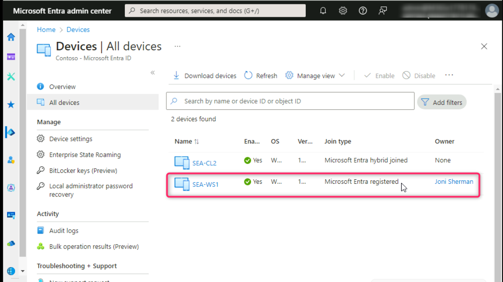

# Übung 4 - Verwalten der Microsoft Entra Geräteregistrierung.

**Zusammenfassung**

In diesem Lab führen wir die Microsoft Entra Registrierung mit einem
Windows-Gerät durch.

**Übung 1: Konfigurieren der Microsoft Entra Geräteregistrierung**

**Szenario**

Mehrere Benutzer haben darum gebeten, ihre persönlichen iOS-, Android-
und Windows-Geräte für den Zugriff auf Contoso-Cloudressourcen zu
verwenden. Da Contoso nicht Eigentümer der Geräte ist, möchten Sie
nicht, dass die Benutzer eine Entra-Verknüpfung für die vollständige
Geräteverwaltung durchführen. Stattdessen müssen Sie sicherstellen, dass
Benutzer ihre Geräte bei Microsoft Entra registrieren können, wodurch
Sie weiterhin Unternehmensrichtlinien nach Bedarf auf Apps anwenden und
Benutzern weiterhin den Zugriff auf Contoso-Ressourcen gestatten können.
Sie testen die Microsoft Entra Geräteregistrierung mit einem Windows
11-Gerät.

**Aufgabe 1: Konfigurieren der Azure AD-Geräteregistrierung**

1.  Öffnen Sie auf dem
    [*SEA-SVR1*](https://labclient.labondemand.com/Instructions/e7cc4ae1-e3d9-4c55-accc-696f537e1e17?rc=10)
    einen neuen Tab im Edge-Browser und geben Sie die folgende URL ein,
    !!**https://entra.microsoft.com**!!und drücken Sie dann **Enter**.

2.  Sign in with your O365 tenant ID
    !!**admin@M365xXXXXXXXX.onmicrosoft.com**!! and use the tenant Admin
    password.

> 
>
> 

3.  In der Dialogbox **Stay signed in?** Wählen Sie die Schaltfläche Yes
    aus.

> 

4.  Navigieren Sie im **Microsoft Entra admin center** und klicken Sie
    auf **Identity**.

5.  Wählen Sie **Devices** und dann die Seite **Devices Settings** aus,
    und stellen Sie im Detailbereich sicher, dass **Users may register
    their devices with Microsoft Entra** auf **All** festgelegt und
    ausgegraut ist.

> Diese Option ist abgeblendet und standardmäßig auf **All** festgelegt,
> wenn Microsoft Intune im Mandanten aktiviert ist. Dadurch wird
> sichergestellt, dass alle Benutzer in der Lage sind, persönliche,
> iOS-, Android- und macOS-Geräte unter Windows 10 oder höher bei Azure
> AD zu registrieren.
>
> 

**Aufgabe 2: Durchführen der Microsoft Entra Registrierung**

1.  Wechseln Sie zu
    [*SEA-WS1*](https://labclient.labondemand.com/Instructions/e7cc4ae1-e3d9-4c55-accc-696f537e1e17?rc=10)
    und melden Sie sich als **Admin** mit dem Passwort !!**Pa55w.rd**!!.

2.  Wählen Sie auf der Taskleiste **Start** und dann **Settings**.

3.  Wählen Sie im Fenster **Settings** die Option **Accounts**.

4.  Wählen Sie auf der Seite **Accounts** die Option **Access work or
    school**.

5.  Wählen Sie auf der Seite **Access work or school** die Option
    **Connect**.

6.  Geben Sie in **Sign In** !!**JoniS@M365xXXXXXXX.onmicrosoft.com**!!
    ein und wählen Sie dann **Next**.

7.  Geben Sie auf der Seite **Enter password** das Mandantenkennwort:
    !\!! ein und wählen Sie dann
    **Sign In** aus**.**

8.  Auf der Seite **You're all set!** wählen Sie **Done**.

9.  Überprüfen Sie auf der Seite **Access work or school**, ob Jonis
    **Work or school account** angezeigt wird.

10. Schließen Sie die Seite Settings.

**Aufgabe 3: Überprüfen der Microsoft Entra Registrierung**

1.  Klicken Sie auf
    [*SEA-WS1*](https://labclient.labondemand.com/Instructions/e7cc4ae1-e3d9-4c55-accc-696f537e1e17?rc=10)
    mit der rechten Maustaste auf die Schaltfläche **Start**, und wählen
    Sie dann **Windows-Terminal (Admin) aus**.

> 

2.  Wählen Sie im Dialogfeld **User Account Control** die Option
    **Yes**.

> 

3.  Geben Sie in der PowerShell-Konsole Folgendes ein, und drücken Sie
    **Enter**:

> !!**dsregcmd /status**!!

4.  Überprüfen Sie, ob in der Ausgabe unter **User State
    \>WorkplaceJoined: YES** angezeigt wird. Dies zeigt an, dass der
    Benutzer eine Geräteregistrierung in Microsoft Entra durchgeführt
    hat.

> 

5.  Schließen Sie PowerShell, und melden Sie sich dann ab **SEA-WS1**.

6.  Wechseln Sie zu SEA-SVR1. Gehen Sie zum **Microsoft Entra Admin**
    Center-Fenster, navigieren Sie und klicken Sie auf **Identity**.

> 
>
> 7\. Wählen Sie im Abschnitt **Identity** die Option **Devices** aus,
> navigieren Sie dann und klicken Sie auf **All Devices,** wie in der
> Abbildung unten gezeigt.
>
> 

8.  Stellen Sie sicher, dass der **Join Typ** als Microsoft Entra
    registriert aufgeführt ist und dass der Besitzer **Joni Sherman**.

> 
>
> Beachten Sie, dass das Gerät bei Microsoft Entra registriert ist und
> NICHT bei Microsoft Entra eingebunden ist. Bei Entra registrierte
> Geräte handelt es sich in der Regel um Geräte, die nicht mit Entra
> verknüpft werden können, oder um Geräte, die sich im persönlichen
> Besitz des Benutzers befinden. Durch die Registrierung eines Geräts
> erhalten Sie Zugriff auf Cloud-basierte Ressourcen.

9.  Schließen Sie Microsoft Edge.

**Aufgabe 4: Melden Sie sich bei Windows an, und trennen Sie die
Verbindung zur Organisation**

1.  Wechseln Sie zu
    *[SEA-WS1](https://labclient.labondemand.com/Instructions/e7cc4ae1-e3d9-4c55-accc-696f537e1e17?rc=10).*
    Wählen Sie in der Taskleiste die Schaltfläche
    **Windows-Startsymbol** und dann **Settings**.

2.  Wählen Sie im Fenster **Settings** die Option **Accounts**.

> 

3.  Wählen Sie auf der Seite **Accounts** die Option **Access work or
    school**.

> 

4.  Klicken Sie auf der Seite **Access work or school** auf das
    Dropdown-Menü neben **JoniS@M3654xXXXXXXXX** **Work or school**
    account, wie in der folgenden Abbildung gezeigt.

> 

5.  Klicken Sie auf die Schaltfläche **Disconnect**.

> 

6.  Klicken Sie auf die Schaltfläche **Yes**, um die Entfernung des
    Kontos zu bestätigen.

> 
>
> Beachten Sie, dass Sie nicht neu starten müssen, um ein bei Microsoft
> Entra registriertes Gerät zu trennen.

7.  Melden Sie sich von **SEA-WS1**.

**Ergebnisse**: Nach Abschluss dieser Übung haben Sie die Microsoft
Entra Geräteregistrierung konfiguriert.
