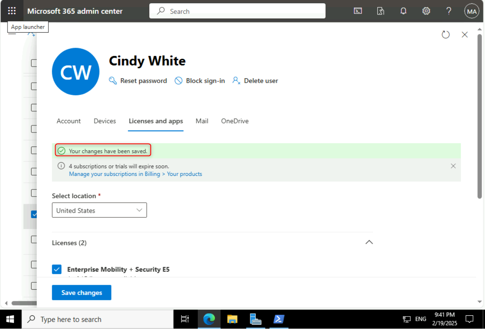
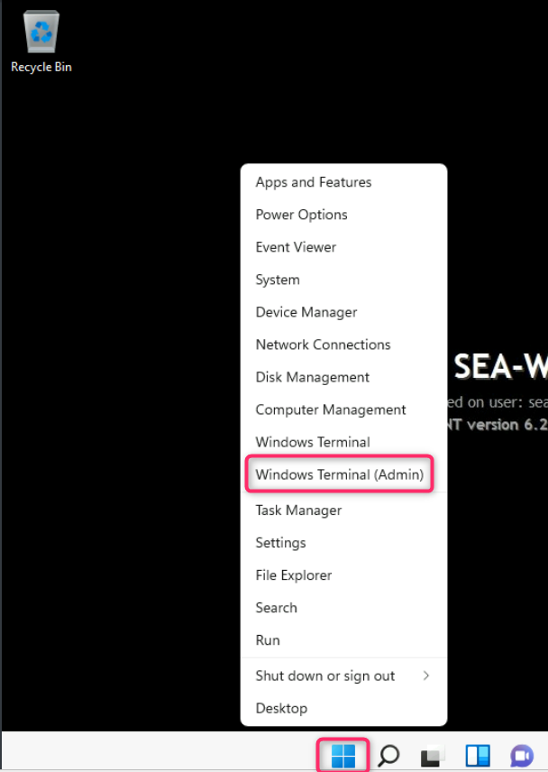
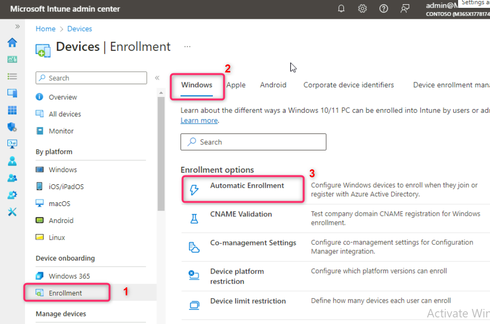
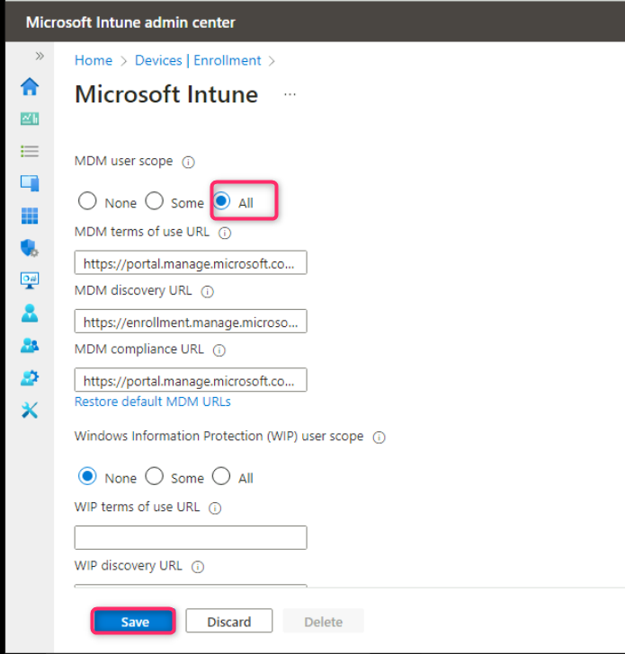
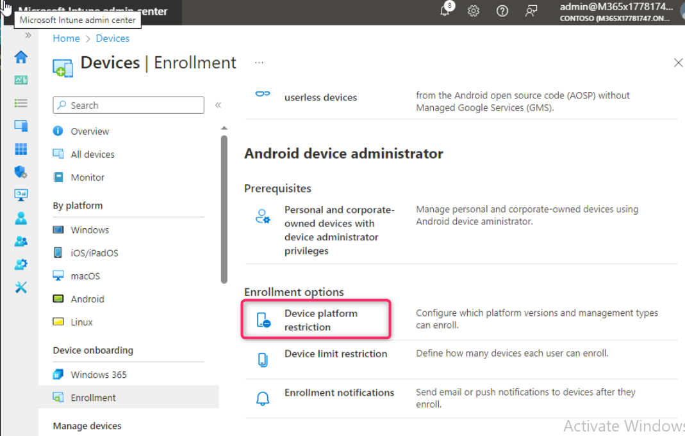
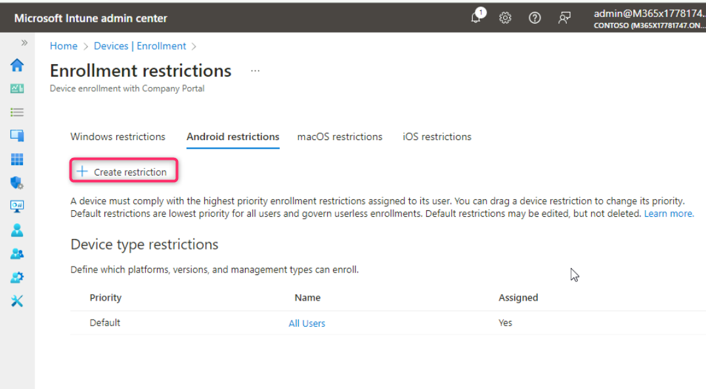
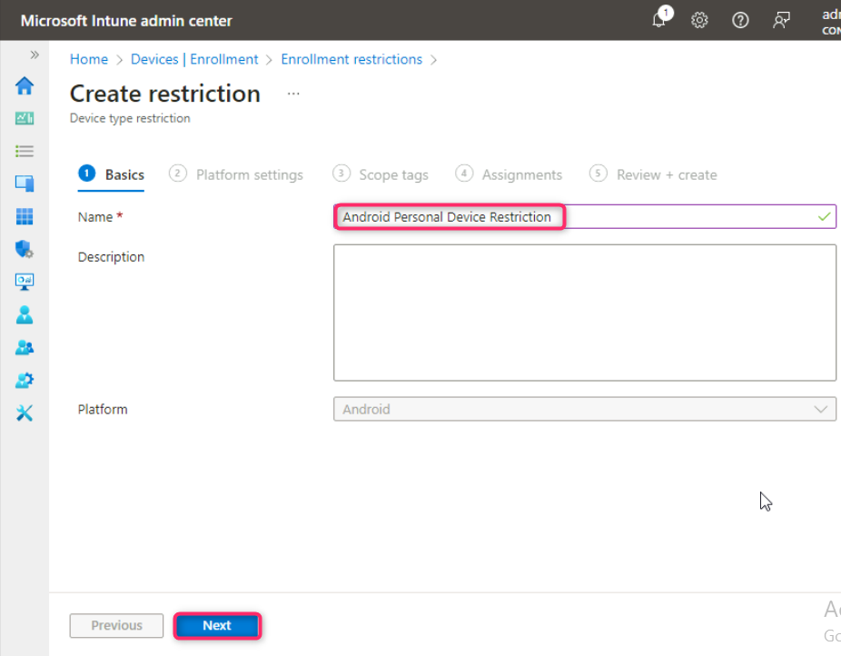

**실습 5 - Microsoft Intune에 장치 등록 관리**

**요약**

이 실습에서는 라이선스 검토 및 할당, Windows 자동 등록 구성, 등록 제한
구성 등을 통해 Microsoft Intune을 사용한 장치 관리를 준비합니다.

**필수 조건**

이 실습을 시작하기 전에 다음 실습을 완료해야 합니다.

- 실습 1 - Microsoft Entra ID에서 ID 관리

- 실습 2 - Microsoft Entra Connect를 사용하여 ID 동기화

**참고:** Entra ID에 대한 Windows Hello 로그인 인증을 보호하는 데
사용되는 문자 메시지를 수신할 수 있는 휴대폰도 필요합니다.

**시나리오**

Microsoft Intune을 사용하여 장치 관리를 준비해야 합니다. 먼저,
사용자에게 장치 관리에 적합한 라이선스가 할당되었는지 확인해야 합니다.
검증 테스트로 Aaron Nicholls에게 필요한 라이선스를 할당합니다. 또한
Microsoft Entra ID에 가입 또는 등록된 모든 Windows 장치가 Intune에
자동으로 등록되는지 확인해야 합니다. 또한 영업 그룹 구성원이 개인용
Android 및 iOS 장치를 Intune에 등록하지 못하도록 제한하고 등록 장치
제한을 10대로 늘려야 합니다. 마지막으로 Allan Deyoung을 장치 등록
관리자로 구성하여 최대 1,000대의 장치를 등록할 수 있도록 해야 합니다.

**작업 1: 장치 관리 라이선스 검토 및 할당**

1.  [*SEA-SVR1*](https://labclient.labondemand.com/Instructions/e7cc4ae1-e3d9-4c55-accc-696f537e1e17?rc=10)에서
    **Microsoft 365 admin center**창으로 이동합니다.

2.  **Billing**를 선택한 후 **Licenses**를 클릭합니다.

3.  **Licenses** 페이지에서 테넌트에서 사용 가능한 라이선스를 기록해
    둡니다.

4.  **Enterprise Mobility + Security E5**를 선택하고 클릭하세요. 이
    라이선스가 할당된 모든 사용자를 확인하세요. 이 위치에서 라이선스를
    할당하거나 제거할 수 있습니다.

5.  사용자를 선택하면 해당 사용자에게 할당된 라이선스를 확인할 수
    있습니다. Enterprise Mobility + Security E5 라이선스에 포함된
    서비스를 확인하세요. Microsoft Intune은 이 라이선스에 지원되는
    서비스 중 하나입니다.

6.  **Microsoft 365 admin center** 탐색 창에서 **Active users**를
    선택합니다.

7.  !! **Cindy White**!!를 검색하여 선택합니다.

8.  **Cindy White user**페이지에서 **Licenses and apps**을 클릭합니다.

9.  **Settings**에서 **Usage location** 필드에서 **United States** 을
    선택하고 **Enterprise Mobility + Security E5 and Office 365 E5 (no
    teams)**의 확인란을 클릭한 다음 **Save changes**을 클릭합니다.

***참고:** 사용자에게 라이선스를 할당하려면 먼저 사용자의 사용 위치가
설정되어 있어야 합니다.*

**작업 2: PowerShell을 활용하여 사용자 비밀번호 설정**

1.  [***SEA-SVR1***](urn:gd:lg:a:select-vm)에서 **Start button**을
    마우스 오른쪽 버튼으로 클릭하고 **Windows PowerShell (Admin)**을
    선택합니다.

2.  **User Account Control**대화 상자에서 **Yes를** 선택합니다.

3.  In the **Windows PowerShell** window, type the following command,
    and then press **Enter**: **Windows PowerShell** 창에서 다음 명령을
    입력하고 **Enter**키를 누릅니다.

!!**Connect-MsolService**!!

4.  **Sign in to your account**  대화 상자에서 홈 탭의 Office 365 테넌트
    자격 증명을 사용하여 로그인합니다.

**참고 – 테넌트 관리자 자격 증명 비밀번호를 변경하라는 메시지가 표시된
경우, 업데이트된 비밀번호를 입력해야 합니다.**

5.  **Windows PowerShell** 창에서 다음 명령을 입력하여 **Cindy White**의
    암호를 재설정합니다.

!!**Get-MsolUser | Where-Object DisplayName -EQ "Cindy White" |
Set-MsolUserPassword -NewPassword P@55w.rd1234 -ForceChangePassword
$false**!!

**작업 3: Microsoft Intune에 Windows 자동 등록 활성화**

1.  **SEA-SVR1**에서 **Microsoft Edge**의 새 탭을 열고 주소 표시줄에 !!
    **https://Endpoint.microsoft.com**!!을 입력한 후 **Enter** 키를
    누릅니다. 로그인하라는 메시지가 표시되면 **Office 365 Tenant
    Admin**의 자격 증명을 입력합니다.

2.  Microsoft Intune 관리 센터에서 **Devices**를 선택합니다.

3.  **Enrollment**을 클릭합니다. **Windows**탭이 선택되어 있는지 확인한
    후 **Enrollment options**섹션으로 이동하여 **Automatic
    Enrollment**을 클릭합니다.

4.  **MDM user scope**  행에서 **All** 라디오 버튼을 선택한 다음
    **Save**를 선택합니다.

5.  아래 이미지에 표시된 대로 **Devices | Enrollment**링크를 클릭합니다.

**참고**: 이 단계를 수행하면 Windows 장치에 Azure AD에 가입하는 모든
사용자가 Intune에 자동으로 등록됩니다.

**작업 4: 등록 제한 구성**

1.  **Devices onboarding**섹션으로 이동하여 **Enrollment**을 클릭합니다.
    그런 다음 아래 이미지와 같이 **Android**탭을 클릭합니다.

2.  **Enrollment options**섹션으로 스크롤하여 **Device platform
    restriction**을 클릭합니다.

3.  **Android restrictions** 탭을 선택한 다음 + **Create restriction**를
    선택합니다.

4.  Select **Next**. **Create restriction**페이지의 **Name**상자에 !!
    **Android Personal Device Restriction**!!을 입력하고 **Next**를
    선택합니다.

5.  플랫폼 설정 페이지의 **Personally owned**에서 다음 기기 유형에 대해
    **Block** 를 선택하고 **Next**버튼을 클릭합니다:

    - Android Enterprise (work profile)

    - Android device administrator

6.  **Scope tags**페이지에서 **Next**를 선택합니다.

7.  **Assignments** 페이지의 **Included groups**에서 **Add groups**를
    선택합니다.

8.  **Select groups to include**창 **Search** 창에 **Sales**를 입력하고
    선택한 다음 **Select** 버튼을 클릭합니다.

9.  **Assignments** 탭에서 **Next** 버튼을 클릭합니다.

10. **Review + create**페이지에서**Create**를 선택합니다.

우선순위 1이 지정된 Android 개인 기기 제한에 주목하세요.

11. **Devices | Enrollment**페이지의 **Windows** 탭에서 **Enrollment
    options**섹션으로 이동하여 **Device limit restriction**을
    클릭합니다.

모든 사용자에게 할당된 기본 기기 제한이 있습니다. 이 기본 제한은 기기
등록 제한을 사용자당 5대로 설정합니다.

12. **Enrollment device limit restrictions**에서 **Create
    restriction**을 선택합니다.

13. 제한 생성 페이지의 **Name** 상자에 !! **Sales Device Enrollment
    Limit**!!을 입력하고 **Next**를 선택합니다.

14. **Device limit** 페이지에서 **10**을 선택한 후 **Next**를선택합니다.

15. **Scope tags** 페이지에서 **Next**를 선택합니다.

16. **Assignments** 페이지의 **Included groups**에서 **Add groups**를
    선택합니다.

17. **Select groups to include**페이지 검색 상자에 **Sales**를 입력하고
    선택한 다음 **Select**버튼을 클릭합니다.

18. **Next** 버튼을 클릭합니다.

19. **Review + create**페이지에서 **Create**를 선택합니다.

20. 페이지를 새로 고침하세요. 판매 기기 등록 제한이 기기 제한 10개로
    설정되어 있고 우선순위 1이 지정되어 있는 것을 확인합니다.

**작업 5: 장치 등록 관리자 구성**

1.  **Microsoft Intune admin center**에서 장치를 선택합니다.

2.  **Device onboarding**섹션으로 이동하여 **Enrollment**을 클릭한 다음,
    **Device enrolment managers**탭을 클릭합니다.

3.  **Enroll devices** 창에서 **Device enrollment managers**를
    선택합니다.

기본적으로 기기 등록 관리자는 구성되어 있지 않습니다.

4.  **Enroll devices|Device enrollment managers** 페이지에서 **Add**를
    선택합니다.

5.  **Add user** 페이지의 사용자 이름에 Allan DeYoung !\!!의
    이메일 주소를 입력하고(**XXXXXX**를 테넌트 이름으로 대체) **Add**를
    선택합니다.

**이제 Allan은 최대 1000대의 기기를 등록할 수 있습니다.**

6.  Microsoft Intune 관리 센터의 탐색 창에서 **Home**을 선택합니다.

7.  Microsoft Edge를 닫습니다.

**결과:** 이 연습을 완료하면 라이선스 검토 및 할당, Windows 자동 등록
구성, 등록 제한 활성화 및 할당, 그리고 장치 등록 관리자 구성이
완료됩니다.
