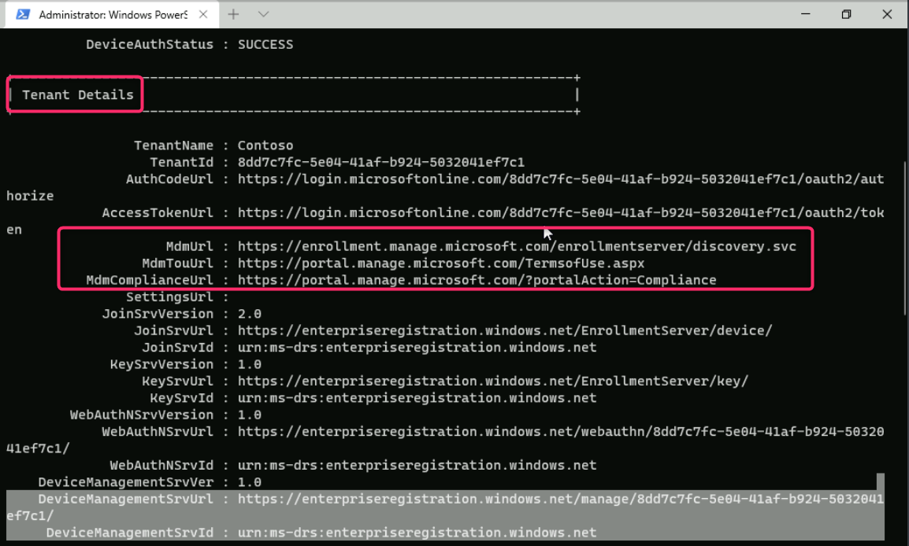
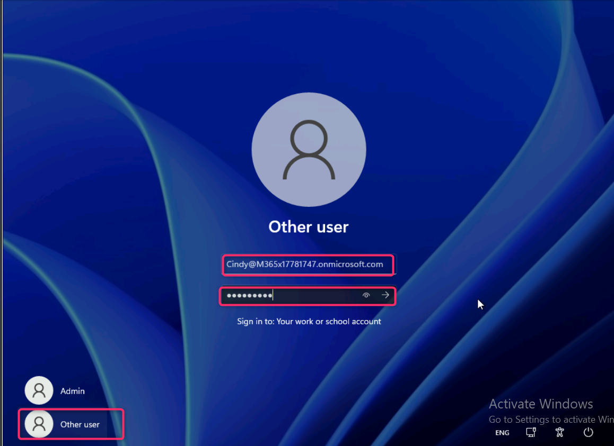

**Lab 6 - Registrieren von Geräten bei Microsoft Intune**

**Zusammenfassung**

In dieser Übung verknüpfen Sie einen Windows-Client mit Entra ID und
überprüfen, ob das Gerät automatisch bei Microsoft Intune registriert
wurde.

**Voraussetzungen**

Zu den folgenden Labs müssen vor diesem Lab abgeschlossen werden:

1.  Lab \#1 - Verwalten von Identitäten in Microsoft Entra ID

2.  Lab \#2 - Synchronisieren von Identitäten mit Microsoft Entra
    Connect

3.  Lab \#5 - Verwalten der Geräteregistrierung bei Microsoft Intune

Hinweis: Möglicherweise benötigen Sie auch ein Mobiltelefon, das
Textnachrichten empfangen kann, die zum Sichern der Windows
Hello-Anmeldeauthentifizierung bei der Entra ID verwendet werden.

**Szenario**

Sie haben Cindy White entsprechende Lizenzen zugewiesen und testen nun
den Prozess des Beitritts eines Windows-Geräts zu Entra ID und lassen es
automatisch bei Microsoft Intune registrieren.

**Aufgabe 1: Automatisches Registrieren eines Windows-Geräts bei
Microsoft Intune**

1.  Wechseln Sie zu
    [*SEA-WS1*](https://labclient.labondemand.com/Instructions/e7cc4ae1-e3d9-4c55-accc-696f537e1e17?rc=10)
    und melden Sie sich als **Admin** mit dem Passwort !!**Pa55w.rd**!!

2.  Wählen Sie auf der Taskleiste **Start** und dann **Settings**.

3.  Wählen Sie im Fenster **Settings** die Option **Accounts**.

4.  Wählen Sie auf der Seite Konten die Option **Access work or
    school**.

5.  Wählen Sie auf der Seite **Access work or school** die Option
    **Connect**.

6.  Wählen Sie im **Microsoft account** Fenster **Join this device to
    Microsoft Entra ID**.

7.  Geben Sie auf der **Sign in**!!
    [**Cindy@M365x51282399.onmicrosoft.com**](mailto:Cindy@M365x51282399.onmicrosoft.com)!!
    ein und wählen Sie dann **Next**.

8.  Geben Sie auf der Seite **Enter password** das Passwort:
    !\!! ein und wählen Sie
    dann **Sign in**.

9.  **Make sure this is your organization** Dialogfeld wird angezeigt,
    und wählen Sie dann **Join**.

10. Auf der Seite **You're all set!**  lesen Sie die Informationen und
    wählen Sie dann **Done**.

11. Vergewissern Sie sich, dass im Abschnitt **Access work or school**
    die Option Verbunden mit **Azure AD von Contoso** angezeigt wird.

12. Wählen Sie **Connected to Contoso's Azure AD** und wählen Sie dann
    **Info**.

13. Notieren Sie sich die Informationen zu den von Contoso verwalteten
    Bereichen, scrollen Sie nach unten, und wählen Sie dann **Sync**.
    Dadurch wird eine Gerätesynchronisierung mit Intune erzwungen.

14. Schließen Sie das Fenster **Settings**.

**Aufgabe 2: Überprüfen der Geräteregistrierung bei Microsoft Entra und
Intune**

1.  Wählen Sie in der **SEA-WS1-**Taskleiste **Start** aus, und geben
    Sie !!**certlm.msc!!** ein Drücken Sie **Enter**.

2.  Wählen Sie im Dialogfeld Benutzerkontensteuerung die Schaltfläche
    **Yes** aus.

3.  Erweitern Sie in der **Certificates** console im Navigationsbereich
    die Option **Personal** und wählen Sie den **Certificates** node
    aus. Stellen Sie sicher, dass die folgenden Zertifikate im
    Detailbereich aufgeführt sind:

- Microsoft Intune MDM Device CA

- MS-Organization-Access

- MS-Organization-P2P-Access \[2024\]

Dies gibt an, dass das Gerät bei Microsoft Entra und Intune registriert
ist.

4.  Schließen Sie das Fenster Certificates.

5.  Klicken Sie mit der rechten Maustaste auf die Schaltfläche **Start**
    und wählen Sie dann **Windows Terminal (Admin)**.

6.  Klicken Sie im Dialogfeld **User Account Control** auf die
    Schaltfläche **Yes**.

7.  Geben Sie in der PowerShell-Konsole Folgendes ein, und drücken Sie
    **Enter**:

!!**dsregcmd /status**!!

8.  Überprüfen Sie in der Ausgabe unter **Device State**, ob
    **AzureAdJoined: YES** angezeigt wird. Dies gibt an, dass das Gerät
    in Azure AD eingebunden ist.

9.  Überprüfen Sie in der Ausgabe unter **Tenant Details**, ob die
    folgenden drei Einträge vorhanden sind:

- mdmUrl:https://enrollment.manage.microsoft.com/enrollmentserver/discovery.svc

- mdmTouUrl:https://portal.manage.microsoft.com/TermsofUse.aspxmdm

- ComplianceUrl:https://portal.manage.microsoft.com/?portalAction=Compliance

*Hinweis: Diese Einträge geben an, dass das Gerät bei Intune registriert
ist.*

**Aufgabe 3: Anmelden als Microsoft Entra ID-Benutzer**

1.  Melden Sie sich von **SEA-WS1** ab, da Sie mit dem lokalen
    Administratorkonto angemeldet sind.

2.  Wählen Sie auf dem Anmeldebildschirm Anderer Benutzer aus und melden
    Sie sich an als !!**Cindy@M365xXXXXXXX.onmicrosoft.com**!!  mit dem
    Passwort: !\!!

3.  Warten Sie, bis das Profil erstellt wurde.

**Hinweis** – Wenn Sie zu **Windows Hello** aufgefordert werden,
schließen Sie den Anmeldevorgang entsprechend ab und geben Sie auf der
Seite **Set up PIN** in den Feldern **New PIN** und **Confirm Pin!!
ein.102938**!! und wählen Sie dann **OK** aus.

4.  Melden Sie sich von **SEA-WS1** ab.

**Aufgabe 4: Überprüfen der Geräteregistrierung in der Microsoft
Intune-Konsole**

1.  Wechseln Sie zu
    *[SEA-SVR1](https://labclient.labondemand.com/Instructions/e7cc4ae1-e3d9-4c55-accc-696f537e1e17?rc=10)*
    und melden Sie sich mit den angegebenen Zugangsdaten an.

2.  Geben Sie im Microsoft Edge-Browser
    !!**https://intune.microsoft.com**!! in der Adressleiste ein, und
    drücken Sie **Enter**. Melden Sie sich mit Ihrem Office
    365-Mandantenadministratorkonto an.

3.  Wählen Sie im Navigationsbereich **Devices**.

4.  Auf den **Devices | Overview**, navigieren Sie und klicken Sie auf
    **Windows**.

5.  Navigieren Sie und klicken Sie auf **Windows devices**. Stellen Sie
    sicher, dass **SEA-WS1** aufgeführt ist.

Beachten Sie, dass für SEA-WS1 in der Spalte **Managed by\>** **Intune**
und in der Spalte **Ownership** \>**Corporate** angezeigt wird.

**Hinweis**: In dieser Ansicht werden Geräte aufgelistet, die bei Intune
registriert sind. Denken Sie daran, dass Sie die automatische
Registrierung zwischen Microsoft Entra und Microsoft Intune konfiguriert
haben, und dass aus diesem Grund jedes Gerät, das Microsoft Entra
beigetreten oder bei Microsoft Entra registriert ist, automatisch bei
Microsoft Intune registriert wird. Alle Geräte, die vor dem Einrichten
der Registrierung eingebunden wurden, sind nur in Entra eingebunden oder
registriert, aber nicht bei Intune registriert.

6.  Öffnen Sie einen neuen Tab und navigieren Sie zum **Microsoft Entra
    Admin Center** !!**https://entra.microsoft.com**!!. Klicken Sie auf
    **Devices** und wählen Sie dann **All devices**.

7.  Machen Sie sich notizen von **SEA-WS1**. Beachten Sie, dass in der
    Spalte **Join-Typ** „Microsoft Entra join" und in der Spalte **MDM**
    Microsoft Intune angezeigt wird.

**Ergebnisse**: Nach Abschluss dieser Übung haben Sie erfolgreich einen
Windows-Client mit Microsoft Entra ID verknüpft und überprüft, ob das
Gerät automatisch bei Microsoft Intune registriert wurde.
