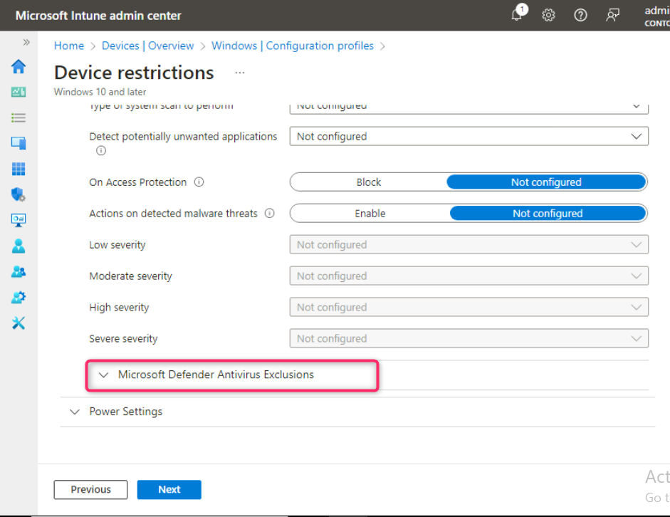
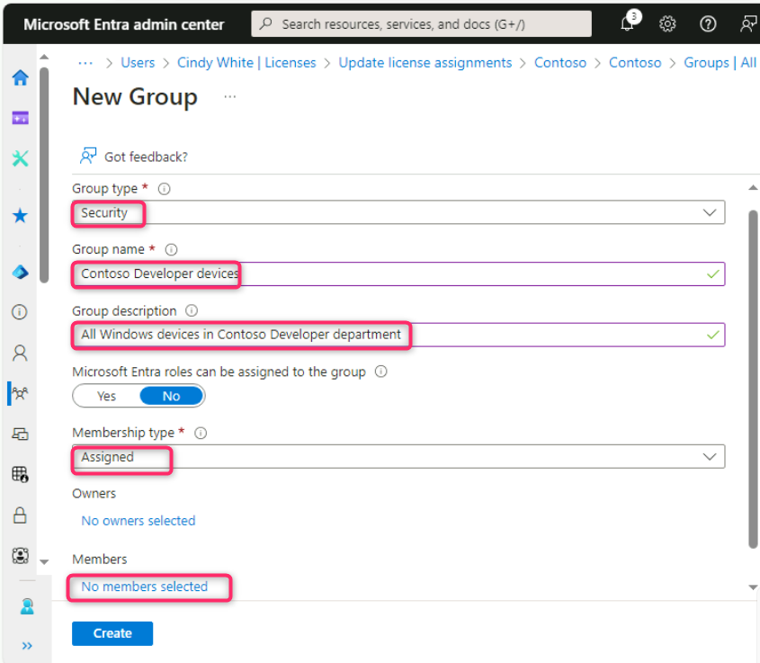
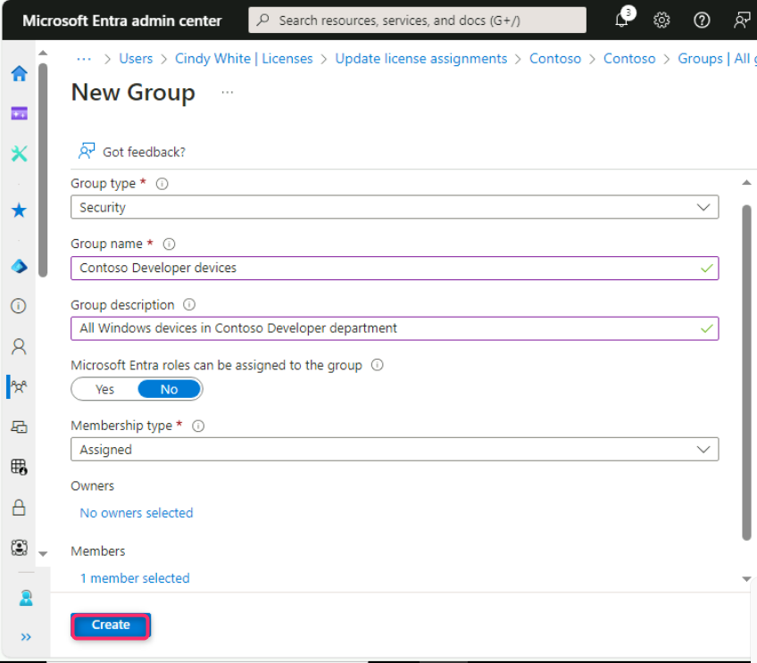
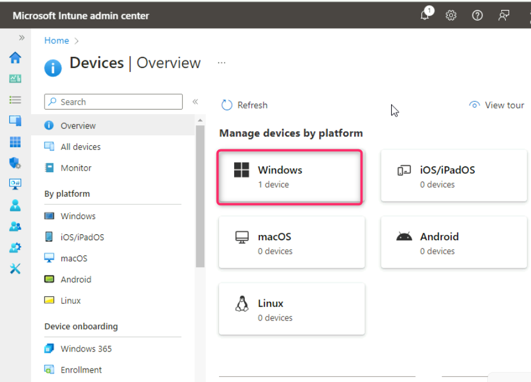
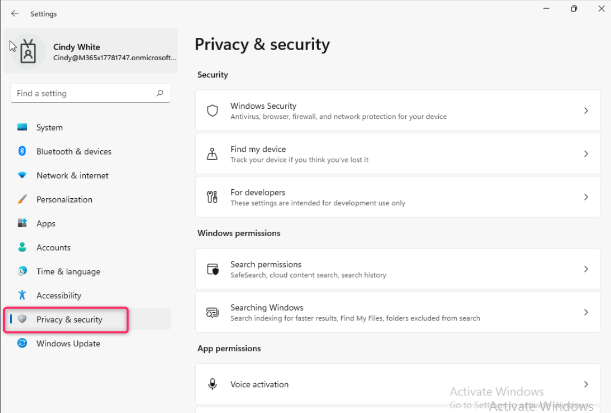
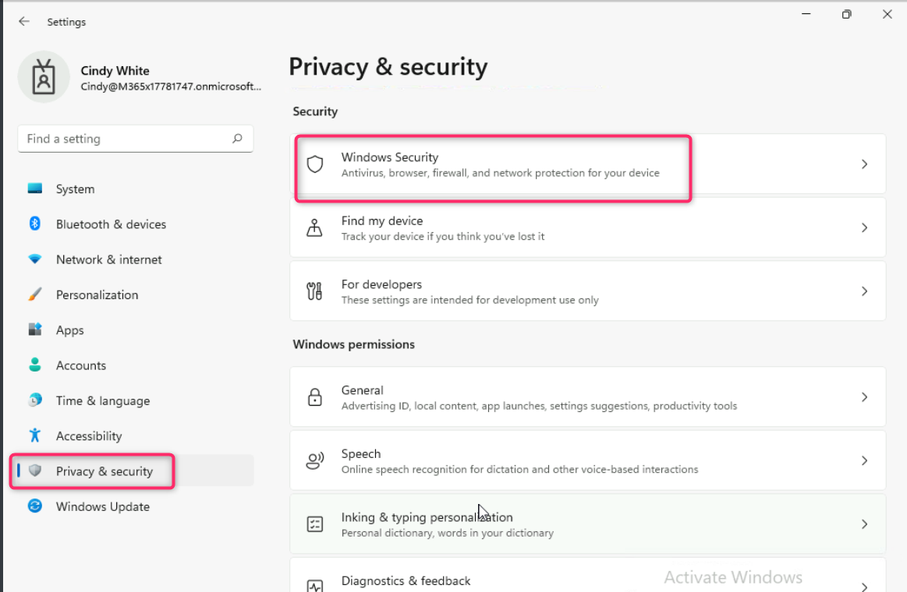

**Lab 7 - Erstellen und Bereitstellen von Konfigurationsprofilen**

**Zusammenfassung**

In dieser Übung verwenden wir Microsoft Intune, um ein
Konfigurationsprofil für ein Windows 11-Gerät zu erstellen und
anzuwenden.

**Voraussetzungen**

Zu den folgenden Labs müssen vor diesem Lab abgeschlossen werden:

1.  Lab \#1 - Verwalten von Identitäten in Microsoft Entra ID

2.  Lab \#2 - Synchronisieren von Identitäten mit Microsoft Entra
    Connect

3.  Lab \#5 - Verwalten der Geräteregistrierung bei Microsoft Intune

4.  Lab \#6 - Registrieren von Geräten bei Microsoft Intune

Hinweis: Sie benötigen außerdem ein Mobiltelefon, das Textnachrichten
empfangen kann, die zum Sichern der Windows
Hello-Anmeldeauthentifizierung bei Microsoft Entra ID verwendet werden.

**Übung 1: Erstellen und Anwenden eines Konfigurationsprofils.**

**Szenario**

Sie müssen Microsoft Entra und Microsoft Intune verwenden, um Mitglieder
der Entwicklerabteilung bei Contoso zu verwalten. Sie wurden gebeten,
die Lösungen zu bewerten, die es den Benutzern ermöglichen, effektiv und
sicher auf Windows 11-Geräten zu arbeiten. Cindy White hat sich
freiwillig bereit erklärt, Ihnen beim Testen und Bewerten der Lösung zu
helfen und Ihnen Feedback zu geben. Er hat Ihnen auch einige erste
Anforderungen gegeben, die auf die Windows-Geräte des Entwicklers
angewendet werden müssen:

- Der Abschnitt "Gaming" in den Einstellungen sollte nicht sichtbar
  sein.

- Der Abschnitt "Datenschutz" in den Einstellungen sollte so weit wie
  möglich eingeschränkt werden.

- Der Ordner **C:\DevProjects** muss aus Windows Defender ausgeschlossen
  werden.

- Der Prozess devbuild.exe muss von Windows Defender ausgeschlossen
  werden.

- Die am häufigsten verwendeten Apps und kürzlich hinzugefügte Apps
  sollten nicht im Startmenü angezeigt werden.

**Aufgabe 1: Überprüfen der Geräteeinstellungen**

1.  Melden Sie sich bei
    [*SEA-WS1*](https://labclient.labondemand.com/Instructions/e7cc4ae1-e3d9-4c55-accc-696f537e1e17?rc=10)
    als **Cindy** White mit ihren Zugangsdaten an
    !!**Cindy@M365xXXXXXX.onmicrosoft.com**!! mit der PIN !!**102938**!!
    oder Passwort !!**P@55w.rd1234**!!

1.  Wählen Sie auf der Taskleiste **Start** und dann **Settings**.

2.  Vergewissern Sie sich, dass in der Navigationsliste **Settings** die
    Einstellung **Gaming** angezeigt wird.

3.  Wählen Sie die Einstellung **Personalization** aus, und wählen Sie
    dann auf der Seite Personalisierung die Option **Start** aus.
    Notieren Sie sich die Einstellungen für **kürzlich hinzugefügte
    Apps** anzeigen und **Am häufigsten verwendete Apps** anzeigen.

4.  Wählen Sie in der App **Settings** \>**Privacy & security**.

5.  Beachten Sie auf der Seite **Privacy & security** die Optionen unter
    **Security**, **Windows permissions**, und **App permissions**.

6.  Wählen Sie auf der Seite **Privacy & Security** die Option **Windows
    Security** und dann **Open Windows Security**.

7.  Wählen Sie auf der Seite **Windows-Security** die Option **Virus &
    threat protection**.

8.  Auf der Seite **Virus & threat protection** unter **Virus & threat
    protection settings**, wählen Sie **manage settings** aus.

9.  Scrollen Sie nach unten zu **Exclusions** und wählen Sie **Add or
    remove exclusions**. Wählen Sie im Dialogfeld
    Benutzerkontensteuerung die Option **Yes**.

10. Überprüfen Sie auf der Seite **Exclusions**, ob keine Ausschlüsse
    konfiguriert wurden.

11. Schließen Sie das Fenster **Windows Security**.

12. Schließen Sie das Fenster **Settings**.

**Aufgabe 2: Erstellen eines Konfigurationsprofils basierend auf den
Szenarioanforderungen**

1.  Wechseln Sie zu
    [*SEA-SVR1*](https://labclient.labondemand.com/Instructions/e7cc4ae1-e3d9-4c55-accc-696f537e1e17?rc=10).

2.  Wechseln Sie zurück zur Registerkarte, während das **Microsoft
    Intune Admin Center** geöffnet ist, und wählen Sie in der
    Navigationsleiste **Devices** aus.

3.  Auf den **Devices | Overview**, wählen Sie **Windows** aus, wie in
    der folgenden Abbildung gezeigt.

4.  Klicken Sie auf der **Windows | Windows devices**, navigieren Sie
    und klicken Sie auf **Configuration profiles**.

5.  Klicken Sie auf der **Windows | Configuration profiles**, klicken
    Sie **auf** der Registerkarte **Policy** auf **+ Create** und wählen
    Sie **+ New Policy**.

6.  Wählen Sie im Bereich **Create a profile** aus, der auf der rechten
    Seite angezeigt wird, die folgenden Optionen, und wählen Sie dann
    **Create**:

- Platform: **Windows 10 and later**

- Profile type: **Templates**

- Template name: !!!!

7.  Geben Sie auf dem Blatt **Basics** die folgenden Informationen ein,
    und wählen Sie dann **Next**:

- Name: !!Contoso Developer - standard!!

- Description: !!Basic restrictions and configuration for Contoso
  Developers.!!

8.  Erweitern Sie auf dem Blatt **Configurations settings** die Option
    **Control Panel and Settings**.

9.  Wählen Sie **Block** neben den Optionen **Gaming** und **Privacy**
    aus.

10. Erweitern Sie auf dem Blatt **Device restrictions** \>**Start**.

11. Scrollen Sie nach unten und wählen Sie **Block** neben **Most used
    apps**, **Recently added apps** und **Recently opened items in Jump
    Lists** aus.

12. Scrollen Sie auf dem Blatt **Device restrictions** nach unten, und
    erweitern Sie **Microsoft Defender Antivirus** aus.

13. Scrollen Sie unter **Microsoft Defender Antivirus** nach unten, und
    erweitern Sie **Microsoft Defender Antivirus Exclusions**.

14. Geben Sie unter **Microsoft Defender Antivirus Exclusions** die
    folgenden Details ein, und klicken Sie auf die Schaltfläche
    **Next**:

- Files and folders box - !!**C:\DevProjects**!!

- Processes box - !!**DevBuild.exe**!!

15. Klicken Sie auf der Registerkarte **Assignments** auf die
    Schaltfläche **Next**.

16. Klicken Sie auf der Registerkarte **Applicability Rules** auf die
    Schaltfläche **Next**.

17. Klicken Sie auf der Registerkarte **Review + create** auf die
    Schaltfläche **Create**.

18. Das Konfigurationsprofil sollte jetzt aufgelistet sein.

**Aufgabe 3: Erstellen der Gerätegruppe "Contoso Developer"**

1.  Wählen Sie im Microsoft Intune Admin Center im Navigationsbereich
    die Option **Groups**.

2.  In **Groups | All groups**, wählen Sie **New group** aus.

3.  Geben Sie auf dem Blatt **New Group** die folgenden Informationen
    ein:

- Group type: **Security**

- Group name: !!Contoso Developer devices!!

- Group description: !!All Windows devices in Contoso Developer
  department!!

- Membership type: **Assigned**

4.  Unter **Members**, wählen Sie **No members selected** aus.

5.  Geben Sie auf dem Blatt **Add members** im **Suchfeld** den Namen!!
    Sea!!ein. Markieren Sie **SEA-WS1** und wählen Sie **Select** aus.

6.  Wählen Sie auf dem Blatt **New Group** die Option **Create**.

7.  Klicken Sie auf der Seite **Groups | All groups** auf All Groups,
    und schauen Sie, ob die Gruppe **Contoso developer devices**
    angezeigt wird.

**Aufgabe 4: Erstellen einer dynamischen Azure AD-Gerätegruppe**

1.  Klicken Sie auf der Seite **Groups | All Groups** im Detailbereich
    die Option **New group**.

2.  Geben Sie auf dem Blatt **Groupe** die folgenden Werte an:

- Group type: **Security**

- Group name: !!Windows Devices!!

- Membership type: **Dynamic Device**

3.  Wählen Sie im Abschnitt **Dynamic Device Members** die Option **Add
    dynamic query**.

4.  Wählen Sie auf dem Blatt **Dynamic membership rules** im Abschnitt
    **Rules Syntax** die Option **Edit**.

5.  Fügen Sie im Textfeld **Edit rule syntax** die folgende einfache
    Mitgliedschaftsregel hinzu, und wählen Sie **OK**.

!!**(device.deviceOSType -contains "Windows")**!!

6.  Wählen Sie auf dem Blatt **Dynamic membership rules** die Option
    **Save**.

7.  Wählen Sie auf der Seite **New Group** die Option **Create**.

**Aufgabe 5: Zuweisen eines Konfigurationsprofils zu Windows-Geräten**

1.  Wählen Sie auf der Seite **Microsoft Intune admin center** auf der
    Navigationsleiste **Devices** aus.

2.  Auf den **Devices | Overview** wählen Sie **Windows** aus, wie in
    der folgenden Abbildung gezeigt.

3.  Klicken Sie auf der **Windows | Windows devices**, navigieren Sie
    und klicken Sie auf **Configuration profiles**.

4.  Auf den **Devices | Configuration profiles**, im Detailbereich
    wählen Sie **Contoso Developer – Standard** aus.

5.  Scrollen Sie auf dem Blatt **Contoso Developer – standard**,
    scrollen Sie nach unten zum Abschnitt **Assignment**, und wählen Sie
    **Edit** aus.

6.  Wählen Sie auf der Seite **Assignment** unter **Included
    groups** die Option **Add groups** aus.

7.  Geben Sie auf dem Blatt **Select groups to include** im **Suchfeld!!
    Contoso Developer devices**!! ein und klicken Sie dann auf die
    Schaltfläche **Select**.

13. Wählen Sie auf dem Blatt **Device restrictions** die Option
    **Review + save** und dann **Save**.

**Aufgabe 6: Überprüfen, ob das Konfigurationsprofil angewendet wird**

1.  Wechseln Sie zu
    *[SEA-WS1](https://labclient.labondemand.com/Instructions/e7cc4ae1-e3d9-4c55-accc-696f537e1e17?rc=10).*
    Melden Sie sich mit dem Konto von Cindy White an.

- Username - !!**Cindy@M365xXXXXXXX.onmicrosoft.com**!!

- Password – !!**P@55w.rd1234**!!

2.  Wählen Sie auf der Taskleiste **Start** und dann **Settings**.

> 

3.  Wählen Sie im Fenster **Settings** die Option **Accounts**. Wählen
    Sie auf der Seite Accounts die Option **Access work or school**.

4.  Klicken Sie auf die Dropdownliste neben **Connected to Contoso’s
    Azure AD,** und wählen Sie die Schaltfläche **Info** aus.

5.  Scrollen Sie auf der Seite **Managed by Contoso** nach unten, und
    wählen Sie dann unter Devices Sync statuts die Option **Sync** aus.
    Warten Sie, bis die Synchronisierung abgeschlossen ist.

6.  

7.  Schließen Sie die App **Seetings.**

> **Hinweis**: Der Synchronisierungsfortschritt kann bis zu 15 Minuten
> dauern, bevor das Profil auf das Windows 11-Gerät angewendet wird. Das
> Abmelden oder Neustarten des Geräts kann diesen Vorgang beschleunigen.

8.  Wählen Sie
    [*auf*](https://labclient.labondemand.com/Instructions/e7cc4ae1-e3d9-4c55-accc-696f537e1e17?rc=10)
    SEA-WS1 erneut **Start** und dann **Settings** aus. Vergewissern Sie
    sich, dass die Einstellung **Gaming** entfernt wurde.

9.  Wählen Sie **Privacy & security** und beachten Sie, dass viele der
    Datenschutzeinstellungen jetzt ausgeblendet sind.

10. Wählen Sie die Einstellung **Personalization** und dann **Start**
    aus. Vergewissern Sie sich, dass **Show recently added apps** und
    **Show most used apps** auf **Off** festgelegt und ausgegraut sind.

11. Wählen Sie in der App Settings \>**Privacy and Security**.

12. Wählen Sie auf der Seite **Privacy & Security** die Option **Windows
    Security** und dann **Open Windows Security** aus.

13. Wählen Sie auf der Seite **Windows Security** die Option **Virus &
    threat protection** aus.

14. Wählen Sie auf der Seite **Virus & threat protection** die Option
    **manage settings** unter **Virus & threat protection settings**
    aus.

15. Scrollen Sie nach unten zu **Exclusions** und wählen Sie **Add or
    remove exclusions** aus. Wählen Sie **Yes** in der Meldung
    Benutzerkontensteuerung aus.

16. Überprüfen Sie auf der Seite **Exclusions**, ob **C:\DevProjects**
    und **DevBuild.exe** angezeigt werden.

17. Schließen Sie die **Windows Security** Seite und schließen Sie dann
    die App **Settings**.

**Ergebnisse**: Nach Abschluss dieser Übung haben Sie erfolgreich ein
Konfigurationsprofil für ein Windows 11-Gerät erstellt und zugewiesen.

**Übung 2: Ändern einer zugewiesenen Konfigurationsprofilrichtlinie.**

**Szenario**

Es gab eine Ausnahme von der Richtlinie von Contoso, die angibt, dass
Mitglieder der Entwicklerabteilung die Datenschutzoptionen in den
Einstellungen auf ihren Geräten nicht blockieren sollten. Diese Änderung
sollte umgesetzt und getestet werden.

**Aufgabe 1: Ändern der Einstellungen in einem zugewiesenen
Konfigurationsprofil**

1.  Wechseln Sie zu **SEA-SVR1**. Wechseln Sie zurück zur Registerkarte
    **Microsoft Intune Admin Center**, und wählen Sie in der
    Navigationsleiste **Devices** aus.

2.  Auf der Seite **Devices | Overview**, wählen Sie **Windows** wie in
    der folgenden Abbildung gezeigt.

3.  Auf der Seite **Windows | Windows devices**, navigieren Sie und
    klicken Sie auf **Configuration profiles**.

4.  Auf **Devices | Configuration profiles** im Detailbereich wählen Sie
    die Option **Contoso Developer – standard** aus.

5.  Auf **Contoso Developer - standard** im Detailbereich, scrollen Sie
    nach unten zum **Configuration settings** Bereich, und wählen Sie
    dann **Edit**.

6.  Auf der **Device restrictions** Seite, erweiten Sie **Control Panel
    and Settings**.

7.  Stellen Sie sicher, dass neben Privacy die Option **Not configured**
    ausgewählt ist.

8.  Wählen Sie **Review + save**, und wählen Sie dann **Save**.

**Aufgabe 2: Erzwingen der Gerätesynchronisierung über das Microsoft
Intune Admin Center**

1.  Wählen Sie
    [*auf*](https://labclient.labondemand.com/Instructions/e7cc4ae1-e3d9-4c55-accc-696f537e1e17?rc=10)
    SEA-SVR1 im **Microsoft Intune Admin Center** im Navigationsbereich
    **Devices** und dann **All Devices** und dann **SEA-WS1** aus.

2.  Wählen Sie auf dem Blatt **SEA-WS1** die Option **Sync** aus, und
    wenn Sie dazu aufgefordert werden, wählen Sie **Yes**.

**Hinweis**: Intune verbindet das Gerät und synchronisiert alle
Richtlinien. Dies kann bis zu 5 Minuten dauern.

**Aufgabe 3: Überprüfen der Änderungen auf
[*SEA-WS1*](https://labclient.labondemand.com/Instructions/e7cc4ae1-e3d9-4c55-accc-696f537e1e17?rc=10)**

1.  Wechseln Sie zu
    [*SEA-WS1*](https://labclient.labondemand.com/Instructions/e7cc4ae1-e3d9-4c55-accc-696f537e1e17?rc=10).
    Wählen Sie auf der Taskleiste **Start** und dann die Option
    **Settings**.

2.  Wählen Sie in der App **Settings** die Option **Privacy &
    security** aus und stellen Sie sicher, dass alle Anpassungsoptionen
    wieder verfügbar sind.

3.  Schließen Sie alle geöffneten Fenster, und melden Sie sich ab
    **SEA-WS1**.

**Ergebnisse**: Nach Abschluss dieser Übung haben Sie erfolgreich ein
zugewiesenes Konfigurationsprofil geändert, ein Konfigurationsprofil
geändert und die Änderungen überprüft.
