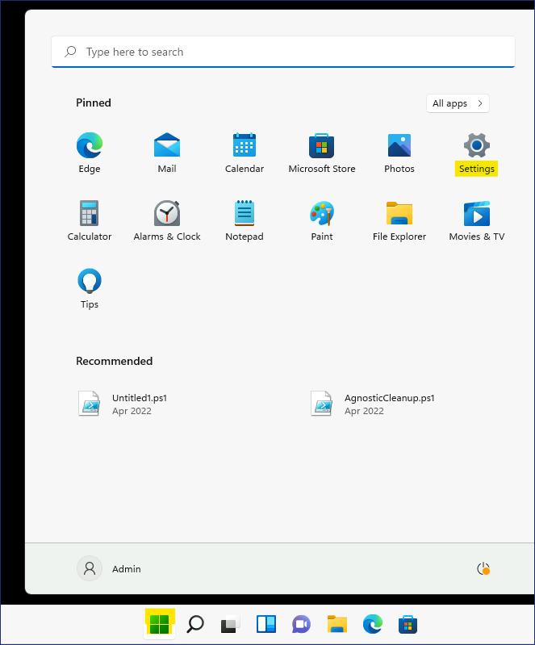
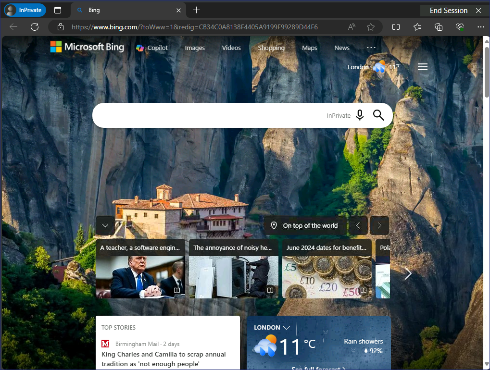

**실습8 - 키오스크 모드를 구성하기 위한 구성 프로필 사용**

**요약**

이 실습에서는 Microsoft Intune을 사용하여 Windows 11 장치에서 단일 앱
키오스크 모드를 실행하기 위한 구성 프로필을 만들고 적용합니다.

**필수 조건**

이 랩을 시작하기 전에 다음 랩을 완료해야 합니다:

- 실습 05 - Microsoft Intune에 장치 등록 관리

참고: Entra ID에 대한 Windows Hello 로그인 인증을 보호하는 데 사용되는
문자 메시지를 수신할 수 있는 휴대폰도 필요합니다.

**연습 1: 구성 프로필 생성 및 적용**

**시나리오**

Contoso 방문자가 인터넷을 탐색할 수 있도록 **SEA-WS2**를 Windows 11
키오스크 형태로 구성해 달라는 요청을 받았습니다. 키오스크가 다음과 같이
구성되어 있는지 확인해야 합니:

- 단일 앱, 전체 화면 키오스크

- 자동 로그인

- Microsoft Edge 브라우저에 액세스할 수 있도록 하며, 공개
  브라우징(InPrivate) 모드로 설정해야 합니다. 홈페이지는
  [**http://bing.com**](http://bing.com)으로 설정해야 합니다.

**작업 1: SEA-WS2를 Microsoft Intune에 등록**

1.  !!**Pa55w.rd**!!라는 비밀번호를 사용하여 관리자 권한으로
    [*SEA-WS2*](https://labclient.labondemand.com/Instructions/e7cc4ae1-e3d9-4c55-accc-696f537e1e17?rc=10)에
    로그인합니다.

2.  타스트바에서 **Start**를 선택한 다음 **Settings**를 선택합니다.

3.  **Settings** 창에서 **Accounts**를 선택합니다.

4.  계정 페이지에서 **Access work or school**를 선택합니다.

5.  **Access work or school**  페이지에서 **Connect**를 선택합니다.

6.  **Microsoft account** 창에서 **Join this device to Microsoft Entra
    ID를** 선택합니다.

7.  **Sign in** 페이지에서 !!**AllanD@M365xXXXXXX.onmicrosoft.com**!!을
    입력하고 **Next**를 선택합니다.

8.  **Enter password** 페이지에서 테넌트 비밀번호 !!**P@55w.rd1234**!!를
    입력한 다음 **Sign in**을 선택합니다.

9.  **Make sure this is your organization** 대화 상자에서 **Join**을
    선택합니다.

10. **You're all set!** 페이지에서 정보를 읽은 다음 **Done을**
    선택합니다.

11. **Access work or school** 섹션에서 **Connected to Contoso's Azure
    AD**이 표시되는지 확인합니다.

12. **Connected to Contoso's Azure AD** 에 연결을 선택한 다음 **Info**를
    선택합니다.

13. 아래로 스크롤하여 **Sync**를 선택합니다. 이렇게 하면 장치가 Intune과
    강제로 동기화됩니다.

14. **Settings** 창을 닫습니다.

**작업 2: Contoso Kiosk 장치 그룹 만들기**

1.  [*SEA-SVR1*](https://labclient.labondemand.com/Instructions/e7cc4ae1-e3d9-4c55-accc-696f537e1e17?rc=10)에서
    **Microsoft Entra admin center**탭으로 전환합니다. **Groups**를
    선택한 후 **All groups**를 클릭합니다.

2.  **Groups | All groups** 페이지에서 **New group**을 선택합니다.

3.  **New Group**  블레이드에서 다음 정보를 입력합니다:

- Group type: **Security**

- Group name: !! Contoso Kiosk Devices!!

- Group description: !!All Windows devices configured as a Kiosk!!

- Membership type: **Assigned**

4.  **Members**에서 **No members selected**를 선택합니다.

5.  **Add members** 블레이드에서 **Search** 상자에 **Sea**를 입력합니다.
    **SEA-WS2** 를 선택한 후 **Select**를 클릭합니다.

6.  **New Group** 블레이드에서 **Create**를 선택합니다.

7.  **Groups | All groups** 블레이드에서 페이지를 새로 고치고 **Contoso
    Kiosk Devices** 그룹이 표시되는지 확인합니다.

**작업 3: 시나리오 요구 사항을 기반으로 구성 프로필 만들기**

1.  Microsoft Intune 관리 센터로 돌아가서 탐색 모음에서 **Devices** 를
    선택합니다.

2.  **Devices | Overview** 페이지에서 아래 이미지와 같이 **Windows**를
    선택합니다.

3.  **Windows | Windows devices** 페이지에서 **Configuration
    profiles**을 찾아 클릭합니다.

4.  **Windows | Configuration profiles** 페이지의 **Policies** 탭에서
    **+ Create**를 클릭하고 **+ New Policy를** 선택합니다.

5.  **Create a profile**블레이드에서 다음 옵션을 선택한 다음
    **Create**를 선택합니다:

- Platform: **Windows 10 and later**

- Profile type: **Templates**

- Template name: !!**Kiosk**!!

6.  **Basics** 블레이드에서 다음 정보를 입력한 후 **Next**를 선택합니다:

- Name: !!Contoso Kiosk Policy!!

- Description: !!Basic settings for Contoso Kiosk Devices.!!

7.  **Configuration settings**  블레이드에서 **Select a kiosk mode**옆의
    **Single app, full-screen kiosk**를 선택합니다.

선택한 모드에 따라 추가 옵션이 표시됩니다.

8.  **Configuration settings** 블레이드에서 다음 옵션을 선택한 후
    **Next** 를 선택합니다:

- User logon type: **Auto logon (Windows 10, version 1803 and later, or
  Windows 11)**

- Application type: **Add Microsoft Edge browser**

- Edge Kiosk URL: !! **http://bing.com**!!

- Microsoft Edge kiosk mode type: **Public Browsing (InPrivate)**

- Refresh browser after idle time: **5**

- Specify Maintenance Window for App Restarts: **Not configured**

> 

9.  **Assignments** 블레이드의 **Included groups**에서 **Add groups을**
    선택합니다.

10. **Select groups to include** 창에서 !!**Contoso Kiosk Devices**!!를
    선택한 다음 **Select**를 클릭합니다.

11. **Assignment** 탭에서 **Next** 버튼을 클릭합니다.

12. **Applicability Rules**탭에서 **Next** 버튼을 클릭합니다.

13. **Review + create** 탭에서 **Create** 버튼을 클릭합니다.

14. 구성 프로필이 나열됩니다.

**작업 4: 구성 프로필이 적용되었는지 확인**

1.  !!**Pa55w.rd**!!라는 비밀번호를 사용하여 **Admin** 권한으로
    [*SEA-WS2*](https://labclient.labondemand.com/Instructions/e7cc4ae1-e3d9-4c55-accc-696f537e1e17?rc=10)에
    로그인합니다.

2.  타스크바에서 **Start**을 선택한 다음 **Settings**를 선택합니다.

3.  **Settings** 창에서 **Accounts**를 선택합니다.

4.  계정 페이지에서 **Access work or school**를 선택합니다.

5.  **Connected to Contoso's Azure AD** 에 연결을 선택한 다음 **Info**를
    선택합니다.

6.  아래로 스크롤하여 **Sync**를 선택하세요. 이렇게 하면 장치가 Intune과
    강제로 동기화됩니다.

7.  **Settings**  창을 닫습니다.

> 

5.  **SEA-WS2**를 다시 시작합니다.

**SEA-WS2**가 자동으로 로그인하고 프로필을 생성합니다. 로그인이 완료되면
InPrivate 브라우징으로 구성된 Microsoft Edge가 표시됩니다. SEA-WS2가
자동으로 로그인되지 않으면 1~7단계를 반복하여 기기에서 정책이 새로
고쳐졌는지 확인하세요..

**결과**: 이 연습을 완료하면 Windows 11 장치를 단일 앱 키오스크로
구성하기 위한 구성 프로필을 성공적으로 만들고 할당하게 됩니다.
