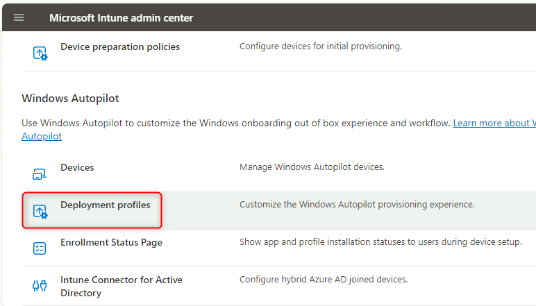
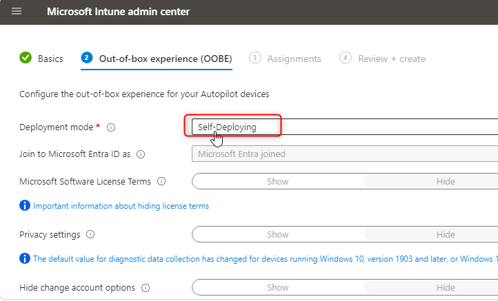
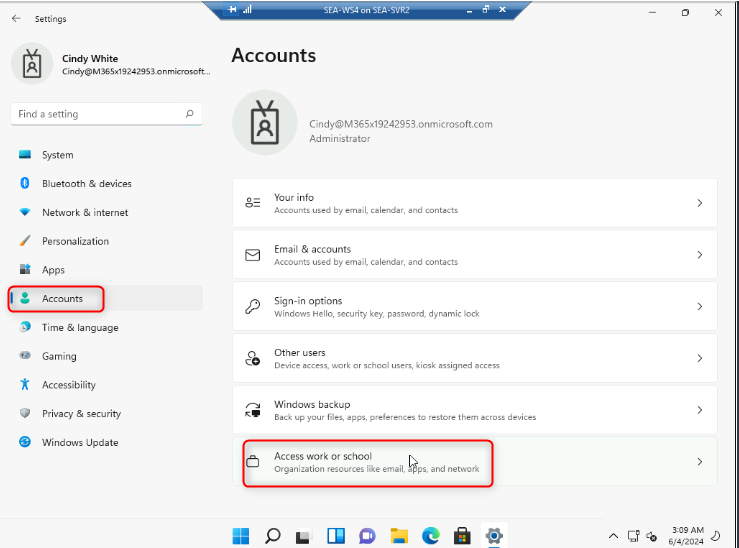
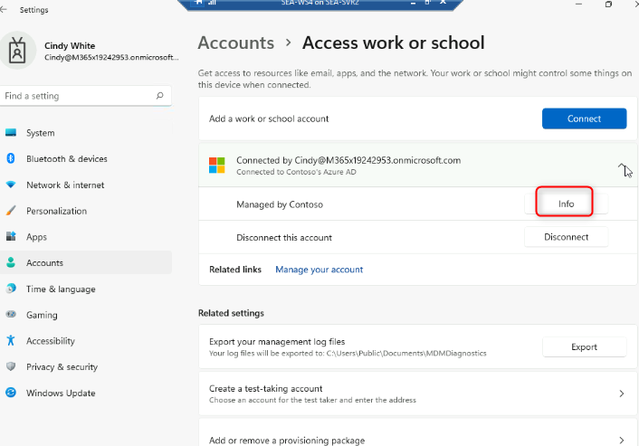

실습 21: 자동 조종 재설정 및 자체 배포 모드로 Windows 새로 고침

**요약**

이 실습에서는 원격 Autopilot 재설정을 수행하는 방법을 알아봅니다.

**필수 조건**

이 실습을 시작하기 전에 다음 실습을 완료해야 합니다:

- 실습 01 - Microsoft Entra ID에서 ID 관리

- 실습 02 - Azure AD Connect를 사용하여 ID 동기화

- 실습 21 - Microsoft 배포 도구 키트를 사용하여 Windows 11 배포

- 실습 20 - Autopilot을 사용하여 Windows 11 배포

**시나리오**

SEA-WS4는 Windows Autopilot을 사용하여 배포되었습니다. Autopilot
재설정과 관련된 다른 프로비저닝 시나리오를 테스트해야 합니다. Windows
Autopilot 자체 배포 모드로 구성된 새 배포 프로필을 생성합니다.

작업 1: 자체 배포 Windows Autopilot 배포 프로필 구성

1.  [***SEA-SVR1***](urn:gd:lg:a:select-vm)로 전환합니다.

> 

2.  **Microsoft Edge**에서 새 탭을 열고
    [**https://intune.microsoft.com**](https://intune.microsoft.com)으로
    이동합니다. 메시지가 표시되면
    [**admin@M365xXXXXXXXX.onmicrosoft.com**](mailto:admin@M365xXXXXXXXX.onmicrosoft.com)및
    비밀번호로 로그인합니다.

3.  **Microsoft Intune admin center**에서 **Devices**를 선택합니다.

> 

4.  **Device onboarding** 섹션에서 **Enrollment**을 선택합니다.

> 

5.  Windows 등록 블레이드의 세부 정보 창에서 **Deployment Profiles**을
    선택합니다.

> 

6.  **Windows AutoPilot deployment profiles** 블레이드에서 **Contoso
    Profile 1** 을 선택한 다음 **Properties**를 선택합니다.

> 
>
> 
>
> 

7.  **Assignments**까지 아래로 스크롤한 다음**Edit**을 선택합니다.

> 

8.  **IT Devices**옆에서 **Remove**를 선택합니다.

> 

9.  **Review and save**을 선택한 다음 **Save**를 선택합니다.

> 

10. **Contoso Profile 1|Properties**  페이지를 닫습니다.

11. **Windows AutoPilot deployment profiles**  블레이드에서 **Create
    profile** 를 선택한 다음 **Windows PC**를 선택합니다.

> 

12. **Basics**탭의 **Name**텍스트 상자에 [**Contoso profile
    2**](urn:gd:lg:a:send-vm-keys)를 입력합니다.

13. **Convert all targeted devices to Autopilot**에서 **No**를 선택한
    후**Next**를 선택합니다.

> 

14. **Out-of-box experience (OOBE)** 탭에서 **Deployment mode** 가
    **Self-Deploying**로 설정되어 있는지 확인합니다.

> 

15. 다음 옵션이 설정되어 있는지 확인하세요:

    - Language (Region): **Operating system default**

    - Automatically configure keyboard: **Yes**

    - Apply device name template: **Yes**

    - Enter a name: [**Contoso-%RAND:2%**](urn:gd:lg:a:send-vm-keys)

> 

16. **Next**를 선택합니다.

17. **Assignments** 탭의 **Included groups**  에서 **Add groups**를
    선택합니다.

> 

18. **IT Devices** 그룹을 선택하고 **Select**.를 클릭합니다. **Next**.를
    선택합니다.

> 
>
> 

19. **Review + create** 블레이드에서 정보를 검토한 다음 **Create**를
    선택합니다.

> 

작업 2: Autopilot 재설정 수행

1.  **Microsoft Intune admin center**에서 **Devices** 를 선택한 다음
    **All devices**를 선택합니다.

2.  Autopilot PC(이름이 DESKTOP으로 시작)를 선택합니다.

> 

3.  메뉴 막대에서 타원을 선택한 다음 **Autopilot Reset**을 선택합니다.

> 

4.  메시지가 나타나면 **Yes**를 선택합니다.

> 

5.  [***SEA-SVR2***](urn:gd:lg:a:select-vm)로 전환하고 **SEA-WS4** 창을
    최대화합니다.

> **참고**: SEA-WS4는 이전 랩에서 실행 중이어야 합니다.
>
> **참고**: 장치를 최신 버전으로 업데이트한 후 "다시 시작"을 클릭합니다.

6.  **SEA-WS4**를 다시 시작합니다.

> 
>
> **참고**: 이 과정은 30분 정도 소요될 수 있으며, 진행 중 여러 번
> 재부팅될 수 있습니다. 이 작업이 완료될 때까지 강사는 다음 모듈을
> 진행할 수 있습니다. 다음 실습 시간에 다시 방문하여 작업 3을 완료해
> 주시기 바랍니다.

작업 3: Autopilot 배포 확인

1.  로그인 페이지에서
    [**Cindy@M365x19242953.onmicrosoft.com**](mailto:Cindy@M365x19242953.onmicrosoft.com)을
    입력하고 비밀번호는 [**P@55w.rd1234**](mailto:P@55w.rd1234)입니다.

2.  **Use Windows Hello with your account** 에서 **OK**를 선택합니다.

> 

3.  **Verify your identity**  페이지에서 문자 인증 방법을 선택합니다.

4.  **Enter code** 페이지에서 모바일 기기로 전송된 문자 코드를 입력하고
    **Verify**를 선택합니다.

> 

5.  PIN 설정 대화 상자에서 **New PIN** 및 **Confirm PIN** 필드에
    [**102938**](urn:gd:lg:a:send-vm-keys)을 입력한 다음 ok를
    선택합니다. 

6.  **All set!** 페이지에서 **OK**를 선택합니다.

7.  **Start**을 선택하고 **Settings**을 선택합니다.

> 

8.  **Accounts**을 선택한 다음 **Access work or school**를 선택합니다.
    장치가 Contoso의 Azure AD에 연결되어 있는지 확인합니다.

> 

9.  **Connected to Contoso's Azure AD** 를 선택하고 **Info**를
    선택합니다.

> 

10. **Managed by Contoso**  페이지에서 아래로 스크롤한 다음 **Sync**를
    선택합니다.

> 

11. **SEA-WS4**에서 **Settings**  창을 닫습니다.

12. **SEA-WS4**를 종료하고 **SEA-WS4** 창을 닫습니다.

13. [***SEA-SVR2***](urn:gd:lg:a:select-vm)에서 Hyper-V 관리자를
    닫습니다.

**결과**: 이 연습을 완료하면 자동 배포 모드를 사용하여 Windows 11 장치에
Autopilot Reset 기능을 프로비저닝하게 됩니다.
