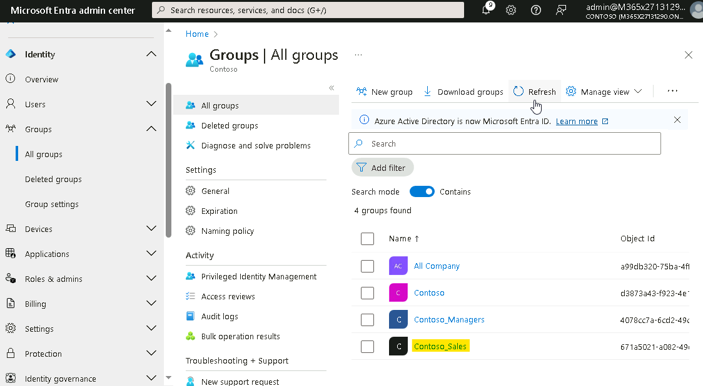
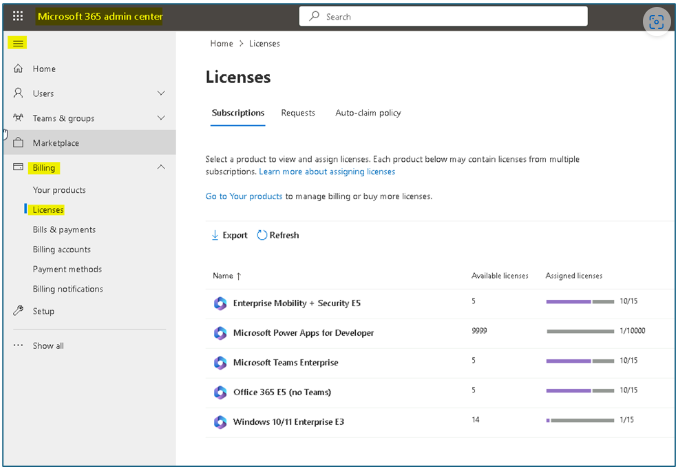
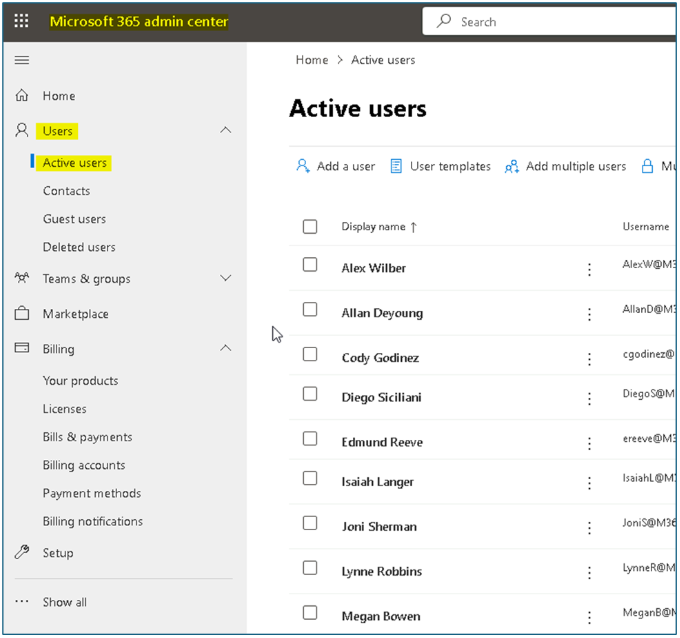
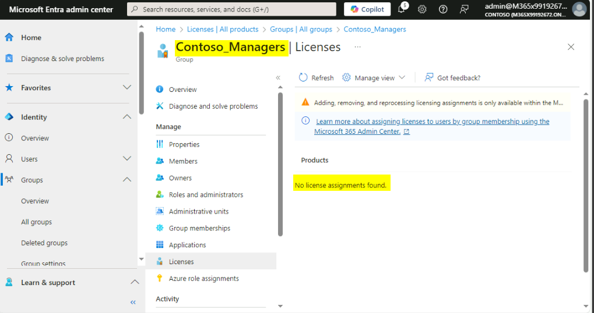
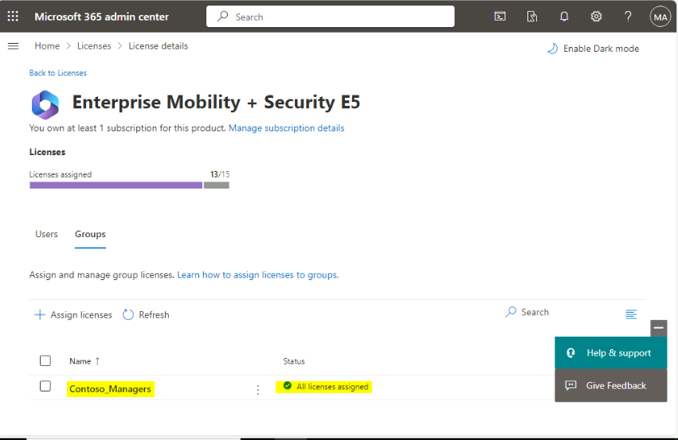

Lab01 - 在 Microsoft Entra ID 中管理身份

**总结**

在本实验中，您将使用 Microsoft Entra
管理中心来创建和修改用户、分配管理角色、创建和修改组，以及在 Microsoft
Entra ID 中管理许可证分配。

练习 1：在 Microsoft Entra ID 中创建用户

**场景**

您需要在 Microsoft Entra ID
中为一些将于下周开始的新员工创建用户帐户。下表列出了新用户：

[TABLE]

**注意：**对于位置，请使用您的本地区域或美国。

您还被告知，在接下来的几个月内将再招聘几名员工。您已经确定脚本编写是添加大量新用户的一种更有效的方法。您已决定创建一个
PowerShell 脚本，并在创建 Cody Godinez 的帐户时对其进行测试。

任务 1：使用 Microsoft Entra 管理中心创建用户

1.  在 [***SEA-SVR1***](urn:gd:lg:a:select-vm)上， 以
     [**Contoso\Administrator**](urn:gd:lg:a:send-vm-keys) 身份登录，密码为
    !\!!。

> 

2.  打开 **Microsoft Edge 浏览器**并导航到

> !\!!

3.  在登录提示符下，输入 Lab 界面的 “主页” 选项卡中的 **Office 365
    租户凭据**。

> 

**注意 –** 如果提升为 MFA，请完成 MFA 登录过程。

4.  在 **Microsoft Entra admin center** 中，展开 “**Identity**”
    ，然后在导航窗格中选择 “**Users**” 。

> 
>
> 记下已作为 Microsoft Entra ID 域成员存在的用户。每个用户都已启用，如
> **Account enabled** 列所示。**On-premises synced enabled**
> （本地同步已启用） 列对所有当前用户显示 **No**
> （否）。这表示每个用户都是直接在 Microsoft Entra ID
> 中创建的，而不是从本地目录服务同步的。
>
> 

5.  在 **Users | All users** 页面上，选择 **New user**
    （新建用户），然后选择 **Create new user** （创建新用户）。

> 

6.  在 **New User** （新建用户） 页面上，确保选中 **Create user**
    （创建用户），输入以下内容：

    - 用户主体名称：!\!!

    - 显示名称：!\!!

    - 取消选中 **Auto-generate password**（自动生成密码）。

    - 密码 **–** !!**P@55w.rd1234**!!

> 

7.  在 **Properties** 选项卡上，提供以下信息，然后单击 **Next
    Assignments**。

    - **职称**，输入!\!!

    - **部门，** 输入!!**H[R](urn:gd:lg:a:send-vm-keys)**!!

    - **使用地点 - United States**

> 

8.  在 Assignments 选项卡上，单击 **Review + create** 按钮。

> 

9.  验证详细信息，然后单击 **Create** 按钮。

> 
>
> 

10. 同样，使用以下详细信息为 Miranda Snider 创建用户帐户。

    - 用户主体名称： !\!!

    - 显示名称：!! [**Miranda Snider**](urn:gd:lg:a:send-vm-keys)!!

    - 取消选中 **Auto-generate password**（自动生成密码）。

    - 密码 **–** !!**P@55w.rd1234**!!

    - 职称 - !!**Helpdesk Manager**!!

    - 部门 **-** !!**Operations**!!

    - 使用地点 **- United States**

11. 选择 **Allan Deyoung** 的用户帐户，然后单击 **Edit properties**
    并使用以下详细信息更新 Job 信息，然后单击 **Save** 按钮。

    - 职称- !\!!

    -  部门 - !\!!

> 

12. 选择 **Joni Sherman** 的用户帐户，然后单击 **Edit properties**
    并使用以下详细信息更新 Job 信息，然后单击 **Save** 按钮。

    - 职称 - !!**ParaLegal**!!

    -  部门 - !!**Legal**!!

> 

13. 选择 **Alex Wilber** 的用户帐户，然后单击 **Edit properties**
    并使用以下详细信息更新 Job 信息，然后单击 **Save** 按钮。

    - 职称 - !!**Marketing Assistant**!!

    -  部门 – !\!!

> 

任务 2：使用 PowerShell 创建用户

1.  在 [***SEA-SVR1***](urn:gd:lg:a:select-vm) 的任务栏上，右键单击
    **Start** 开始，然后选择 **Windows PowerShell（Admin）。**

> 

2.  在 **Windows PowerShell** 窗口中，键入以下命令，然后按
    **Enter**。如果出现提示，请输入!\!!
    在 NuGet 和存储库消息中：

> !!**Install-Module MSOnline**!!
>
> 

3.  在 **Windows PowerShell** 窗口中，键入以下命令，然后按 **Enter**：

> !!**Connect-MsolService**!!
>
> 

4.  在 “**Sign in to your account**” 对话框中，使用 “主页” 选项卡中的
    Office 365 租户凭据登录。

> **注意 –** 如果系统提示您更改 Tenant admin credentials
> 密码，请确保提供更新的密码。

5.  在 **Windows PowerShell** 窗口中，键入以下代码以创建新用户，然后按
    **Enter**。

> 注意 –
> 将以下命令粘贴到记事本中并替换租户详细信息，然后根据需要将命令复制并粘贴到
> Windows PowerShell 中，以确保租户信息正确无误
>
> !!**New-MsolUser -UserPrincipalName
> cgodinez@M365xXXXXXXXX.onmicrosoft.com -DisplayName "Cody Godinez"
> -FirstName "Cody" -LastName "Godinez" -Password ‘P@55w.rd1234’
> -ForceChangePassword $false -UsageLocation "US" -Title "Sales Rep"
> -Department "Sales"**!!
>
> 

6.  在 **Windows PowerShell** 窗口中，键入以下命令以重置 Alew
    Wilber、Allan Deyoung 和 Joni Sherman 的密码

> !!**Get-MsolUser | Where-Object DisplayName -EQ "Alex Wilber" |
> Set-MsolUserPassword -NewPassword P@55w.rd1234 -ForceChangePassword
> $false**!!
>
> !!**Get-MsolUser | Where-Object DisplayName -EQ “Allan Deyoung” |
> Set-MsolUserPassword -NewPassword P@55w.rd1234 -ForceChangePassword
> $false**!!
>
> !!**Get-MsolUser | Where-Object DisplayName -EQ "Joni Sherman" |
> Set-MsolUserPassword -NewPassword P@55w.rd1234 -ForceChangePassword
> $false**!!
>
> 

7.  在 **Windows PowerShell** 窗口中，键入以下命令，然后按 **Enter**：

> !!**Get-MsolUser**!!

8.  验证是否显示了租户中的用户列表。另请记下哪些用户已分配许可证。尚未为
    **isLicensed** 值为 **False** 的任何用户分配许可证。

> 

**结果：**完成本练习后，您将成功在 Microsoft Entra ID
中创建新的用户帐户。

练习 2：在 Microsoft Entra ID 中分配管理角色

**场景**

您需要查看和修改租户的当前管理角色。

您已获得一个用户列表，其中应分配有管理角色，如下表所示。

[TABLE]

任务 1：查看和分配管理角色

1.  在 [***SEA-SVR1***](urn:gd:lg:a:select-vm)上，切换到 **Microsoft
    Edge**。

2.  在**Microsoft Entra admin center**的导航窗格中，展开**Roles &
    admins**。

3.  选择 **Roles & admin** 并搜索 !!**Global administrator**!!
    ，然后单击 Role **Global Administrator**。

> 

4.  单击 **Add assignments**（添加分配）。

> 

5.  在 Add assignments （添加分配） 页面上，选择 **Allan
    Deyoung**，然后选择 **Add** （添加）。

> 

6.  在页面顶部的导航链接中，选择 **Roles and
    administrators**（角色和管理员）。

> 

7.  在 **Roles and administrators** 页面上，搜索并选择 !!**User
    administrator**!!. 确保 **Assignments** （分配） 处于选中状态。

> 
>
> 请注意，当前没有分配给 User administrator 角色的用户。

8.  单击 **+ Add assignments**（添加分配）。

> 

9.  在 Add assignments （添加分配） 页面上，选择 **Edmund Reeve**
    ，然后选择 **Add** （添加）。

> 

10. 单击 **Roles and administrators** 链接，然后搜索并选择 !!**Helpdesk
    administrator**!!。

> 
>
> 
>
> 请注意，当前没有分配给 Helpdesk 管理员角色的用户。

11. 在 **Helpdesk administrator |Assignments** （分配） 页面，选择 **Add
    assignments**（添加分配）。

> 

12. 在 Add assignments （添加分配） 页面上，选择 **Miranda
    Snider**，然后选择 **Add** （添加）。

> 

13. 在页面顶部的导航链接中，选择 **Roles and
    administrators**（角色和管理员）。

> 

**结果：**完成本练习后，您应该已成功为用户分配管理角色。

练习 3：创建和管理组并验证许可证分配。

**场景**

您需要将这三个新用户添加到安全组并分配许可证，如下表所示。

[TABLE]

系统还要求您修改登录页面的公司品牌。

任务 1：使用 Microsoft Entra 管理中心创建组

1.  在 [***SEA-SVR1***](urn:gd:lg:a:select-vm)上，在 **Microsoft Entra
    admin center**
    的导航窗格中，展开“**Identity**”并选择“**Groups**”，然后单击 “**New
    group**”。

> 

2.  在 **New Group** （新建组） 页面上，输入以下内容：

    - 组类型：**Security**

    - 组名：!\!!

    - 成员身份类型：**Assigned**

3.  在 Members 下，单击 **No members selected**。

4.  在 Add members （添加成员） 页面中，添加 **Edmund Reeve** 和
    **Miranda Snider**，然后单击 **Select** （选择）。

> 

5.  选择**Create**。

任务 2：使用 PowerShell 创建组

1.  在 [***SEA-SVR1***](urn:gd:lg:a:select-vm)上，切换到 Windows
    PowerShell。

2.  在 **Windows PowerShell** 窗口中，键入以下代码以创建新组，然后按
    **Enter**：

> !!**New-MsolGroup -DisplayName "Contoso_Sales" -Description "Contoso
> Sales team users"**!!
>
> 

3.  在 **Windows PowerShell** 窗口中，键入以下命令，然后按 **Enter**：

> !!**Get-MsolGroup**!!
>
> 

4.  验证您是否获取了租户中的组列表，包括您刚刚创建的**Contoso_Sales**组。

> 

5.  在 **Windows PowerShell** 窗口中，键入以下代码以将变量定义为
    Contoso_Sales 组，然后按 **Enter**：

> !!**$group = Get-MsolGroup | Where-Object {$\_.DisplayName -eq
> "Contoso_Sales"}**!!

6.  在 **Windows PowerShell**
    窗口中，键入以下代码以将另一个变量定义为用户，然后按 **Enter**：

> !!**$user = Get-MsolUser | Where-Object {$\_.DisplayName -eq "Cody
> Godinez"}**!!

7.  在 **Windows PowerShell** 窗口中，键入以下代码以使用设置变量将 Cody
    添加到 Contoso_Sales，然后按 **Enter**：

> !!**Add-MsolGroupMember -GroupObjectId $group.ObjectId
> -GroupMemberType "User" -GroupMemberObjectId $user.ObjectId**!!

8.  在 **Windows PowerShell** 窗口中，键入以下代码，然后按 **Enter**：

> !! **Get-MsolGroupMember -GroupObjectId $group.ObjectId**!!

9.  验证您是否在命令输出结果中看到 **Cody Godinez**。

> 

10. 关闭 Windows PowerShell。

任务 3：查看许可证并修改公司品牌

1.  在 Microsoft Entra 管理中心的导航窗格中，展开 “**Identity**”
    ，然后展开 “**Billing**” 并选择 “**Licenses**” 。

> https://admin.microsoft.com/Adminportal/Home?referrer=entra#/licenses
>
> 

2.  在 **Licenses** （许可证） 页面的 Subscriptions （订阅）
    下，检查所有可用的许可证。

> 
>
> 注意 - 记下当前为**Enterprise Mobility + Security E5 and Office 365 E5
> (no Teams)** 分配和分配的许可证
>
> 

3.  在 Microsoft 365 管理中心中，在左侧导航窗格中，选择 “**Users**”
    ，然后选择 “**Active users**” 。

> 

4.  在用户列表中，选择 **Cody Godinez**。

> 

5.  在 Cody Godinez 页面上，选择 **Licenses and apps**

> 
>
> 请注意，Cody 当前没有任何许可证分配。

6.  在 “**Licenses and apps**” 页上，选中 “**企业移动性 + 安全性 E5”**
    和**“Office 365 E5（无 Teams）**”旁边的复选框，然后单击“**Save
    changes**”。

> 
>
> 

**注意：**重复步骤 4 到 8，将企业移动性 + 安全性 E5 和 Office 365 E5（无
Teams）许可证分配给 Joni Sherman、Alex Wilber 和 Allan
Deyoung，以防他们未分配许可证。

7.  在 Microsoft Entra 管理中心的导航窗格中，展开 **Identity** 并选择
    **Groups**。

> 

8.  在 “**Groups | All groups**” 页上，选择 **Contoso_Managers**。

> 

9.  在 **Contoso_Managers** 页上，选择 **Licenses**。

> 
>
> **请注意，Contoso_Managers 组当前没有任何许可证分配。**

10. . 导航到 Microsoft 365 管理中心，向下滚动到 “许可证” ，选择
    “**Enterprise Mobility + Security E5**” 。

> 

11. 单击 **Groups** 选项卡，然后单击 **Assign licenses**。

> 

12. 从列表中选择 Contoso_Mangers 然后单击 **Assign**。

13. 在 Microsoft Entra 管理中心的导航窗格中，展开 “**Identity**”
    ，然后展开 “**Billing**” 并选择 “**Licenses**” 。

> 
>
> 

14. 在 **Licenses|Overview** （概述） 页面的 **Manage** （管理）
    下，选择 **All products** （所有产品）。

> 
>
> 

15. 重复相同的过程，并将 Office 365 E5（无
    Teams）许可证分配给Contoso_Managers团队。

> 记下分配了 Office 365 E5（无 Teams）许可证的用户。请注意 Assignment
> Paths 列，该列指示如何为每个用户配置许可证分配。Edmund 和 Miranda
> 都从他们在 Contoso_Managers
> 组中的成员身份接收许可证分配。您可能需要多次选择 **Refresh** （刷新）
> 以更新 Assignment path （分配路径） 列。
>
> 

16. 关闭 Microsoft Edge。

**结果：**完成本练习后，您应该已成功创建和管理组，并分配了许可证。
