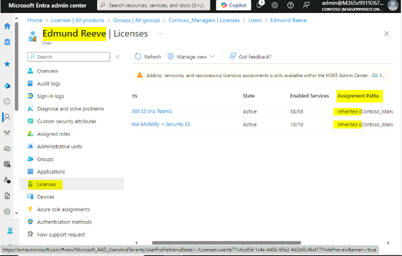

Lab01 - Microsoft Entra ID でのアイデンティティー の管理

**要約**

このラボでは、Microsoft Entra 管理センターを使用して、Microsoft Entra ID
でのユーザーの作成と変更、管理者ロールの割り当て、グループの作成と変更、ライセンス割り当ての管理を行います。

手順 1: Microsoft Entra ID でのユーザーの作成

**シナリオ**

来週から始まる一部の新入社員のために、Microsoft Entra
IDでユーザーアカウントを作成する必要があります。新しいユーザーは次の表にリストされています:

[TABLE]

**注:
場所については、お住まいの地域または米国のいずれかを使用してください。**

今後数ヶ月でさらに数名の従業員が採用される予定であることも伝えられました。多数の新規ユーザーを追加するには、スクリプトを使用する方がはるかに効率的だと判断しました。そこで、PowerShellスクリプトを作成し、Cody
Godinezのアカウント作成時にテストすることにしました。

タスク 1: Microsoft Entra 管理センターを使用してユーザーを作成する

1.  [***SEA-SVR1***](urn:gd:lg:a:select-vm)で,
    [**Contoso\Administrator**](urn:gd:lg:a:send-vm-keys)としてサインインし、パスワードは
    !\!!を使用。

> 

2.  Microsoft Edge ブラウザー**を開き**、次に移動します

> !\!!

3.  サインイン プロンプトで、 ラボ インターフェイスの \[Home\] タブから
    **Office 365 Tenant credentials** を入力します.

> 

**注** – MFA を求められた場合は、MFA サインイン プロセスを完了します.

4.  **Microsoft Entra admin
    center**に、**Identity**を拡張して**、ナビゲーションペーンにUsers**を選択する。

> 
>
> Microsoft Entra
> IDドメインのメンバーとして既に存在するユーザーをメモしてください。各ユーザーは、「**Account
> enabled**」列に示されているとおりに有効化されています。「**On-premise
> sync
> enabled**」列には、現在のすべてのユーザーについて「**No**」と表示されています。これは、各ユーザーが**Microsoft
> Entra
> ID**で直接作成され、オンプレミスのディレクトリサービスから同期されていないことを示しています。
>
> 

5.  On the **Users | All users**ページで**New userを選択してからCreate
    new user**を選択する。

> 

6.  On the **New UserページでCreate
    userが選択されたことを確認し、以下を入力する：**

    - User principal name: !\!!

    - Display Name: !\!!

    - Uncheck **Auto-generate password.**

    - Password **–** !!**P@55w.rd1234**!!

> 

7.  **Properties**タブで以下の情報を入力し**、Next
    Assignments**をクリックする

    - **Job title**, enter !\!!

    - **Department**, enter  !!**H[R](urn:gd:lg:a:send-vm-keys)**!!

    - **Usage location - United States**

> 

8.  Assignmentsタブで**Review + create**ボタンをクリックする**。**

> 

9.  詳細を確認し、\[**Create\]**ボタンをクリックします。

> 
>
> 

10. 同様に、以下の詳細でMiranda Sniderのユーザーアカウントを作成します.

    - User principal name:  !\!!

    - Display Name: !! [**Miranda Snider**](urn:gd:lg:a:send-vm-keys)!!

    - Uncheck **Auto-generate password.**

    - Password **–** !!**P@55w.rd1234**!!

    - Job title - !!**Helpdesk Manager**!!

    - Department **-** !!**Operations**!!

    - Usage location **- United States**

11. **Allan Deyoung**のユーザーアカウントを選択し、**\[Edit
    properties\]**をクリックして
    、以下の詳細でジョブ情報を更新し、\[**Save\]**ボタンをクリックします。

    - Job title- !\!!

    -  Department - !\!!

> 

12. **Joni Sherman**のユーザーアカウントを選択し、\[**Edit
    properties\]**をクリックし
    、以下の詳細でジョブ情報を更新して、\[**Save\]**ボタンをクリックします.

    - Job title- !!**ParaLegal**!!

    -  Department - !!**Legal**!!

> 

13. **Alex Wilber**のユーザーアカウントを選択し、\[**Edit
    properties**\]をクリックし
    、以下の詳細でジョブ情報を更新して、\[**Save**\]ボタンをクリックします。.

    - Job title - !!**Marketing Assistant**!!

    -  Department – !\!!

> 

タスク 2: PowerShell を使用してユーザーを作成する

1.  [***SEA-SVR1***](urn:gd:lg:a:select-vm)で、タスクバーで**Startを右クリックし、Windows
    PowerShell (Admin)**を選択する。

> 

2.  **Windows
    PowerShell**ウィンドウで、以下のコマンドを入力し、Enterキーを押します。プロンプトが表示されたら、NuGetとリポジトリのメッセージに「!!Y!!」と入力します:

> !!**Install-Module MSOnline**!!
>
> 

3.  In the **Windows
    PowerShellウィンドに以下のコマンドを入力してEnter**をクリックする。

> !!**Connect-MsolService**!!
>
> 

4.  \[**Sign in to your account**\] ダイアログ ボックスで、\[Home\]
    タブから Office 365 Tenant credentialsを使用してサインインします.

> **注意 – Tenant admin
> credentialsのパスワードを変更するように求められた場合は、更新されたパスワードを入力してください.**

5.  **Windows PowerShell**
    ウィンドウで、次のコードを入力して新しいユーザーを作成し、**Enter**
    キーを押します.

> 注:
> 以下のコマンドをメモ帳に貼り付け、テナントの詳細を置き換えてから、テナント情報が正しいことを確認する必要がある場合は、コマンドをコピーして
> Windows PowerShell に貼り付けます。
>
> !!**New-MsolUser -UserPrincipalName
> cgodinez@M365xXXXXXXXX.onmicrosoft.com -DisplayName "Cody Godinez"
> -FirstName "Cody" -LastName "Godinez" -Password ‘P@55w.rd1234’
> -ForceChangePassword $false -UsageLocation "US" -Title "Sales Rep"
> -Department "Sales"**!!
>
> 

6.  **Windows PowerShell**ウィンドウで、次のコマンドを入力して、Alew
    Wilber、Allan Deyoung、Joni Shermanのパスワードをリセットします。

> !!**Get-MsolUser | Where-Object DisplayName -EQ "Alex Wilber" |
> Set-MsolUserPassword -NewPassword P@55w.rd1234 -ForceChangePassword
> $false**!!
>
> !!**Get-MsolUser | Where-Object DisplayName -EQ “Allan Deyoung” |
> Set-MsolUserPassword -NewPassword P@55w.rd1234 -ForceChangePassword
> $false**!!
>
> !!**Get-MsolUser | Where-Object DisplayName -EQ "Joni Sherman" |
> Set-MsolUserPassword -NewPassword P@55w.rd1234 -ForceChangePassword
> $false**!!
>
> 

7.  **Windows PowerShell** ウィンドウで、次のコマンドを入力し、**Enter**
    キーを押します:

> !!**Get-MsolUser**!!

1.  テナントのユーザーの一覧が表示されていることを確認します。また、ライセンスが割り当てられているユーザーにも注意する。**isLicensed**
    値が **False** のユーザーには、ライセンスが割り当てられていません。

> 

**結果**: この手順を完了すると、Microsoft Entra ID で新しいユーザー
アカウントが正常に作成されました。

手順 2: Microsoft Entra ID での管理者ロールの割り当て

**シナリオ**

テナントの現在の管理者ロールを確認して変更する必要があります。

次の表に示すように、管理者ロールを割り当てる必要があるユーザーのリストが提供されています。

[TABLE]

タスク 1: 管理者ロールの確認と割り当て

1.  ***SEA-SVR1*** [で](urn:gd:lg:a:select-vm) Microsoft Edge
    に切り替えます**。**

2.  **Microsoft Entra admin centerに**、ナビゲーションウィンドに**Roles
    & admins**を拡張する**。**

3.  Select **Roles & adminを選択して**!!**Global
    administrator**!!を検索し、**Global
    Administrator**のRoleをクリックする。

> 

4.  **Add assignments**をクリックする。

> 

5.  Add assignmentsページで**Allan
    Deyoung**を選択してから**Add**を選択する。

> 

6.  ページの一番上に、ナビゲーションリンクに**Roles and
    administrators**を選択する**。**

> 

7.  **Roles and administratorsページで** !!**User
    administrator**!!を検索して選択する。**Assignments**が選択されていることを確認する。

> 
>
> 現在、ユーザー管理者ロールに割り当てられているユーザーはいないことに注意する

8.  + **Add assignments**を追加する。

> 

9.  Add assignmentsページで**Edmund
    Reeve**を選択してから**Add**を選択する。

> 

10. **Roles and administrators**リンクをクリックして !!**Helpdesk
    administrator**!!を検索して選択する。

> 
>
> 
>
> 現在、ヘルプデスク管理者ロールに割り当てられているユーザーはいないことに注意する。

11. **Helpdesk administrator | AssignmentsページでAdd
    assignments**を選択する。

> 

12. Add assignmentsページで**Miranda
    Snider**を選択してから**Add**を選択する。

> 

13. ページの一番上に、ナビゲーションリンクに**Roles and
    administrators**を選択する。

> 

**結果**:
この手順を完了すると、管理者ロールがユーザーに正常に割り当てられましたはずです。

手順 3: グループの作成と管理、およびライセンス割り当ての検証。

**シナリオ**

次の表に示すように、3 人の新しいユーザーをセキュリティ
グループに追加し、ライセンスを割り当てる必要があります.

[TABLE]

また、サインイン ページの会社のブランドを変更するように求められました。

タスク 1: Microsoft Entra 管理センターを使用してグループを作成する

1.  On [***SEA-SVR1***](urn:gd:lg:a:select-vm)で、**Microsoft Entra
    admin
    center**のナビゲーションペンに**Identity**を拡張して**Groups**を選択し**、New
    groupをクリックする。**

> 

2.  **New Group**ページに次を入力する:

    - Group type: **Security**

    - Group name: !\!!

    - Membership type: **Assigned**

3.  Membersのしたに**No members selected**をクリックする。

4.  In the Add membersページに**Edmund Reeve**, **Miranda
    Snider**を追加して**Select**をクリックする。

> 

5.  **Create**を選択する

タスク 2: PowerShell を使用してグループを作成する

1.  On [***SEA-SVR1***](urn:gd:lg:a:select-vm)で、Windows
    PowerShellに切り替える。

2.  **Windows
    PowerShell**ウィンドに以下のコードを入力して、新しいグループを柵瀬氏してから**Enter**を押す：

> !!**New-MsolGroup -DisplayName "Contoso_Sales" -Description "Contoso
> Sales team users"**!!
>
> 

3.  In the **Windows
    PowerShell**ウィンドに以下のコマンドを入力して**、Enter**を押す:

> !!**Get-MsolGroup**!!
>
> 

4.  作成した**Contoso_Sales**グループを含む、テナント内のグループの一覧を取得していることを確認します
    。

> 

5.  In the **Windows
    PowerShellウィンドに以下のコードを入力して、変数を**Contoso_Sales
    groupとして変数を定義してから**Enter**を押す:

> !!**$group = Get-MsolGroup | Where-Object {$\_.DisplayName -eq
> "Contoso_Sales"}**!!

6.  In the **Windows
    PowerShellウィンドに以下のコードを入力して、ユーザとして他の変数を定義して、Enterを入力する**:

> !!**$user = Get-MsolUser | Where-Object {$\_.DisplayName -eq "Cody
> Godinez"}**!!

7.  In the **Windows
    PowerShell**ウィンドに以下のコードを入力して、設定された変数を使用してCody
    to Contoso_Sales を追加し、**Enter**を押す:

> !!**Add-MsolGroupMember -GroupObjectId $group.ObjectId
> -GroupMemberType "User" -GroupMemberObjectId $user.ObjectId**!!

8.  In the **Windows
    PowerShell**ウィンドに以下のコードを入力して、**Enter**を押す:

> !! **Get-MsolGroupMember -GroupObjectId $group.ObjectId**!!

9.  コマンドアウトプット結果に**Cody
    Godinez**を表示することを確認する**。**

10. Windows PowerShellをクローズする

タスク 3: ライセンスのレビュー、会社のブランドを変更する

1.  In the Microsoft Entra
    adminセンターに、ナビゲーションペンに**Identity**を拡張してから**Billing**を拡張し、**Licenses**をせんたくする。

> https://admin.microsoft.com/Adminportal/Home?referrer=entra#/licenses
>
> 

2.  \[**License\]** ページの \[**Subscription**\]
    で、使用可能なすべてのライセンスを確認します。

> 
>
> 注 - **Enterprise Mobility + Security E5 と Office 365 E5** (Teams
> なし) で使用可能で割り当てられている現在のライセンスに注意してください
> )
>
> 

3.  Microsoft 365 管理センターで、左側のナビゲーション ウィンドウで
    \[**Users**\] を選択し 、\[**Active users**\] を選択します.

> 

4.  ユーザーリストに**Cody Godinez**をせんたくする。

> 

5.  Cody Godinezページに**Licenses and apps**を選択する。

> 
>
> Codyには現在ライセンスの割り当てがないことに注意する。

6.  **Licenses and appsページで** **Enterprise Mobility + Security
    E5**と**Office 365 E5 (no
    Teams)** の横のチェックボックスをオンして、**Save
    changes**をクリックする。

> 
>
> 

**注**: Joni Sherman、Alex Wilber、Allan Deyoung
にライセンスが割り当てられていない場合は、手順 4 ～ 8
を繰り返して、Enterprise Mobility + Security E5 および Office 365 E5
(Teams なし) のライセンスを割り当てます。

7.  In the Microsoft Entra admin
    centerに、ナビゲーションウィンドウで**Identity**を拡張して**Groups**を選択する。

> 

8.  **Groups | All groupsページでContoso_Managers**を選択する。

> 

9.  **Contoso_ManagersページでLicenses**を選択する。

> 
>
> **Contoso_Managers
> グループには現在ライセンスの割り当てがないことに注意する**

10. Microsoft 365 admin
    centerに移動してlicensesにスクロールダウンし、**Enterprise
    Mobility + Security E5**を選択する。

> 

11. **Groups**タブにクリックして**Assign licenses**をクリックする。

> 

12. リストからContoso_Mangersを選択して**Assign**をクリックする。

13. In the Microsoft Entra admin
    centerに、ナビゲーションウィンドウでで**Identity**を拡張してから**Billingを拡張し、Licenses**を選択する。

> 
>
> 

14. **Licenses|Overview**ページで**Manage**の下にある**All
    products**を選択する。

> 
>
> 

15. 同じプロセスを繰り返し、Office 365 E5 (Teams なし)
    ライセンスをContoso_Managersチームに割り当てます。

> Office 365
> E5（Teamsなし）ライセンスが割り当てられているユーザーをメモする。「Assignment
> Paths」列には、各ユーザーのライセンス割り当てがどのように構成されているかが表示されます。EdmundとMirandaはどちらも、Contoso_Managersグループのメンバーシップからライセンス割り当てを受けています。「Assignment
> path
> 」列を更新するには、「Refresh」を数回クリックする必要があるかもしれません。
>
> 

16. Microsoft Edgeをクローズする。

**結果**:
この手順を完了すると、グループの作成と管理、およびライセンスの割り当てが正常に完了しました。
