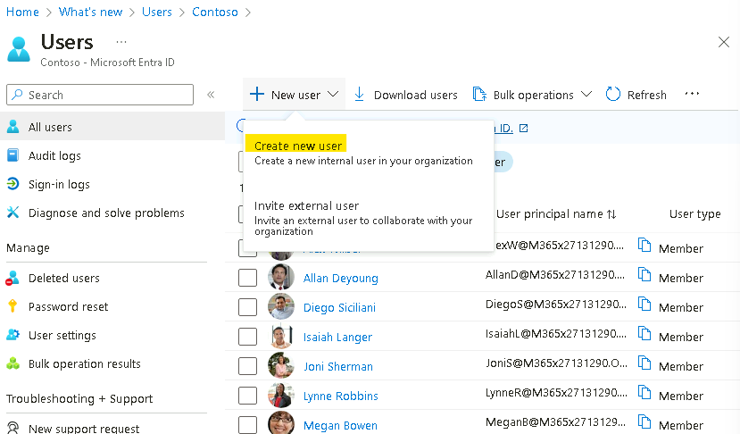
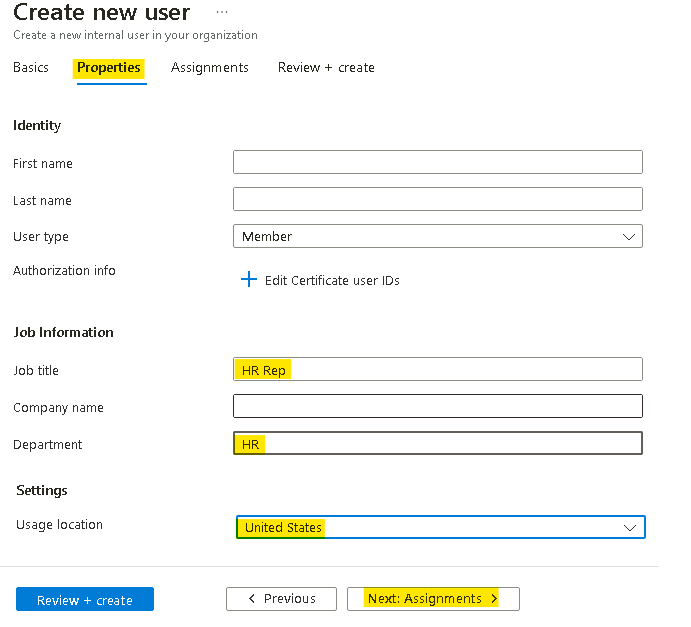
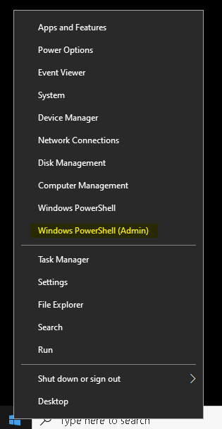
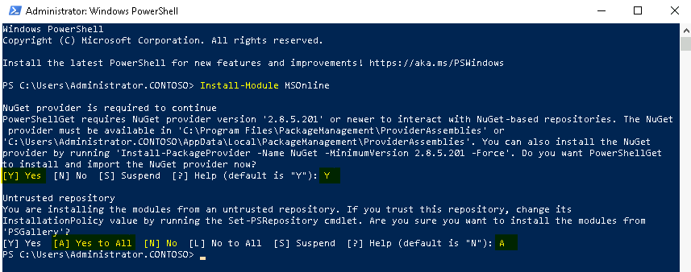
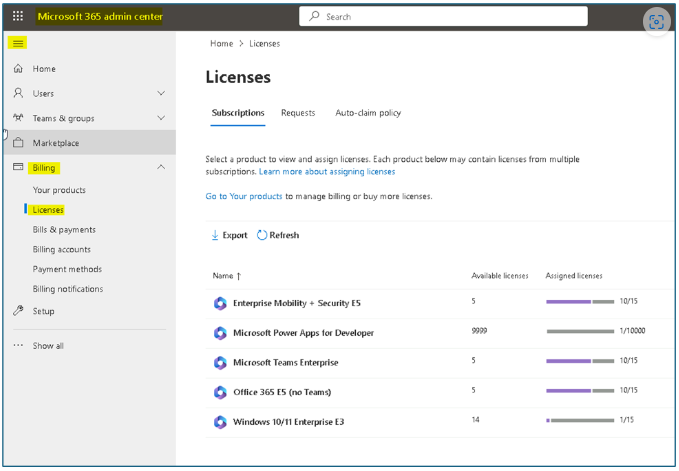
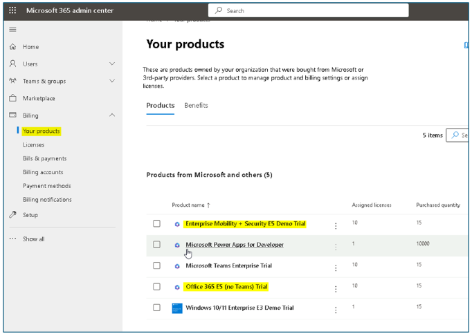
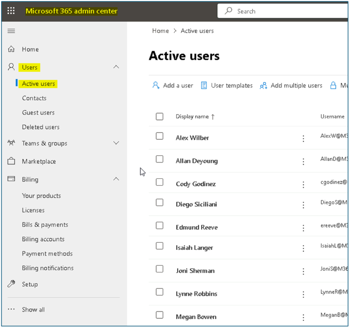
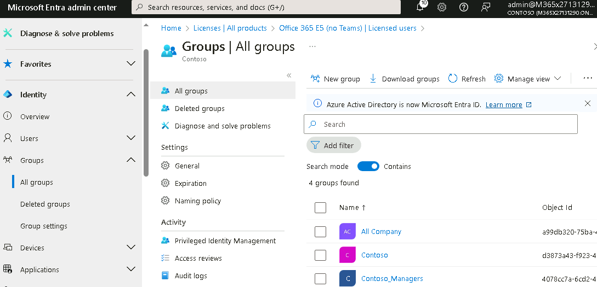
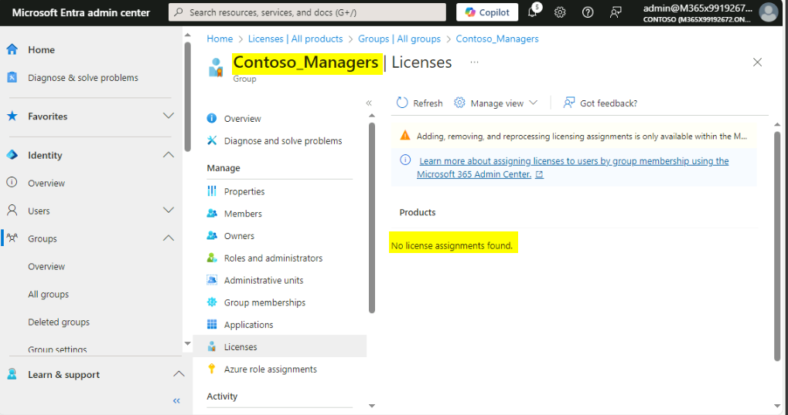

Atelier01 - Gestion des identités dans Microsoft Entra ID

**Résumé**

Dans cet atelier, vous allez utiliser le Microsoft Entra admin center
pour créer et modifier des utilisateurs, attribuer des rôles
administratifs, créer et modifier des groupes et gérer les attributions
de licences dans Microsoft Entra ID.

Exercice 1 : Création d'utilisateurs dans Microsoft Entra ID

**Scénario**

Vous devez créer des comptes d'utilisateur dans Microsoft Entra ID pour
certains nouveaux employés qui commenceront la semaine prochaine. Les
nouveaux utilisateurs sont répertoriés dans le tableau suivant :

[TABLE]

**Remarque** : Pour l'emplacement, utilisez votre région locale ou les
États-Unis.

On vous a également dit que plusieurs autres employés seront embauchés
au cours des deux prochains mois. Vous avez décidé que l'utilisation de
scripts serait une méthode beaucoup plus efficace pour ajouter un grand
nombre de nouveaux utilisateurs. Vous avez décidé de créer un script
PowerShell et de le tester lors de la création du compte de Cody
Godinez.

Tâche 1 : Créer des utilisateurs à l'aide de Microsoft Entra admin
center

1.  Sur [***SEA-SVR1***](urn:gd:lg:a:select-vm), connectez-vous en tant
    que [**Contoso\Administrator**](urn:gd:lg:a:send-vm-keys) avec le
    mot de passe !! [**Pa55w.rd**](urn:gd:lg:a:send-vm-keys) !!.

> 

2.  Ouvrez le **Microsoft Edge Browser** et accédez à

> !\ !!

3.  Au prompt de connexion, entrez les **Office 365 Tenant credentials**
    à partir de l'onglet Accueil de l'interface d’atelier.

> 

**Remarque** – Si vous êtes invité à utiliser l'authentification
multifacteur, completer le processus de connexion à l'authentification
multifacteur.

4.  Dans le **Microsoft Entra admin center**, développez **Identity**
    et, dans le volet de navigation, sélectionnez **Users**.

> 
>
> Prenez note des utilisateurs qui existent déjà en tant que membres du
> domaine Microsoft Entra ID. Chaque utilisateur est activé comme
> indiqué dans la colonne **Account enabled** . La colonne **On-premises
> synced** **enabled** indique **No** pour tous les utilisateurs
> actuels. Cela indique que chaque utilisateur a été créé directement
> dans Microsoft Entra ID et qu'il n'a pas été synchronisé à partir d'un
> service d'annuaire local.
>
> 

5.  Sur le menu **Users | All users** , sélectionnez **New users**, puis
    sélectionnez **Create new user**.

> 

6.  Sur la page **New users**, assurez-vous que l' option **Create
    user** est sélectionnée, entrez ce qui suit :

    - Nom de l'utilisateur principal
      :!\!!

    - Nom d'affichage : !\
      !!

    - Décochez la case **Auto-generate password.**

    - Mot de passe **–** !!**P@55w.rd1234** !!

> 

7.  Dans l' onglet **Properties**, fournissez les informations
    ci-dessous, puis cliquez sur **Next Assignments**

    - **Job title,**, entrez !\ !!

    - **Department**, entrez !!**H**[**R**](urn:gd:lg:a:send-vm-keys) !!

    - **Usage location - United States**

> 

8.  Dans l'onglet Missions, cliquez sur le bouton **Review + create**

> 

9.  Vérifiez les détails, puis cliquez sur le bouton **Create**.

> 
>
> 

10. De même, créez le compte utilisateur pour Miranda Snider avec les
    détails ci-dessous.

    - Nom de l'utilisateur principal :
      !\!!

    - Nom d'affichage : !! [**Miranda
      Snider**](urn:gd:lg:a:send-vm-keys) !!

    - Décochez la case **Auto-generate password.**

    - Mot de passe **–** !!**P@55w.rd1234** !!

    - Titre du poste - !!**Helpdesk Manager**!!

    - Département **-** !!**Opérations** !!

    - Lieu d'utilisation **- United States**

11. Sélectionnez le compte utilisateur d'**Allan Deyoung** et cliquez
    sur **Edit properties** et mettre à jour les informations du Job
    avec les détails ci-dessous, puis cliquez sur le bouton **Save**.

    - Titre du poste- !! [**IT Admin**](urn:gd:lg:a:send-vm-keys)!!

    - Département - !\ !!

> 

12. Sélectionnez le compte utilisateur de **Joni Sherman** et cliquez
    sur **Edit properties** et mettre à jour les informations du Job
    avec les détails ci-dessous, puis cliquez sur le bouton **save**.

    - Titre du poste- !!**ParaLegal** !!

    - Département - !!**Legal** !!

> 

13. Sélectionnez le compte utilisateur d'**Alex Wilber** et cliquez sur
    **Edit properties** et mettre à jour les informations du travail
    avec les détails ci-dessous, puis cliquez sur le bouton **Save.**

    - Titre du poste - !!**Assistant Marketing** !!

    - Département – !! [**marketing**](urn:gd:lg:a:send-vm-keys) !!

> 

Tâche 2 : Créer des utilisateurs à l'aide de PowerShell

1.  Sur [***SEA-SVR1***](urn:gd:lg:a:select-vm), dans la barre des
    tâches, cliquez avec le bouton droit sur **Start**, puis
    sélectionnez **Windows PowerShell (Admin).**

> 

2.  Dans la fenêtre **Windows PowerShell**, tapez la commande suivante,
    puis appuyez sur **Entrer**. Si vous y êtes invité, entrez
    !\!! dans les messages NuGet et de
    messages de référentiel :

> !!**Install-Module MSOnline** !!
>
> 

3.  Dans la fenêtr**e Windows PowerShell**, tapez la commande suivante,
    puis appuyez sur **Enter**:

> !!**Connect-MsolService** !!
>
> 

4.  Dans la boîte de dialogue **Sign in to your account** ,
    connectez-vous à l'aide des informations d'identification du Office
    365 Tenant à partir de l'onglet Accueil.

> **Remarque – Si vous avez été invité à modifier le mot de passe des
> informations d'identification de Tenant admin, assurez-vous de fournir
> le mot de passe mis à jour.**

5.  Dans la fenêtre **Windows PowerShell**, tapez le code suivant pour
    créer un utilisateur, puis appuyez sur **Enter**.

> Remarque – collez la commande ci-dessous dans le bloc-notes et
> remplacez-la par les détails du tenant , puis copiez et collez la
> commande dans Windows PowerShell, si nécessaire pour vous assurer que
> les informations du tenant sont correctes
>
> !! **New-MsolUser -UserPrincipalName
> cgodinez@M365xXXXXXXXX.onmicrosoft.com -DisplayName "Cody Godinez"
> -FirstName "Cody" -LastName "Godinez" -Password ‘P@55w.rd1234’
> -ForceChangePassword $false -UsageLocation "US" -Title "Sales Rep"
> -Department "Sales"**!!
>
> 

6.  Dans la fenêtre **Windows PowerShell**, tapez la commande suivante
    pour réinitialiser les mots de passe d'Alew Wilber, Allan Deyoung et
    Joni Sherman

> !!**Get-MsolUser | Where-Object DisplayName -EQ "Alex Wilber" |
> Set-MsolUserPassword -NewPassword P@55w.rd1234 -ForceChangePassword
> $false**!!
>
> !!**Get-MsolUser | Where-Object DisplayName -EQ “Allan Deyoung” |
> Set-MsolUserPassword -NewPassword P@55w.rd1234 -ForceChangePassword
> $false**!!
>
> !!**Get-MsolUser | Where-Object DisplayName -EQ "Joni Sherman" |
> Set-MsolUserPassword -NewPassword P@55w.rd1234 -ForceChangePassword
> $false**!!
>
> 

7.  Dans la **f**enêtre **Windows PowerShell**, tapez la commande
    suivante, puis appuyez sur **Enter** :

> !!**Get-MsolUser** !!

8.  Vérifiez que la liste des utilisateurs de votre locataire est
    affichée. Notez également quels utilisateurs ont une licence
    attribuée. Aucun utilisateur dont la valeur **isLicensed** est
    **False** n'a pas reçu de licence.

> 

**Résultats** : Une fois cet exercice terminé, vous aurez créé de
nouveaux comptes d'utilisateur dans Microsoft Entra ID.

Exercice 2 : Attribution de rôles administratifs dans Microsoft Entra ID

**Scénario**

Vous devez examiner et modifier les rôles administratifs actuels de
votre tenant.

Vous avez reçu une liste d'utilisateurs auxquels des rôles
d'administration doivent être attribués, comme indiqué dans le tableau
suivant.

[TABLE]

Tâche 1 : Examiner et attribuer des rôles d'administration

1.  Sur [***SEA-SVR1***](urn:gd:lg:a:select-vm), basculez vers
    **Microsoft Edge**.

2.  Dans le **Microsoft Entra admin center**, dans le volet de
    navigation, développez **Roles & admins**

3.  Sélectionnez **Roles & admins** et recherchez !!**Global
    administrator** !! et cliquez sur le rôle **Global Administrator**.

> 

4.  Cliquez sur **Add assignments**

> 

5.  Sur la page Ajouter des attributions, sélectionnez **Allan
    Deyoung**, puis **Add.**

> 

6.  En haut de la page, dans le lien de navigation, sélectionnez **Roles
    and administrators**.

> 

7.  Sur la page **Rôles et administrateurs**, recherchez et sélectionnez
    !!**User administrator** !!. Assurez-vous que **assignments** est
    sélectionnée.

> 
>
> Notez qu'aucun utilisateur n'est actuellement affecté au rôle
> d'administrateur d'utilisateurs.

8.  Cliquez sur + **Add assignments**.

> 

9.  Sur la page Ajouter des attributions, sélectionnez **Edmund Reeve**,
    puis **Add**.

> 

10. Cliquez sur le lien **Roles and administrators** puis recherchez et
    sélectionnez !!**Helpdesk administrator** !!.

> 
>
> 
>
> Notez qu'aucun utilisateur n'est actuellement affecté au rôle
> d'administrateur du support technique.

11. Sur les pages **Helpdesk administrator | Assignments**  sélectionnez
    **Add assignments**..

> 

12. Sur la page Ajouter des attributions, sélectionnez **Miranda
    Snider**, puis **Add.**

> 

13. En haut de la page, dans le lien de navigation, sélectionnez **Roles
    and administrators**.

> 

**Résultats** : Une fois cet exercice terminé, vous devez avoir attribué
des rôles d'administration aux utilisateurs.

Exercice 3 : Création et gestion de groupes et validation de
l'attribution des licences.

**Scénario**

Vous devez ajouter les trois nouveaux utilisateurs à un groupe de
sécurité et attribuer des licences comme indiqué dans le tableau
suivant.

[TABLE]

Vous avez également été invité à modifier l'image de marque de
l'entreprise pour la page de connexion.

Tâche 1 : Créer des groupes à l'aide de Microsoft Entra admin center

1.  Sur [***SEA-SVR1***](urn:gd:lg:a:select-vm), dans le **Microsoft
    Entra admin center**, dans le volet de navigation, développez
    **Identity** et sélectionnez **Groups** , puis cliquez sur **New
    group.**

> 

2.  Sur la page **New group**, entrez ce qui suit :

    - Type de groupe : **Sécurity**

    - Nom du groupe
      :!\!!

    - Type d'adhésion : **Assigned**

3.  Sous Membres, cliquez sur **No members selected.**

4.  Dans la page Ajouter des membres, ajoutez **Edmund Reeve**,
    **Miranda Snider**, puis cliquez sur **Select**.

> 

5.  Sélectionnez **Create**.

Tâche 2 : Créer des groupes à l'aide de PowerShell

1.  Sur [***SEA-SVR1***](urn:gd:lg:a:select-vm), basculez vers Windows
    PowerShell.

2.  Dans la fenêtre **Windows PowerShell**, tapez le code suivant pour
    créer un groupe, puis appuyez sur **Enter** :

> !! **New-MsolGroup -DisplayName "Contoso_Sales" -Description "Contoso
> Sales team users"**!!
>
> !!
>
> 

3.  Dans la fenêtre **Windows PowerShell**, tapez la commande suivante,
    puis appuyez sur **Enter** :

> !!**Get-MsolGroup** !!
>
> 

4.  Vérifiez que vous obtenez la liste des groupes de votre tenant, y
    compris le groupe de **Contoso_Sales** que vous venez de créer.

> 

5.  Dans la fenêtre **Windows PowerShell**, tapez le code suivant pour
    définir une variable en tant que groupe Contoso_Sales, puis appuyez
    sur **Enter** :

> !!**$group = Get-MsolGroup | Where-Object {$\_.DisplayName -eq
> "Contoso_Sales"}**!!

6.  Dans la fenêtre **Windows PowerShell**, tapez le code suivant pour
    définir une autre variable en tant qu'utilisateur, puis appuyez sur
    **Enter** :

> !!**$user = Get-MsolUser | Where-Object {$\_.DisplayName -eq "Cody
> Godinez"}**!!

7.  Dans la fenêtre **Windows PowerShell**, tapez le code suivant pour
    ajouter Cody à Contoso_Sales à l'aide de variables définies, puis
    appuyez sur **Enter** :

> !! **Add-MsolGroupMember -GroupObjectId $group.ObjectId
> -GroupMemberType "User" -GroupMemberObjectId $user.ObjectId**!!

8.  Dans la fenêtre **Windows PowerShell**, tapez le code suivant, puis
    appuyez sur **Enter** :

> !! **Get-MsolGroupMember -GroupObjectId $group. ObjectId** !!

9.  Vérifiez que vous voyez **Cody Godinez** dans le résultat de sortie
    de la commande.

> 

10. Fermez Windows PowerShell.

Tâche 3 : Examiner les licences et modifier l'image de marque de
l'entreprise

1.  Dans le the Microsoft Entra admin center , dans le volet de
    navigation, développez **Identity**, puis **Billing** et
    sélectionnez **Licences**.

> https://admin.microsoft.com/Adminportal/Home?referrer=entra#/licenses
>
> 

2.  Sur la page **Licences**, sous Abonnements, recherchez toutes les
    licences disponibles.

> 
>
> Remarque - Prenez note des licences actuellement disponibles et
> attribuées pour **Enterprise Mobility + Security E5** et **Office 365
> E5 (No Teams)**
>
> 

3.  Dans le Microsoft Entra admin center, dans le volet de navigation de
    gauche, sélectionnez **Users**, puis **active users**.

> 

4.  Dans la liste des utilisateurs, sélectionnez **Cody Godinez**.

> 

5.  Sur la page Cody Godinez, sélectionnez **Licences and apps**

> 
>
> Notez que Cody n'a pas d'attribution de licence en cours.

6.  Sur la page **Licences and apps**, cochez la case en regard de
    **Enterprise Mobility + Security E5** et **Office 365 E5 (noTeams)**
    et cliquez sur **Save changes**.

> 
>
> 

**Remarque** : Répétez les étapes 4 à 8 pour attribuer les licences
Enterprise Mobility + Security E5 et Office 365 E5 (no Teams) à Joni
Sherman, Alex Wilber et Allan Deyoung au cas où les licences ne leur
seraient pas attribuées.

7.  Dans le Microsoft Entra admin center, dans le volet de navigation,
    développez **Identity** et sélectionnez **Groups**.

> 

8.  Sur les **groups | All groups**, sélectionnez **Contoso_Managers**.

> 

9.  Sur la page **Contoso_Managers**, sélectionnez **Licences**.

> 
>
> **Notez que le groupe Contoso_Managers n'a pas d'attributions de
> licence en cours.**

10. . Accédez dans le Microsoft 365 admin center et faites défiler
    jusqu'à Licences, sélectionnez **Enterprise Mobility + Security
    E5.**

> 

11. Cliquez sur l' onglet **Groups**, puis sur **Assign licenses**

> 

12. Sélectionnez Contoso_Mangers dans la liste et cliquez sur
    **Assign.**

13. Dans le Microsoft Entra admin center, dans le volet de navigation,
    développez **Identity**, puis **Billing** et sélectionnez
    **Licences**.

> 
>
> 

14. Sur les pages **Licenses|Overview** , sous **Manage**, sélectionnez
    **All products**.

> 
>
> 

15. Répétez le même processus et attribuez une licence Office 365 E5 (no
    Teams) à Contoso_Managers team.

> Prenez note des utilisateurs auxquels la licence Office 365 E5 (no
> Teams) est attribuée. Notez la colonne Chemins d'attribution qui
> indique comment l'attribution de licence est configurée pour chaque
> utilisateur. Edmund et Miranda reçoivent tous deux leur licence de
> leur appartenance au groupe Contoso_Managers. Vous devrez peut-être
> sélectionner **Refresh** plusieurs fois pour mettre à jour la colonne
> Chemin d'affectation.
>
> 

16. Fermez Microsoft Edge.

**Résultats** : Une fois cet exercice terminé, vous devez avoir créé et
géré des groupes, ainsi que attribué des licences.
