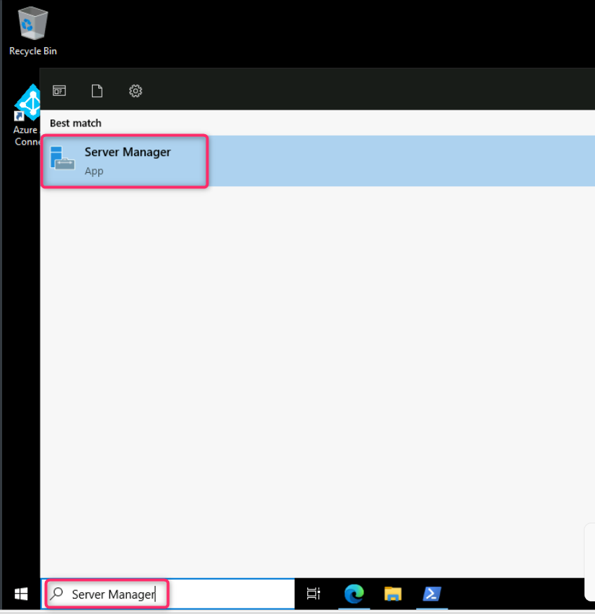
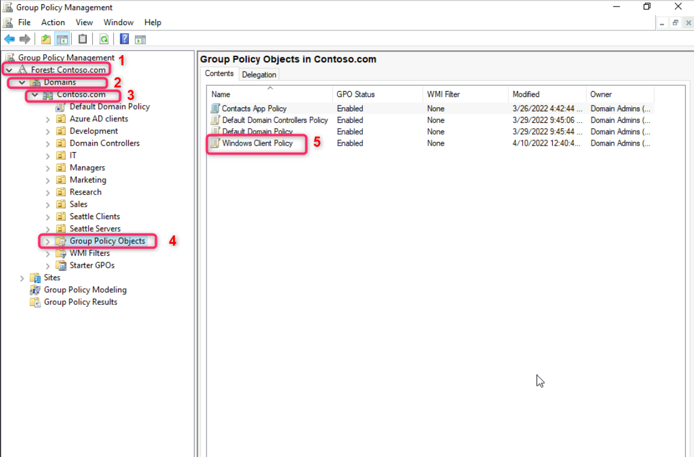
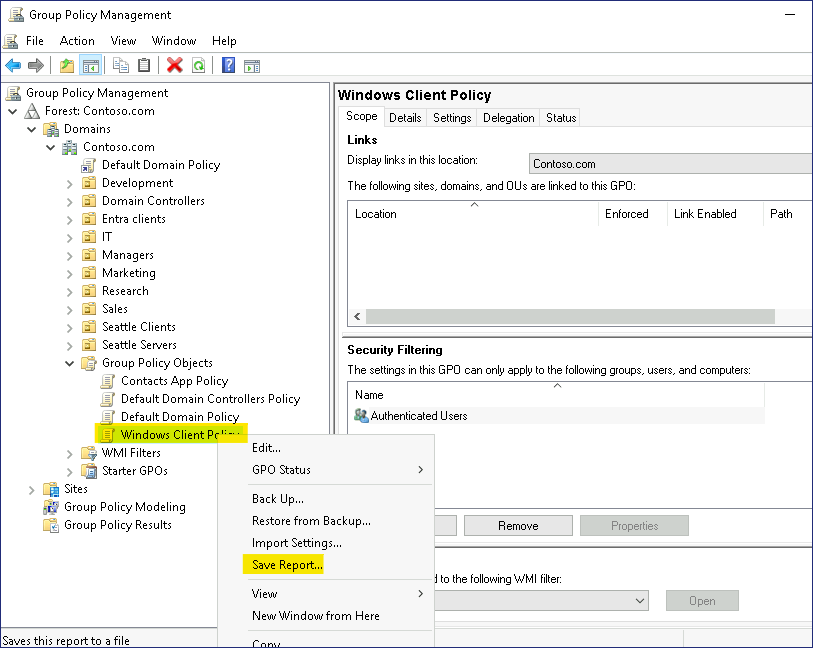
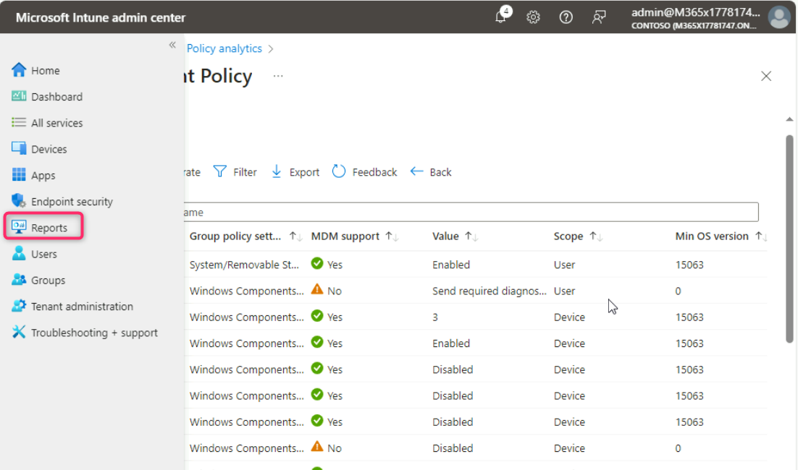

**实验 10 - 使用组策略分析验证 Microsoft Intune 中的 GPO 支持**

**总结**

在本实验中，您将使用组策略分析导入 Active Directory 组策略对象 （GPO）
并确定支持等效 Microsoft Intune MDM 策略的设置。

**场景**

Contoso 传统上使用 Active Directory GPO
在整个域中部署计算机和用户策略设置。您计划将所有受支持的 GPO 设置移动到
Microsoft Intune 配置文件。您有一个名为 **Windows Client Policy** 的
GPO。您需要使用组策略分析来验证 Windows 客户端策略 GPO
中的设置，并确定哪些设置可以成功迁移到 Intune。

**任务 1：将 Windows 客户端策略 GPO 导出到 XML 文件**

1.  使用提供的凭据搜索栏登录  ，键入 !!**Server
    Manager**!!，然后选择它。

> 

2.  在 **Server Manager - Dashboard** 中，选择 **Tools** ，然后选择
    **Group Policy Management**。

> 

3.  在组策略管理控制台中，依次展开
    **Forest:Contoso.com**、**Domains**、**Contoso.com**，然后选择
    **Group Policy Objects**。

> 验证是否列出了多个组策略对象。

4.  在详细信息窗格中，选择 **Windows Client Policy** GPO。

> 

5.  右键单击 **Windows Client Policy**，然后选择 **Save Report**。

> 

6.  在 “保存 GPO 报告” 对话框中，选择 “**Documents**”，将 “**Save as
    type**” 更改为 “**XML file**”，然后选择 “**Save**”。

> 

7.  关闭组策略管理控制台。

8.  关闭 Server Manager。

**任务 2：使用组策略分析分析 Windows 客户端 GPO**

1.  打开 Microsoft Edge，键入
    !!**https://intune.microsoft.com**!!，然后按 **Enter**。

2.  如果出现提示，请使用 Office 365 租户凭据登录。

3.  在 **Microsoft Intune 管理中心**，导航并选择“**Devices**”。

> 

4.  导航到 **Manage devices** 部分，然后选择 **Group Policy
    analytics**。

> 

5.  在 **Devices | Group Policy analytics**
    边栏选项卡中，选择“**Import**”。

> 

6.  在 **GPO file upload** 选项卡上，单击旁边的文件夹 **Select a file**
    搜索栏 如下图所示。

> 

7.  在 **Open** 框中，选择 **Documents**，然后选择 **Windows Client
    Policy.xml**。然后，点击 **Open** 按钮。

> 

8.  点击 **Next** 按钮。

> 

9.  在 **Scope tags** 中，单击 **Next** 按钮。

> 

10. 在 **Review + create** 选项卡中，单击 **Create** 按钮。

> 

11. Windows 客户端策略 GPO 会立即导入和分析。关闭 **Import GPO files**
    （导入 GPO 文件） 页面。

12. 在 **Devices | Group Policy analytics** 边栏选项卡中，查看
    “**Windows Client Policy**” 旁边的信息。

> 请注意，89% 的设置都支持 MDM。
>
> 

13. 在 MDM Support （MDM 支持） 下，选择 **89%**。

> 请注意每个受支持设置的每个**设置名称、MDM 支持、CSP 名称**和 **CSP
> 映射**。记下哪些设置没有等效的 CSP 映射。
>
> 

14. 关闭 **Windows Client Policy** 窗口。

**任务 3：查看组策略分析摘要报告**

1.  在 **Microsoft Intune 管理中心**导航菜单中，选择 “**Reports**”。

> 

2.  在 **Reports** （报告） 页面的 **Device management** （设备管理）
    部分中，选择 **Group Policy analytics** （组策略分析）。

> 

3.  在详细信息窗格中的 **Summary** （摘要） 下，选择 **Refresh**
    （刷新）。您可能需要刷新几次

> 刷新和构建摘要报告可能需要 5-10 分钟。

4.  查看 **Group policy migration readiness** 信息。

> 
>
> 应该有许多策略可供迁移，并且有许多策略不受支持。

5.  选择 **Reports** （报告） 选项卡，然后选择 **Group policy migration
    readiness** （组策略迁移就绪情况）。

> 

6.  选择 **Generate report**（生成报告）。

> 

7.  组策略迁移就绪情况报告提供与每个设置相关的信息，以及支持的配置文件类型。

> 

8.  关闭 **Group policy migration readiness** （组策略迁移就绪） 窗口。

**结果：**完成本练习后，您将成功导出 GPO 并使用组策略分析来验证 Intune
中的等效策略设置。
