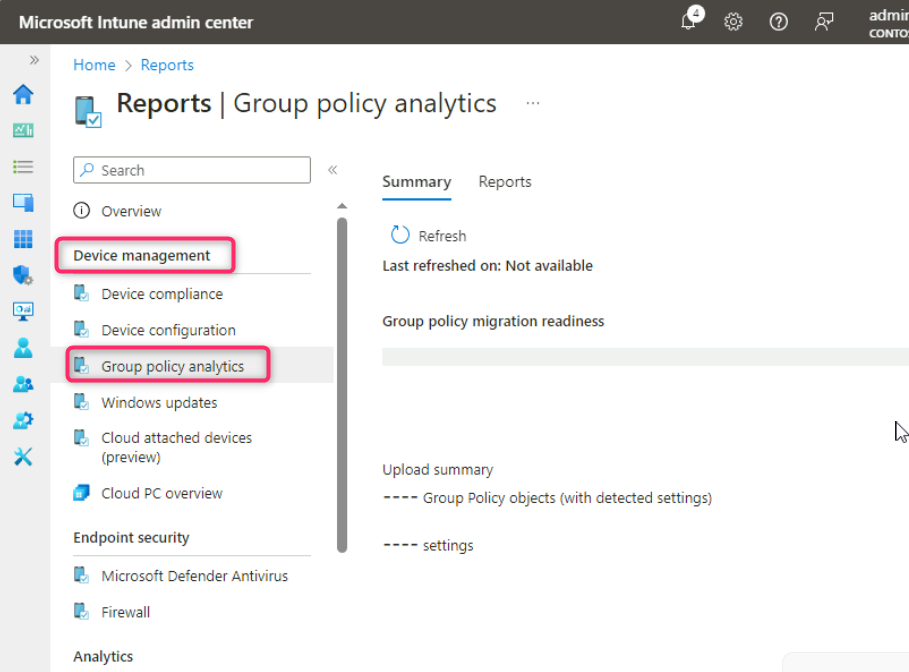

**Atelier 10 - Utilisation de l'analyse de la politique du groupe pour
valider la prise en charge des GPO dans Microsoft Intune**

**Résumé**

Dans cet atelier, vous allez utiliser l'analyse de la politique du
groupe pour importer la poliique d’un objet de groupe (GPO) Active
Directory et identifier les paramètres qui prennent en charge la
politique MDM Microsoft Intune équivalente.

**Scénario**

Contoso utilise traditionnellement les GPO Active Directory pour
déployer des paramètres de politique d'ordinateur et d'utilisateur dans
l'ensemble du domaine. Vous prévoyez de déplacer tous les paramètres GPO
pris en charge vers les profils de configuration Microsoft Intune. Vous
disposez la politique de groupe nommé **Windows Client Policy**. Vous
devez utiliser Group Policy Analytics pour valider les paramètres de la
politique client Windows GPO et identifier les paramètres qui peuvent
être migrés avec succès vers Intune.

**Tâche 1 : Exporter a politique du client de windows GPO dans un
fichier XML**

1.  Connectez-vous à avec la barre de recherche d'identifiants fournie,
    tapez !! **Server Manager**!! puis sélectionnez-le.

> 

2.  Dans **server manager - dashboard**, sélectionnez **Outils**, puis
    sélectionnez **Group Policy Management**.

> 

3.  Dans la console de gestion de la politique du groupe, développez
    **Forest:Contoso.com**, puis **Domaines**, puis **Contoso.com**,
    puis sélectionnez **Group Policy Objects**.

> Vérifiez que plusieurs objets de la politique du groupe sont
> répertoriés.

4.  Dans le volet d'informations, sélectionnez **Windows Client
    Policy** GPO.

> 

5.  Cliquez avec le bouton droit sur **Windows Client Policy**, puis
    sélectionnez **Save report**.

> 

6.  Dans la boîte de dialogue Enregistrer le rapport GPO, sélectionnez
    **Documents**, remplacez le **type Enregistrer sous** par **XML
    file**, puis sélectionnez **Save**.

> 

7.  Fermez la console de gestion de la politique du groupe.

8.  Fermez le Gestionnaire de serveur.

**Tâche 2 : Analyser le client Windows à l'aide de Group Policy
Analytics**

1\. Ouvrez Microsoft Edge, tapez !!**https://intune.microsoft.com** !!
dans la barre d'adresse, puis appuyez sur **Enter**.

1.  Connectez-vous avec les informations d'identification de Office 365
    Tenant si vous y êtes invité.

2.  Dans le **Microsoft Intune admin center**, naviguez et sélectionnez
    **Devices**.

> 

3.  Accédez à la section **Manage devices** et sélectionnez **Group
    Policy analytics**

> 

4.  Sur le panneau **Devices | Group Policy analytics** , sélectionnez
    **Import**.

> 

5.  Dans l'onglet Téléchargement de **fichiers GPO**, cliquez sur le
    dossier à côté de **elect a file** dans la une barre de recherche,
    comme indiqué dans l'image ci-dessous.

> 

6.  Dans la zone **Ouvrir**, sélectionnez **Documents**, puis
    sélectionnez **Windows Client Policy.xml**.. Ensuite, cliquez sur le
    bouton **Open**.

> 

7.  Cliquez sur le bouton **Nextt**.

> 

8.  Dans les **balises Scope,** cliquez sur le bouton **Next**.

> 

9.  Dans l' onglet **Review + create**, cliquez sur le bouton
    **Create**.

> 

10. 11\. La politique client Windows GPO est immédiatement importée et
    analysée. Fermez la **page Importer des fichiers GPO**.

11. Sur le pannau **Devices | Group Policy analytics**  passez en revue
    les informations en regard de **Windows Client Policy**.

> Notez que 89 % des paramètres prennent en charge la gestion des
> appareils mobiles.
>
> 

12. Sous Prise en charge MDM, sélectionnez **89 %.**

> Notez chaque **nom de paramètre**, **prise en charge MDM**, **nom
> CSP** et mappage **CSP** pour chaque paramètre pris en charge. Notez
> les paramètres qui n'ont pas de mappage CSP équivalent.
>
> 

13. Fermez la fenêtre **Windows Client Policy** 

**Tâche 3 : Examiner le rapport récapitulatif d'analyse de la politique
du groupe**

1.  Dans le menu de navigation du **Microsoft Intune admin center**,
    sélectionnez **Raports**.

> 

2.  Sur la page **Raports**, dans la section **Device management** 
    sélectionnez select **Group Policy analytics**..

> 

3.  Dans le volet de détails, sous **Résumé**, sélectionnez **Refresh**
    Vous devrez peut-être actualiser plusieurs fois

> L'actualisation et la création du rapport de synthèse peuvent prendre
> 5 à 10 minutes.

4.  Consultez les informations sur l'**état de préparation à la
    migration de la politique du groupe**.

> 
>
> Il doit y avoir un certain nombre de politiques prêtes pour la
> migration et un certain nombre de politiques non soutenues.

5.  Sélectionnez l' onglet **Raports**, puis Préparation **à la
    migration de la politique du groupe**.

> 

6.  Sélectionnez **Generate report**.

> 

7.  Le rapport de préparation à la migration de la politique du groupe
    fournit des informations relatives à chaque paramètre et au type de
    profil pris en charge.

> 

8.  Fermez la fenêtre **Préparation à la migration de** **la politique
    du groupe**.

**Résultats** : Après avoir terminé cet exercice, vous aurez exporté un
GPO et utilisé avec succès Group Policy Analytics pour valider les
paramètres de politique équivalents dans Intune.
