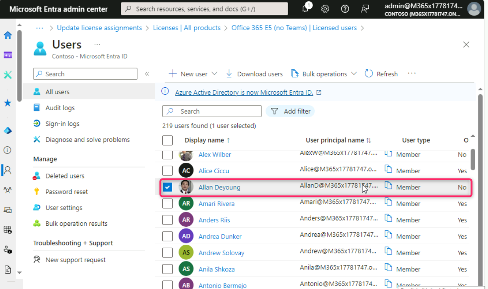
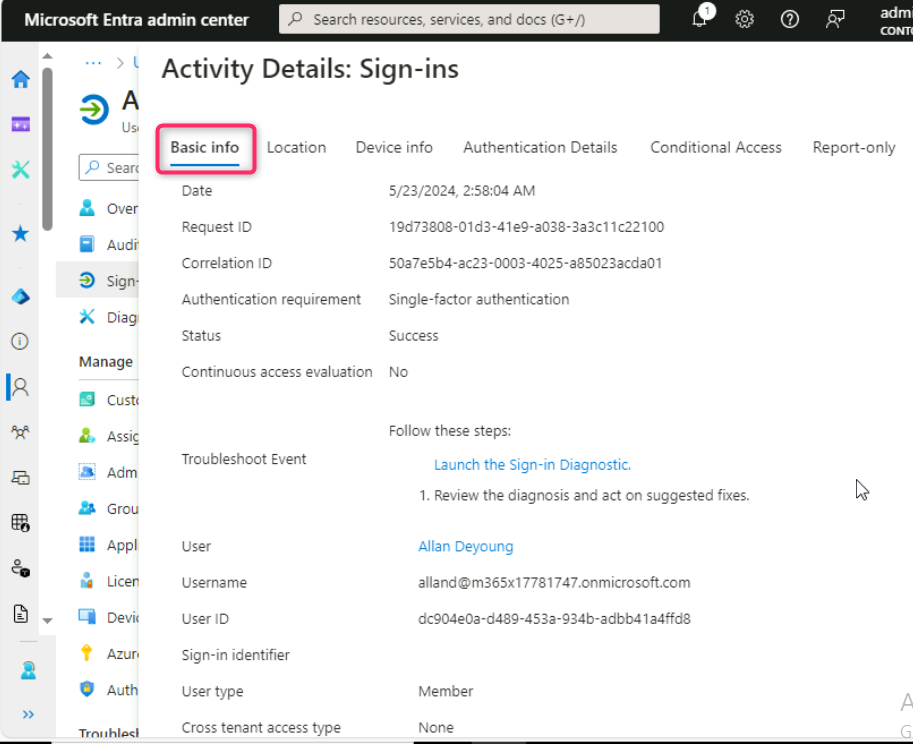
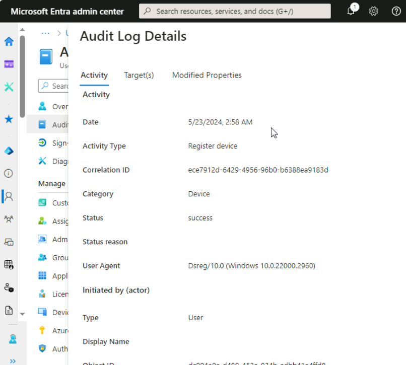
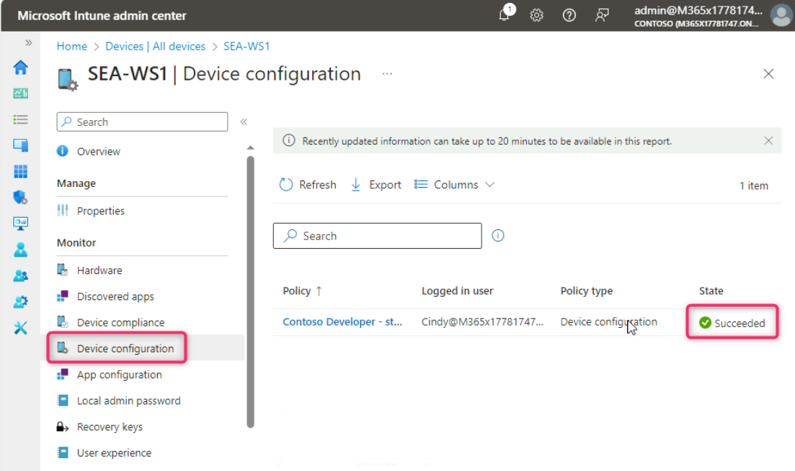

**Laboratorio 11- Supervise el dispositivo y la actividad del usuario en
Intune**

**Resumen**

En este laboratorio, va a supervisar el user Sign-in activity, Audit
logs, y device activity.

**Prerrequisitos**

Se debe completar los siguientes laboratorios antes de este laboratorio:

- Laboratorio \#1-Gestionar Identities en Microsoft Entra ID

- Laboratorio \#2-Sincronizar Identities mediante Microsoft Entra
  Connect

- Laboratorio \#5-Manage Device Enrollment into Microsoft Intune

- Laboratorio \#6-Inscripción de dispositivos en Microsoft Intune

- Laboratorio \#7-Crear e implementar los Configuration Profiles

**Ojo**: También necesita un celular que puede recibir mensajes de texto
para asegurar la autenticación del inicio de sesión de Windows Hello a
Microsoft Entra ID.

**Escenario**

Tiene que revisar el sign-in activity de Cindy White y la información
general proporcionado por Audit logs. También necesita verficar el
hardware
en [*SEA-WS1*](https://labclient.labondemand.com/Instructions/e7cc4ae1-e3d9-4c55-accc-696f537e1e17?rc=10) y
confirmar si se ha aplicado correctamente el configuration profile
asignado a este dispositivo.

**Tarea 1: Supervise el user activity**

1.  Cambie a
    *[SEA-SVR1](https://labclient.labondemand.com/Instructions/e7cc4ae1-e3d9-4c55-accc-696f537e1e17?rc=10)*
    e inicie sesión con las creenciales proporcionadas si es necesario.

2.  En la página **Microsoft Entra admin center**, navegue y seleccione
    **Users**, y haga clic en **All users**.

> 

3.  En la página **Users**, navegue y seleccione **Allan Deyoung**.

> 

4.  En el User page de **Allan Deyoung**, navegue y haga clic en
    **Sign-in logs**.

> 

5.  En la página **Allan Deyoung | Sign-in logs**, haga clic en la
    primera entrada en la pestaña **User sign-ins (interactive)**.

> 

6.  Seleccione cada una de las páginas principales, incluyendo **Basic
    info**, **Location**, **Device info**, **Authentication Details**,
    y **Conditional Access**. Baje y examine la información en cada
    página. Después de revisar la información proporcionada en cada
    página, cierre el panel.

> 
>
> 
>
> 
>
> 
>
> 

7.  En el panel de Users navigation, seleccione **Audit logs**.

8.  En el panel details, se ve audit information sobre los cambios
    administrativos a usuarios. Examine la información al seleccionar
    varias entradas.

> 
>
> 

**Tarea 2: Supervise el device activity**

1.  Cambie a la ventana **Microsoft Intune admin center**, navegue y
    haga clic en **Devices**.

2.  En el panel de navegación Devices, seleccione **Overview**.

> 

3.  Baje y revise lo siguiente:

- Configuration policy assignment failures

- Noncompliant devices.

- Deployment status per Windows update ring.

> 

4.  Baje hasta la sección **Manage devices** y haga clic en
    **Configuration**. Revise los detalles de configuración.

> 

5.  Suba en la página y seleccione **All devices**. En la página
    **Devices | All devices**, se ve la información de los dispositivos
    como Device name, Managed by, Ownership, Compliance, OS, y OS
    version. Haga clic en **SEA-WS1**.

> 

6.  En el panel de navegación SEA-WS1, seleccione **Hardware** y examine
    el hardware inventory.

> 

7.  En el panel de navegación SEA-WS1, seleccione **Discovered apps** y
    examine el app inventory.

> 

8.  En el panel de navegación SEA-WS1, seleccione **Device
    configuration** y en el details pane tome nota de Device
    configuration profiles asignados a este dispositivo. La
    columna **State** debe mostrar **Succeeded**, lo que significa que
    se aplicaron los perfiles al dispositivo exitosamente.

> 

9.  En la página **SEA-WS1 | Device configuration**, haga clic en
    **Contoso Developer – standard**.

> 

10. En el **Contoso Developer – standard** blade, tome nota de cada
    configuración en el perfil.

> El **State** debe mostrar **Succeeded** junto a cada configuración.
>
> 

**Resultados**: Después de completar este ejercicio, habrá supervisado
el user Sign-in activity, Audit logs, y device activity.
