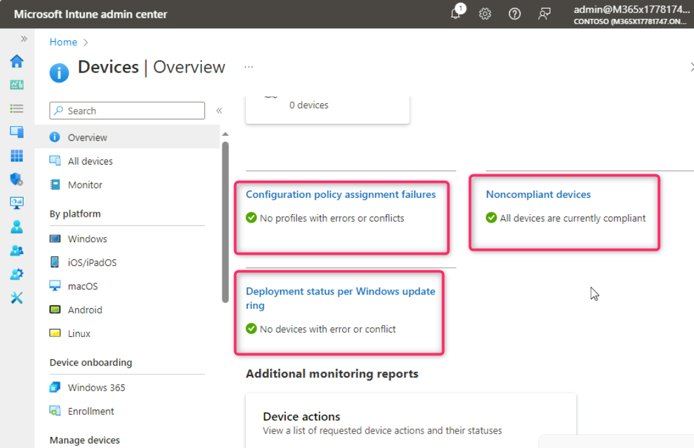
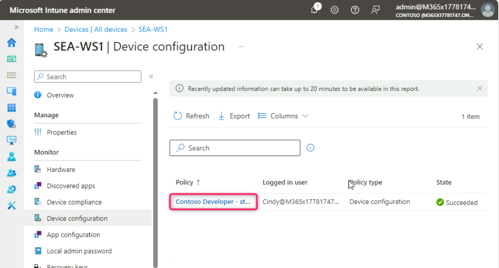

**Atelier 11 - Surveiller l'activité de l'appareil et de l'utilisateur
dans Intune**

**Résumé**

Dans cet atelier, vous allez surveiller l'activité de connexion de
l'utilisateur, les journaux d'audit et l'activité de l'appareil.

**Conditions préalables**

Le(s) Ateliers suivant(s) doit(vent) être completé(s) avant cet atelier:

- Atelier \#1-Gestion des identités dans Microsoft Entra ID

- Atelier \#2 : Synchronisation des identités à l'aide de Microsoft
  Entra Connect

- Atelier \#5 : Gérer l'inscription d'un appareil dans Microsoft Intune

- Atelier \#6-Inscription d'appareils dans Microsoft Intune

- Atelier \#7-Création et déploiement de profils de configuration

**Remarque** : Vous aurez également besoin d'un téléphone mobile capable
de recevoir des SMS utilisés pour sécuriser l'authentification de
connexion Windows Hello à Microsoft Entra ID.

**Scénario**

Vous devez consulter l'activité de connexion de Cindy White et les
informations générales fournies par les journaux d'audit. Vous devez
également vérifier le composant sur
[*SEA-WS1*](https://labclient.labondemand.com/Instructions/e7cc4ae1-e3d9-4c55-accc-696f537e1e17?rc=10)
et confirmer que le profil de configuration attribué à ce périphérique
est correctement appliqué.

**Tâche 1 : Surveiller l'activité des utilisateurs**

1.  Passez à
    *[SEA-SVR1](https://labclient.labondemand.com/Instructions/e7cc4ae1-e3d9-4c55-accc-696f537e1e17?rc=10)*
    et connectez-vous avec les informations d'identification fournies si
    nécessaire.

2.  Sur la page **Microsoft Entra admin center**  naviguez et
    sélectionnez **Users**, puis cliquez sur **all users**.

> 

3.  Dans la page **Users**, naviguez et sélectionnez **Allan Deyoung**.

> 

4.  Sur la page Utilisateur **d'Allan Deyoung**, naviguez et cliquez sur
    **Sign-in logs**

> 

5.  Dans **Allan Deyoung | Sign-in logs** cliquez sur la première entrée
    sous l' onglet **User sign-ins (interactive**).

> 

6.  Sélectionnez chacune des pages principales, y compris les
    **informations de base**, **l'emplacement**, **les informations sur
    l'appareil**, **les détails d'authentification** et l**'accès
    conditionnel**. Faites défiler vers le bas et examinez les
    informations sur chaque page. Après avoir examiné attentivement les
    informations fournies dans chaque page, fermez le volet.

> 
>
> 
>
> 
>
> 
>
> 

7.  Dans le volet de navigation Utilisateurs, sélectionnez **Audit
    logs**.

8.  Dans le volet d'informations, des informations d'audit sur les
    modifications administratives apportées aux utilisateurs
    s'affichent. Examinez les informations en sélectionnant les
    différentes entrées.

> 
>
> 

**Tâche 2 : Surveiller l'activité de l'appareil**

1.  Basculez vers la fenêtre **Microsoft Intune admin center** naviguez
    et cliquez sur **Devices**.

2.  Dans le volet de navigation Appareils, sélectionnez **Aperçu**

> 

3.  Faites défiler vers le bas et passez en revue les points suivants :

- Échecs d'attribution des politique de configuration

- Appareils non conformes.

- État du déploiement par anneau de mise à jour Windows.

> 

4.  Faites défiler jusqu'à la **Manage devices** et cliquez sur
    **Configuration**. Vérifiez les détails de la configuration.

> 

5.  Faites défiler l'écran vers le haut et sélectionnez **All devices**.
    Dans la section **Devices | All devices**, des informations sur les
    appareils, telles que le nom de l'appareil, Géré par, Propriété,
    Conformité, Système d'exploitation et Version du système
    d'exploitation sont affichées. Cliquez sur **SEA-WS1**.

> 

6.  Dans le volet de navigation SEA-WS1, sélectionnez **Hardware** et
    examinez l'inventaire matériel.

> 

7.  Dans le volet de navigation SEA-WS1, sélectionnez **Discovered
    apps** et examinez l'inventaire des applications.

> 

8.  Dans le volet de navigation SEA-WS1, sélectionnez **Device
    configuration**  et, dans le volet d'informations, notez les profils
    de configuration de l'appareil attribués à l'appareil. La colonne
    **Etat** doit afficher **Réussi,** ce qui signifie que les profils
    ont été appliqués avec succès à l'appareil.

> 

9.  Dans le **SEA-WS1 |** **Device configuration**, cliquez sur
    **Contoso Developer – standard**.

> 

10. Sur le panneau **Contoso Developer – standard**, notez chaque
    paramètre que vous avez configuré dans le profil.

> L**'État** doit afficher **Réussi** à côté de tous.
>
> 

**Résultats** : Une fois cet exercice terminé, vous aurez correctement
surveillé l'activité de connexion de l'utilisateur, les journaux d'audit
et l'activité de l'appareil.
