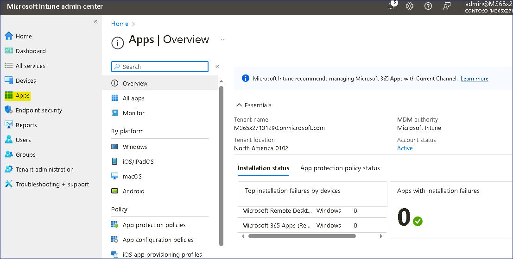

Lab12 - Distribuzione di app cloud con Microsoft Intune

**Sommario**

In questo lab si creano e si distribuiscono app basate sul cloud usando
Intune e il sito Web del portale aziendale.

**Prerequisiti**

[**  
**](https://synonyms.reverso.net/synonym/it/prerequisiti)I seguenti
laboratori devono essere completati prima di questo laboratorio:

- Lab \#1- Gestione delle identità nell'ID Microsoft Entra

- Lab \#2- Sincronizzazione delle identità tramite Microsoft Entra
  Connect

- Lab \#5- Gestire la registrazione dei dispositivi in Microsoft Intune

- Lab \#6- Registrazione dei dispositivi in Microsoft Intune

- Lab \#7- Creazione e distribuzione dei profili di configurazione

**Nota:** avrai anche bisogno di un telefono cellulare in grado di
ricevere messaggi di testo utilizzati per proteggere l'autenticazione di
accesso a Windows Hello per l'ID Microsoft Entra.

**Esercizio 1: Aggiungere un'app di Microsoft Store a Microsoft Intune
Scenario**

Si usa Microsoft Intune per gestire desktop e app per Contoso
Corporation. Il reparto Ricerca si connette spesso a vari server per
eseguire attività e ha chiesto che l'app Microsoft Remote Desktop sia
disponibile per i membri della Ricerca per l'installazione in base alle
esigenze. Desktop remoto Microsoft è disponibile in Microsoft Store, ma
si decide di aggiungere l'app a Intune in modo che gli utenti possano
accedervi dal sito Web Portale aziendale. Un membro della ricerca di
nome Aaron Nicholls ha accettato di testare il processo di installazione
dopo che l'app è stata pubblicata sul portale.

Task 1: Aggiungere Microsoft Remote Desktop a Microsoft Intune

1.  In SEA-SVR1, se necessario, accedere come Contoso\Administrator con
    la password. Pa55w.rd!! e chiudi **Server Manager.**

2.  Sulla barra delle applicazioni, seleziona **Microsoft Edge.**

3.  In Microsoft Edge, digita !! https://Intune.microsoft.com !! nella
    barra degli indirizzi, quindi premere **Invio**.

4.  Accedere usando le credenziali del tenant di Office 365 dalla scheda
    Home.

5.  Nella pagina dell'interfaccia di **amministrazione di Microsoft
    Intune** selezionare **App**.

> 

6.  Nella pagina **App**, nel riquadro di spostamento, selezionare
    **Tutte le app.**

7.  Nel riquadro dei dettagli selezionare +**Aggiungi**.

> 

8.  Nella pagina **Seleziona tipo di** app fare clic sul menu a discesa
    e quindi selezionare **App di Microsoft Store (nuovo)**.

> 
>
> Leggi le informazioni sull'app di Microsoft Store e fai clic su
> **Seleziona**. Viene visualizzata la pagina **Aggiungi app**.
>
> Nella pagina Informazioni **sull'app** fare clic sul collegamento
> **Cerca nell'app di Microsoft Store (nuova**).

9.  Nella scheda **Cerca nell'app Microsoft Store (nuova**) cerca e
    seleziona !! Desktop remoto Microsoft!! quindi fare clic sul
    pulsante Seleziona.

> 

10. Torna alla scheda Aggiungi app, inserisci le seguenti informazioni e
    quindi seleziona **Avanti**:

    - **Categoria: Affari**

    - Mostrarla come app in primo piano nel Portale aziendale: **Sì**
      

> Nella scheda **Compiti**, fai clic su + A**ggiungi gruppo** 

11. Nella pagina **Seleziona gruppi** selezionare il gruppo Ricerca,
    Vendite e quindi fare **clic su Seleziona.**

> 

12. Fare clic sul pulsante **Avanti**.

> 

13. Nella scheda Rivedi + **crea**, fai clic sul pulsante Crea.

> 

14. Viene visualizzata la pagina Desktop remoto Microsoft.

> Prendere nota dei nodi Proprietà, Stato installazione dispositivo e
> Stato installazione utente.
>
> 

Task 2: Forzare la sincronizzazione dei criteri dalla console di
Microsoft Intune

1.  **Nell'interfaccia di amministrazione di Microsoft Intune**
    selezionare **Dispositivi** e quindi selezionare **Tutti i
    dispositivi.**

> Nel riquadro dei dettagli selezionare **SEA-WS1**.

2.  Nel pannello **SEA-WS1** selezionare **Sincronizza** e, quando
    richiesto, selezionare **Sì**.

> 
>
> Microsoft Intune contatterà il dispositivo e sincronizzerà tutti i
> criteri. Questa operazione può richiedere fino a 5 minuti.

Task 3: Installare un'app dal sito Web Portale aziendale

1.  Accedi a SEA-WS1 come **Cindy White** utilizzando le sue credenziali

2.  !!**Cindy@M365xXXXXXX.onmicrosoft.com**!! Con Password
    !!**P@55w.rd1234**!! o con il PIN!!**102938**!!

3.  Sulla barra delle applicazioni, seleziona **Microsoft Edge**.

4.  Se necessario, nella pagina **Benvenuto in Microsoft Edge**
    selezionare **Conferma e continua**. Chiudi la pagina di benvenuto.

5.  Nella barra degli indirizzi sfoglia
    a !\!!

6.  Accedi come!!**Cindy@M365xXXXXXX.onmicrosoft.com**!!

> 

7.  Nel portale Web di Contoso selezionare **Dispositivi**.

> 

8.  Nella pagina Dispositivi, seleziona **Tocca qui per indicare il
    dispositivo che stai utilizzando o aggiungere un nuovo
    dispositivo.**

> 

9.  Nella finestra di dialogo **Quale dispositivo stai utilizzando**,
    seleziona l'opzione accanto a **SEA-WS1**, quindi fai clic sul
    pulsante **Seleziona**.

> 
>
> Si noti che il messaggio ora cambia in Le app verranno installate su:
> SEA-WS1

10. Nell'angolo in alto a sinistra, seleziona il pulsante di
    navigazione, quindi seleziona **Download e aggiornamenti.**

> 

11. Dai risultati elencati, controlla lo stato, l'app **Microsoft Remote
    Desktop** dovrebbe apparire come **Installata**.

> Nota: potrebbero essere necessari fino a 10-20 minuti prima che l'app
> venga visualizzata.
>
> 

12. Fare clic sul **menu Start** e verificare che **Desktop remoto** sia
    visualizzato nel menu Start.

> 

**Risultati**: dopo aver completato questo esercizio, avrai aggiunto e
installato correttamente un'app di Microsoft Store da Microsoft Intune.

**Esercizio 2: Configurare e distribuire le app di Microsoft 365 da
Microsoft Intune Scenario**

Tutti gli utenti del reparto Ricerca di Contoso richiedono Microsoft 365
Apps. È stato chiesto di distribuire le versioni a 64 bit di Microsoft
Excel, Outlook, PowerPoint e Word nei dispositivi Windows. È inoltre
necessario assicurarsi che siano configurati per il canale corrente per
gli aggiornamenti.

Task 1: Verificare le app installate su SEA-WS1

1.  Su SEA-WS1, sulla barra delle applicazioni, selezionare **Start**,
    quindi selezionare l'app **Impostazioni**.

> 

2.  Nell'app **Impostazioni**, seleziona **App**, quindi **App e
    funzionalità.**

> 
>
> Verificare che **Microsoft 365 Apps for enterprise - en-us** non sia
> elencato.
>
> 

3.  Chiudi tutte le finestre aperte.

Task 2: Aggiungere app di Microsoft 365 a Microsoft Intune

1.  Passare a SEA-SVR1, nell'interfaccia di amministrazione di
    **Microsoft Intune selezionare App**.

2.  Nella sezione **App** | Pannello Panoramica selezionare **Tutte le
    app**. Nel riquadro dei dettagli selezionare +**Aggiungi**.

> 

3.  Nel pannello **Seleziona tipo di app**, in App Microsoft 365,
    seleziona Windows 10 e versioni successive, quindi fai clic su
    **Seleziona**.

> 

4.  Nel pannello **Aggiungi app di Microsoft 365** configurare le
    opzioni seguenti e selezionare **Avanti**:

    - Nome della suite: !\!!

    - Descrizione della suite: !\ !! (Seleziona
      **Modifica descrizione** per inserire queste informazioni.)

> 

5.  Nella scheda **Configura suite di app** espandere l'elenco a discesa
    **Seleziona app di Office**, selezionare le app di Office seguenti:

    - Excel

    - Outlook

    - PowerPoint

    - Word

> 

6.  Nella scheda **Configura suite di app**, configura le seguenti
    opzioni e seleziona **Avanti**:

    - Architettura: **64-bit**

    - Formato di file predefinito: **Office Open XML Format**

    - Canale di aggiornamento: **Canale attuale**

    - Accettare le Condizioni di licenza software Microsoft per conto
      degli utenti: **Si**

> 

7.  Nella sezione **Obbligatorio** della scheda **Assegnazioni**
    selezionare **Aggiungi gruppo**.

> 
>
> Nel pannello **Seleziona gruppi** selezionare **Ricerca** e quindi
> scegliere **Seleziona**.
>
> Selezionare **Avanti**
>
> 

8.  Nella scheda **Rivedi** + **Crea** selezionare **Crea**.

> 

9.  Nella pagina App **Microsoft 365 (ricerca)** selezionare Proprietà.

> 

10. Nel riquadro dei dettagli verificare che la **ricerca** sia
    **elencata** in Obbligatorio nella sezione **Assegnazioni**.

> 

Task 3: Forzare la sincronizzazione dei criteri dalla console di
Microsoft Intune

1.  Nell'interfaccia di amministrazione di **Microsoft Intune
    selezionare Dispositivi** e quindi selezionare Tutti i
    **dispositivi**.

2.  Nel riquadro dei dettagli selezionare **SEA-WS1.**

> 

3.  Nel pannello **SEA-WS1** selezionare **Sincronizza** e, quando
    richiesto, selezionare **Sì**.

> 
>
> Microsoft Intune contatterà il dispositivo e sincronizzerà tutti i
> criteri. Questa operazione può richiedere fino a 5 minuti.

Task 4: Verificare che le app di Microsoft 365 siano installate

1.  Se hai già effettuato l'accesso a SEA-WS1 come **Cindy White**.

> **Nota**: potrebbe essere necessario attendere circa 10-15 minuti per
> l'installazione di Microsoft 365 Suite sul dispositivo.

2.  Esci e accedi di nuovo a  come **Cindy White** utilizzando le sue
    credenziali !!**Cindy@M365xXXXXXX.onmicrosoft.com**!! con Password
    !!**P@55w.rd1234**!!

3.  Su SEA-WS1, sulla barra delle applicazioni, selezionare **Start**,
    quindi selezionare l'app **Impostazioni**.

> 

4.  Nell'app **Impostazioni**, seleziona **App** e nella pagina **App e
    funzionalità**.

> 

5.  Cercare!! Microsoft 365!! e verificare che Microsoft 365 Apps for
    enterprise - en-us sia elencato.

> 

6.  Chiudi l'app **Impostazioni** e seleziona il pulsante **Start**.

7.  Nella sezione **Consigliati** dovrebbe essere possibile visualizzare
    le app appena installate che sono state selezionate dalle app di
    Microsoft 365 in Microsoft Intune.

> 

Task 5: Monitorare lo stato di installazione dell'app in Microsoft
Intune

1.  Passare a SEA-SVR1 e nell'interfaccia di **amministrazione di
    Microsoft Intune** selezionare **App**.

> 

2.  Sulle app | **Pannello Panoramica**, selezionare Monitoraggio e
    quindi **selezionare** Stato **installazione app**.

> 

3.  Nel riquadro dei dettagli selezionare **App Microsoft 365
    (Ricerca)**.

> 

4.  Nel riquadro dei dettagli, in **Stato dispositivo** e in **Stato
    utente**, verificare che sia visualizzato 1 in Installato.

> 

**Nota**: indica che l'app è installata su un dispositivo e per un solo
utente. Si noti che la visualizzazione delle informazioni potrebbe
richiedere del tempo e potrebbe apparire come **Installazione in
sospeso**.

> **Nota** – Puoi avviare il **Lab 13** e poi ricontrollare dopo **30-45
> minuti**.

5.  Seleziona **Stato installazione dispositivo**.

> Nel riquadro dei dettagli è possibile visualizzare i dispositivi in
> cui è installata l'app e anche il nome dell'utente. La colonna **Nome
> dispositivo** deve **elencare** **SEA-WS1** e la colonna Stato deve
> indicare Installato. Ciò significa che l'app è installata su
> **SEA-WS1.**
>
> 

6.  Nell'interfaccia di amministrazione di **Microsoft Intune
    selezionare** **Dispositivi**.

7.  Sui dispositivi | **Pannello Panoramica** selezionare Tutti i
    dispositivi e quindi nel riquadro dei **dettagli** selezionare
    **SEA-WS1**.

> 

8.  Nel pannello **SEA-WS1** selezionare **App gestite.**

9.  **Sul SEA-WS1 | Nel pannello App gestite,** nel riquadro dei
    dettagli, selezionare App **Microsoft 365 (Ricerca)**.

> 
>
> Nella finestra **Microsoft 365 Apps (Research) - dettagli di
> installazione** (Microsoft 365 Apps (Research) - Installation details
> (Dettagli installazione) è possibile visualizzare l'intero ciclo di
> vita dell'applicazione, ovvero quando è stata creata, assegnata, l'ora
> e lo stato dell'installazione e l'ultima volta che il dispositivo è
> stato archiviato (sincronizzato con Microsoft Intune).
>
> 

10. Chiudere tutte le finestre aperte.

**Risultati:** dopo aver completato questo esercizio, le app Microsoft
365 da Microsoft Intune saranno state configurate e distribuite
correttamente.
