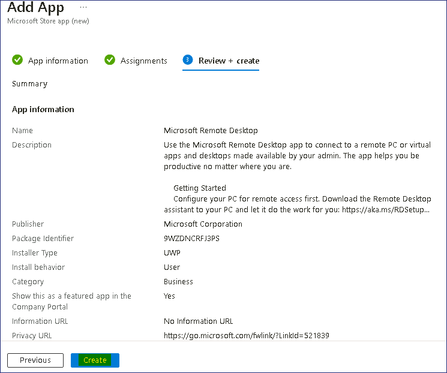
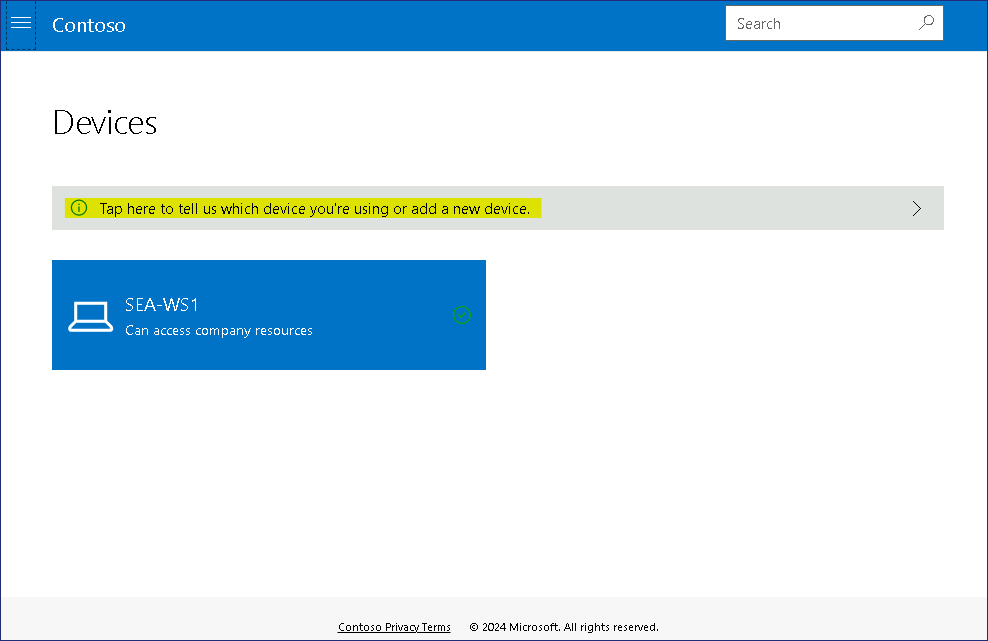

Atelier 12 - Déploiement cloud apps à l'aide de Microsoft Intune

**Résumé**

Dans cet atelier, vous allez créer et déployer des applications basées
sur le cloud à l'aide d'Intune et du site web du portail d'entreprise.

**Conditions préalables**

Le(s) Ateliers suivant(s) doit(vent) être completé(s) avant cet
atelier::

- Atelier \#1-Gestion des identités dans Microsoft Entra ID

- Atelier \#2 : Synchronisation des identités à l'aide de Microsoft
  Entra Connect

- Atelier \#5 : Gérer l'inscription d'un appareil dans Microsoft Intune

- Atelier \#6-Inscription d'appareils dans Microsoft Intune

- Atelier \#7-Création et déploiement de profils de configuration

**Remarque** : Vous aurez également besoin d'un téléphone mobile capable
de recevoir des SMS utilisés pour sécuriser l'authentification de
connexion Windows Hello à Microsoft Entra ID.

Exercice 1 : Ajouter Microsoft Store App à Microsoft Intune

**Scénario**

Vous utilisez Microsoft Intune pour gérer les postes de travail et les
applications de Contoso Corporation. Le service de recherche se connecte
souvent à divers serveurs pour effectuer des tâches et a demandé à ce
que the Microsoft Remote Desktop app soit disponible pour que les
membres de la recherche puissent l'installer au besoin. Microsoft Remote
Desktop est disponible à partir du Microsoft Store, mais vous décidez
d'ajouter l'application à Intune afin que les utilisateurs puissent y
accéder à partir du site web du Portail d'entreprise. Un membre de
l'équipe de recherche nommé Aaron Nicholls a accepté de tester le
processus d'installation après que vous ayez publié l'application sur le
portail.

Tâche 1 : Ajouter Microsoft Remote Desktop à Microsoft Intune

1.  Sur
    [***SEA-SVR1***](https://labclient.labondemand.com/Instructions/e7cc4ae1-e3d9-4c55-accc-696f537e1e17),
    si nécessaire, connectez-vous en tant que
    [**Contoso\Administrator**](https://labclient.labondemand.com/Instructions/e7cc4ae1-e3d9-4c55-accc-696f537e1e17)
    avec le mot de passe !\ !! et
    fermez le **Server Manager**

2.  Dans la barre des tâches, sélectionnez **Microsoft Edge**.

3.  Dans Microsoft Edge, tapez !!
    [**https://Intune.microsoft.com**](urn:gd:lg:a:select-vm)  !! dans
    la barre d'adresse, puis appuyez sur **Enter**.

4.  Connectez-vous à l'aide des informations d'identification deOffice
    365 tenant à partir de l'onglet Accueil.

5.  Dans la page **Microsoft Intune admin center** , sélectionnez
    **Apps**.

> 

6.  Sur la page **Apps**, dans le volet de navigation, sélectionnez
    **All Apps**.

7.  Dans le volet d'informations, sélectionnez **+Add**.

> 

8.  Dans la page **Sélectionner le type d'application**, cliquez sur le
    menu déroulant, puis sélectionnez **Microsoft store app (new)**.

> 
>
> Lisez les informations sur Microsoft store app, puis cliquez sur
> **Select**. La page **Add App** s'ouvre.

9.  Sur la page **d'informations de l'application**, cliquez sur le lien
    **Search the** **Microsoft Store app (new).**

> 

10. Dans l' onglet **Search the** **Microsoft Store app (new)**
    recherchez et sélectionnez !\!!
    puis cliquez sur le bouton Sélectionner.

> 

11. De retour dans l'onglet Ajouter une application, entrez les
    informations suivantes, puis sélectionnez **Next** :

    - Catégorie : **Business**

    - Affichez cette application en tant qu'application en vedette dans
      le Portail d'entreprise : **Yes**

> 

12. Dans l' onglet **Assignments**, cliquez sur **+ Add group** 

13. Sur la page **Sélectionner des groupes**, sélectionnez le groupe
    **Research, Sales**  puis cliquez sur **Select**.

> 

14. Cliquez sur le bouton **Next**.

> 

15. Dans l'onglet Vérifier + créer, cliquez sur le bouton **Create**.

> 

16. La page Microsoft Remote Desktop s'ouvre.

> Prenez note des nœuds Propriétés, État d'installation de l'appareil et
> État d'installation de l'utilisateur.
>
> 

Tâche 2 : Forcer la synchronisation des stratégies à partir de la
console Microsoft Intune

1.  Dans le **Microsoft Intune admin center**, sélectionnez
    **Devices** , puis Tous **All devices**.

2.  Dans le volet d'informations, sélectionnez **SEA-WS1**.

> 

3.  Sur la lame **SEA-WS1**, sélectionnez **Sync** et, lorsque vous y
    êtes invité, sélectionnez **Yes**.

> 
>
> Microsoft Intune contactera l'appareil et synchronisera toutes les
> stratégies. Cela peut prendre jusqu'à 5 minutes.

Tâche 3 : Installer une application à partir du site Web du Portail
d'entreprise

1.  Connectez-vous à en tant que **Cindy White** en utilisant ses
    identifiants !!**Cindy@M365xXXXXXX.onmicrosoft.com** !! avec Mot de
    passe !!**P@55w.rd1234** !! ou avec le PIN !!**102938** !!

2.  Dans la barre des tâches, sélectionnez **Microsoft Edge**.

3.  Si nécessaire, dans la page **Bienvenue dans Microsoft Edge**,
    sélectionnez **Confirmer et continuer**. Fermez la page d'accueil.

4.  Dans la barre d'adresse, accédez à
    !\ !!

5.  Connectez-vous en tant que
    !!**Cindy@M365xXXXXXX.onmicrosoft.com** !!

> 

6.  Sur le portail web Contoso, sélectionnez **Devices**.

> 

7.  Sur la page Appareils, sélectionnez **Appuyez ici pour nous indiquer
    l'appareil que vous utilisez ou ajouter un nouvel appareil**.

> 

8.  Dans la boîte de dialogue **Quel périphérique utilisez-vous**,
    sélectionnez l'option en regard de **SEA-WS1**, puis cliquez sur le
    bouton **Select.**

> 
>
> Notez que le message passe maintenant à Apps will be installed on :
> **SEA-WS1**
>
> 

9.  Dans le coin supérieur gauche, sélectionnez le bouton de navigation,
    puis sélectionnez **Téléchargements et mises à jour**.

> 

10. À partir des résultats répertoriés, vérifiez l'état, **Microsoft
    Remote Desktop** doit apparaître comme **Installée**.

> Remarque - L'affichage de l'application peut prendre jusqu'à 10 à 20
> minutes.
>
> 

11. Cliquez sur le **menu Démarrer** et vérifiez que **Remote Desktop**
    s'affiche dans le menu Démarrer.

> 

**Résultats** : Une fois cet exercice terminé, vous avez ajouté et
installé Microsoft Store App à partir de Microsoft Intune.

Exercice 2 : Configurer et déployer Microsoft 365 Apps à partir de
Microsoft Intune

**Scénario**

Tous les utilisateurs du service de recherche de Contoso ont besoin de
Microsoft 365 Apps. On vous a demandé de déployer les versions 64 bits
de Microsoft Excel, Outlook, PowerPoint et Word sur vos appareils
Windows. Vous devez également vous assurer qu'ils sont configurés pour
le canal actuel pour les mises à jour.

Tâche 1 : Vérifier les applications installées sur SEA-WS1

1.  Sur [***SEA-WS1***](urn:gd:lg:a:send-vm-keys), dans la barre des
    tâches, sélectionnez **Start**, puis sélectionnez le **Settings**
    apps

> 

2.  Dans l' application **Settings**, sélectionnez **Apps**, puis **Apps
    & features**.

> 
>
> Vérifiez que **Microsoft 365 Apps for enterprise - en-us** n'est pas
> répertorié.
>
> 

3.  Fermez toutes les fenêtres ouvertes.

Tâche 2 : Ajouter Microsoft 365 apps à Microsoft Intune

1.  Basculez vers [***SEA-SVR1***](urn:gd:lg:a:send-vm-keys), tandis que
    dans le **Microsoft Intune admin center** sélectionnez **Apps**.

2.  Dans la section **Apps | Overview** , sélectionnez **All Apps**.
    Dans le volet d'informations, sélectionnez **+Add**.

> 

3.  Dans le panneau **Sélectionner le type d'application**, sous
    **Microsoft 365 Apps**, sélectionnez **Windows 10 et versions
    ultérieures**, puis cliquez sur **Select**.

> 

4.  Dans le panneau **Ajouter Microsoft 365 Apps**  configurez les
    options suivantes et sélectionnez **SNext** :

    - Nom de la suite : !! [**Microsoft 365 Apps
      (Research)**](urn:gd:lg:a:select-vm)!!

    - Description de la suite : !\!!
      (Sélectionnez **Modifier la description** pour entrer ces
      informations.)

> 

5.  Sous l' onglet **Configure app suite** , développez la liste
    déroulante **Sélectionner Office apps** , sélectionnez les
    applications Office suivantes :

    - Excel

    - Outlook

    - PowerPoint

    - Word

> 

6.  Sous l' onglet **Configure app suite** , configurez les options
    suivantes et sélectionnez **Next** :

    - Architecture : **64 bits**

    - Format de fichier par défaut : **Office Open XML Format**

    - Canal de mise à jour : **Canal actuel**

    - Acceptez les termes du contrat de licence du logiciel Microsoft au
      nom des utilisateurs : **Yes**

> 

7.  Sous l' onglet **Assignments**, dans la section **requise**,
    sélectionnez **Add group.**

> 

8.  Dans le panneau **Select groups** , sélectionnez **Research**, puis
    choisissez **Select**.

> 

9.  Sélectionnez **Next**.

> 

10. Sous l' onglet **Review + Create** , sélectionnez **Create**.

> 

11. Dans la page **Microsoft 365 Apps (Research)** sélectionnez
    **Properties**.

> 

12. Dans le volet d'informations, vérifiez que Recherche est répertorié
    sous **required** dans la section **Assignments** .

> 

Tâche 3 : Forcer la synchronisation des stratégies à partir de la
console Microsoft Intune

1.  Dans le **Microsoft Intune admin center**, sélectionnez **Devices**,
    puis Tous **All Devices**.

2.  Dans le volet d'informations, sélectionnez **SEA-WS1**.

> 

3.  Sur panneau **SEA-WS1**, sélectionnez **Sync** et, lorsque vous y
    êtes invité, sélectionnez **Yes**.

> 
>
> Microsoft Intune contactera l'appareil et synchronisera toutes les
> stratégies. Cela peut prendre jusqu'à 5 minutes.

Tâche 4 : Vérifier que Microsoft 365 apps sont installées

1.  Si vous êtes déjà connecté à
    [*SEA-WS1*](urn:gd:lg:a:send-vm-keys?rc=10) en tant que **Cindy
    White**.

> **Remarque** – Vous devrez peut-être attendre environ 10 à 15 minutes
> pour que la suite Microsoft 365 s'installe sur l'appareil.

2.  Déconnectez-vous et connectez-vous à nouveau à en tant que **Cindy
    White** en utilisant ses informations d'identification
    !!**Cindy@M365xXXXXXX.onmicrosoft.com** !! avec Mot de passe
    !!**P@55w.rd1234** !!

3.  Sur [***SEA-WS1***](urn:gd:lg:a:send-vm-keys), dans la barre des
    tâches, sélectionnez **Start**, puis sélectionnez le
    **Settings** app

> 

4.  Dans le **Settings** app , sélectionnez **Apps**, puis sur la page
    **Apps & features** .

> 

5.  Cherchez !!**Microsoft 365** !! et vérifiez que **Microsoft 365 Apps
    for enterprise - en-us** est répertorié.

> 

6.  Fermez le **Settings** app et sélectionnez le bouton **Start**.

7.  Dans la section **Recommandé,** vous devez voir les applications
    nouvellement installées qui ont été sélectionnées à partir de
    Microsoft 365 Apps dans Microsoft Intune.

> 

Tâche 5 :L’etat l'installation de Monitor app dans Microsoft Intune

1.  Basculez vers **[*SEA-SVR1*](urn:gd:lg:a:select-vm)** et, dans le
    **Microsoft Intune admin center**, sélectionnez **Apps**.

> 

2.  Sur les **Apps | Overview**  sélectionnez **Surveiller**, puis
    sélectionnez **App install status**.

> 

3.  Dans le volet d'informations, sélectionnez **Microsoft 365 Apps
    (Research)**.

> 

4.  Dans le volet de détails, sous **Device status**  et sous **User
    status**, vérifiez que **1** s'affiche sous Installé.

> 
>
> **Remarque** : Cela indique que l'application est installée sur un
> appareil et pour un utilisateur. Notez que l'affichage des
> informations peut prendre un certain temps et qu'elles peuvent
> apparaître comme **Installation en attente**.
>
> **Remarque** – Vous pouvez démarrer **l'atelier 13**, puis revenir
> après **30 à 45** minutes.

5.  Sélectionnez **État d'installation de l'appareil**.

> Dans le volet d'informations, vous pouvez voir les appareils sur
> lesquels l'application est installée, ainsi que le nom de
> l'utilisateur. La **colonne Nom du périphérique** doit indiquer
> **SEA-WS1** et la colonne **État** doit indiquer **Installé**. Cela
> signifie que l'application est installée sur **SEA-WS1**.
>
> 

6.  Dans le **Microsoft Intune admin center** sélectionnez **Devices**.

7.  Sur les **Devices | Overview**  sélectionnez **All devices** , puis
    dans le volet d'informations, sélectionnez **SEA-WS1**.

> 

8.  Sur la lame **SEA-WS1**, sélectionnez **Managed Apps**..

9.  Sur le **SEA-WS1 | Managed Apps** dans le volet d'informations,
    sélectionnez **Microsoft 365 Apps (Research)**

> 
>
> Dans la fenêtre **Microsoft 365 Apps (Research)- Détails de
> l'installation**, vous pouvez voir le cycle de vie complet de
> l'application, c'est-à-dire quand elle a été créée, attribuée, l'heure
> et l'état de l'installation et la dernière fois que l'appareil s'est
> archivé (synchronisé avec Microsoft Intune).
>
> 

10. Fermez toutes les fenêtres ouvertes.

**Résultats** : Une fois cet exercice terminé, vous aurez correctement
configuré et déployé les Microsoft 365 Apps à partir de Microsoft
Intune.
