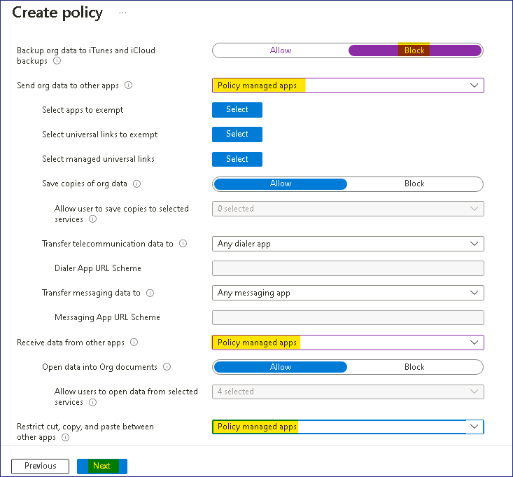

Lab13：为移动设备配置应用程序保护策略

**总结**

在本实验中，您将为移动设备配置应用程序保护策略。

**场景**

Contoso 的所有开发人员都拥有运行最新 iOS/iPadOS 版本的 iPhone 和
iPad。安全部门担心数据泄露，并希望防止将公司电子邮件中的数据复制到移动设备上的其他应用程序。您必须提供解决安全部门问题的解决方案。您需要确保以下几点：

- 必须限制 Outlook 数据备份到 iTunes 或 iCloud。

- 只有策略托管的应用程序才能从 Outlook 发送和接收数据。

- 只有策略托管的应用程序才能使用 Outlook 进行剪切、复制或粘贴。

- 用户必须提供其工作或学校帐户凭据才能访问 Outlook。

任务 1：为 iOS/iPadOS 设备创建应用保护策略

1.  在 [***SEA-SVR1***](urn:gd:lg:a:select-vm)上，
    如有必要，使用密码以 [**Contoso\Administrator**](urn:gd:lg:a:send-vm-keys) 身份登录 !\!!

2.  在任务栏上，选择 **Microsoft Edge** 并导航到 **Microsoft Intune
    管理中心** !!**https://intune.microsoft.com**!!  ，然后按
    **Enter**。

3.  使用 Office 365 租户管理员凭据从“主页”选项卡登录。

4.  在 **Microsoft Intune 管理中心**页面上，选择 “**Apps**” 。

> 

5.  在 **Apps | Overview** 边栏选项卡的 “**Policy**” 下，选择 “**App
    protection policies**” 。

> 

6.  在详细信息窗格中，选择 “**+ Create policy** “，然后选择
    “**iOS/iPadOS**” 。

> 

7.  在 **Basics** 选项卡上，配置以下选项，然后选择 **Next**：

    - 名字： !\!!

    - 描述： !\!!

> 

8.  在 **Apps** （应用程序） 选项卡上，单击 **+ Select public apps**
    （选择公共应用程序）。

9.  在 **Select apps to target** 边栏选项卡的文本框中，键入
    !!**Outlook**!! 选择 **Microsoft Outlook**，然后单击 “**Select**”
    按钮，然后选择 “**Next**” 。

> 

10. 在 **Data protection** （数据保护） 选项卡上，配置以下选项，然后选择
    **Next** （下一步）：

    - 将组织数据备份到 iTunes 和 iCloud 备份： **Block**

    - 将组织数据发送到其他应用： **Policy managed apps**

    - 从其他应用接收数据： **Policy managed apps**

    - 限制其他应用之间的剪切、复制和粘贴： **Policy managed apps**

> 将所有其他设置保留为默认值
>
> 

11. 在 **Access requirements** （访问要求）
    选项卡上，配置以下选项，然后选择 **Next**：

    - 访问 PIN： **Not required**

    - 用于访问的工作或学校帐户凭据： **Require**

> 

12. 在 **Conditional launch** （条件启动） 选项卡上，查看设置。选择
    **Next**（下一步）。

> 
>
> **注意：**您可以在此处设置访问保护策略的登录安全要求。您可以选择一个设置，并输入用户登录公司应用程序必须满足的值。记下各种设置，但不要更改任何内容。

13. 在 **Assignments** （分配） 选项卡上，选择 **Next** （下一步）。

> 

14. 在 “**Review + create**” 选项卡上，查看设置，然后选择 “**Create**”。

> 

15. 在 “**Apps | App protection policies**”
    边栏选项卡上的详细信息窗格中，验证是否列出了 “**Outlook -
    Developers**” 。

> 

16. 关闭Microsoft Edge。

**结果：**完成本练习后，您将成功为移动设备配置应用程序保护策略。
