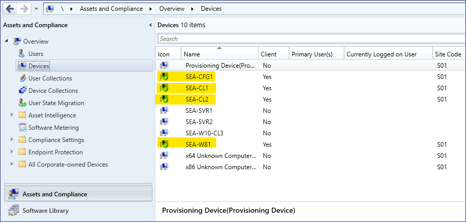
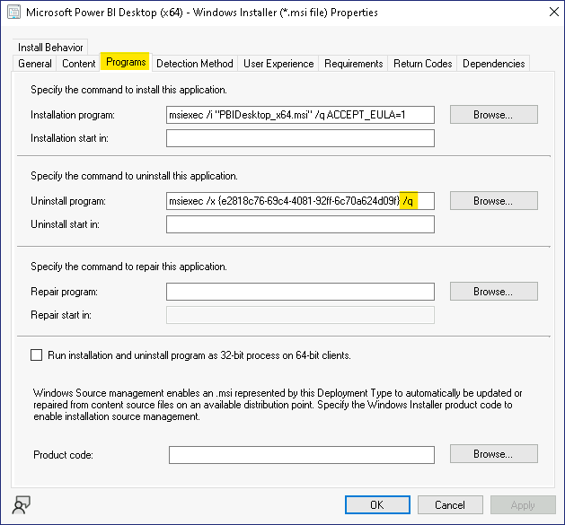

Laboratório14 - Implementar aplicativos usando o Endpoint Configuration
Manager

**Resumo**

Neste laboratório, você usará o Microsoft Endpoint Configuration Manager
para implementar aplicações em estações de trabalho with clientes de
desktop.

**Cenário**

A Contoso usa o Microsoft Endpoint Configuration Manager para gerenciar
estações de trabalho desktop no ambiente de rede local do Active
Directory. Você precisa implementar uma nova aplicação chamada Microsoft
Power BI Desktop nos clientes do Configuration Manager do Windows 11. O
administrador do Endpoint Configuration Manager já criou o objeto de
aplicação para você. Suas tarefas incluem criar uma coleção para os
dispositivos de destino, distribuir o conteúdo do aplicativo para os
pontos de distribuição e, em seguida, criar a implementação atribuída à
coleção de destino. Você verificará o processo garantindo que a
aplicação seja exibida no Software Center em SEA-CL1.

Tarefa 1: Criar uma coleção de dispositivos

1.  Altere para [***SEA-CFG1***](urn:gd:lg:a:select-vm), faça login como
    [**[Contoso\Administrator](urn:gd:lg:a:send-vm-keys)**](urn:gd:lg:a:send-vm-keys)
    com a senha !\!!.

2.  Na barra de tarefas, selecione **Configuration Manager Console**. O
    console do Microsoft Endpoint Configuration Manager será aberto.

> 

3.  No workspace **Assets and Compliance**, selecione **Device
    Collections**.

> 

4.  Clique com o botão direito do mouse em **Device Collections** e
    selecione **Create Device Collection**. O Assistente para Criação de
    Coleção de Dispositivos será aberto.

> 

5.  Na página **General**, configure o seguinte e selecione **Next**:

    - Name: !\!!

    - Comment: !\!!

    - Limiting collection: **All Windows 11 Workstations**

> 

6.  Na página **Membership Rules**, selecione **Next**. No aviso do
    Configuration Manager, selecione **OK.** Você adicionará um membro
    direto em uma etapa posterior.

> 
>
> 

7.  Na página **Summary**, selecione **Next** e, na página
    **Completion**, selecione **Close**.

> 
>
> A coleção do **Power BI App Deployment** é exibida na lista Coleções
> de dispositivos.
>
> 

Tarefa 2: Atribuir um dispositivo a uma coleção existente

1.  No workspace **Assets and Compliance**, selecione **Devices**.

> Anote os dispositivos listados. Qualquer dispositivo com um círculo
> verde com uma marca de seleção branca está ativo no momento.
>
> 

2.  No painel de detalhes, selecione **SEA-CL1**.

3.  Clique com o botão direito do mouse [em
    [***SEA-CL1***](urn:gd:lg:a:select-vm)](urn:gd:lg:a:select-vm),
    aponte para **Add Selected Items** e selecione **Add Selected Items
    to Existing Device Collection**.

> 

4.  Na caixa de diálogo **Select Collection**, selecione **Power BI App
    Deployment** e, em seguida, selecione **OK**.

> 

5.  Para verificar, no workspace **Assets and Compliance**, selecione
    **Device Collections** e clique duas vezes em **Power BI App
    Deployment**.

> 
>
> [***SEA-CL1***](urn:gd:lg:a:select-vm) deve ser listado como membro
> desta coleção.
>
> 

Tarefa 3: Configurar um tipo de implementação

1.  No console do Microsoft Endpoint Configuration Manager, selecione o
    workspace **Software Library**.

> 

2.  No workspace **Software Library**, expanda **Application
    Management** e selecione **Applications**.

> 
>
> 
>
> Observe os aplicativos que foram criados pelo administrador do
> Endpoint Configuration Manager.

3.  No painel de detalhes, selecione **Microsoft Power BI Desktop
    (x64)**.

> 

4.  No painel de resultados, selecione a aba **Deployment Types**.
    Observe que há um tipo de implementação baseado no Windows
    Installer.

> 

5.  Clique com o botão direito do mouse no tipo de implementação
    **Microsoft Power BI Desktop (x64) - Windows installer** e selecione
    **Properties**.

> 

6.  Na caixa de diálogo **Properties**, selecione a aba **Programs**.
    Observe como o aplicativo é instalado. Ele usará o msiexec com a
    opção /q, que realiza uma instalação silenciosa.

> 

7.  Na caixa de diálogo **Properties**, selecione a aba **Requirements**
    e depois selecione **Add**.

> 

8.  Na caixa de diálogo **Create Requirement**, configure o seguinte e
    selecione **OK**:

    - Category: **Device**

    - Condition: **Operating System**

    - Rule type: **Value**

    - Operator: **One of Windows 11 (Select the check box next to
      Windows 11)**

> 

9.  Na caixa de diálogo **Properties**, selecione **OK**. Este requisito
    impedirá que o aplicativo seja instalado em qualquer sistema
    operacional, exceto o Windows 11.

> 

Tarefa 4: Distribuir conteúdo para pontos de distribuição

1.  No workspace **Software Library**, selecione **Microsoft Power BI
    Desktop (x64)**.

2.  Clique com o botão direito do mouse em **Microsoft Power BI Desktop
    (x64)** e selecione **Distribute Content**.

> 

3.  Na página **General**, selecione **Next**.

> 

4.  Na página **Content**, selecione **Next**.

> 

5.  Na página **Content Destination**, selecione **Add** e, em seguida,
    selecione **Distribution Point**.

> 

6.  Na caixa de diálogo **Add Distribution Points**, marque a caixa de
    seleção ao lado de **SEA-CFG1.CONTOSO.COM** e selecione **OK.**

> 

7.  Na página **Content Destination**, selecione **Next**.

> 

8.  Na página **Summary**, selecione **Next** e depois **Close**.

> 
>
> 

9.  Na aba **Summary**, selecione **Content Status**.

> 
>
> A página de Status do Conteúdo é aberta para o Microsoft Power BI
> Desktop. No painel de resultados, verifique se um círculo verde é
> exibido e se a mensagem Success:1 aparece ao lado do círculo. Isso
> indica que o conteúdo agora está distribuído para os pontos de
> distribuição e pode ser implementado nos dispositivos. Pode ser
> necessário selecionar o botão Atualizar na faixa de opções.
>
> 

10. No canto superior esquerdo, selecione a seta **Back to
    Applications** para retornar ao nó de Aplicações da biblioteca de
    software.

Tarefa 5: Criar uma implementação

1.  No workspace **Biblioteca de Software,** selecione **Microsoft Power
    BI Desktop (x64).**

2.  Clique com o botão direito do mouse em **Microsoft Power BI Desktop
    (x64)** e selecione **Deploy**. O **Deploy Software Wizard** será
    aberto.

> 

3.  Na página **General**, ao lado de **Collection**, selecione
    **Browse**.

> 

4.  Na página **Select Collection**, selecione **User Collections** e,
    em seguida, **Device Collections**.

5.  Na lista **Device Collections**, selecione **Power BI App
    Deployment** e, em seguida, selecione **OK**.

> 

6.  Na página **General**, selecione **Next**.

> 

7.  Na página **Content**, selecione **Next**.

> 

8.  Na página **Deployment Settings**, verifique se a **Action** está
    definida como **Install** e a **Purpose** está definida como
    **Available**. Selecione **Next**.

> 

9.  Na página **Scheduling**, selecione **Next**. O aplicativo estará
    disponível o mais breve possível por padrão.

> 

10. Na página **User Experience**, ao lado de **User notifications**,
    selecione **Display in Software Center and show all notifications**.
    Selecione **Next**.

> 

11. Na página **Alerts**, selecione **Next**.

> 

12. Na página **Sumarry**, selecione **Next** e depois **Close**.

> 
>
> 

13. No painel de resultados, na aba **Deployments**, verifique se a
    implementação é exibida.

> 

14. Feche o console do Microsoft Endpoint Configuration Manager.

15. Sair do [***SEA-CFG1***](urn:gd:lg:a:select-vm).

Tarefa 6: Usar o Software center para instalar um aplicativo
implementado

1.  Altere para [***SEA-CL1***](urn:gd:lg:a:select-vm) e faça login como
    [**Contoso\Administrator**](urn:gd:lg:a:send-vm-keys) com a senha
    !\!!.

2.  Clique no **Start Menu** e depois entre no **Control Panel**.

3.  Nos resultados, selecione **Control Panel**.

> 

4.  No **Control panel**, selecione **System and Security**.

> 

5.  Em **System and Security**, selecione **Configuration Manager**.
    Propriedades do Configuration Manager serão exibidas.

> 

6.  Na caixa de diálogo **Configuration Manager Properties**, selecione
    a aba **Actions**.

> 

7.  Na aba **Actions**, selecione **Machine Policy Retrieval &
    Evaluation Cycle** e, em seguida, selecione **Run Now**. Na mensagem
    exibida, selecione **OK.**

> 
>
> 

8.  Selecione **OK** para fechar as **Configuration Manager Properties**
    e, em seguida, feche o **Control Panel**.

> 

9.  Na área de notificação, selecione **New Software is Available** e,
    em seguida, selecione **Open Software Center**. Pode ser necessário
    expandir a seta da área de notificação para exibir o ícone.

> 
>
> Se o Software center não iniciar, clique no **Start Menu**, role para
> baixo e clique em !!**Software Center**!!
>
> 

10. No **Software Center**, na página **Applications**, observe o novo
    aplicativo disponível, chamado **Microsoft Power BI Desktop (x64).**
    Este aplicativo agora está disponível para qualquer dispositivo
    membro da coleção de **Power BI App Deployment** criada
    anteriormente.

> 

11. Selecione **Microsoft Power BI Desktop (x64)** e depois selecione
    **Install**.

> 
>
> 
>
> O aplicativo é baixado e instalado sem intervenção do usuário. Você
> saberá que a instalação foi bem-sucedida quando o atalho do **Power BI
> Desktop** for exibido no desktop.
>
> 

12. Feche o Software Center.

13. Sair do [***SEA-CL1***](urn:gd:lg:a:select-vm) .

**Resultados:** Depois de concluir este exercício, você terá usado com
êxito o Microsoft Endpoint Configuration Manager para implementar
aplicações em estações de trabalho clientes de desktop.
