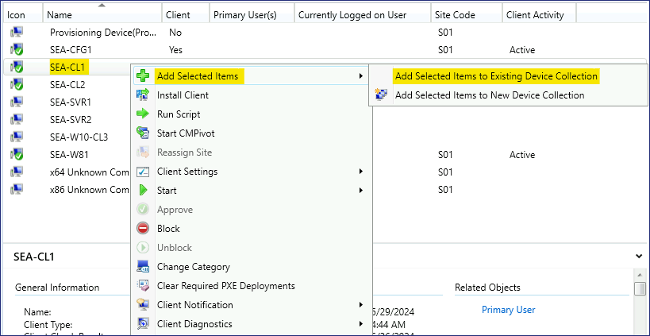
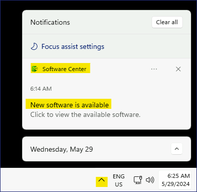
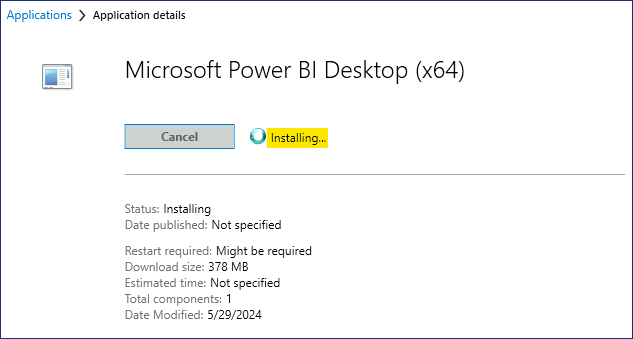

Atelier14 - Déploiement d'applications à l'aide d'Endpoint Configuration
Manager

**Résumé**

Dans cet atelier, vous allez utiliser Microsoft Endpoint Configuration
Manager pour déployer des applications sur des postes de travail clients
de bureau.

**Scénario**

Contoso utilise Microsoft Endpoint Configuration Manager pour gérer les
postes de travail de bureau dans l'environnement réseau Active Directory
local. Vous devez déployer une nouvelle application nommée Microsoft
Power BI desktop sur les clients Windows 11 Configuration Manager.
L'administrateur Endpoint Configuration Manager a déjà créé l'objet
d'application pour vous. Vos tâches incluent la création d'un
regroupement pour les appareils cibles, la distribution du contenu de
l'application aux points de distribution, puis la création du
déploiement attribué au regroupement cible. Vous vérifierez le processus
en vous assurant que l'application est affichée dans le Centre logiciel
sur SEA-CL1.

Tâche 1 : Créer une collection d'appareils

1.  Passez à [***SEA-CFG1***](urn:gd:lg:a:select-vm), connectez-vous en
    tant que [**Contoso\Administrator**](urn:gd:lg:a:send-vm-keys) avec
    le mot de passe !\ !!.

2.  Dans la barre des tâches, sélectionnez **Console du gestionnaire de
    configuration**. La console Microsoft Endpoint Configuration Manager
    s'ouvre.

> 

3.  Dans l'espace de travail **Assets and Compliance**  sélectionnez
    **Device Collections**..

> 

4.  Cliquez avec le bouton droit sur **Device Collections** , puis
    sélectionnez **Create Device Collection**. L'Assistant Création
    d'une collection de périphériques s'ouvre.

> 

5.  Sur la page **Général**, configurez les éléments suivants, puis
    sélectionnez **next** :

    - Nom : !\!!

    - Commentaire : !\!!

    - Limitation de la collecte : **All Windows 11 Workstations**

> 

6.  Sur la page **Règles d'adhésion**, sélectionnez **Next**. Dans
    l'avertissement du Gestionnaire de configuration, sélectionnez
    **OK.** Vous ajouterez un membre direct à une étape ultérieure.

> 
>
> 

7.  Sur la page **Résumé**, sélectionnez **next**, puis sur la page
    **Completion**, sélectionnez **close**.

> 
>
> La collection **Power BI App Deployment**  s'affiche dans la liste
> Collections de terminaux.
>
> 

Tâche 2 : Attribuer un appareil à une collection existante

1.  Dans l'espace de **travail Ressources et conformité**, sélectionnez
     **Devices.**

> Prenez note des appareils répertoriés. Tous les appareils qui ont un
> cercle vert avec une coche blanche sont actuellement actifs.
>
> 

2.  Dans le volet d'informations, sélectionnez **SEA-CL1**.

3.  Cliquez avec le bouton droit sur
    [***SEA-CL1***](urn:gd:lg:a:select-vm), pointez sur Ajouter les
    **éléments sélectionnés**, puis sélectionnez **Ajouter les éléments
    sélectionnés à la collection de périphériques existante**.

> 

4.  Dans la boîte de dialogue **Sélectionner une collection**,
    sélectionnez **Power BI App Deployment**, puis **OK.**

> 

5.  Pour vérifier, dans l'espace de **Assets and Compliance** ,
    sélectionnez **Regroupements** d'appareils, puis double-cliquez sur
    **Power BI App Deployment**.

> 
>
> [***SEA-CL1***](urn:gd:lg:a:select-vm) devrait être répertorié comme
> membre de cette collection.
>
> 

Tâche 3 : Configurer un type de déploiement

1.  Dans la console Microsoft Endpoint Configuration Manager,
    sélectionnez l'espace de **Software Library** .

> 

2.  Dans l'espace de **Software Library**  développez **Application
    Management** , puis sélectionnez **Applications**.

> 
>
> 
>
> Notez les applications qui ont été créées par l'administrateur
> Endpoint Configuration Manager.

3.  Dans le volet d'informations, sélectionnez **Microsoft Power BI
    Desktop (x64).**

> 

4.  Dans le volet des résultats, sélectionnez l' onglet **Types de
    déploiement**. Notez qu'il existe un type de déploiement basé sur
    Windows Installer.

> 

5.  Cliquez avec le bouton droit sur le type de déploiement **Microsoft
    Power BI Desktop (x64) - Windows Installer**, puis sélectionnez
    **Properties**.

> 

6.  Dans la boîte de dialogue **Propriétés,** sélectionnez l' onglet
    **Programmes**. Prenez note de la façon dont l'application est
    installée. Il utilisera msiexec avec le commutateur /q qui effectue
    une installation silencieuse.

> 

7.  Dans la boîte de dialogue **Properties**, sélectionnez l' onglet
    **Requirements** , puis sélectionnez **Add**.

> 

8.  Dans la **boîte de dialogue Créer un besoin**, configurez les
    éléments suivants, puis sélectionnez **OK** :

    - Catégorie : **Device**

    - Condition : **Operating System**

    - Type de règle : **Valeur**

    - Opérateur : **l'un des Windows 11 (cochez la case en regard de
      Windows 11)**

> 

9.  Dans la boîte de dialogue **Propriétés, s**électionnez **OK.** Cette
    exigence empêchera l'application de s'installer sur n'importe quel
    système d'exploitation, à l'exception de Windows 11.

> 

Tâche 4 : Distribuer le contenu aux points de distribution

1.  Dans l'espace de **Software Library** , sélectionnez **Microsoft
    Power BI Desktop (x64).**

2.  Cliquez avec le bouton droit sur **Microsoft Power BI Desktop
    (x64),** puis sélectionnez **Distribute Content**.

> 

3.  Sur la page **Général**, sélectionnez **Suivant**.

> 

4.  Sur la page **Contenu**, sélectionnez **Next**.

> 

5.  Sur la page **Destination du contenu**, sélectionnez **Add**, puis
    sélectionnez **Distribution Point**.

> 

6.  Dans la boîte de dialogue **Ajouter des points de distribution**,
    cochez la case en regard de **SEA-CFG1.CONTOSO.COM**, puis
    sélectionnez **OK**.

> 

7.  Sur la page **Content Destination** , sélectionnez **Next**.

> 

8.  Sur la **page Résumé**, sélectionnez **Next**, puis **Close**.

> 
>
> 

9.  Dans l' onglet **Résumé**, sélectionnez **Content Status**.

> 
>
> La page État du contenu s'ouvre pour Microsoft Power BI Desktop. Dans
> le volet des résultats, vérifiez qu'un cercle vert s'affiche et que
> Success :1 s'affiche en regard du cercle. Cela indique que le contenu
> est désormais distribué aux points de distribution et peut désormais
> être déployé sur les appareils. Vous devrez peut-être sélectionner le
> bouton Actualiser dans le ruban.
>
> 

10. Dans le coin supérieur gauche, sélectionnez la **Back to
    Applications**  pour revenir au nœud Applications de la bibliothèque
    de logiciels.

Tâche 5 : Créer un déploiement

1.  Dans l'espace de **Software Library** , sélectionnez **Microsoft
    Power BI Desktop (x64).**

2.  Cliquez avec le bouton droit sur **Microsoft Power BI Desktop
    (x64),** puis sélectionnez **Déployer**. L'**Assistant Déploiement
    de logiciel** s'ouvre.

> 

3.  Sur la page **General**, à côté de **Collection**, sélectionnez
    **Browse**..

> 

4.  Sur la page **Sélectionner une collection**, sélectionnez
    **Collections d'utilisateurs**, puis Collections sélectionnez
    **Device Collections**.

5.  Dans la liste **Device Collections** , sélectionnez **Power BI App
    Deployment** , puis **OK.**

> 

6.  Sur la page **General**, sélectionnez **Next**.

> 

7.  Sur la page **Content**, sélectionnez **Next**.

> 

8.  Sur la page **Paramètres de déploiement**, vérifiez que l'**action**
    est définie sur **Installer** et que l'**objectif** est défini sur
    **Disponible**. Sélectionnez **Next**.

> 

9.  Sur la page **Planification**, sélectionnez **Next**. L'application
    sera disponible dès que possible par défaut.

> 

10. Sur la page **Expérience utilisateur**, à côté de **Notifications
    utilisateur**, sélectionnez **Afficher dans le Centre logiciel et
    afficher toutes les notifications**. Sélectionnez **Next**.

> 

11. Sur la page **Alertes**, sélectionnez **Next**.

> 

12. Sur la page **Résumé**, sélectionnez **Next**, puis électionnez
    **close**.

> 
>
> 

13. Dans le volet des résultats, sous l' onglet **Deployments s**,
    vérifiez que le déploiement s'affiche.

> 

14. Fermez la console Microsoft Endpoint Configuration Manager.

15. Se déconnecter de [***SEA-CFG1***](urn:gd:lg:a:select-vm).

Tâche 6 : Utiliser le Centre logiciel pour installer une application
déployée

1.  Basculez vers [***SEA-CL1***](urn:gd:lg:a:select-vm) et
    connectez-vous en tant que
    [**Contoso\Administrator**](urn:gd:lg:a:send-vm-keys) avec le mot de
    passe !! [**Pa55w.rd**](urn:gd:lg:a:send-vm-keys) !!.

2.  Cliquez sur le **Start Menu** , puis entrez dans le **control
    panel.**

3.  Dans les résultats, sélectionnez **control panel**.

> 

4.  Dans le **Control panel**,, sélectionnez **System and Security**.

> 

5.  Dans **Système et sécurité**, sélectionnez **Configuration Manager**
    Propriétés du gestionnaire de configuration s'affiche.

> 

6.  Dans la boîte de dialogue **Configuration Manager
    Properties** sélectionnez l' onglet **Actions**.

> 

7.  Sous l' **onglet Actions**, sélectionnez **Machine Policy Retrieval
    & Evaluation Cycle**, puis sélectionnez **Run now**. À l'invite du
    message, sélectionnez **OK.**

> 
>
> 

8.  Sélectionnez **OK** pour fermer les propriétés du **Configuration
    Manager Properties**, puis fermez **Control panel**.

> 

9.  Dans la zone de notification, sélectionnez **Nouveau logiciel
    disponible**, puis Ouvrir **pen Software Center**. Vous devrez
    peut-être développer la flèche de la zone de notification pour
    afficher l'icône.

> 
>
> Si le Centre logiciel ne se lance pas, cliquez sur le **Start Menu**
> et faites défiler vers le bas et cliquez sur !! **Software Center**!!
>
> 

10. Dans le **Software Center**, dans la page **Applications**, notez la
    nouvelle application disponible nommée **Microsoft Power BI Desktop
    (x64).** Cette application est désormais disponible pour tout
    appareil membre de la collection **Power BI App Deployment** créée
    précédemment.

> 

11. Sélectionnez **Microsoft Power BI Desktop (x64),** puis Sélectionnez
    **Install**.

> 
>
> 
>
> L'application se télécharge et s'installe sans intervention de
> l'utilisateur. Vous saurez que l'installation a réussi lorsque le
> **Power BI Desktop**  s'affiche sur le bureau.
>
> 

12. Fermez le Centre logiciel.

13. Se déconnecter de [***SEA-CL1***](urn:gd:lg:a:select-vm).

**Résultats** : Une fois cet exercice terminé, vous aurez utilisé
Microsoft Endpoint Configuration Manager pour déployer des applications
sur des postes de travail clients de bureau.
