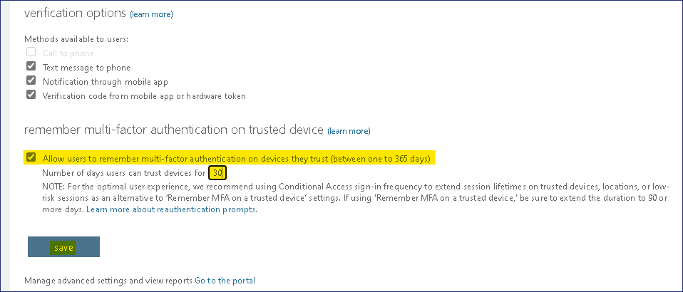
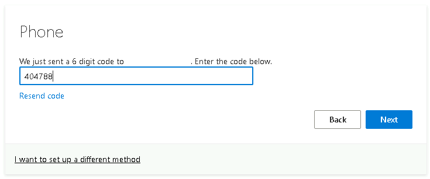
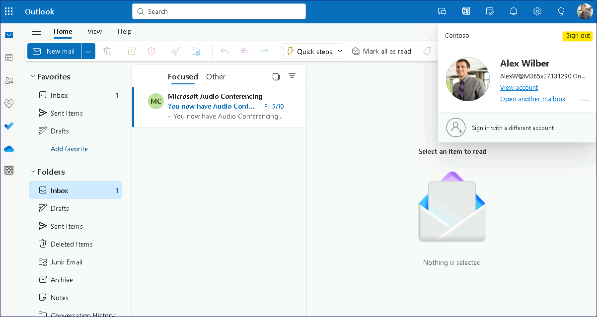

實驗 15 - 配置多重身份驗證

**總結**

在本實驗中，您將配置每用戶多重身份驗證 （MFA） 並使用條件訪問策略應用
MFA。

練習 1：配置每用戶多重身份驗證。

**場景**

要為用戶登錄事件提供額外的安全性，您需要配置和測試多重身份驗證
（MFA）。您決定首先測試每用戶 MFA。Alex Wilber 已同意為您驗證設置。

任務 1：在啟用 MFA 之前驗證登錄

1.  切換並登錄 [**SEA-WS3**](urn:gd:lg:a:select-vm) 為 !\!!
    用密碼 !\!!

2.  在任務欄上，選擇 **Microsoft
    Edge**。在地址欄中，輸入 !\!!，然後按
    Enter 鍵。

3.  在 **Sign in** （登錄） 頁面，輸入
    !!**AlexW@M365xXXXXXXX.onmicrosoft.com**!!，然後選擇 **Next**。

4.  在 **Enter password** （輸入密碼） 頁面上，輸入 !!**P@55w.rd1234**!!
    ，然後選擇 **Sign in** （登錄）。在 Edge Save password
    提示符處，選擇 **Save** （保存）。

> Outlook 網頁版將打開。請注意，登錄 Outlook 網頁版只需要密碼。

5.  在右上角，選擇 **Account manager for Alex Wilber**，然後選擇 **Sign
    out** （注銷）。

> 

6.  關閉 Microsoft Edge。

任務 2：為用戶啟用 MFA

1.  切換到 [**SEA-SVR1**](urn:gd:lg:a:select-vm)。
    在 [**SEA-SVR1**](urn:gd:lg:a:select-vm)上，如有必要，請以
     [**Contoso\Administrator**](urn:gd:lg:a:send-vm-keys) 請使用密碼 !!
    [**Pa55w.rd**](urn:gd:lg:a:send-vm-keys)!!  並關閉 **Server
    Manager**。

2.  在任務欄上選擇 **Microsoft Edge**，導航到 **Microsoft Entra
    管理中心** !!**https://Entra.Microsoft.com**!!

3.  使用 **Office 365 Tenant admin** 憑據登錄。

> 
>
> 此時將打開 **Microsoft Entra 管理中心**。

4.  在 **Microsoft Entra 管理中心**的導航窗格中，展開 “**Identity**”
    ，然後選擇 “**Users**” 。

5.  選擇 **All users** （所有用戶），然後在結果窗格頂部選擇 **Per-user
    MFA** （每用戶 MFA）。您可能需要先選擇省略號才能查看 **Per-user
    MFA** （每用戶 MFA） 選項。

> 

6.  在 Multi-Factor Authentication 頁面上，選擇 **Service settings**
    （服務設置）。

> 

7.  向下滾動到 **verification options** （驗證選項） 部分。

> 記下可為用戶驗證配置的各種方法。

8.  在 **Remember multi-factor authentication on trusted device**
    （在受信任的設備上記住多重身份驗證） 部分中，選中 **Allow users to
    remember multi-factor authentication on devices they trust**
    （允許用戶在他們信任的設備上記住多重身份驗證） 旁邊的複選框。

9.  在 **Number of days users can trust devices for**
    （用戶可以信任設備的天數） 旁邊，輸入 **30** 並選擇 **Save**
    （保存）。出現提示時選擇 **close** 。

> 
>
> 

10. 在頁面頂部的 **multi-factor authentication** （多重身份驗證）
    下，選擇 **users** （用戶）。

> 

11. 在用戶列表中，選中 **Alex Wilber** 旁邊的複選框。

12. 在 Alex Wilber 頁面中，選擇 **Enable**。

> 

13. 在 **About enabling multi-factor auth** （關於啟用多重身份驗證）
    消息中，選擇 **enable multi-factor auth** （啟用多重身份驗證）。

> 

14. 在 **Updates successful**（更新成功）消息中，選擇
    **close**（關閉）。請注意，Alex Wilber 的 **Multi-Factor Auth
    Status** （多重身份驗證狀態） 現在為 **Enabled** （已啟用）。

> 
>
> 

15. 關閉 Microsoft Edge。

任務 3：註冊和驗證 MFA

1.  切換到 [**SEA-WS3**](urn:gd:lg:a:select-vm)。 在任務欄上，選擇
    **Microsoft Edge**。

2.  在地址欄中，輸入 !\!!，然後按
    **Enter** 鍵。

3.  在 **Pick an account** （選擇帳戶）
    頁面上，選擇 !\!!

> 

4.  在 **Enter password** （輸入密碼）
    頁面上，輸入 !!**P@55w.rd1234**!!**，**然後選擇 **Sign in**
    （登錄）。

5.  在 “**More information required**” 頁面上，選擇 “**Next”**
    。此時將打開 Keep your account secure 頁面。

> 
>
> 通常，您需要使用 Microsoft Authenticator
> 應用程序來管理多重身份驗證。但是，對於此實驗方案，您將使用短信。

6.  在 **Keep your account secure** （確保您的賬戶安全） 頁面上，選擇
    **I want to set up a different method** （我想設置其他方法）。

> 

7.  在 **Choose a different method** 對話框中，選擇 **Phone**
    （電話），然後選擇 **Confirm** （確認）。

> 

8.  在 **Phone** （電話） 頁面上，輸入您可以接收短信的手機號碼，然後選擇
    **Next** （下一步）。

> 

9.  收到短信形式的驗證碼後，在 **Phone** （電話）
    頁面上指示的位置輸入驗證碼，然後選擇 **Next** （下一步）。

> 

10. 在 SMS 驗證消息中，選擇 **Next**（下一步），然後選擇
    **Done**（完成）。

> 
>
> 

11. 在 “保持登錄狀態” 消息中，選擇 “**No**”。

> 
>
> Outlook 網頁版將打開 Alex Wilber 的收件箱。

12. 在右上角，選擇 **Account manager for Alex Wilber**，然後選擇 **Sign
    out** （注銷）。

> 
>
> **注意：**用戶只需在首次使用 MFA
> 時進行註冊。後續登錄只需要提供驗證碼，該驗證碼會發送到您在註冊時輸入的電話號碼。

13. 在地址欄中，輸入 !\!!，然後按
    Enter 鍵。

14. 在 **Pick an account** （選擇帳戶）
    頁面上，選擇 !!**AlexW@M365xXXXXXXXX.onmicrosoft.com**!!

15. 在 **Enter password** （輸入密碼）
    頁面上，輸入 !!**P@55w.rd1234**!!**，**然後選擇 **Sign in**
    （登錄）。

> 
>
> **Verify your identity** （驗證您的身份）
> 提示隨即打開。請注意，它包含電話號碼的最後兩位數字。

16. 在 **Verify your identity** （驗證您的身份）
    提示符處，選擇您的文本電話號碼。

17. 在 **Enter code** （輸入代碼）
    頁面上，輸入發送到您的移動電話的代碼，然後選擇 **Verify** （驗證）。

> 
>
> 請注意，您可以選中一個複選框，在 30 天內不再要求驗證。

18. 由於 **Microsoft Authenticator App**
    確保更高的安全性和流暢的體驗，系統將提示您配置相同的內容，現在單擊
    **Skip for now**

> 

19. 在 “保持登錄狀態” 消息中，選擇 “**No**”。Outlook 網頁版將打開 Alex
    Wilber 的收件箱。

> 

20. 在右上角，選擇 **Account manager for Alex Wilber**，然後選擇 **Sign
    out** （注銷）。

> 

21. 關閉 Microsoft Edge。

任務 3：刪除每用戶 MFA

1.  切換到 [**SEA-SVR1**](urn:gd:lg:a:select-vm)。在 [**SEA-SVR1**](urn:gd:lg:a:select-vm)上，
    如有必要，請以 [**Contoso\Administrator**](urn:gd:lg:a:send-vm-keys) 使用密碼 
    !\!! 並關閉 **Server
    Manager**。

2.  在任務欄上選擇 **Microsoft Edge**，導航到 **Microsoft Entra
    管理中心** !!**https://Entra.Microsoft.com**!!

3.  使用 **Office 365 租戶管理員**憑據登錄。

> 
>
> 此時將打開 **Microsoft Entra 管理中心**。

4.  在 **Microsoft Entra 管理中心**的導航窗格中，展開 “**Identity**”
    ，然後選擇 “**Users**” 。

5.  選擇 **All users** （所有用戶），然後在結果窗格頂部選擇 **Per-user
    MFA** （每用戶 MFA）。您可能需要先選擇省略號才能查看 **Per-user
    MFA** （每用戶 MFA） 選項。

> 

6.  在頁面頂部的 **multi-factor authentication** （多重身份驗證）
    下，選擇 **users** （用戶）。

7.  在用戶列表中，選中 **Alex Wilber** 旁邊的複選框。

> 請注意，Alex Wilber 的 **Multi-Factor Auth Status** 現在設置為
> **Enforced**（強制）（之前設置為 Enabled）。這是因為 Alex
> 已註冊並正在使用 MFA。
>
> 

8.  在 Alex Wilber 頁面中，選擇 **Manage user settings**
    （管理用戶設置）。

> 

9.  在 Manage user settings （管理用戶設置）
    框中，選中所有三個選項旁邊的複選框，選擇 **Save** （保存），然後選擇
    **close** （關閉）。

> 
>
> 這些選項將刪除 Alex 的所有已保存 MFA 設置。
>
> 

10. 在用戶列表中，選中 **Alex Wilber** 旁邊的複選框。

11. 在 Alex Wilber 頁面中，選擇 **Disable** （禁用）。

> 

12. 在 **Disable multi-factor authentication** 消息中，選擇 **yes**。

> 

13. 在 **Updates successful**（更新成功）消息中，選擇
    **close**（關閉）。

> 
>
> 請注意，Alex Wilber 的 **Multi-Factor Auth Status**
> （多重身份驗證狀態） 現在為 **Disabled** （禁用）。
>
> 

14. 關閉 Microsoft Edge。

**結果：**完成本練習後，您將成功配置每用戶多重身份驗證。

練習 2：使用條件訪問配置多重身份驗證

**場景**

要為用戶登錄事件提供額外的安全性，您需要配置和測試多重身份驗證
（MFA）。您決定使用條件訪問策略為您的 MFA 要求提供更大的靈活性。Alex
Wilber 已同意為您驗證設置。

任務 1：在使用 MFA 啟用條件訪問之前驗證登錄

1.  切換並登錄 [**SEA-WS3**](urn:gd:lg:a:select-vm) 為 !\!!
     用密碼 !\!!

2.  在任務欄上，選擇 **Microsoft
    Edge**。在地址欄中，輸入 !\!!
    ，然後按 Enter 鍵。

3.  在 **Sign in** （登錄）
    頁面，輸入 !!**AlexW@M365xXXXXXXX.onmicrosoft.com**!! ，然後選擇
    **Next**。

4.  在  **Enter password** （輸入密碼）
    頁面上，輸入 !!**P@55w.rd1234**!!，然後選擇 **Sign in** （登錄）。在
    Edge Save password 提示符處，選擇 **Save** （保存）。

> Outlook 網頁版將打開。請注意，登錄 Outlook 網頁版只需要密碼。

5.  在右上角，選擇 **Account manager for Alex Wilber**，然後選擇 **Sign
    out** （注銷）。

> 

6.  關閉 Microsoft Edge。

任務 2：使用 MFA 配置條件訪問

1.  切換到 [**SEA-SVR1**](urn:gd:lg:a:select-vm).
    在 [**SEA-SVR1**](urn:gd:lg:a:select-vm)上，如有必要，請以 [**Contoso\Administrator**](urn:gd:lg:a:send-vm-keys) 使用密碼 
    !\!!  並關閉 **Server
    Manager**。

2.  在任務欄上選擇 **Microsoft Edge**，導航到 **Microsoft Entra
    管理中心** !!**https://Entra.Microsoft.com**!!

3.  使用 **Office 365 租戶管理員**憑據登錄。

> 
>
> 此時將打開 **Microsoft Entra 管理中心**。

4.  在 **Microsoft Entra 管理中心**的導航窗格中，依次展開 “**Identity**”
    、 “**Protection**”和“**Conditional Access**” 。

> 

5.  在 “**Conditional Access**” 頁上，選擇 “**Policies**”，然後選擇 “**+
    New policy**” 。

> 

6.  在 **New Conditional access policy** （新建條件訪問策略） 頁面的
    **Name** （名稱） 框中，輸入 !\!!。

7.  在 “**Assignments**” 下，選擇 “**0 users or workload identities
    selected**” 。

> 

8.  在 Users and groups （用戶和組） 窗格中，選擇 **Select users and
    groups** （選擇用戶和組） 旁邊的選項，然後選中 **Users and groups**
    （用戶和組） 旁邊的複選框。

9.  在 **Select** 頁面上，選擇 **Alex Wilber**，然後單擊 **Select**。

> 
>
> 請注意，通常您會指定一個組，但在本練習中，我們只在 Alex Wilber
> 上測試設置。

10. 在 Target resources （目標資源） 下選擇 **No target resources
    selected** （未選擇目標資源），然後單擊 **Select
    apps**（選擇應用程序）。

> 

11. 在 **Select** （選擇） 頁面上，選中  **Office
    365** 旁邊的複選框，然後單擊 **Select** （選擇）。

> 

12. 在 **Access controls** 下的 **Grant** 部分中，選擇 **0 controls
    selected**。

> 

13. 在 **Grant** （授予） 頁面上，選擇 **Grant access**
    （授予訪問權限），選中 **Require multi-factor authentication**
    （需要多重身份驗證） 旁邊的複選框，然後單擊 **Select** （選擇）。

> 

14. 在 **Enable policy** （啟用策略） 下，選擇 **On** （打開）。

15. 選擇 **Create** （創建） 以創建 Contoso MFA 策略。請注意，該策略以
    State （狀態） 為 **On** （開啟） 列出。

> 
>
> 

16. 在 **Microsoft Entra 管理中心**中，選擇 “**Users**” 。在 User
    （用戶） 列表中，選擇 **Alex Wilber**。

> 

17. 在 Alex Wilber 頁面上，選擇 **Authentication methods**。

> 
>
> 請注意，已經為 Alex 配置了電話號碼，

18. 關閉Microsoft Edge。

任務 3：驗證條件訪問 MFA

1.  切換到 [**SEA-WS3**](urn:gd:lg:a:select-vm)。 在任務欄上，選擇
    **Microsoft Edge**。

2.  在地址欄中，輸入 !\!!，然後按
    Enter 鍵。

3.  在 **Pick an account** （選擇帳戶） 頁面上，選擇
    !!**AlexW@M365xXXXXXXX.onmicrosoft.com**!!

> 

4.  在 **Enter password** （輸入密碼）
    頁面上，輸入 !!**P@55w.rd1234**!!**，**然後選擇 **Sign in**
    （登錄）。

5.  在 **Verify your identity** （驗證您的身份）
    提示符處，選擇您的文本電話號碼。

> 

6.  在 **Enter code** （輸入代碼）
    頁面上，輸入發送到您的移動電話的代碼，然後選擇 **Verify** （驗證）。

> 
>
> 請注意，您可以選中一個複選框，在 30 天內不再要求驗證。

7.  在 “保持登錄狀態” 消息中，選擇 “**No**”。Outlook 網頁版將打開 Alex
    Wilber 的收件箱。

> 

8.  在右上角，選擇 **Account manager for Alex Wilber**，然後選擇 **Sign
    out** （注銷）。

> 

9.  關閉Microsoft Edge。

任務 4：刪除條件訪問 MFA

1.  切換到 [**SEA-SVR1**](urn:gd:lg:a:select-vm)。
    在 [**SEA-SVR1**](urn:gd:lg:a:select-vm)上，如有必要，請以 [**Contoso\Administrator**](urn:gd:lg:a:send-vm-keys) 使用密碼
    !\!!  並關閉 **Server
    Manager**。

2.  在任務欄上選擇 **Microsoft Edge**，導航到 **Microsoft Entra
    管理中心**!!**https://Entra.Microsoft.com**!!

3.  使用 **Office 365 租戶管理員**憑據登錄。

> 
>
> 此時將打開 **Microsoft Entra 管理中心**。

4.  在 **Microsoft Entra 管理中心**的導航窗格中，依次展開 “**Identity**”
    、 “**Protection**” 和“**Conditional Access**” 。

> 

5.  在 “**Conditional Access**” 頁面上，選擇 “**Policies**” ，然後選擇
    “**Contoso MFA Policy**” 。

6.  在 **Contoso MFA Policy** （Contoso MFA 策略） 頁面上，選擇
    **Delete** （刪除），然後選擇 **Delete** （刪除）。

> 
>
> 

7.  對於 **Delete** 確認，單擊 **Delete** 按鈕。

> 
>
> 

8.  關閉Microsoft Edge。

**結果：**完成本練習後，您將使用條件訪問策略成功配置多重身份驗證。
