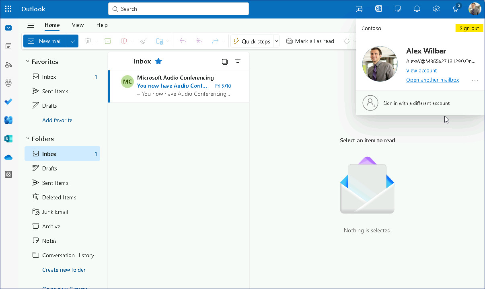
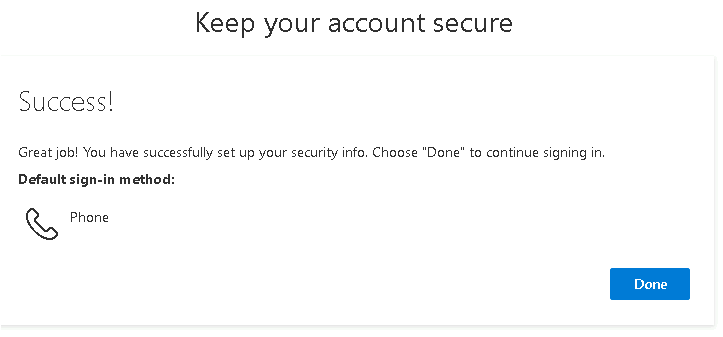

Atelier 15 : configuration de l'authentification multifacteur

**Résumé**

Dans cet atelier, vous allez configurer l'authentification multifacteur
(MFA) par utilisateur et appliquer l'authentification multifacteur à
l'aide d'une stratégie d'accès conditionnel.

Exercice 1 : Configurer l'authentification multifacteur par utilisateur.

**Scénario**

Pour fournir une sécurité supplémentaire pour les événements
d'authentification de l'utilisateur, vous devez configurer et tester
l'authentification multifacteur (MFA). Vous décidez de tester d'abord
l'authentification multifacteur par utilisateur. Alex Wilber a accepté
de valider les paramètres pour vous.

Tâche 1 : Valider la connexion avant d'activer l'authentification
multifacteur

1.  Basculez et connectez-vous à [**SEA-WS3**](urn:gd:lg:a:select-vm) en
    tant que !\ !! avec le mot de
    passe !\ !!

2.  Dans la barre des tâches, sélectionnez **Microsoft Edge**. Dans la
    barre d'adresse, entrez
    !\ !! et appuyez
    sur Entrée.

3.  Sur la page **de connexion**, entrez
    !!**AlexW@M365xXXXXXXX.onmicrosoft.com** !! , puis sélectionnez
    **Next**.

4.  Sur la page Entrer le **mot de passe**, entrez !!**P@55w.rd1234** !!
    et sélectionnez **Se connecter**. À l'invite Edge Save password,
    sélectionnez **Save**.

> Outlook sur le Web s'ouvre. Notez que seul le mot de passe était
> requis pour se connecter à Outlook sur le Web.

5.  Dans le coin supérieur droit, sélectionnez le gestionnaire de
    **compte pour Alex Wilber**, puis sélectionnez **Sign out**.

> 

6.  Fermez Microsoft Edge.

Tâche 2 : Activer l'authentification multifacteur pour un utilisateur

1.  Passez à [**SEA-SVR1**](urn:gd:lg:a:select-vm). Sur
    [**SEA-SVR1**](urn:gd:lg:a:select-vm), si nécessaire, connectez-vous
    en tant que [**Contoso\Administrator**](urn:gd:lg:a:send-vm-keys)
    avec le mot de passe !! [**Pa55w.rd**](urn:gd:lg:a:send-vm-keys) !!
    et fermez le **Server Manager**.

2.  Dans la barre des tâches, sélectionnez **Microsoft Edge**, accédez
    au **Office 365 Tenant admin** !!**https://Entra.Microsoft.com** !!

3.  Connectez-vous avec les informations d'identification de **Office
    365 Tenant admin**.

> 
>
> Le **Microsoft Entra admin center** s'ouvre.

4.  Dans le **Microsoft Entra admin center**,dans le volet de
    navigation, développez **Identity**, puis sélectionnez **Users**.

5.  Sélectionnez **All users** , puis en haut du volet de résultats,
    sélectionnez **Per-user MFA**. Vous devrez peut-être d'abord
    sélectionner l'ellipse pour afficher l' option **Per-user MFA** .

> 

6.  Sur la page Authentification multifacteur, sélectionnez **service
    settings**.

> 

7.  Faites défiler la page jusqu'à la **section des options de
    vérification**.

> Prenez note des différentes méthodes qui peuvent être configurées pour
> la vérification de l'utilisateur.

8.  Dans la section Mémoriser l**'authentification multifacteur sur un
    appareil approuvé**, cochez la case en regard de Autoriser **les
    utilisateurs à se souvenir de l'authentification multifacteur sur
    les appareils qu'ils approuvent**.

9.  À côté **de Nombre de jours pendant lesquels les utilisateurs
    peuvent approuver les appareils**, saisissez **30,** puis
    sélectionnez **Save**. Sélectionnez **Close** lorsque vous y êtes
    invité.

> 
>
> 

10. En haut de la page, sous **multi-factor authentication**,
    sélectionnez **Users**.

> 

11. Dans la liste des utilisateurs, cochez la case en regard d'**Alex
    Wilber**.

12. Sur la page Alex Wilber, sélectionnez **Activer**.

> 

13. Dans le message À propos de l**'activation de l'authentification
    multifacteur**, sélectionnez **enable multi-factor auth**.

> 

14. Dans le **message Mises à jour** **réussies**, sélectionnez
    **Close**. Notez que le **Multi-Factor Auth Status** pour Alex
    Wilber est désormais **activé**.

> 
>
> 

15. Fermez Microsoft Edge.

Tâche 3 : Enregistrement et validation de MFA

1.  Passez à [**SEA-WS3**](urn:gd:lg:a:select-vm). Dans la barre des
    tâches, sélectionnez **Microsoft Edge**.

2.  Dans la barre d'adresse, entrez
    !\ !! et appuyez
    sur Entrée.

3.  Sur la page **Choisir un compte**, sélectionnez
    !\ !!

> 

4.  Sur la page Entrer le **mot de passe**, entrez !!**P@55w.rd1234** !!
    et sélectionnez **Sign in**.

5.  Sur la page **Plus d'informations requises**, sélectionnez **Next**.
    La page Protégez votre compte s'ouvre.

> 
>
> En règle générale, vous souhaiterez utiliser Microsoft Authenticator
> app pour gérer l'authentification multifacteur. Toutefois, pour ce
> scénario de laboratoire, vous utiliserez des SMS.

6.  Sur la **page Protégez votre compte**, sélectionnez **Je souhaite
    configurer une autre méthode**.

> 

7.  Dans la **boîte de dialogue** Choisir une autre méthode**,**
    sélectionnez **Téléphone**, puis sélectionnez **Confirm**.

> 

8.  Sur la page **Téléphone**, entrez votre numéro de téléphone mobile
    auquel vous pouvez recevoir des SMS, puis sélectionnez **Next**.

> 

9.  Une fois que vous avez reçu le code de vérification sous forme de
    SMS, entrez le code à l'endroit indiqué sur la page **Téléphone**,
    puis sélectionnez **Next**.

> 

10. Dans le message vérifié par SMS, sélectionnez **Next**, puis
    sélectionnez **Done**.

> 
>
> 

11. Dans le message Rester connecté, sélectionnez **No**.

> 
>
> Outlook sur le Web s'ouvre dans la boîte de réception d'Alex Wilber.

12. Dans le coin supérieur droit, sélectionnez le **gestionnaire de**
    **compte pour Alex Wilber**, puis sélectionnez **Sign out**.

> 
>
> **Remarque** : Les utilisateurs n'ont qu'à s'inscrire la première fois
> qu'ils utilisent l'authentification multifacteur. Les connexions
> ultérieures ne nécessitent que la fourniture du code de validation,
> qu'il a envoyé par SMS au numéro de téléphone que vous avez saisi lors
> de l'inscription.

13. Dans la barre d'adresse, entrez
    !\ !! et appuyez
    sur Entrée.

14. Sur la page **Choisir un compte**, sélectionnez
    !!**AlexW@M365xXXXXXXXX.onmicrosoft.com** !!

15. Sur la page Entrer le **mot de passe**, entrez !!**P@55w.rd1234** !!
    et sélectionnez **Sign in**.

> 
>
> L' invite **Vérifier votre identité** s'ouvre. Notez qu'il contient
> les deux derniers chiffres de votre numéro de téléphone.

16. À l' invite **Vérifier votre identité**, sélectionnez votre numéro
    de téléphone SMS.

17. Sur la page **Entrer le code**, entrez le code envoyé sur votre
    téléphone mobile, puis sélectionnez **Vérify.**

> 
>
> Notez que vous pouvez cocher une case pour ne pas demander à nouveau
> la vérification pendant 30 jours.

18. Comme **Microsoft Authenticator** garantit plus de sécurité et une
    expérience fluide, vous serez invité à configurer la même, pour
    l'instant, cliquez sur **Skip for now**

> 

19. Dans le message Rester connecté, sélectionnez **No**. Outlook sur le
    Web s'ouvre dans la boîte de réception d'Alex Wilber.

> 

20. Dans le coin supérieur droit, sélectionnez le **gestionnaire de**
    **compte pour Alex Wilber**, puis sélectionnez **Sign out**.

> 

21. Fermez Microsoft Edge.

Tâche 3 : Supprimer par utilisateur de MFA

1.  Passez à [**SEA-SVR1**](urn:gd:lg:a:select-vm). Sur
    [**SEA-SVR1**](urn:gd:lg:a:select-vm), si nécessaire, connectez-vous
    en tant que [**Contoso\Administrator**](urn:gd:lg:a:send-vm-keys)
    avec le mot de passe !! [**Pa55w.rd**](urn:gd:lg:a:send-vm-keys) !!
    et fermez le **Server Manager**.

2.  Dans la barre des tâches, sélectionnez **Microsoft Edge**, accédez
    au **Microsoft Entra admin center**
    !!**https://Entra.Microsoft.com** !!

3.  Connectez-vous avec les informations d'identification de **Office
    365 Tenant admin**

> 
>
> Le **Microsoft Entra admin center** s'ouvre.

4.  Dans le **Microsoft Entra admin center**, dans le volet de
    navigation, développez **Identity**, puis sélectionnez **Users**.

5.  Sélectionnez Select **All users** , puis en haut du volet de
    résultats, sélectionnez **Per-user MFA**. Vous devrez peut-être
    d'abord sélectionner l'ellipse pour afficher l' option **Per-user
    MFA** .

> 

6.  En haut de la page, sous **multi-factor authentication**,
    sélectionnez **Users**.

7.  Dans la liste des utilisateurs, cochez la case en regard d'**Alex
    Wilber**.

> Notez que le statut **Multi-Factor Auth Status**  pour Alex Wilber est
> désormais défini sur **enforced** (au lieu de Activé). En effet, Alex
> s'est inscrit et utilize MFA.
>
> 

8.  Sur la page Alex Wilber, sélectionnez **Manage user settings.**

> 

9.  Dans la zone Gérer les paramètres utilisateur, cochez la case en
    regard des trois options, sélectionnez **Save**, puis sélectionnez
    **Close.**

> 
>
> Ces options supprimeront tous les paramètres MFA enregistrés pour
> Alex.
>
> 

10. Dans la liste des utilisateurs, cochez la case en regard d'**Alex
    Wilber**.

11. Sur la page Alex Wilber, sélectionnez **Disable**.

> 

12. Dans le message **Désactiver l'authentification multifacteur**,
    sélectionnez **Yes**.

> 

13. Dans le **message Mises à jour** réussies, sélectionnez **Close**.

> 
>
> Notez que le **statut d'authentification multifacteur** pour Alex
> Wilber est désormais **désactivé**.
>
> 

14. Fermez Microsoft Edge.

**Résultats** : Une fois cet exercice terminé, vous aurez configuré avec
succès l'authentification multifacteur par utilisateur.

Exercice 2 : Configurer l'authentification multifacteur à l'aide de
l'accès conditionnel

**Scénario**

Pour fournir une sécurité supplémentaire pour les événements
d'authentification de l'utilisateur, vous devez configurer et tester
l'authentification multifacteur (MFA). Vous décidez que l'utilisation
d'une politique d'accès conditionnel offre une plus grande flexibilité
pour vos exigences MFA. Alex Wilber a accepté de valider les paramètres
pour vous.

Tâche 1 : Valider la connexion avant d'activer l'accès conditionnel avec
MFA

1.  Basculez et connectez-vous à [**SEA-WS3**](urn:gd:lg:a:select-vm) en
    tant que !\ !! avec le mot de
    passe !\ !!

2.  Dans la barre des tâches, sélectionnez **Microsoft Edge**. Dans la
    barre d'adresse, entrez
    !\ !! et appuyez
    sur Entrée.

3.  Sur la page **Sign In**, entrez
    !!**AlexW@M365xXXXXXXX.onmicrosoft.com** !! , puis sélectionnez
    **Next**.

4.  Sur la page Entrer le **mot de passe**, entrez !!**P@55w.rd1234** !!
    et sélectionnez **Se connecter**. À l'invite Edge Save password,
    sélectionnez **Enregistrer**.

> Outlook sur le Web s'ouvre. Notez que seul le mot de passe était
> requis pour se connecter à Outlook sur le Web.

5.  Dans le coin supérieur droit, sélectionnez le gestionnaire de
    **compte pour Alex Wilber**, puis sélectionnez **Sign out**.

> 

6.  Fermez Microsoft Edge.

Tâche 2 : Configurer l'accès conditionnel avec MFA

1.  Passez à [**SEA-SVR1**](urn:gd:lg:a:select-vm). Sur
    [**SEA-SVR1**](urn:gd:lg:a:select-vm), si nécessaire, connectez-vous
    en tant que [**Contoso\Administrator**](urn:gd:lg:a:send-vm-keys)
    avec le mot de passe !! [**Pa55w.rd**](urn:gd:lg:a:send-vm-keys) !!
    et fermez le **Server Manager**.

2.  Dans la barre des tâches, sélectionnez **Microsoft Edge**, accédez
    au **c** to **Microsoft Entra admin
    center**!!**https://Entra.Microsoft.com** !!

3.  Connectez-vous avec les informations d'identification de **Office
    365 Tenant admin**.

> 
>
> Le **centre Microsoft Entra admin center** s'ouvre.

4.  Dans le **Microsoft Entra admin center**, dans le volet de
    navigation, développez **Identity**, puis Protection, puis
    **Conditional Access.**

> 

5.  Sur la page **Accès conditionnel**, sélectionnez **Policies**, puis
    **+ New policy**.

> 

6.  Sur la page **Nouvelle politique d'accès conditionnel**, dans la
    zone **Nom**, entrez !\ !.

7.  Sous **Assignments**, sélectionnez **0 users or workload identities
    selected**.

> 

8.  Dans le volet Utilisateurs et groupes, sélectionnez l'option en
    regard de **Select users and groups** , puis activez la case à
    cocher en regard de **Users and groups**.

9.  Dans la page **Sélectionner**, sélectionnez **Alex Wilber**, puis
    cliquez sur **Select**.

> 
>
> Notez qu'en règle générale, vous spécifiez un groupe, mais pour cet
> exercice, nous allons simplement tester le réglage sur Alex Wilber.

10. Sélectionnez **Aucune ressource cible sélectionnée** sous Ressources
    cibles, puis cliquez sur **Select apps**.

> 

11. Dans la page **Sélectionner**, activez la case à cocher en regard
    d'**Office 365,** puis cliquez sur **Select**.

> 

12. Sous **Contrôles d'accès**, dans la section **Accord,** sélectionnez
    **0 controls selected**.

> 

13. Sur la **page Accorder, sélectionnez** Accorder l'accès**, Require
    multi-factor authentication** **,** puis cliquez sur **Select.**

> 

14. Sous **Enable policy**, sélectionnez **On**.

15. Sélectionnez **Create** pour créer la stratégie MFA Contoso. Notez
    que la stratégie est répertoriée avec l'état **On**.

> 
>
> 

16. Dans le **Microsoft Entra admin center**, sélectionnez **Users**.
    Dans la liste Utilisateur, sélectionnez **Alex Wilber**.

> 

17. Sur la page Alex Wilber, sélectionnez **Authentication methods**.

> 
>
> Notez qu'un numéro de téléphone a déjà été configuré pour Alex,

18. Fermez Microsoft Edge.

Tâche 3 : Valider L'accès conditionnel de MFA

1.  Passez à [**SEA-WS3**](urn:gd:lg:a:select-vm). Dans la barre des
    tâches, sélectionnez **Microsoft Edge**.

2.  Dans la barre d'adresse, entrez
    !\ !! et appuyez
    sur Entrée.

3.  Sur la page **Choisir un compte**, sélectionnez
    !!**AlexW@M365xXXXXXXX.onmicrosoft.com** !!

> 

4.  Sur la page Entrer le **mot de passe**, entrez !!**P@55w.rd1234** !!
    et sélectionnez **Sign in** .

5.  À l' invite **Vérifier votre identité**, sélectionnez votre numéro
    de téléphone SMS.

> 

6.  Sur la page **Entrer le code**, entrez le code envoyé sur votre
    téléphone mobile, puis sélectionnez **Verify**.

> 
>
> Notez que vous pouvez cocher une case pour ne pas demander à nouveau
> la vérification pendant 30 jours.

7.  Dans le message Rester connecté, sélectionnez **No**. Outlook sur le
    Web s'ouvre dans la boîte de réception d'Alex Wilber.

> 

8.  Dans le coin supérieur droit, sélectionnez le gestionnaire de
    **compte pour Alex Wilber**, puis sélectionnez **Sign out**.

> 

9.  Fermez Microsoft Edge.

Tâche 4 : Supprimer L'accès conditionnel de MFA

1.  Passez à [**SEA-SVR1**](urn:gd:lg:a:select-vm). Sur
    [**SEA-SVR1**](urn:gd:lg:a:select-vm), si nécessaire, connectez-vous
    en tant que [**Contoso\Administrator**](urn:gd:lg:a:send-vm-keys)
    avec le mot de passe !! [**Pa55w.rd**](urn:gd:lg:a:send-vm-keys) !!
    et fermez le **Server Manager**.

2.  Dans la barre des tâches, sélectionnez **Microsoft Edge**, accédez
    au **Microsoft Entra admin
    center** !!**https://Entra.Microsoft.com** !!

3.  Connectez-vous avec les informations d'identification de **Office
    365 Tenant admin.**

> 
>
> Le **Microsoft Entra admin center** s'ouvre.

4.  Dans le **Microsoft Entra admin center**, dans le volet de
    navigation, développez **Identity**, puis Protection, puis
    **Conditional Access.**

> 

5.  Dans la page **Conditional Access** , sélectionnez **Policies**,
    puis sélectionnez **Contoso MFA Policy**.

6.  Dans la page **Contoso MFA Policy**  sélectionnez **Supprimer**,
    puis **Delete**.

> 
>
> 

7.  Pour la confirmation de la suppression, cliquez sur le bouton
    Supprimer.

> 
>
> 

8.  Fermez Microsoft Edge.

**Résultats** : Une fois cet exercice terminé, vous aurez configuré
l'authentification multifacteur à l'aide d'une stratégie d'accès
conditionnel.
