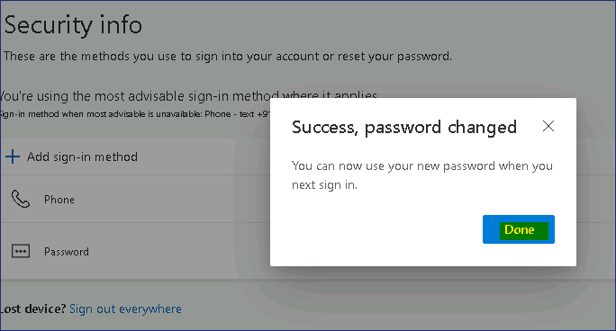

Laboratório 16 - Configurando a redefinição de senha de autoatendimento
para contas de usuário no Microsoft Enterprise

**Resumo**

Neste laboratório, você configurará e validará a self-service password
reset (SSPR) para contas de usuário no **Microsoft Entra ID.**

**Pré-requisitos**

Os seguintes laboratórios devem ser concluídos antes deste laboratório:

- Laboratório nº 2 - Sincronizando identidades usando o Microsoft Entra
  Connect

- Laboratório nº 5 - Gerenciar registro de dispositivos no Microsoft
  Intune

**Cenário**

O Help Desk indicou que um grande número de tickets de suporte está
relacionado a redefinições de senha. Você foi solicitado a propor uma
solução para que os usuários redefinam suas próprias senhas. Para contas
sincronizadas do AD DS, o processo deve redefinir as senhas do Microsoft
Entra e do AD DS.

Tarefa 1: Configurar o password writeback

1.  Entre no [***SEA-SVR1***](urn:gd:lg:a:select-vm) como
    !!**[Contoso\Administrator](urn:gd:lg:a:send-vm-keys)!!** com a
    senha !!**[Pa55w.rd](urn:gd:lg:a:send-vm-keys)!!** e feche o
    **Server Manager**.

2.  Em desktop, clique duas vezes em **Azure AD Connect**.

> 

3.  Na página **Welcome to Azure AD Connect**, selecione **Configure**.

> 

4.  Na página **Additional tasks**, selecione **Customize
    synchronization options** e, em seguida, selecione **Next**.

> 

5.  Na página **Connect to Azure AD**, se necessário, digite
    !!**admin@M365xXXXXXXX.onmicrosoft.com!!** na caixa de texto
    **USERNAME**, digite a **PASSWORD** e selecione **Next**.

> 

6.  Na página **Connect to your directories**, selecione **Next**.

7.  Na página **Domain and OU filtering**, selecione **Next**.

8.  Na página **Optional features**, selecione **Password writeback** e,
    em seguida, **Next**.

> 

9.  Na página **Ready to configure**, selecione **Configure**.

> 
>
> 
>
> **Observação:** a configuração pode levar alguns minutos.

10. Na página **Configuration complete**, selecione **Exit**.

> 

Tarefa 2: Habilitar a redefinição de senha por autoatendimento.

1.  Na barra de tarefas, selecione **Microsoft Edge** e navegue até o
    **Microsoft Entra admin center** **https://Entra.Microsoft.com**.

2.  Entre com as credenciais de **Office 365 Tenant admin.**

> 
>
> O **Microsoft Entra admin center** é aberto.

3.  Em **Microsoft Entra admin center**, no painel de navegação, expanda
    **Identity** e selecione **Users**.

4.  No painel de navegação **Users**, selecione **Password reset**.

> 

5.  Na janela **Password reset | Properties,** selecione **All** para
    habilitar a redefinição de senha por autoatendimento para todos os
    usuários. Selecione **Save**.

> 
>
> 

6.  No painel **Password reset | Properties**, selecione
    **Authentication methods**.

> 

7.  Para os métodos disponíveis aos usuários, certifique-se de que
    **Mobile Phone** e **Email** estejam selecionados e, em seguida,
    selecione **Security Questions**.

8.  Para o **Number of questions required to register**, selecione
    **3.**

9.  Para o **Number of questions required to reset**, selecione **3.**

> 

10. Na seção **Select security questions**, selecione **No security
    questions configured** e, em seguida, **Predefined**. Selecione três
    perguntas de sua escolha e, em seguida, selecione **OK** duas vezes.

> 
>
> 

11. Selecione **Save**.

> 

12. Selecione **Registration.** Selecione **Yes** para **Require users
    to register when signing in** e em **Number of days before users are
    asked to re-confirm their authentication information.** Defina o
    valor como **90** e selecione **Save**.

> 

13. No painel de navegação, selecione **On-premises integration**.

14. Verifique se o seu cliente de writeback local está em execução e
    marque a caixa de seleção **Enable password write back for synced
    users**. Se necessário, selecione **Save**.

> 

15. Feche o Microsoft Edge.

Tarefa 3: Validar redefinição de senha de autoatendimento

1.  Altere para [***SEA-WS3***](urn:gd:lg:a:select-vm). Se necessário,
    faça login como !!**[Admin](urn:gd:lg:a:send-vm-keys)!!** com a
    senha !!**[Pa55w.rd](urn:gd:lg:a:send-vm-keys)!!**

2.  Na barra de tarefas, selecione **Microsoft Edge**. Navegue até
    !!**https://mysignins.microsoft.com/!!**

3.  Na página **Pick an account**, selecione **Use another account**.

> 

4.  Na página de **login,** digite
    !!**Cindy@M365xXXXXXX.onmicrosoft.com!!** e selecione **Next**.

5.  Na página **Enter password**, digite **!!P@55w.rd1234!!** e
    selecione **Sign in**. Se o Microsoft Edge solicitar que você salve
    a senha, selecione **Save**.

> 

6.  Você será solicitado a fornecer **More information required**,
    clique em **Next**

> 

7.  Forneça os detalhes e clique em **Next.**

> 

8.  Digite o código de 6 dígitos e clique em **Next**

> 

9.  Clique em **Next** novamente.

> 

10. Clique em **Done**.

> 

11. Você deve ser capaz de acessar **My Account** página

> 

12. Para alterar a **Password,** acesse o link -
    **!!https://mysignins.microsoft.com/security-info!!**

13. Conclua a verificação clicando no texto +XXXXXXXXXXXXXXX

> 

14. Forneça o código de 6 dígitos e clique em **Verify**.

> 

15. Clique em **Skip for now.**

> 

16. Na página **Security info**, clique em **Change** para senha.

> 

17. Na página **Change your password**, insira as seguintes informações
    e selecione **Submit**:

    - Create new password: **!!P@55w.rd12345!!**

    - Confirm new password: **!!P@55w.rd12345!!**

> 

18. Clique no botão **Done**.

> 

19. Feche o Microsoft Edge e saia do
    [***SEA-WS3***](urn:gd:lg:a:select-vm).

Tarefa 4: Executar a sincronização do Azure AD Connect

Observe que esta etapa normalmente não é necessária para writeback de
senha, mas é recomendada para resolver problemas inerentes aos ambientes
de laboratório e garantir que o AD DS esteja sincronizado com o
Microsoft Entra.

1.  Altere para [***SEA-SVR1***](urn:gd:lg:a:select-vm) e clique com o
    botão direito do mouse em **Start** e selecione **Windows PowerShell
    (Admin).**

> 

2.  No prompt de comando do **Windows PowerShell**, digite o seguinte
    comando e pressione **Enter**:

> **!!Start-ADSyncSyncCycle -PolicyType Delta!!**
>
> 

3.  Feche o Windows PowerShell e aguarde aproximadamente 3 a 4 minutos.

Tarefa 5: Verificar o password writeback

1.  Altere para [***SEA-CL1***](urn:gd:lg:a:select-vm) e saia, se
    necessário. Em [***SEA-CL1***](urn:gd:lg:a:select-vm), selecione
    **Other user** e tente entrar como !!**Contoso\Cindy!!** com a senha
    !!**P@55w.rd1234!!**

> 

2.  Certifique-se de receber a mensagem de que o nome de usuário ou a
    senha estão incorretos.

> 

3.  Agora faça login como !!**Contoso\Cindy!!** com a senha
    !!**P@55w.rd12345!!** a senha que foi definida usando o recurso
    SSPR.

4.  Desta vez você deverá ter efetuado login com sucesso com a **new
    password**.

Isso confirma que a senha alterada no portal Meu login foi replicada de
volta para a conta local dos Active Directory Domain Services (AD DS).

> Observação – se você receber a mensagem acima durante o login, isso
> confirma que a ***authentication was successful***, mas a conta não
> tinha permissão para fazer login no SEA-CL1 devido a um problema de
> associação ao grupo.

**Resultados:** Após concluir este exercício, você terá configurado e
validado com sucesso a redefinição de senha de autoatendimento.
