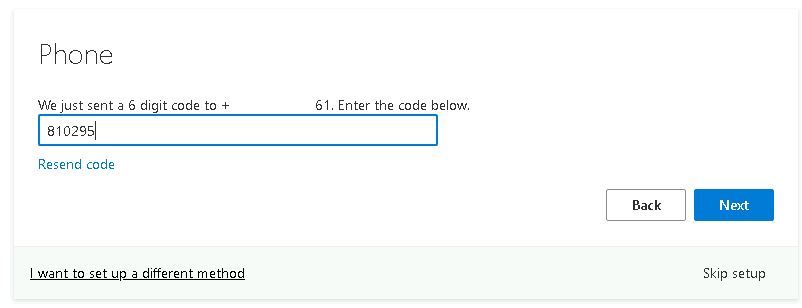
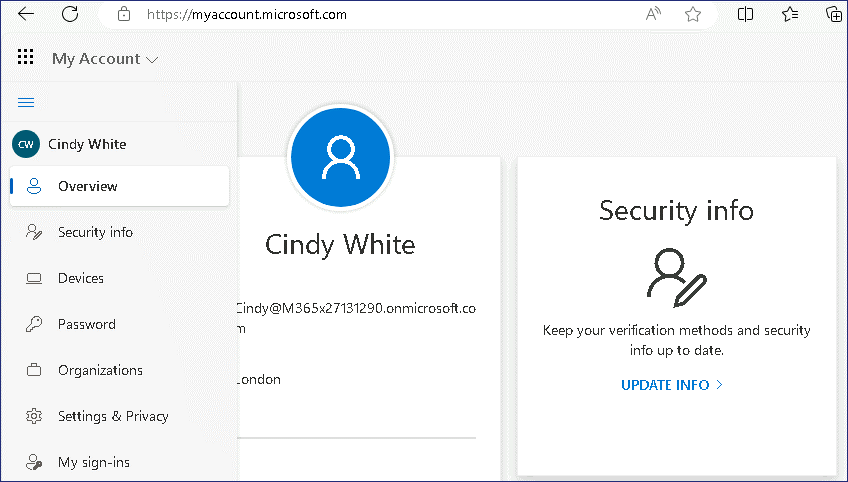

Atelier 16 - Configuration de la réinitialisation de mot de passe en
libre-service pour les comptes d'utilisateur dans Microsoft Entra

**Résumé**

Dans cet atelier, vous allez configurer et valider la réinitialisation
de mot de passe en libre-service (SSPR) pour les comptes d'utilisateur
dans **Microsoft Entra ID**.

**Conditions préalables**

Le(s) Ateliers suivant(s) doit(vent) être complété(s) avant cet atelier

- Atelier \#2 : Synchronisation des identités à l'aide de Microsoft
  Entra Connect

- Atelier \#5 : Gérer l'inscription d'un appareil dans Microsoft Intune

**Scénario**

Le service d'assistance a indiqué qu'un grand nombre de tickets
d'assistance sont liés à la réinitialisation de mot de passe. Il vous a
été demandé de proposer une solution permettant aux utilisateurs de
réinitialiser leur propre mot de passe. Pour les comptes synchronisés à
partir d'AD DS, le processus doit réinitialiser leur mot de passe
Microsoft Entra et AD DS.

Tâche 1 : Configurer la réécriture du mot de passe

1.  Connectez-vous à [***SEA-SVR1***](urn:gd:lg:a:select-vm) en tant que
    !!**[Contoso\Administrateur](urn:gd:lg:a:send-vm-keys) !!** avec le
    mot de passe !\ **!!** et
    fermez le **Server Manager**

2.  Sur le bureau, double-cliquez sur **Azure AD Connect**.

> 

3.  Dans la page **Bienvenue dans Azure AD Connect**, sélectionnez
    **Configure**.

> 

4.  Dans la page **Tâches supplémentaires**, sélectionnez
    **Personnaliser les options de synchronisation**, puis sélectionnez
    **Next**.

> 

5.  Sur la page **Se connecter à Azure AD**, si nécessaire, tapez
    !!**admin@M365xXXXXXXX.onmicrosoft.com !!** dans la zone de texte
    **USERNAME**, tapez le **MOT DE PASSE**, puis sélectionnez **Next**.

> 

6.  Sur la page **Se connecter à vos annuaires**, sélectionnez **Next**.

7.  Sur la page **Filtrage du domaine et de l'unité d'organisation**,
    sélectionnez **Next**.

8.  Dans la page **Fonctionnalités facultatives**, sélectionnez
    **Réécriture du mot de passe**, puis sélectionnez **Next**.

> 

9.  Sur la page **Prêt à** **configurer**, sélectionnez **Configure**.

> 
>
> 
>
> **Remarque** : La configuration peut prendre quelques minutes.

10. Sur la page **Configuration terminée**, sélectionnez **Exit**.

> 

Tâche 2 : Activer la réinitialisation du mot de passe en libre-service.

1.  Dans la barre des tâches, sélectionnez **Microsoft Edge**, accédez
    au **Microsoft Entra admin center https://Entra.Microsoft.com**.

2.  Connectez-vous avec les informations d'identification de **Office
    365 Tenant admin**.

> 
>
> Le **Microsoft Entra admin center** s'ouvre.

3.  Dans le **Microsoft Entra admin center**, dans le volet de
    navigation, développez **Identity**, puis sélectionnez **Users**.

4.  Dans le volet de navigation **Users**, sélectionnez **Password
    reset**.

> 

5.  Dans la section **Password reset | Properties** , sélectionnez
    **All** pour activer la réinitialisation du mot de passe en
    libre-service pour tous les utilisateurs. Sélectionnez **Save**.

> 
>
> 

6.  Sur la réinitialisation du panneau **Password reset | Properties** ,
    sélectionnez **Authentication methods**.

> 

7.  Pour connaître les méthodes disponibles pour les utilisateurs,
    assurez-vous que les options **Téléphone mobile** et **Email** sont
    sélectionnées, puis sélectionnez **Security Questions**.

8.  Pour le **nombre de questions requises pour s'inscrire**,
    sélectionnez **3**.

9.  Pour le **Nombre de questions requises pour la réinitialisation**,
    sélectionnez **3**.

> 

10. Dans la section **Sélectionner des questions de sécurité**,
    sélectionnez **No security questions configured**, puis sélectionnez
    **Predefined i**. Sélectionnez trois questions de votre choix, puis
    sélectionnez **OK** deux fois.

> 
>
> 

11. Sélectionnez **Save**.

> 

12. Sélectionnez **Inscription** Sélectionnez **Yes** pour **Exiger que
    les utilisateurs s'inscrivent lors de la connexion**, et **Nombre de
    jours avant que les utilisateurs ne soient invités à confirmer à
    nouveau leurs informations d'authentification** définissez la valeur
    sur **90,** puis sélectionnez **Save**.

> 

13. Dans le volet de navigation, sélectionnez **Intégration locale**.

14. Vérifiez que votre client d'écriture différée local est en cours
    d'exécution et assurez-vous que la case est cochée pour Activer la
    **réécriture du mot de passe pour les utilisateurs synchronisés**.
    Si nécessaire, sélectionnez **Save**.

> 

15. Fermez Microsoft Edge.

Tâche 3 : Valider la réinitialisation du mot de passe en libre-service

1.  Passez à [***SEA-WS3***](urn:gd:lg:a:select-vm). Si nécessaire,
    connectez-vous en tant que !\
    **!!** avec le mot de passe de
    !\ **!!**

2.  Dans la barre des tâches, sélectionnez **Microsoft Edge**. Naviguez
    jusqu'à !!**https://mysignins.microsoft.com/ !!**

3.  Sur la page **Choisir un compte**, sélectionnez **Use another
    account**.

> 

4.  Sur la page **de connexion**, entrez
    !!**Cindy@M365xXXXXXX.onmicrosoft.com !!** , puis sélectionnez
    **Next**.

5.  Sur la page Entrer le **mot de passe**, entrez **!! P@55w.rd1234
    !!** , puis sélectionnez **Sign in** . Si Microsoft Edge vous invite
    à enregistrer le mot de passe, sélectionnez **Save**.

> 

6.  Vous serez invité à obtenir **plus d'informations requises**,
    cliquez sur **Next**

> 

7.  Fournissez les détails et cliquez sur **Next.**

> 

8.  Entrez le code à 6 chiffres et cliquez sur **Next**

> 

9.  Cliquez à nouveau sur Suivant.

> 

10. Cliquez sur **Done**.

> 

11. Vous devriez pouvoir accéder à la page **Mon compte**

> 

12. Pour changer le **mot de passe,** visitez le lien - **!!
    https://mysignins.microsoft.com/security-info !!**

13. Complétez la vérification en cliquant sur le texte +XXXXXXXXXXXXXX

> 

14. Fournissez le code à 6 chiffres, puis cliquez sur Vérifier.

> 

15. Cliquez sur **Passer pour l'instant.**

> 

16. Sur la page **Informations de sécurité**, cliquez sur **Changer** le
    mot de passe.

> 

17. Sur la page **Changer votre mot de passe**, entrez les informations
    suivantes, puis sélectionnez **Submit** :

    - Créez un nouveau mot de passe : **!! P@55w.rd12345 !!**

    - Confirmez le nouveau mot de passe : **!! P@55w.rd12345 !!**

> 

18. Cliquez sur le bouton Terminé.

> 

19. Fermez Microsoft Edge et déconnectez-vous de
    [***SEA-WS3***](urn:gd:lg:a:select-vm).

Tâche 4 : Exécuter la synchronisation Azure AD Connect

Notez que cette étape n'est normalement pas nécessaire pour la
réécriture du mot de passe, mais qu'elle est recommandée pour résoudre
les problèmes inhérents aux environnements de laboratoire et s'assurer
que les services de domaine Active Directory sont synchronisés avec
Microsoft Entra.

1.  Basculez vers [***SEA-SVR1***](urn:gd:lg:a:select-vm) et cliquez
    avec le bouton droit sur **Start**, puis sélectionnez **Windows
    PowerShell (Admin).**

> 

2.  À la command prompt **Windows PowerShell**, tapez la commande
    suivante, puis appuyez sur **Enter** :

> **!! Start-ADSyncSyncCycle -PolicyType Delta !!**
>
> 

3.  Fermez Windows PowerShell, puis attendez environ 3 à 4 minutes.

Tâche 5 : Vérifier l'écriture différée du mot de passe

1.  Passez à [***SEA-CL1***](urn:gd:lg:a:select-vm) et déconnectez-vous
    si nécessaire. Sur [***SEA-CL1***](urn:gd:lg:a:select-vm),
    sélectionnez **Other user**, puis essayez de vous connecter en tant
    que !!**Contoso\Cindy !!** avec le mot de passe de
    !!**P@55w.rd1234 !!**

> 

2.  Assurez-vous de recevoir le message indiquant que le nom
    d'utilisateur ou le mot de passe est incorrect.

> 

3.  Connectez-vous maintenant en tant que !!**Contoso\Cindy !!** avec le
    mot de passe de !!**P@55w.rd12345 !!** le mot de passe qui a été
    défini à l'aide de la fonction SSPR.

4.  Cette fois-ci, vous devriez être connecté avec succès avec le **new
    password**.

Cela confirme que le mot de passe que vous avez modifié dans le portail
Ma connexion est réécrit dans le compte local des services de domaine
Active Directory (AD DS).

> Remarque - Si vous recevez le message ci-dessus lors de la connexion,
> cela confirme que l' ***authentification a réussi***, mais que le
> compte n'a pas été autorisé à se connecter sur le SEA-CL1 en raison
> d'un problème d'appartenance au groupe.

**Résultats** : Une fois cet exercice terminé, vous aurez correctement
configuré et validé la réinitialisation du mot de passe en
libre-service.
