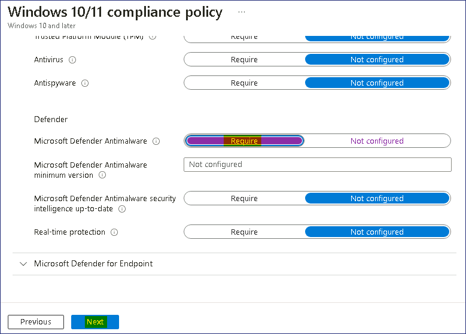
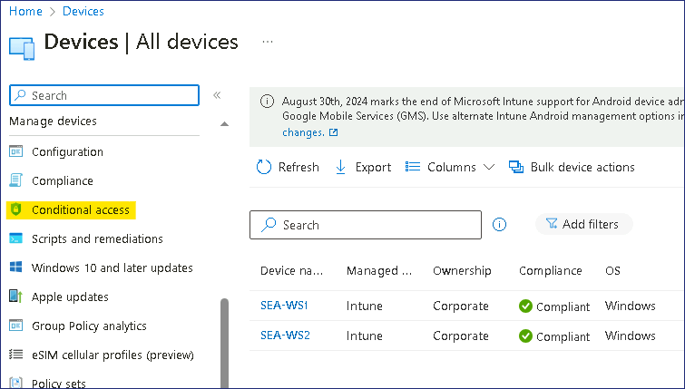

Lab17 - Configuration et validation de la conformité des appareils

**Résumé**

Dans cet atelier, vous validez la conformité de l'appareil en
configurant une stratégie de conformité et une règle d'accès
conditionnel associée utilisées pour déterminer l'état d'un appareil
géré.

**Conditions préalables**

Le(s) Ateliers suivant(s) doit(vent) être complété(s) avant cet atelier:

- Atelier \#1-Gestion des identités dans Microsoft Entra ID

- Atelier \#2 : Synchronisation des identités à l'aide de Microsoft
  Entra Connect

- Atelier \#5 : Gérer l'inscription d'un appareil dans Microsoft Intune

- Atelier \#6-Inscription d'appareils dans Microsoft Intune

- Atelier \#7-Création et déploiement de profils de configuration

Exercice 1 : Configuration des politiques de conformité.

**Scénario**

Contoso souhaite s'assurer que les appareils Windows inscrits dans
Microsoft Intune répondent à une spécification de configuration
minimale. Les spécifications suivantes sont requises :

- Version minimale du système d'exploitation Windows : 10.0.19041.329

- Microsoft Defender Antimalware requis.

Si un appareil répond à ces exigences, il sera marqué comme conforme. Si
l'appareil ne répond pas à ces exigences, il doit être marqué comme non
conforme.

Tâche 1 : Créer et attribuer une politique de conformité

1.  Connectez-vous à [***SEA-SVR1***](urn:gd:lg:a:select-vm) en tant que
    !!**[Contoso\Administrateur](urn:gd:lg:a:send-vm-keys) !!** avec le
    mot de passe !\ **!! **

2.  Dans la barre des tâches, sélectionnez **Microsoft Edge**. Dans
    Microsoft Edge, tapez !!**https://Intune.microsoft.com !!** dans la
    barre d'adresse, puis appuyez sur **Enter**.

3.  Connectez-vous avec les informations d'identification de **Office
    365 Tenant Admin**.

> 

4.  Dans le volet de navigation, sélectionnez **Devices**, puis
    sélectionnez Conformité sous Gérer les appareils.

> 

5.  Sur le panneau **Compliance | Policies** , dans le volet
    d'informations, sélectionnez **+ Create Policy**

> 

6.  Dans le panneau **Create a policy** , indiquez la valeur suivante et
    sélectionnez **Create** :

    - Plate-forme : **Windows 10 et versions ultérieures**

> 

7.  Sous l' onglet **Informations de base**, indiquez la valeur suivante
    et sélectionnez **Next** :

    - Nom:!!**[Conformité1](urn:gd:lg:a:send-vm-keys) !!**

> 

8.  Dans l' onglet **Compliance settings** , développez **État de
    l'appareil** et passez en revue les paramètres disponibles.

> 

9.  Dans l' onglet **Compliance settings** ,développez **Device
    Properties**. Dans le champ **Version minimale du système
    d'exploitation**, tapez
    !\ **!!**

> 

10. Dans l' onglet **Compliance settings** , développez **System
    Security**. Définissez le paramètre **Microsoft Defender
    Antimalware**  sur **Requise**, puis sélectionnez **Next**.

> 

11. Dans l' onglet **Actions for noncompliance** , notez que l'action
    Marquer l'**appareil comme non conforme** est **immédiatement**.

> 
>
> Découvrez comment configurer le nombre de jours après lesquels
> l'appareil est marqué comme non conforme et configurez des actions
> supplémentaires.

12. Sélectionnez **Next**. Dans l' onglet **Assignments** , sélectionnez
    **Add groups**. Sélectionnez **Windows Devices**, Sélectionner, puis
    Sélectionne **Next.**

> 
>
> **Remarque** : Le groupe **Windows Devices**  a été créé dans Création
> et déploiement de profils de configuration - Lab.

13. Sélectionnez **Create**.

> 

14. Dans le menu de navigation, sélectionnez **Devices**, puis dans le
    volet de navigation Appareils, sélectionnez **Compliance**.

> 

15. Sur la page **Compliance**, sélectionnez **Compliance settings**.

> 

16. Sur la page **Paramètres de stratégie de conformité**, à côté de
    **Marquer les appareils sans politique de conformité attribués
    comme**, sélectionnez **Not compliant**, puis sélectionnez **Save**.

> 
>
> Ce paramètre garantit que tout appareil auquel aucune stratégie de
> conformité n'est attribuée sera défini sur **Not compliant**.

**Résultats** : Une fois cet exercice terminé, vous aurez configuré une
stratégie de conformité.

Exercice 2 : Création d'une politique d'accès conditionnel pour assurer
la conformité.

**Scénario**

Lorsqu'un utilisateur utilise un appareil marqué comme non conforme, il
ne doit pas être en mesure d'accéder à sa messagerie. Vous avez été
invité à configurer une politique d'accès conditionnel qui applique
cette règle et à vérifier qu'elle fonctionne comme prévu.

Tâche 1 : Créer une politique d'accès conditionnel

1.  Sur [***SEA-SVR1***](urn:gd:lg:a:select-vm), dans le **Microsoft
    Intune admin center** , sélectionnez **Devices**, puis électionnez
    **Accès conditionnel**.

> 

2.  Cliquez sur **Policies** puis sélectionnez **+ New policy**,

> 

3.  Dans le panneau **Nouveau**, dans la zone de **texte Nom**, tapez
    !\ , puis
    sélectionnez **0 utilisateur ou Identités de charge de travail
    sélectionnées**.

> 

4.  Dans le panneau **Users and groups** , sélectionnez la case d'
    option **All users** .

> 

5.  Dans le panneau **Nouveau**, sélectionnez **Aucune ressource cible
    sélectionnée,** sélectionnez la case d' option **Sélectionner des
    applications**, sélectionnez !!**Office 365 Exchange Online !!**,
    puis cliquez sur **Select**.

> 

6.  Dans le panneau **Nouveau**, dans la section **Conditions**,
    sélectionnez **0 conditions sélectionnées**.

> 

7.  Dans la liste des conditions, sous **Plates-formes de l'appareil**,
    sélectionnez **Non configuré.** Dans la section **Configurer**,
    sélectionnez **Yes**, sélectionnez la case d'option **Sélectionner
    les plates-formes de périphérique**, cochez la case **Windows**,
    puis sélectionnez **Done**.

> 

8.  Dans le panneau **Nouveau,** sous **Contrôles d'accès**, dans la
    section **Accorder**, sélectionnez **0 contrôle sélectionné.**

9.  Activez la case à cocher **Require device to be marked as
    compliant** , puis sélectionnez **Select**.

> 

10. Dans le panneau **Nouveau**, sélectionnez **On** pour l' option
    **Enable policy** , puis sélectionnez **Create**.

> 

11. Fermez Microsoft Edge.

Tâche 2 : Vérifier que la politique d'accès conditionnel fonctionne

1.  Passez à [***SEA-WS3***](urn:gd:lg:a:select-vm) et connectez-vous en
    tant que !\ **!!** avec le mot
    de passe de !\ **!!**.

2.  Sur [***SEA-WS3***](urn:gd:lg:a:select-vm), dans la barre des
    tâches, sélectionnez **Microsoft Edge**. Dans Microsoft Edge, tapez
    [**outlook.office.com,**](urn:gd:lg:a:send-vm-keys) puis appuyez sur
    Entrée.

3.  Dans la boîte de dialogue Choisir un compte, sélectionnez
    !!**Cindy@M365xXXXXXXX.onmicrosoft.com !!**

4.  Sur la page Entrer le **mot de passe**, entrez !!**P@55w.rd12345
    !!** et sélectionnez **Sign in** . Si l'invite Microsoft Edge
    Enregistrer le mot de passe s'affiche, sélectionnez **Mettre à
    jour**.

> 

5.  Vérifiez que vous recevez le message **« Se connecter avec votre
    compte professionnel ».**

> 

6.  Sélectionnez **Plus de détails**. Vous devriez voir plus
    d'informations sur la raison pour laquelle vous êtes bloqué.

> 
>
> **Remarque** : Cela est dû au fait que SEA-WS3 n'est pas joint à
> Microsoft Entra ID et n'est pas géré par Microsoft Intune, et n'est
> donc pas marqué comme conforme.

7.  **Fermez** la fenêtre du navigateur.

8.  Passez à [***SEA-WS1***](urn:gd:lg:a:select-vm) et connectez-vous en
    tant que !!**Cindy@M365xXXXXXXX.onmicrosoft.com !!** avec **la page
    du mot de passe**, entrez !!**P@55w.rd12345 !!**

> **Remarque** : SEA-WS1 est un appareil Windows 11 géré qui est inscrit
> dans Intune.

9.  Dans la barre des tâches, sélectionnez **Microsoft Edge**. Dans
    Microsoft Edge, tapez
    [**Outlook.office.com,**](urn:gd:lg:a:send-vm-keys) puis appuyez sur
    **Enter**.

10. Vérifiez que vous pouvez accéder à la boîte aux lettres de Cindy.

> 
>
> **Remarque** : Cela est dû au fait que **SEA-WS1** est un périphérique
> géré et marqué comme conforme.

11. Fermez Microsoft Edge et déconnectez-vous de
    [***SEA-WS1***](urn:gd:lg:a:select-vm).

Tâche 3 : Désactiver la politique d'accès conditionnel

1.  Sur [***SEA-SVR1***](urn:gd:lg:a:select-vm), dans le **Microsoft
    Intune admin center** !\!<https://intune.microsoft.com> !!
    sélectionnez **Devices**, puis sélectionnez **All Devices.**

> 
>
> Notez que **SEA-WS1** est conforme, c'est pourquoi Cindy a été
> autorisée à accéder à sa boîte aux lettres.

2.  Dans le volet de navigation, sélectionnez **Devices**,, puis Accès
    **Conditional access**.

> 

3.  Sur la page **Conditional Access** , sélectionnez**Policies**, puis
    cliquez sur **Conditional1**.

> 

4.  Sur la page **C Conditional1**, en bas de la page, sélectionnez
    **Off,** puis **Save**.

> 

5.  Fermez Microsoft Edge.

**Résultats** : Une fois cet exercice terminé, vous aurez configuré une
politique d'accès conditionnel pour déterminer la conformité de
l'appareil.
