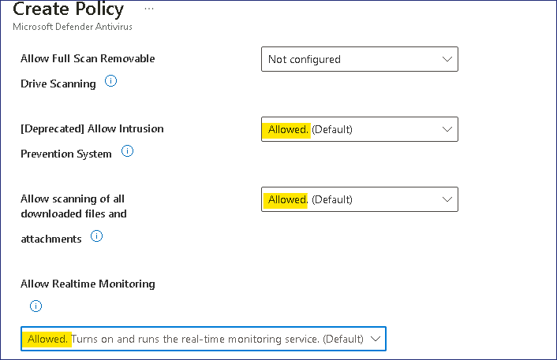

實驗 18 - 使用 Microsoft Intune 配置終結點安全性

**總結**

在本實驗中，您將創建一個策略，以便在 Microsoft Intune 中為託管設備配置
Microsoft Defender。

**先決條件**

在此實驗之前，必須完成以下實驗：

- 實驗 \#5 - 管理設備註冊到 Microsoft Intune

- 實驗 \#6 - 將設備註冊到 Microsoft Intune

- 實驗 \#7 - 創建和部署配置文件

**場景**

系統要求你確保 Contoso 開發人員組已正確配置 Microsoft Defender。已要求：

- 防止篡改保護。

- 在 Windows
  安全中心應用中隱藏“帳戶保護”、“應用程序和瀏覽器控制”、“設備安全”、“設備性能和運行狀況”和“家庭選項”區域

- 必須添加公司名稱和電話號碼。

- 此外，還需要配置實時保護、修復和掃描設置。

設置將通過在已註冊的設備 SEA-WS1 和未註冊的設備 SEA-CL1
上進行測試來驗證。

任務 1：在 Intune 中配置 Windows 安全體驗

1.  切換並登錄 [***SEA-SVR1***](urn:gd:lg:a:select-vm) 作為 !!**[Contoso\Administrator](urn:gd:lg:a:send-vm-keys)!!** 用密碼
    !!**[Pa55w.rd](urn:gd:lg:a:send-vm-keys)!!**

2.  在任務欄上，選擇 **Microsoft Edge**。

3.  在 Microsoft Edge
    中，鍵入 !!**https://Intune.microsoft.com!!**，然後按 **Enter**。

4.  以 Office 365 租戶管理員身份登錄。

> 

5.  從導航窗格中，選擇 **Endpoint security**（終端節點安全），然後選擇
    **Antivirus**（防病毒）。

> 

6.  在 **Endpoint security |Antivirus** 窗格中，選擇 **+ Create
    Policy**。

> 

7.  在 **Create a profile** （創建配置文件） 窗格中，對於 **Platform**
    （平臺），選擇 **Windows 10、Windows 11 和 Windows Server**。

8.  在 **Profile** （配置文件） 列表中，選擇 **Windows Security
    experience**。然後選擇 **Create** （創建）。

> 

9.  在 基本信息 選項卡的 **Name** 字段中，輸入 !!**[Windows Security
    Settings](urn:gd:lg:a:send-vm-keys)!!**。 選擇 **Next**（下一步）。

> 

10. 在 **Defender** 下，配置以下設置：

    - TamperProtection (Device): **On**

> 

11. 在 **Windows Defender Security Center** 下，配置以下設置：

    - 禁用賬戶保護 UI： **Enable**

    - 禁用應用程序瀏覽器 UI： **Enable**

    - 禁用設備安全 UI： **Enable**

    - 禁用系列 UI： **Enable**

    - 禁用運行狀況 UI： **Enable**

> 

12. 在 **Enable Customized Toasts** （啟用自定義 Toast） 旁邊，選擇
    **Enable** （啟用）。

13. 在 **Company name** 字段中，選擇
    **Configured**，然後輸入 !!**[Contoso
    IT](urn:gd:lg:a:send-vm-keys)!!**

14. 對於 **Phone**（電話），選擇
    **Configured**（已配置），然後輸入 !!**[555-1234](urn:gd:lg:a:send-vm-keys)!!**，然後選擇
    **Next**。

> 

15. 在 “**Scope tags**” 頁上，選擇 “**Next**” 。

> 

16. 在 **Assignments** （分配） 選項卡上的 **Included groups**
    （包含的組） 下，選擇 **Add groups** （添加組）。選擇 **Contoso
    Developer Devices** 組，單擊 “**Select**”，然後選擇 “**Next**” 。

> 

17. 在 **Review + create** 選項卡上，查看信息並選擇 **Save**。

> 

任務 2：在 Intune 中配置 Microsoft Defender 防病毒策略

1.  在 **Endpoint security |Antivirus** （防病毒） 窗格中，選擇 **Create
    Policy** （創建策略）。

> 

2.  在 **Create a profile** （創建配置文件） 窗格中，對於 **Platform**
    （平臺），選擇 **Windows 10、Windows 11 和 Windows Server**。

3.  在 “**Profile**” 列表中，選擇 “**Microsoft Defender
    Antivirus**”，然後選擇 “**Create**” 。

> 

4.  在 **Basics** 選項卡的 **Name** 字段中，輸入 !!**[Microsoft Defender
    Antivirus Settings](urn:gd:lg:a:send-vm-keys)!!**，選擇
    **Next**（下一步）。

> 

5.  在 **Configuration settings** （配置設置） 選項卡上，配置以下設置：

    - 允許入侵防禦系統： **Allowed**

    - 允許掃描所有下載的文件和附件： **Allowed**

    - 允許實時監控： **Allowed**

> 

- 運行掃描前檢查簽名： **Enabled**

- 保留已清理惡意軟件的天數： !!**[60](urn:gd:lg:a:send-vm-keys)!!**

> 

- 安排快速掃描時間： !!**[60](urn:gd:lg:a:send-vm-keys)!!** (表示淩晨
  1：00)

> 

- 提交樣本同意書： **Send safe samples automatically**

> 

6.  在 **Configuration settings** （配置設置） 選項卡上，選擇 **Next**
    （下一步）。

7.  在 “**Scope tag**” 頁上，選擇 “**Next**” 。

> 

8.  在 **Assignments** （分配） 選項卡上的 **Included groups**
    （包含的組） 下，選擇 **Add groups** （添加組）。

9.  選擇 **Contoso Developer Devices** 組，然後選擇 **Select**
    （選擇），然後選擇 **Next** （下一步）。

> 

10. 在 **Review + create** 選項卡上，查看信息並選擇 **Save**。

> 

任務 3：同步託管設備

1.  在 **Microsoft Intune 管理中心**，選擇 “**Devices**” ，然後選擇
    “**All devices**” 。

2.  在 **Devices | All devices** 窗格中，選擇 “**SEA-WS1**” ，然後在
    “**SEA-WS1**” 邊欄選項卡上，選擇工具欄上的 “**Sync**” ，然後選擇
    “**Yes**” 。

> 
>
> 等待 3-4 分鐘，以便同步完成。

3.  關閉 Microsoft Edge。

任務 4：驗證配置

1.  切換到 [***SEA-CL1***](urn:gd:lg:a:select-vm)。
    如有必要，請以 !!**[Contoso\Administrator](urn:gd:lg:a:send-vm-keys)!!** 使用密碼 !!**[Pa55w.rd](urn:gd:lg:a:send-vm-keys)!!**.

2.  在 [***SEA-CL1***](urn:gd:lg:a:select-vm)上， 選擇
    **Start**（開始），鍵入 !!**[Windows
    Security](urn:gd:lg:a:send-vm-keys)!!**, 然後在 Windows
    安全中心圖標下選擇 **Open** 。

> 
>
> 請注意，將顯示所有安全選項。這是因為 SEA-CL1 未註冊到 Intune。
>
> 

3.  關閉 Windows Security
    並注銷 [***SEA-CL1***](urn:gd:lg:a:select-vm)。

4.  切換到 [***SEA-WS1***](urn:gd:lg:a:select-vm)，並以
    **!!Cindy@M365x27131290.onmicrosoft.com!!** 使用密碼
    **!!P@55w.rd12345!!**。

5.  選擇 **Start**（開始），鍵入 !!**[Windows
    Security](urn:gd:lg:a:send-vm-keys)!!**, 然後在 Windows
    安全中心圖標下選擇 **Open**。

> 
>
> 請注意，不會顯示在 Intune
> 策略中配置的所有限制區域。 [***SEA-WS1***](urn:gd:lg:a:select-vm) 已在
> Intune 中註冊，該 Intune 已應用安全設置。
>
> 

6.  關閉 Windows Security
    並注銷 [***SEA-WS1***](urn:gd:lg:a:select-vm)。

**結果：**完成本練習後，您將成功創建並應用策略，以在 Intune
中為託管設備配置 Microsoft Defender。
