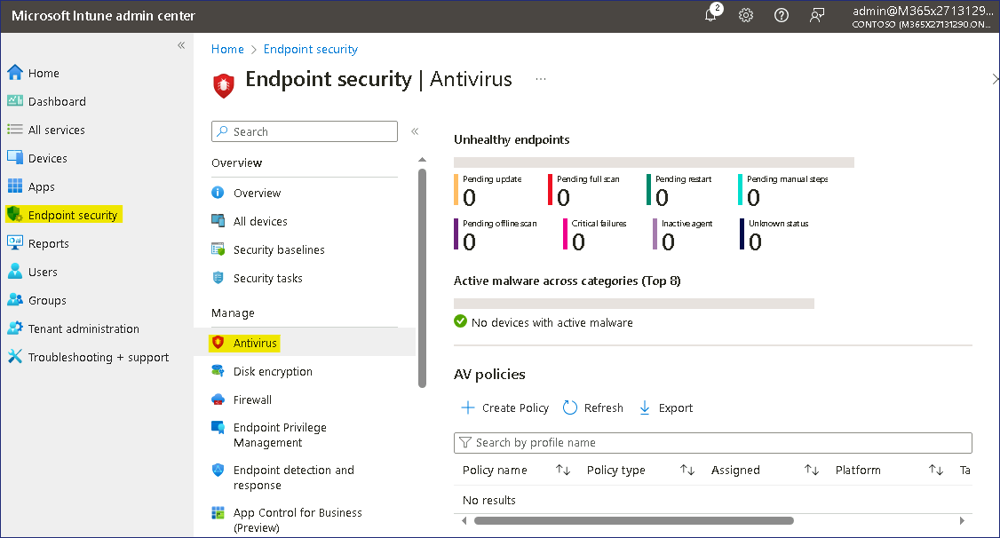
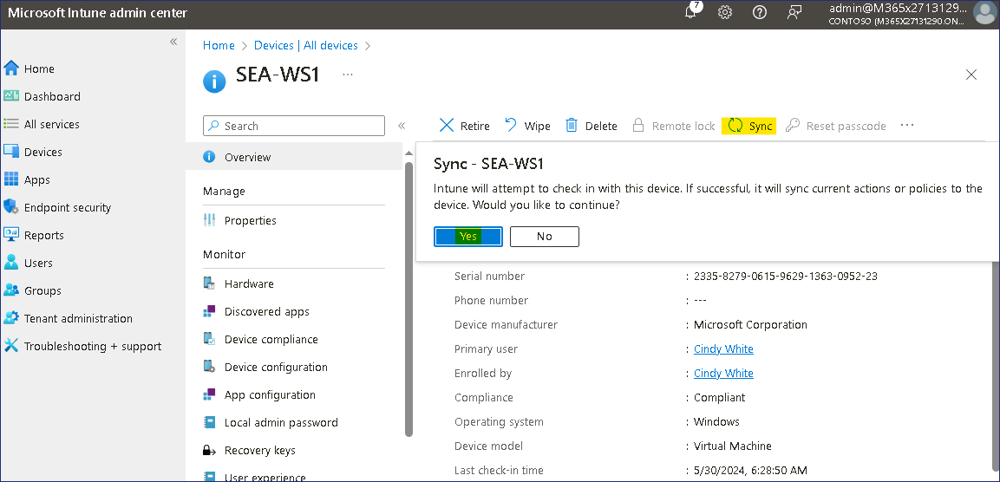

Atelier 18 - Configuration de Endpoint security à l'aide de Microsoft
Intune

**Résumé**

Dans cet atelier, vous allez créer une stratégie pour configurer
Microsoft Defender pour les appareils gérés dans Microsoft Intune.

**Conditions préalables**

Le(s) Ateliers suivant(s) doit(vent) être complété(s) avant cet
atelier::

- Atelier \#5 : Gérer l'inscription d'un appareil dans Microsoft Intune

- Atelier \#6-Inscription d'appareils dans Microsoft Intune

- Atelier \#7-Création et déploiement de profils de configuration

**Scénario**

Vous avez été invité à vous assurer que Microsoft Defender est
correctement configuré dans le groupe de développeurs Contoso. Il a été
demandé que :

- La protection contre les sabotages doit être évitée.

- Masquer les zones Protection du compte, Contrôle de l'application et
  du navigateur, Sécurité de l'appareil, Performances et intégrité de
  l'appareil et Options familiales dans l'application Sécurité Windows

- Le nom de l'entreprise et le numéro de téléphone doivent être ajoutés.

- La protection en temps réel, la correction et les paramètres d'analyse
  doivent également être configurés.

Les paramètres seront vérifiés par des tests sur un appareil inscrit,
SEA-WS1, et un appareil non inscrit, SEA-CL1.

Tâche 1 : Configurer Windows Security Experience dans Intune

1.  Basculez et connectez-vous à [***SEA-SVR1***](urn:gd:lg:a:select-vm)
    en tant que !!**[Contoso\Administrateur](urn:gd:lg:a:send-vm-keys)
    !!** avec le mot de passe
    !\ **!!**

2.  Dans la barre des tâches, sélectionnez **Microsoft Edge**.

3.  Dans Microsoft Edge, tapez !!**https://Intune.microsoft.com !!**
    dans la barre d'adresse, puis appuyez sur **Enter**.

4.  Connectez-vous en tant Office 365 Tenant Admin.

> 

5.  Dans le volet de navigation, sélectionnez **Endpoint security**,,
    puis électionnez **Antiviru**s.

> 

6.  Sur la **s Endpoint security |Antivirus** , sélectionnez **+ Create
    Policy**.

> 

7.  Dans le **volet Créer un profil**, pour **Plateforme**, sélectionnez
    **Windows 10, Windows 11 et Windows Server**.

8.  Dans la **liste Profil**, sélectionnez **Windows Security
    experience**. Sélectionnez ensuite sélectionnez **Create**.

> 

9.  Dans l'onglet Notions de base, dans le champ **Nom**, entrez
    !!**[Windows Security Settings](urn:gd:lg:a:send-vm-keys)!!**.
    Sélectionnez **Next**.

> 

10. Sous **Defender**, configurez les paramètres suivants :

    - TamperProtection (appareil) : **On**

> 

11. Sous **Windows Defender Security Center**, configurez les paramètres
    suivants :

    - Désactiver l'interface utilisateur de protection du compte :
      **Activer**

    - Désactiver l'interface utilisateur du navigateur d'application :
      **Activer**

    - Désactiver l'interface utilisateur de sécurité de l'appareil :
      **Activer**

    - Désactiver l'interface utilisateur familiale : **Activer**

    - Désactiver l'interface utilisateur d'intégrité : **Activer**

> 

12. À côté de **Activer les toasts personnalisés**, sélectionnez
    **Activer**.

13. Dans le champ **Nom de l'entreprise**, sélectionnez **Configuré**,
    puis entrez !\

14. Pour **Téléphone**, sélectionnez **Configuré,** puis entrez
    !!**[555-1234](urn:gd:lg:a:send-vm-keys) !!** , puis sélectionnez
    **Next**.

> 

15. Sur la page **Scope tags** , sélectionnez **Next**.

> 

16. Sous l' onglet **Attributions**, sous **Groupes inclus**,
    sélectionnez **Add groups**. Choisissez le groupe **Contoso
    Developer Devices** , cliquez sur **Select**, puis sur **Next**.

> 

17. Sous l' onglet **Review + create** , vérifiez les informations et
    sélectionnez **Save**.

> 

Tâche 2 : Configurer la Politique antivirus Microsoft Defender dans
Intune

1.  Sur le Panneau **Endpoint security |Antivirus** , sélectionnez
    **Create Policy**.

> 

2.  Dans le volet **Créer un profil**, pour **Plateforme**, sélectionnez
    **Windows 10, Windows 11 et Windows Server**.

3.  Dans la liste **Profil**, sélectionnez **Microsoft Defender
    Antivirus**, puis sélectionnez **Create**.

> 

4.  Dans l' onglet Notions **de base**, dans le champ **Nom**, entrez
    !!**[Microsoft Defender Antivirus
    Settings](urn:gd:lg:a:send-vm-keys)!!**. Sélectionnez **Next**.

> 

5.  Dans l' onglet **Configuration settings**, configurez les paramètres
    suivants :

    - Autoriser le système de prévention des intrusions : **Autorisé**

    - Autoriser l'analyse de tous les fichiers téléchargés et des pièces
      jointes : **Autorisé**

    - Autoriser la surveillance en temps réel : **Autorisé**

> 

- Vérifier les signatures avant d'exécuter l'analyse : **Activé**

- Jours pour conserver les logiciels malveillants nettoyés :
  !\ **!!**

> 

- Programmer le temps de balayage rapide :
  !\ **!!** (représente 1h00)

> 

- Consentement à l'envoi d'échantillons : **Send safe samples
  automatically**

> 

6.  Dans l' onglet **Configuration settings** , sélectionnez **Next**.

7.  Sur la page **Scope tags** , sélectionnez **Next**.

> 

8.  Sous l' onglet **Attributions**, sous **Groupes inclus**,
    sélectionnez **Add groups**.

9.  Choisissez le groupe **Contoso Developer Devices** , puis
    **Sélectionner** , puis sélectionnez **Next**.

> 

10. Sous l' onglet **Review + create** , vérifiez les informations et
    sélectionnez **Save**.

> 

Tâche 3 : Synchroniser les appareils gérés

1.  Dans le **Microsoft Intune admin center** sélectionnez **Devices**,
    puis **All Devices**.

2.  Sur les Dans les volet **Devices | All devices** , sélectionnez
    **SEA-WS1**, puis dans la lame **SEA-WS1**, sélectionnez **Sync**
    dans la barre d'outils, puis sélectionnez **Yes**.

> 
>
> Attendez 3 à 4 minutes pour que la synchronisation soit terminée.

3.  Fermez Microsoft Edge.

Tâche 4 : Vérifier la configuration

1.  Passez à [***SEA-CL1***](urn:gd:lg:a:select-vm). Si nécessaire,
    connectez-vous en tant que
    !!**[Contoso\Administrator](urn:gd:lg:a:send-vm-keys) !!** avec le
    mot de passe de !\ **!!**.

2.  Sur [***SEA-CL1***](urn:gd:lg:a:select-vm), sélectionnez **Start**,
    tapez !! [**[Windows
    Security](urn:gd:lg:a:send-vm-keys)**](urn:gd:lg:a:send-vm-keys)
    **!!**, puis sous l'icône Sécurité Windows, sélectionnez **Open**.

> 
>
> Notez que toutes les options de sécurité sont affichées. Cela est dû
> au fait que SEA-CL1 n'est pas inscrit à Intune.
>
> 

3.  Fermez **Windows Security**  et déconnectez-vous de
    [***SEA-CL1***](urn:gd:lg:a:select-vm).

4.  Passez à [***SEA-WS1***](urn:gd:lg:a:select-vm) et connectez-vous en
    tant que **!! Cindy@M365x27131290.onmicrosoft.com !!** avec Mot de
    passe **!! P@55w.rd12345 !!** .

5.  Sélectionnez **Star**, tapez !! [**[Windows
    Security](urn:gd:lg:a:send-vm-keys)**](urn:gd:lg:a:send-vm-keys)
    **!!**, puis sous l'icône Sécurité Windows, sélectionnez **Open**.

> 
>
> Notez que toutes les zones restreintes configurées dans la Politique
> Intune ne sont pas affichées. [***SEA-WS1***](urn:gd:lg:a:select-vm)
> est inscrit dans Intune, qui a appliqué les paramètres de sécurité.
>
> 

6.  Fermez **Windows Security**  et déconnectez-vous de
    [***SEA-WS1***](urn:gd:lg:a:select-vm).

**Résultats** : Une fois cet exercice terminé, vous aurez créé et
appliqué une stratégie pour configurer Microsoft Defender pour les
appareils gérés dans Intune.
