# **Laboratório 19 - Implementação do Windows 11 usando o Microsoft Deployment Toolkit**

**Resumo**

Neste laboratório, você usará o Microsoft Deployment Toolkit para criar
e Implementar uma imagem do sistema operacional Windows 11.

**Cenário**

Você precisa Implementar uma nova máquina virtual do Windows 11 chamada
SEA-WS4. Você decide usar o Microsoft Deployment Toolkit para
Implementar o sistema operacional em uma máquina virtual criada no
Hyper-V. Você configurará um novo Compartilhamento de Implementação no
MDT e, em seguida, configurará a sequência de tarefas que executará as
etapas de Implementação do SEA-WS4.

### **Tarefa 1: Criar um novo compartilhamento de Implementação**

1.  Altere para [**SEA-SVR2**](urn:gd:lg:a:select-vm), faça login como
    !!**[Contoso\Administrator](urn:gd:lg:a:send-vm-keys)!!** com a
    senha !!**[Pa55w.rd](urn:gd:lg:a:send-vm-keys)!!**

> 

2.  Na barra de tarefas, selecione **File Explorer** e navegue até
    !!**[E:\Labfiles\ISOs](urn:gd:lg:a:send-vm-keys)!!**

> 

3.  Clique com o botão direito do mouse em **Win11_21H2_Eval.iso** e
    selecione **Mount**. O ISO será montado como DVD Drive **D.**

> 
>
> 

4.  Feche o **File Explorer**.

5.  Selecione o **Start menu**, expanda **Microsoft Deployment Toolkit**
    e selecione **Deployment Workbench.**

> 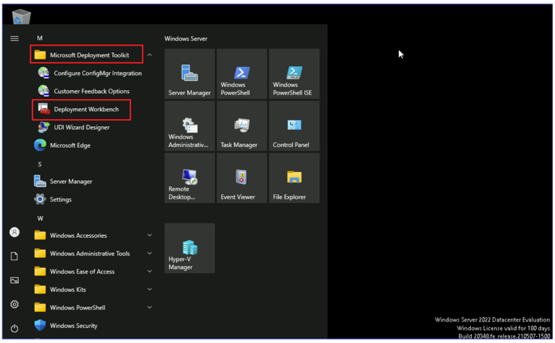

6.  Em **Deployment Workbench**, clique com o botão direito do mouse em
    **Deployment Shares** e selecione **New Deployment Share** .

> 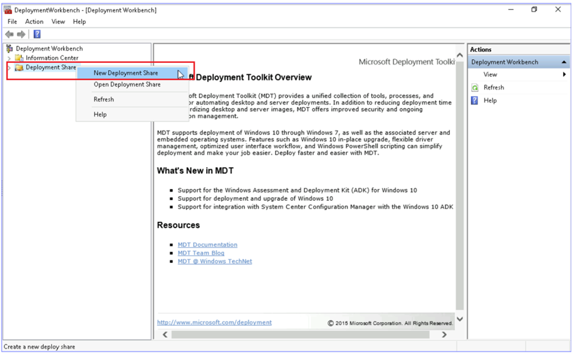
>
> O **New Deployment Share Wizard** é aberto.

7.  Na página **Path**, em **Deployment share path**, altere o valor
    para !!**[E:\DeploymentShare](urn:gd:lg:a:send-vm-keys)!!** e
    selecione **Next**.

> 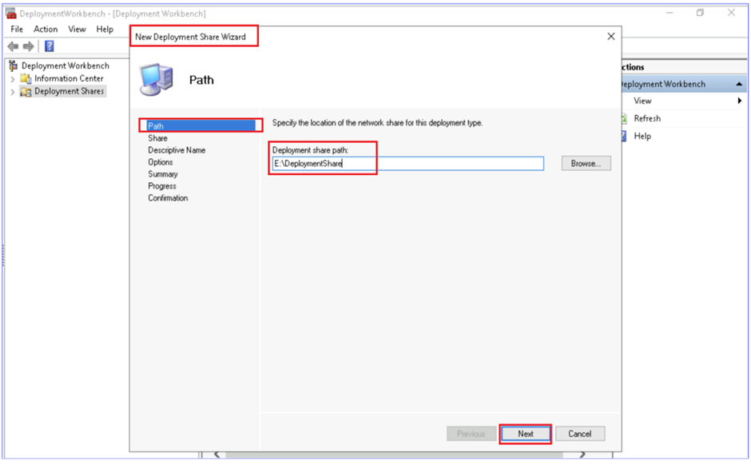

8.  Na página **Share**, anote o **Share name**, mas não o altere.
    Selecione **Next**.

> 

9.  Na página **Descriptive Name**, aceite o valor padrão e selecione
    **Next**.

> 

10. Na página **Options**, configure o seguinte e selecione **Next**:

    - Solicitar a definição da senha do administrador local: **Enabled**

    - Todas as outras caixas de seleção: **Disabled**

> 

11. Na página **Summary**, revise as informações e selecione **Next**.

> 

12. Na página **Confirmation**, certifique-se de que o processo foi
    concluído com sucesso e selecione **Finish**.

> 

13. Em **Deployment Shares**, expanda a pasta **MDT Deployment Share**.

> Anote os vários nós que podem ser configurados para o compartilhamento
> de Implementação.

### **Tarefa 2: Adicionar arquivos do sistema operacional ao compartilhamento de Implementação**

1.  No Deployment Workbench, expanda **Deployment Shares**, expanda
    **MDT Deployment Share** e selecione **Operating Systems**.

> 

2.  Clique com o botão direito do mouse em **Operating Systems** e
    selecione **Import Operating System**. O Assistente para Importação
    do Sistema Operacional será aberto.

> 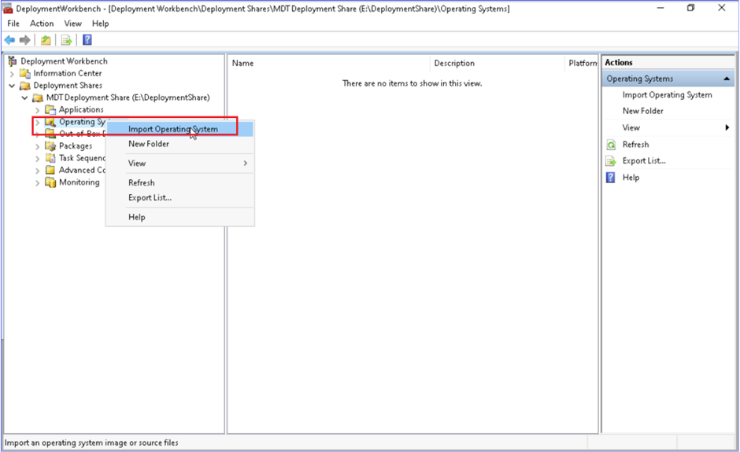

3.  No **Import Operating System Wizard**, na página **OS Type**,
    selecione **Full set of source files** e, em seguida, selecione
    **Next**.

> 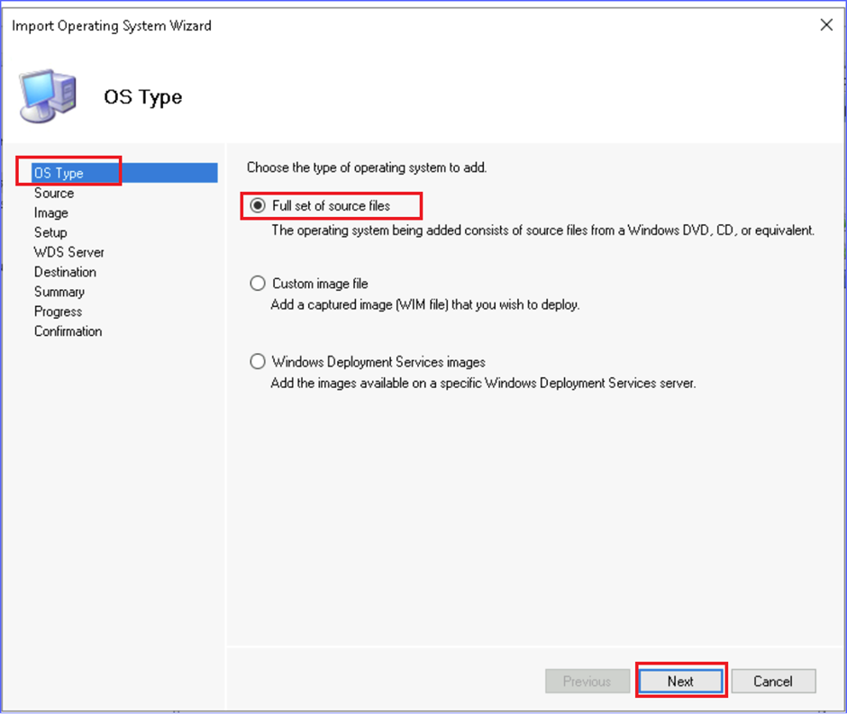

4.  Na página **Source**, em **Source Directory**, digite !!
    [**D:\\**](urn:gd:lg:a:send-vm-keys) **!!** e selecione **Next**.

> 

5.  Na página **Destination**, altere o nome do diretório de destino
    padrão para !!**[Windows 11 Enterprise
    x64](urn:gd:lg:a:send-vm-keys)!!** e selecione **Next**.

> 

6.  Na página **Summary**, revise as informações e selecione **Next**.

> 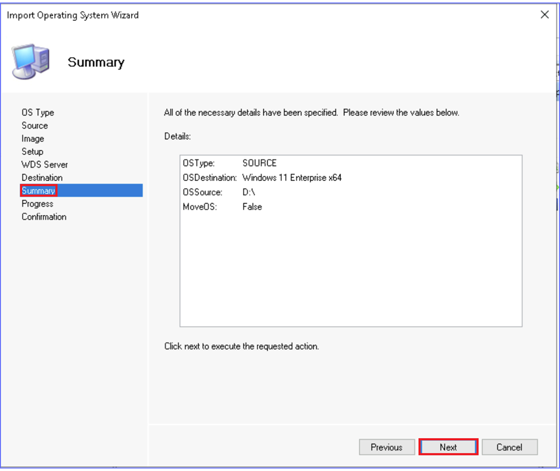
>
> Os arquivos de origem do sistema operacional são copiados para o
> compartilhamento de Implementação.

7.  Na página **Confirmation**, certifique-se de que o processo foi
    concluído com sucesso e selecione **Finish**.

> 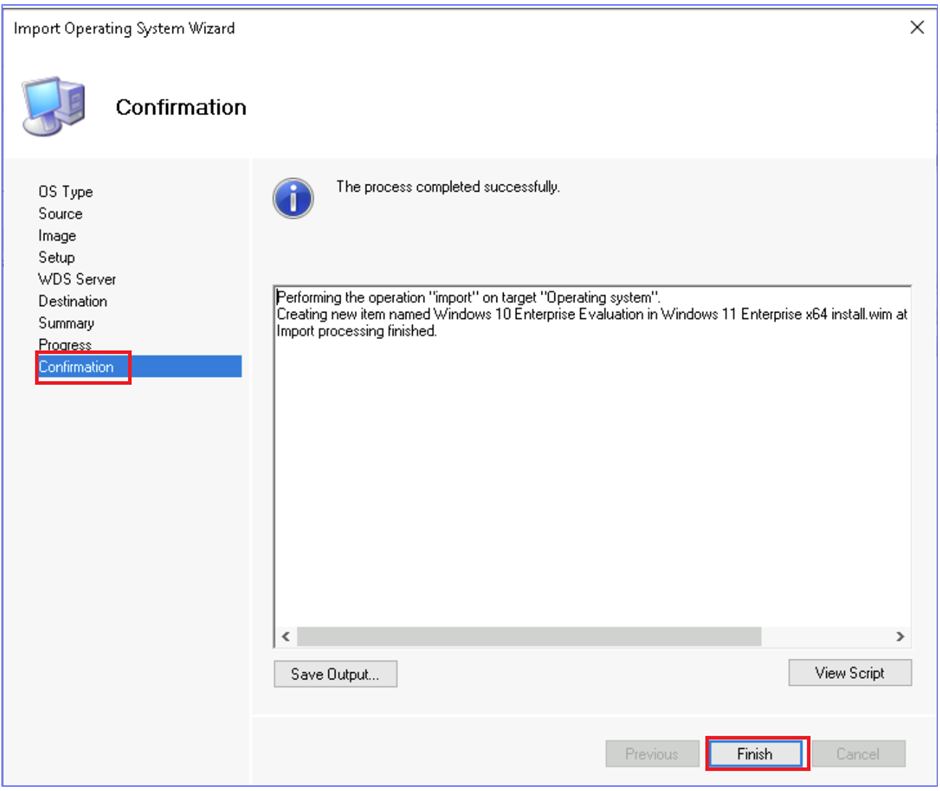

8.  Em **Deployment Workbench**, com **Operating Systems** selecionados,
    verifique se o sistema operacional é exibido.

### **Tarefa 3: Adicionar aplicações ao compartilhamento de Implementação**

1.  No Deployment Workbench, expanda **Deployment Shares**, expanda
    **MDT Deployment Share** e selecione **Applications**.

2.  Clique com o botão direito do mouse **em Applications** e selecione
    **New Application**. O Assistente para Novo Aplicativo será aberto.

> 

3.  Em **New Application Wizard**, na página **Application Type**,
    selecione **Application with source files** e, em seguida, selecione
    **Next**.

> 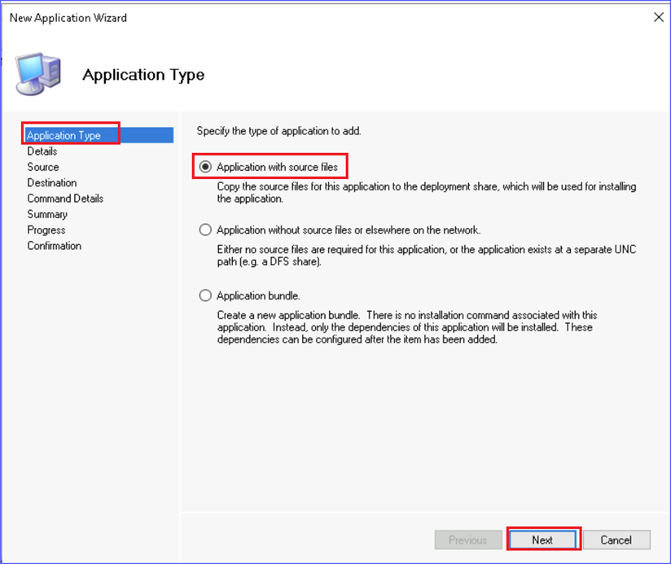

4.  Na página **Details**, configure o seguinte e selecione **Next**:

    - Publisher: !!**[Microsoft](urn:gd:lg:a:send-vm-keys)!!**

    - Application Name: !!**[XML Notepad](urn:gd:lg:a:send-vm-keys)!!**

> 

5.  Na página **Source**, em **Source directory**, digite
    !!**[E:\Labfiles\Apps](urn:gd:lg:a:send-vm-keys)!!** e selecione
    **Next**.

> 

6.  Na página **Destination**, aceite o nome do diretório de destino
    padrão e selecione **Next**.

> 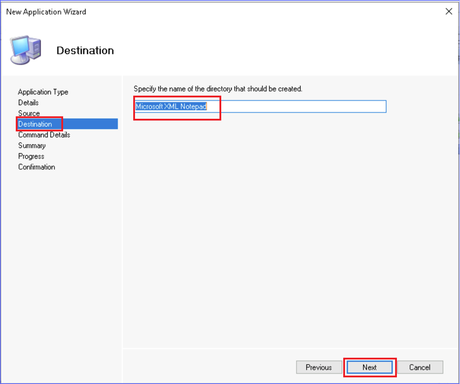

7.  Na página **Command Details**, em **Command line,** digite
    !!**[XmlNotepadSetup.msi /q](urn:gd:lg:a:send-vm-keys)!!** e
    selecione **Next**.

> 

8.  Na página **Summary**, revise as informações e selecione **Next**.

> 

9.  Na página **Confirmation**, certifique-se de que o processo foi
    concluído com sucesso e selecione **Finish**.

### **Tarefa 4: Criar uma sequência de tarefas MDT**

1.  No Deployment Workbench, expanda **Deployment Shares**, expanda
    **MDT Deployment Share** e selecione **Task Sequences**.

2.  Clique com o botão direito do mouse em **Task Sequences** e
    selecione **New Task Sequence Wizard**. O **New Task Sequence
    Wizard** será aberto.

> 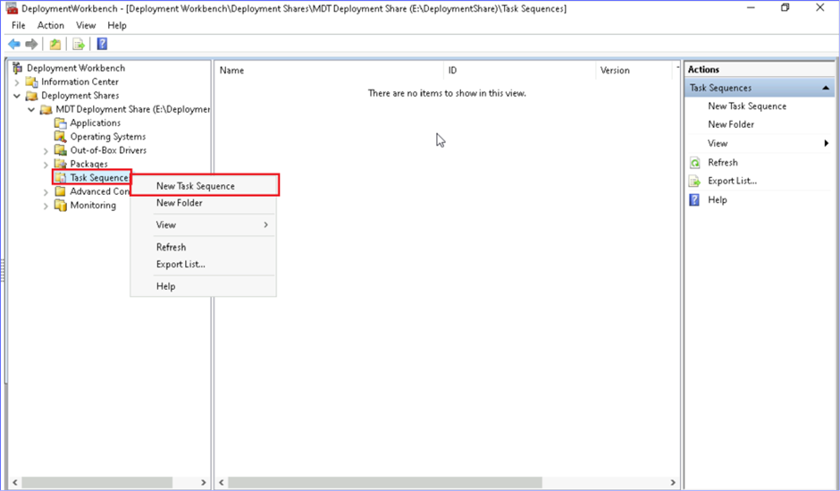

3.  Na página **General Settings**, configure o seguinte e selecione
    **Next**:

    - Task sequence ID: !!**[001](urn:gd:lg:a:send-vm-keys)!!**

    - Task sequence name: !!**[Deploy Windows 11
      Enterprise](urn:gd:lg:a:send-vm-keys)!!**

> 

4.  Na página **Select Template**, selecione **Standard Client Task
    Sequence** e, em seguida, **Next**.

> 

5.  Na página **Select OS**, selecione **Windows 10 Enterprise
    Evaluation** e depois selecione **Next**.

> 

6.  Na página **Specify Product Key**, selecione **Do not specify a
    product key at this time** e, em seguida, selecione **Next**.

> 

7.  Na página **OS Settings**, configure o seguinte e selecione
    **Next**:

    - Full Name: !!**[User](urn:gd:lg:a:send-vm-keys)!!**

    - Organization: !!**[Contoso
      Corporation](urn:gd:lg:a:send-vm-keys)!!**

    - Internet Explorer Home
      Page: !!**[about:blank](urn:gd:lg:a:send-vm-keys)!!**

> 

8.  Na página **Admin Password**, selecione **Use the specified local
    Administrator password** e digite
    !!**[Pa55w.rd](urn:gd:lg:a:send-vm-keys)!!** em ambas as caixas de
    texto. Selecione Next.

> 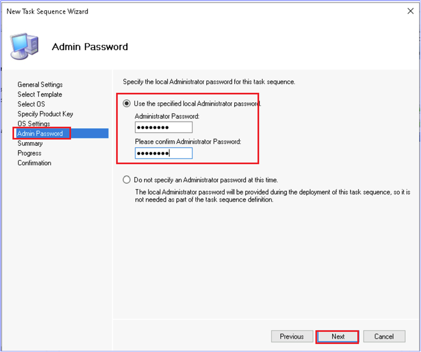

9.  Na página **Summary**, revise as informações e selecione **Next**.

> 

10. Na página **Confirmation**, certifique-se de que o processo foi
    concluído com sucesso e selecione **Finish**.

> 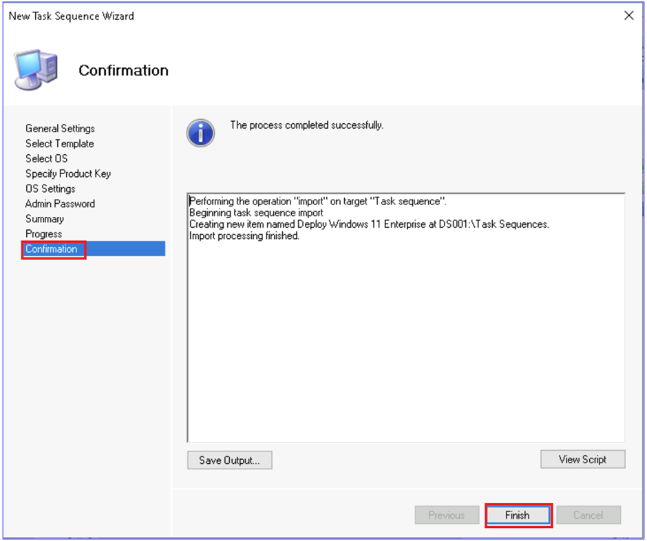

11. Em **Deployment Workbench**, com **Task Sequences** selecionado,
    verifique se a sequência de tarefas **Deploy Windows 11 Enterprise**
    é exibida.

> 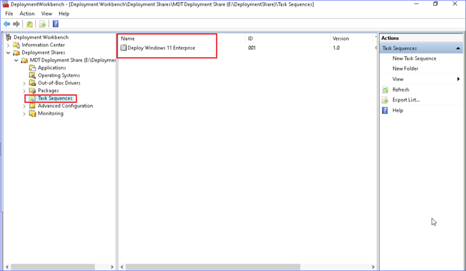

12. Clique com o botão direito do mouse na sequência de tarefas **Deploy
    Windows 11 Enterprise** e selecione **Properties**.

> 

13. Selecione a aba **Task Sequence**.

14. Expanda o nó **Validation** e selecione **Validate**.

15. Na página **Properties**, desmarque as opções **Ensure minimum
    memory**.

> Não faça nenhuma outra alteração.

16. Na janela **Deploy Windows 11 Enterprise Properties**, selecione
    **OK** .

> 

### **Tarefa 5: Configurar propriedades de compartilhamento de Implementação e configurações do Windows PE**

1.  No Deployment Workbench, expanda **Deployment Shares** e selecione
    **MDT Deployment Share**.

2.  Clique com o botão direito do mouse em **MDT Deployment Share** e
    selecione **Properties**.

> 

3.  Na janela **MDT Deployment Share Properties**, na aba **General**,
    anote as informações que foram fornecidas quando o compartilhamento
    de Implementação foi criado.

> 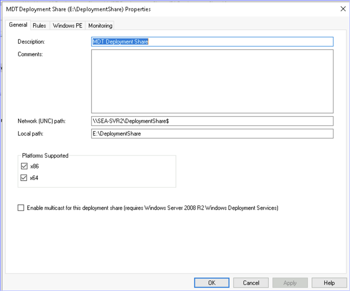

4.  Selecione a aba **Rules**.

> A aba Regras exibe o conteúdo do arquivo CustomSettings.ini. Esses
> valores foram fornecidos durante a criação do compartilhamento de
> implementação.
>
> 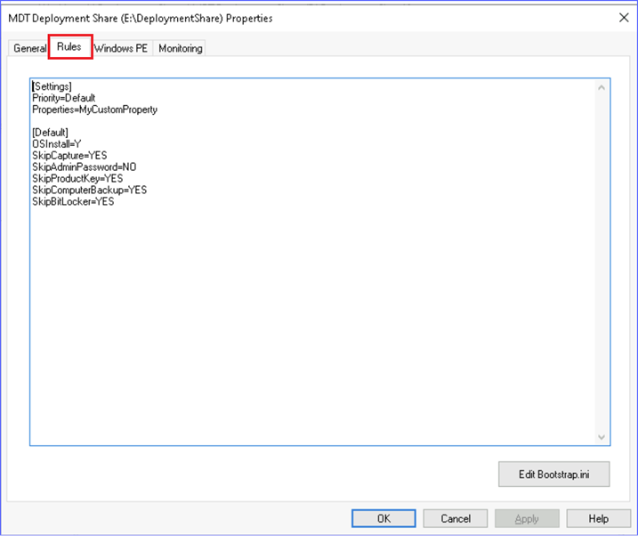

5.  Selecione a aba **Windows PE.**

> A aba Windows PE fornece opções para criar um disco de inicialização
> do Windows PE.

6.  Na aba **Windows PE**, ao lado de **Platform**, selecione **x64.**

7.  Na seção **Windows PE Customizations**, ao lado de **Scratch space
    size**, selecione **64**.

> 

8.  Selecione a aba **Features** e então marque a caixa de seleção ao
    lado dos seguintes Pacotes de Recursos:

    - DISM Cmdlets

    - Windows PowerShell

    - Microsoft Data Access Components (MDAC/ADO) support

> 
>
> 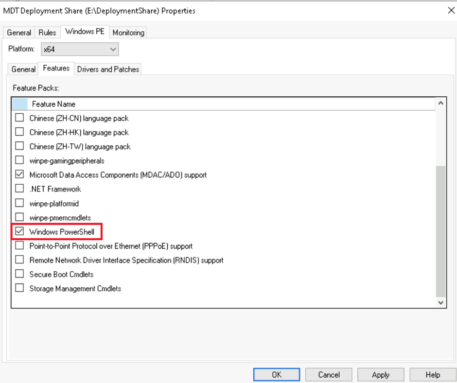

9.  Selecione a aba **Monitoring**.

10. Na aba **Monitoring**, marque a caixa de seleção ao lado de **Enable
    monitoring for this deployment share**.

11. Na janela **MDT Deployment Share Properties**, selecione **OK.**

> 

12. Clique com o botão direito do **MDT Deployment Share** e selecione
    **Update Deployment Share**. O Assistente para Atualizar
    Compartilhamento de Implementação será aberto.

> 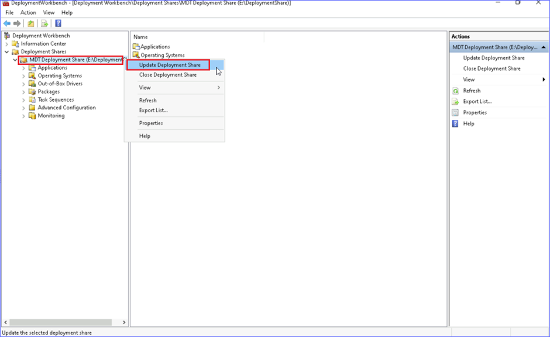

13. Na página **Options**, selecione **Optimize the boot image updating
    process** e selecione **Next**.

> 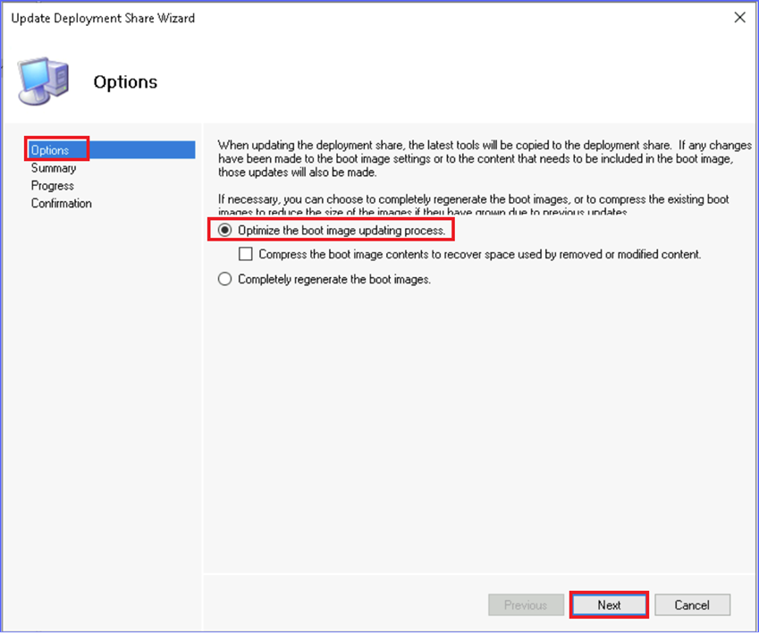

14. Na página **Summary**, selecione **Next**.

> 
>
> O Compartilhamento de Implementação começa a atualizar e criar os
> arquivos do Windows PE. Isso levará alguns minutos para ser concluído.

15. Na página **Confirmation**, certifique-se de que o processo foi
    concluído com sucesso e selecione **Finish**.

> 

### **Tarefa 6: Implementar o Windows 11 usando o MDT**

1.  Em [**SEA-SVR2**](urn:gd:lg:a:select-vm), na barra de tarefas,
    selecione **Hyper-V Manager**.

> 

2.  No Gerenciador do Hyper-V, selecione **Virtual Switch Manager**.

> 

3.  Selecione **External** na lista e clique em **Create Virtual
    Switch**.

> 

4.  Na página **Virtual Switch Properties**, em **Name**, insira
    [**External network**](urn:gd:lg:a:send-vm-keys), selecione **OK**
    e, em seguida, selecione **Yes**.

> 
>
> 

5.  No Gerenciador do Hyper-V, selecione **SEA-SVR2** e, no painel
    Actions, selecione **New** e, em seguida, **Virtual Machine**.

> 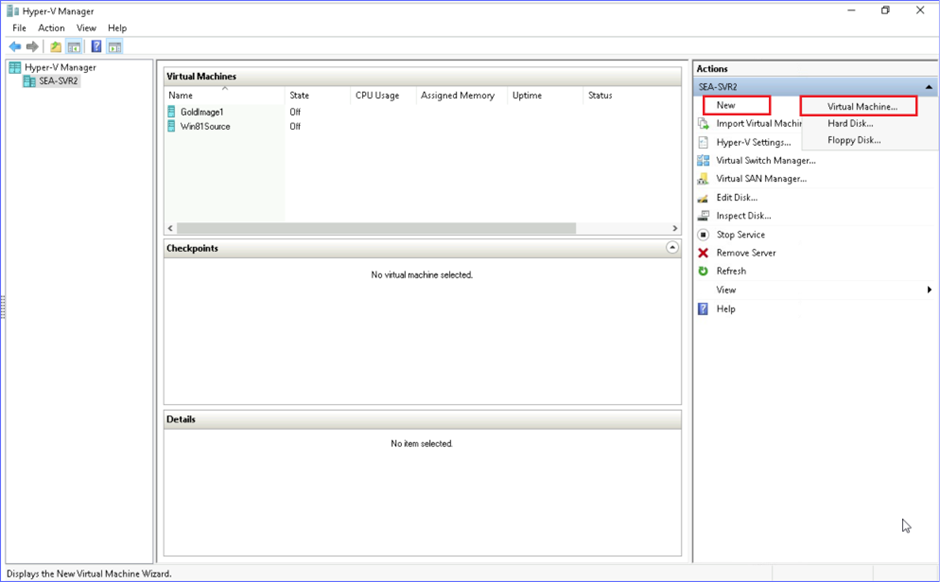

6.  Na página **Before you Begin**, selecione **Next**.

> 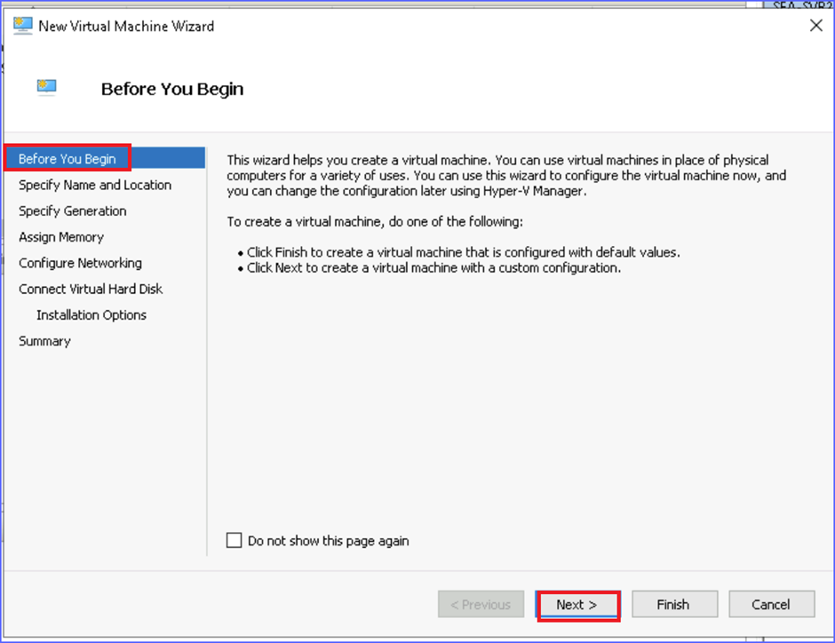

7.  Na página **Specify Name and Location**, na caixa **Name**, digite
    !!**[SEA-WS4](urn:gd:lg:a:send-vm-keys)!!**.

8.  Marque a caixa de seleção ao lado de **Store the virtual machine in
    a different location** e, em seguida, ao lado de **Location**,
    digite
    !!**[E:\Labfiles\VirtualMachines](urn:gd:lg:a:send-vm-keys)!!**.
    Selecione **Next**.

> 

9.  Na página **Specify Generation**, certifique-se de que **Generation
    2** esteja selecionada e selecione **Next**.

> 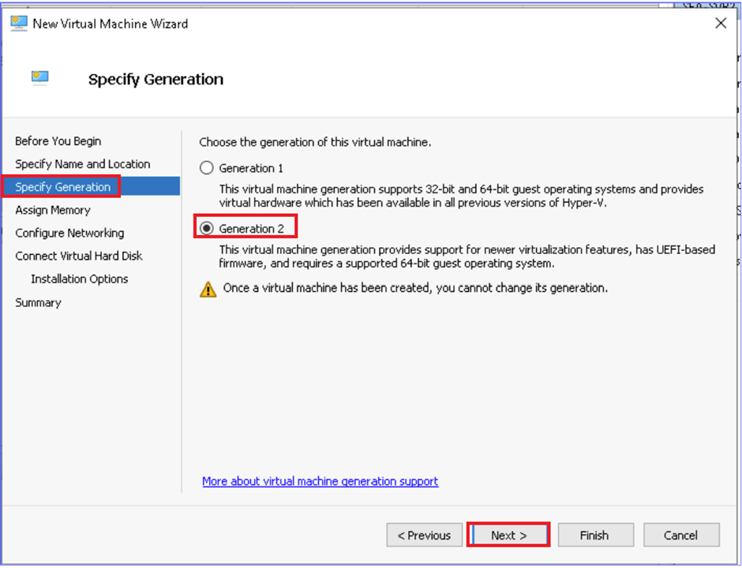

10. Na página **Assign Memory**, ao lado de **Startup memory,** digite
    !!**[8192](urn:gd:lg:a:send-vm-keys)!!** e selecione **Next**.

> 

11. Na página **Configure Networking**, ao lado de **Connection**,
    selecione **External Network** e depois **Next**.

> 

12. Na página **Connect Virtual Hard Disk**, selecione **Create a
    virtual hard disk**, digite o seguinte e clique em **Next**:

    - Name: !!**[SEA-WS4.vhdx](urn:gd:lg:a:send-vm-keys)!!**

    - Location: !!**[E:\Labfiles\VirtualMachines](urn:gd:lg:a:send-vm-keys)!!**

    - Size: !!**[60](urn:gd:lg:a:send-vm-keys)!!**

> 

13. Na página **Installation Options**, selecione **Install an operating
    system from a bootable image file** e configure o seguinte:

    - Image file
      (.iso): !!**[E:\DeploymentShare\Boot\LiteTouchPE_x64.iso](urn:gd:lg:a:send-vm-keys)!!**

> 

14. Selecione **Next** e depois **Finish**.

> 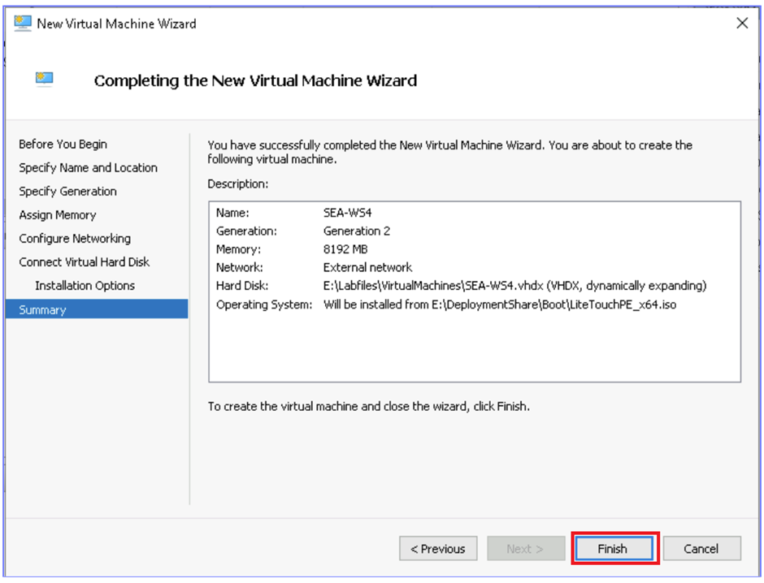

15. No Gerenciador do Hyper-V, clique com o botão direito do mouse em
    **SEA-WS4** e selecione **Settings**.

> 

16. Selecione **Security** e marque a caixa de seleção ao lado de
    **Enable Trusted Platform Module**.

> 

17. Selecione **Processor** e altere o número de processadores virtuais
    para !!**[2](urn:gd:lg:a:send-vm-keys)!!**.

18. Selecione **OK** para fechar a caixa de diálogo Configurações.

> 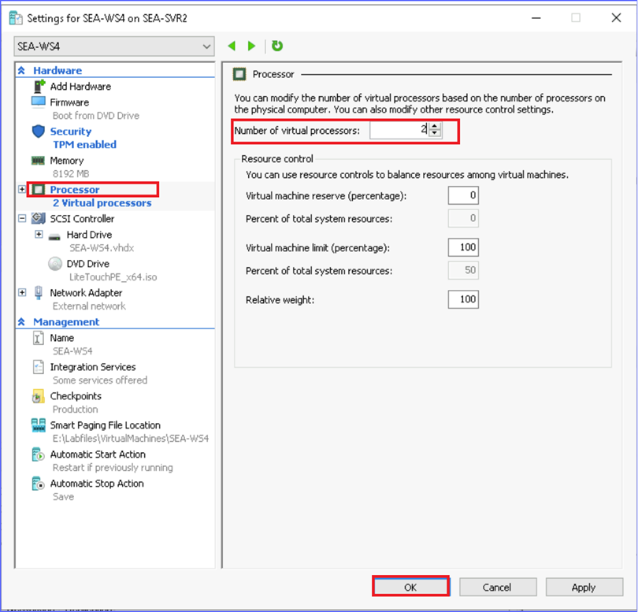

19. No Gerenciador do Hyper-V, selecione **SEA-WS4**, selecione
    **Connect** e, em seguida, selecione **Start**.

> 
>
> 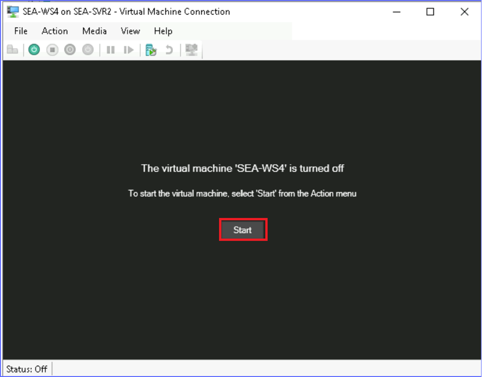

20. Quando o computador iniciar, pressione qualquer tecla do teclado
    para abrir o Assistente de Implementação do MDT. Maximize a janela
    conforme necessário.

> 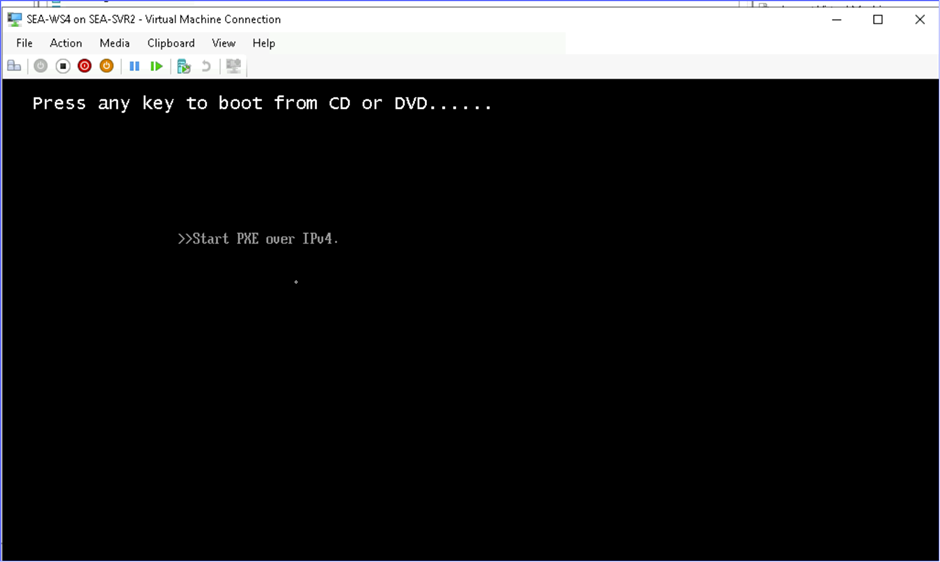

21. Na página **Welcome**, selecione **Run the Deployment Wizard to
    install a new Operating System**.

> 

22. Na janela **Specify credentials for connecting to network shares**,
    digite o seguinte e selecione **OK:**

    - User Name: !!**[Administrator](urn:gd:lg:a:send-vm-keys)!!**

    - Password: !!**[Pa55w.rd](urn:gd:lg:a:send-vm-keys)!!**

    - Domain: !!**[Contoso](urn:gd:lg:a:send-vm-keys)!!**

> 

23. Na página **Task Sequence**, selecione **Deploy Windows 11
    Enterprise** e, em seguida, selecione **Next**.

> 

24. Na página **Computer Details**, ao lado de **Computer name,** digite
    !!**[SEA-WS4](urn:gd:lg:a:send-vm-keys)!!** e selecione **Next**.

> 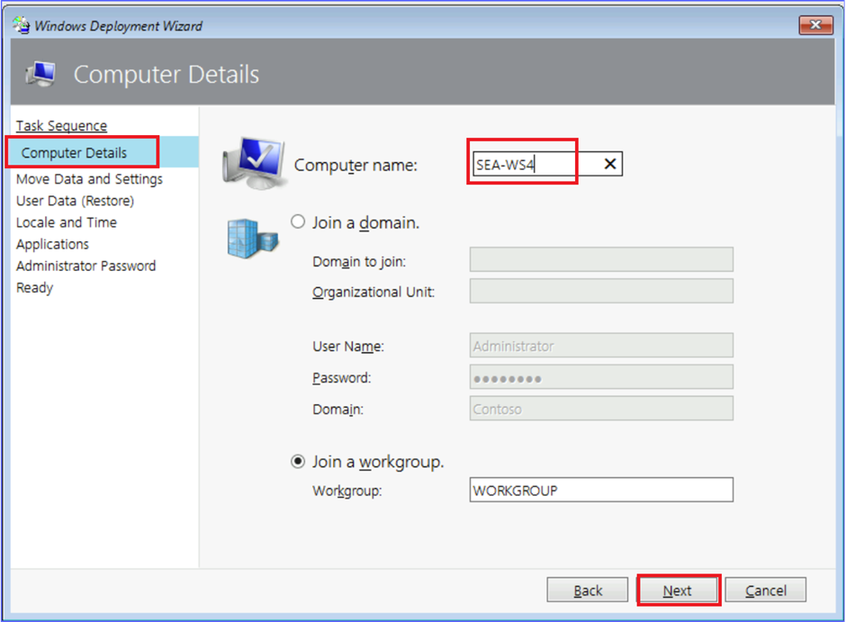

25. Na página **Move Data and Settings**, selecione **Next**.

> 

26. Na página **User Data (Restore)**, selecione **Next**.

> 

27. Na página **Locale and Time**, selecione **Next**.

> 

28. Na página **Applications**, selecione **Next**.

> 

29. Na página **Administrator Password**, digite
    !!**[Pa55w.rd](urn:gd:lg:a:send-vm-keys)!!** em ambas as caixas de
    texto e selecione **Next**.

> 

30. Na página **Ready**, selecione **Begin**.

> 
>
> A instalação será iniciada. Levará algum tempo para ser concluída e o
> **SEA-WS4** será reinicializado durante a instalação, conforme
> necessário.

31. Altere para o **Deployment Workbench.**

32. No Deployment Workbench, expanda **Deployment Shares** e expanda
    **MDT Deployment Share**.

33. Selecione **Monitoring** e, no painel de detalhes, clique duas vezes
    em **SEA-WS4**.

> 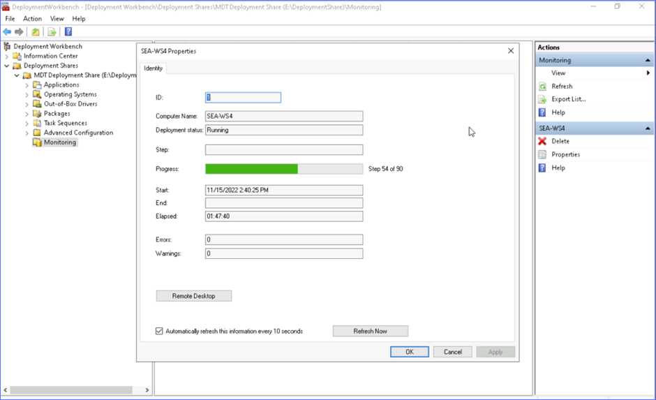
>
> Revise o status do monitoramento durante a Implementação.
>
> 

34. Altere para **SEA-WS4.**

35. Após a conclusão da instalação, a área de trabalho será aberta e
    finalizará a Implementação. No resumo da Implementação, selecione
    **Concluir.**

> 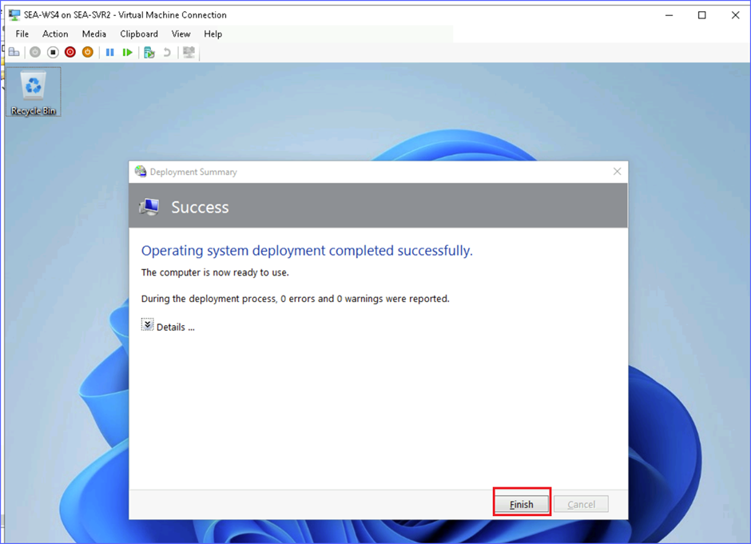

36. Desligue o **SEA-WS4** e feche a janela Conexão da Máquina Virtual.

> 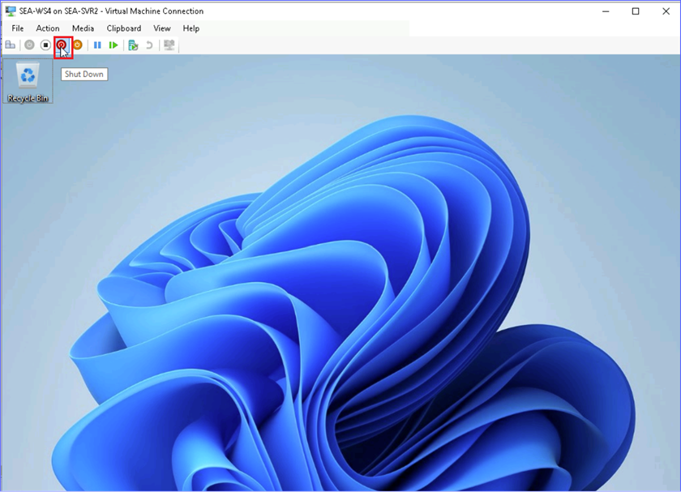

37. No Gerenciador do Hyper-V, clique com o botão direito do mouse em
    **SEA-WS4** e selecione **Settings**.

> 

38. Em **Settings for SEA-WS4**, expanda **SCSI Controller** e selecione
    **DVD Drive**.

39. No painel de detalhes, em **Media**, selecione **None** e depois
    selecione **OK.**

> 

40. Clique com o botão direito do mouse em **SEA-WS4** e selecione
    **Checkpoint** para criar um ponto de verificação do estado atual do
    SEA-WS4.

> 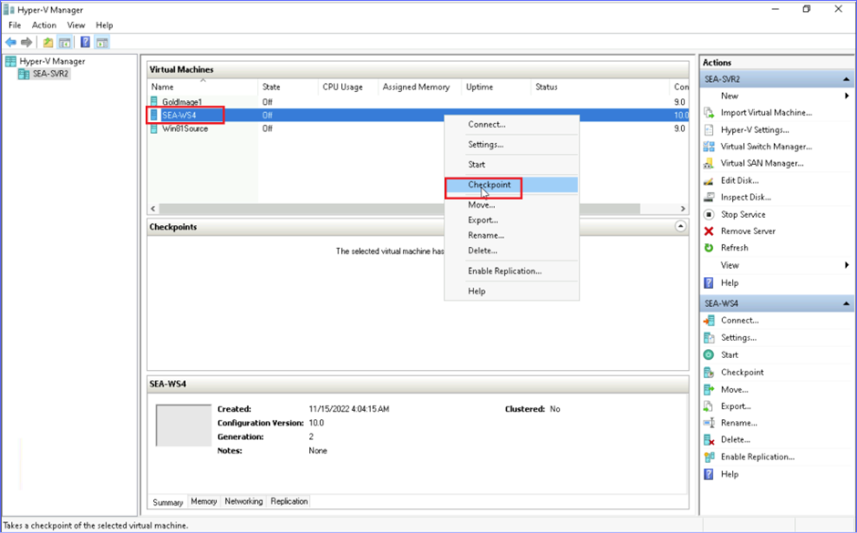
>
> 

41. Em [**SEA-SVR2**](urn:gd:lg:a:select-vm), feche o **Hyper-V
    Manager** e o **Deployment Workbench.**

42. Abra o **File Explorer**, clique com o botão direito do mouse na
    **DVD Drive D** e selecione **Eject**.

> 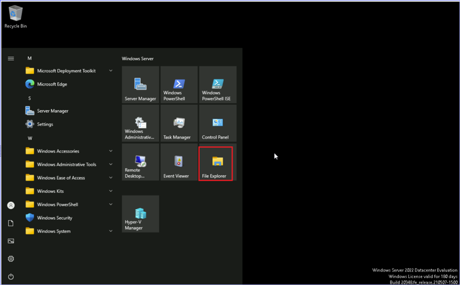
>
> 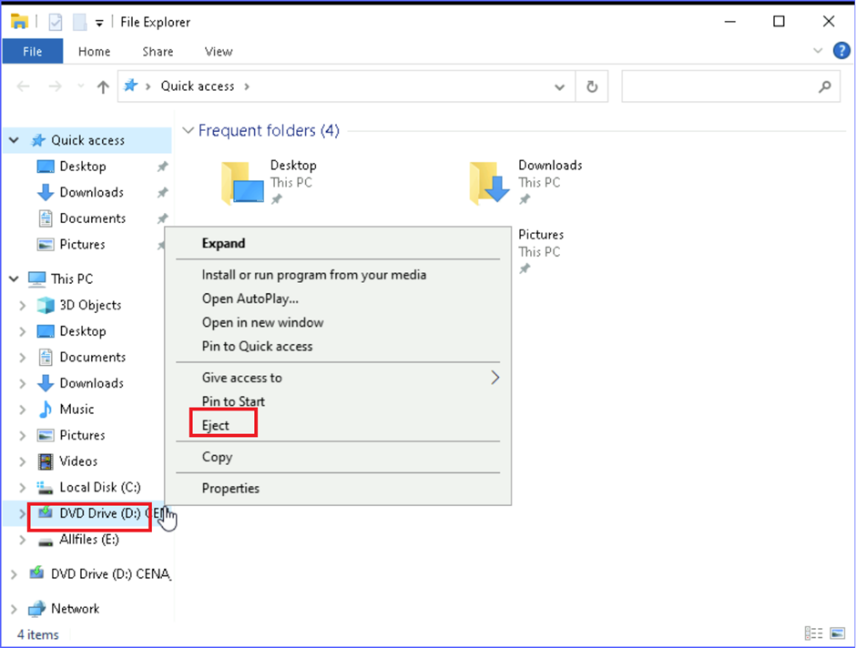

43. Feche o **File Explorer** e saia do **SEA-SVR2**.

**Resultados:** Após concluir este exercício, você terá usado com
sucesso o Microsoft Deployment Toolkit para criar e Implementar uma
estação de trabalho do Windows 11.
