# **Atelier 19 - Déploiement de Windows 11 à l'aide de Microsoft Deployment Toolkit**

**Résumé**

Dans cet atelier, vous allez utiliser Microsoft Deployment Toolkit pour
créer et déployer une image du système d'exploitation Windows 11.

**Scénario**

Vous devez déployer une nouvelle machine virtuelle Windows 11 nommée
SEA-WS4. Vous décidez d'utiliser Microsoft Deployment Toolkit pour
déployer le système d'exploitation sur une machine virtuelle créée dans
Hyper-V. Vous allez configurer un nouveau partage de déploiement dans
MDT, puis configurer la séquence de tâches qui effectuera les étapes de
déploiement de SEA-WS4.

### **Tâche 1 : Créer un nouveau partage de déploiement**

1.  Passez à [**SEA-SVR2**](urn:gd:lg:a:select-vm), connectez-vous en
    tant que !!**[Contoso\Administrator](urn:gd:lg:a:send-vm-keys) !!**
    avec le mot de passe !\
    **!!**

> 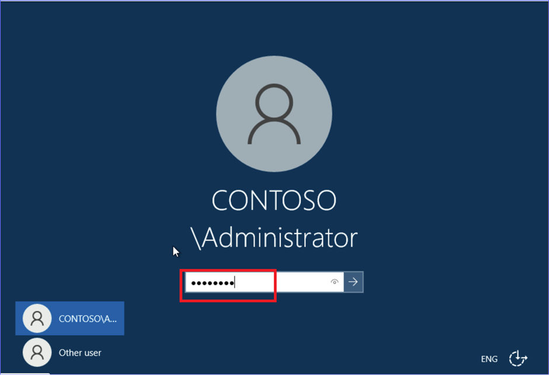

2.  Dans la barre des tâches, sélectionnez **File Explorer** , puis
    accédez à !!**[E :\Labfiles\ISOs](urn:gd:lg:a:send-vm-keys) !!**

> 

3.  Cliquez avec le bouton droit **Win11_21H2_Eval.iso**  puis
    sélectionnez **Mount**. L'ISO se monte en tant que lecteur de DVD
    **D**.

> 
>
> 

4.  Fermez **File Explorer**.

5.  Sélectionnez **Start menu** , développez **Microsoft Deployment
    Toolkit**, puis sélectionnez **Deployment Workbench**.

> 

6.  Dans **Deployment Workbench**, cliquez avec le bouton droit sur
    **Deployment Shares** , puis sélectionnez **New Deployment Share**.

> 
>
> L'**Assistant Nouveau partage de déploiement** s'ouvre.

7.  Sur la page **Chemin d'accès**, sous **Deployment share path**
    remplacez la valeur par
    !!**[E :\DeploymentShare](urn:gd:lg:a:send-vm-keys) !!** , puis
    sélectionnez **Next**.

> 

8.  Sur la page **Partager**, notez le **nom du partage**, mais ne le
    modifiez pas. Sélectionnez **Next**.

> 

9.  Sur la **page Nom descriptif**, acceptez la valeur par défaut et
    sélectionnez **Next**.

> 

10. Dans la **page Options**, configurez les éléments suivants, puis
    sélectionnez **Next** :

    - Demandez à définir le mot de passe de l'administrateur local :
      **Enabled**

    - Toutes les autres cases à cocher : **Disabled**

> 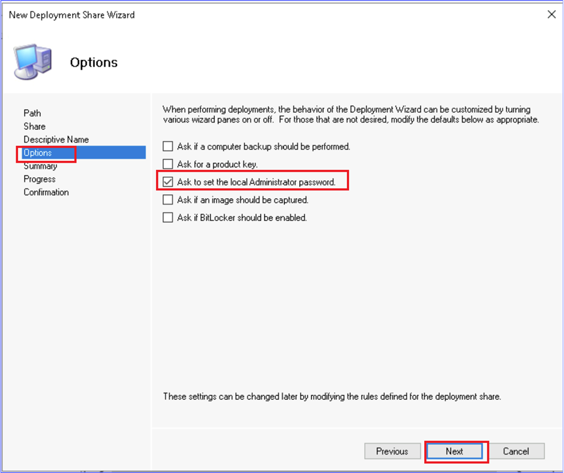

11. Sur la page **Résumé**, passez en revue les informations, puis
    sélectionnez **Next**.

> 

12. Sur la page **Confirmation**, assurez-vous que le processus s'est
    terminé avec succès, puis sélectionnez **Finish**.

> 

13. Sous **Partages de déploiement**, développez le dossier **MDT
    Deployment Share**.

> Prenez note des différents nœuds qui peuvent être configurés pour le
> partage de déploiement.

### **Tâche 2 : Ajouter des fichiers du système d'exploitation au partage de déploiement**

1.  Dans le Deployment Workbench, développez **Partages de
    déploiement**, Partage **MDT Deployment Share**, puis sélectionnez
    **Operating system** .

> 

2.  Cliquez avec le bouton droit sur **operating System**, puis
    sélectionnez **Import Operating System**. L'Assistant Importation du
    système d'exploitation s'ouvre.

> 

3.  Dans **Import Operating System Wizard**, dans la page **OS Type** ,
    sélectionnez **Full set of source files**, puis sélectionnez
    **Next**.

> 

4.  Sur la page **Source**, sous **Source Directory**, entrez
    !!**[D :\\](urn:gd:lg:a:send-vm-keys) !!** , puis sélectionnez
    **Next**.

> 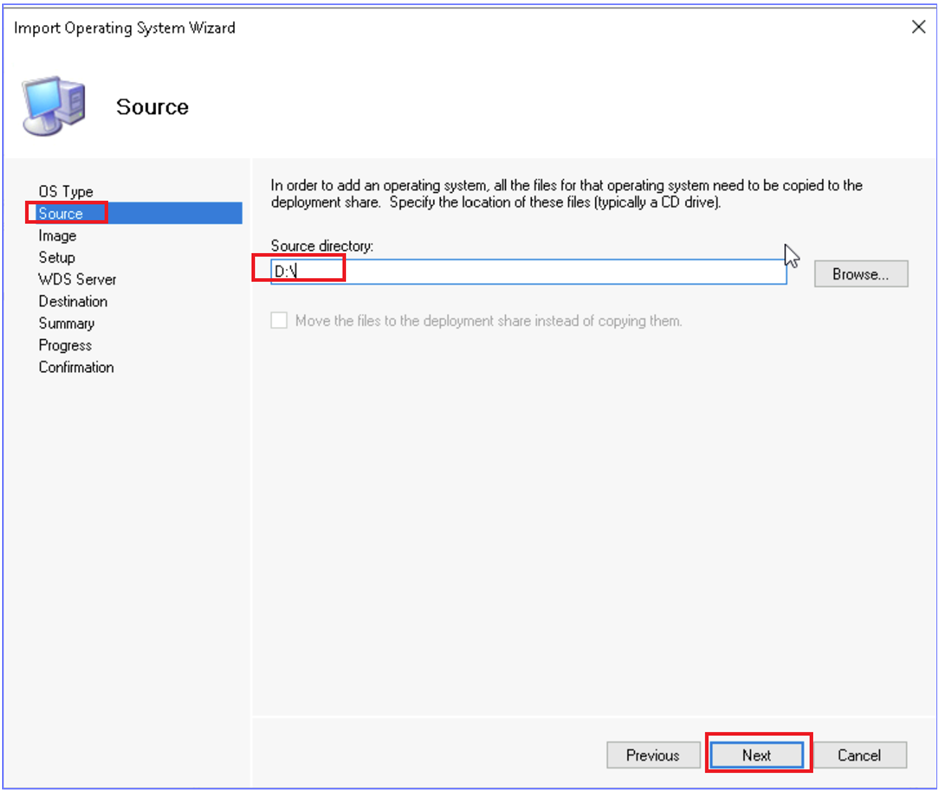

5.  Sur la page **Destination**, remplacez le nom du répertoire de
    destination par défaut par !\ **!!** , puis sélectionnez
    **Next**.

> 

6.  Sur la page **Résumé**, passez en revue les informations, puis
    sélectionnez **Next**.

> 
>
> Les fichiers sources du système d'exploitation sont copiés dans le
> partage de déploiement.

7.  Sur la page **Confirmation**, assurez-vous que le processus s'est
    terminé avec succès, puis sélectionnez **Finish**.

> 

8.  Dans Deployment **Workbench**, avec **Operating Systems** 
    sélectionnés, vérifiez que le système d'exploitation s'affiche.

### **Tâche 3 : Ajouter des applications au partage de déploiement**

1.  Dans Deployment Workbench, développez **Deployment Shares**, **MDT
    Deployment Share**, puis sélectionnez **Applications**.

2.  Cliquez avec le bouton droit sur **Applications**, puis sélectionnez
    **Nouvelle application**. L'Assistant Nouvelle application s'ouvre.

> 

3.  Dans l'**Assistant Nouvelle application**, dans la page **Type
    d'application**, sélectionnez **Application with source files** ,
    puis sélectionnez **Next.**

> 

4.  Dans la page **Détails**, configurez les éléments suivants, puis
    sélectionnez **Next** :

    - Éditeur:!!**[Microsoft](urn:gd:lg:a:send-vm-keys) !!**

    - Nom de l'application : !!**[XML
      Notepad](urn:gd:lg:a:send-vm-keys)!!**

> 

5.  Sur la page **Source**, sous **Répertoire source**, entrez
    !!**[E :\Labfiles\Apps](urn:gd:lg:a:send-vm-keys) !!** , puis
    sélectionnez **Next**.

> 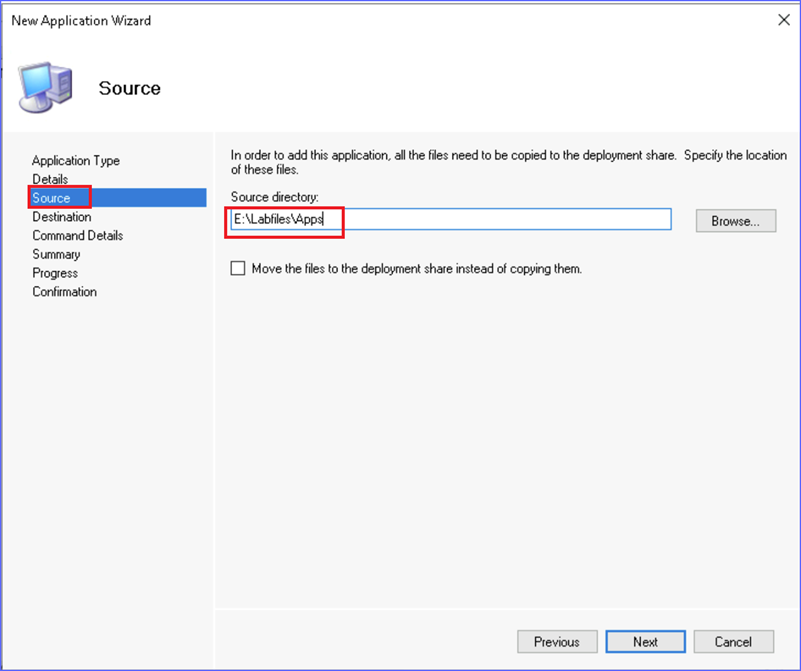

6.  Sur la page **Destination**, acceptez le nom du répertoire de
    destination par défaut, puis sélectionnez **Next**.

> 

7.  Sur la page **Détails de la** **commande**, sous **command Line**,
    entrez !\
    **!!** , puis sélectionnez **Next**.

> 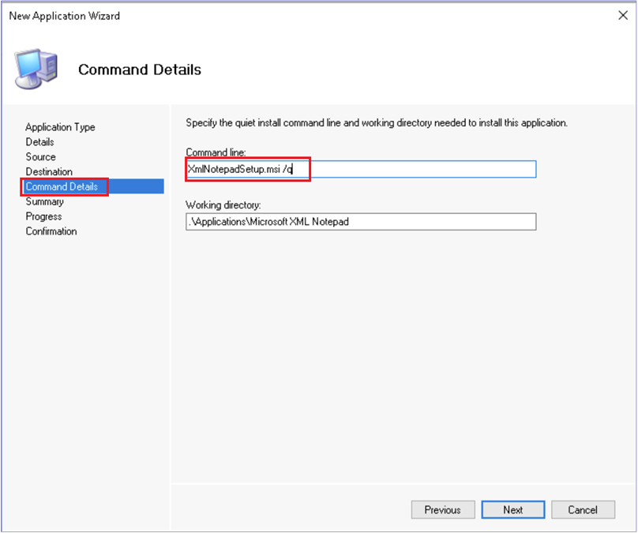

8.  Sur la page **Résumé**, passez en revue les informations, puis
    sélectionnez **Next**.

> 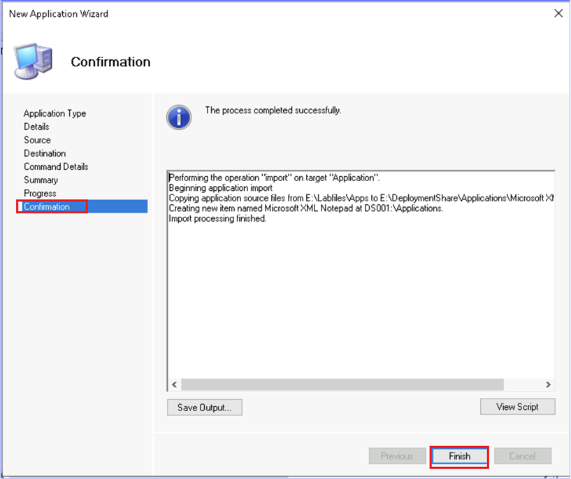

9.  Sur la page **Confirmation**, assurez-vous que le processus s'est
    terminé avec succès, puis sélectionnez **Finish**.

### **Tâche 4 : Création d'une séquence de tâches MDT**

1.  Dans Deployment Workbench, développez **Deployment Shares**, **MDT
    Deployment Share**, puis sélectionnez **Task Sequences**..

2.  Cliquez avec le bouton droit sur **Task Sequences**..puis
    sélectionnez **New Task Sequences**. Le **New Task Sequence Wizard**
    s'ouvre.

> 

3.  Sur la page **Paramètres généraux**, configurez les éléments
    suivants, puis sélectionnez **Next** :

    - ID de la séquence de tâches :
      !\ **!!**

    - Nom de la séquence de tâches : !!**[Déployez Windows 11
      Enterprise](urn:gd:lg:a:send-vm-keys) !!**

> 

4.  Dans la page **Sélectionner un modèle**, sélectionnez **Standard
    Client Task Sequence**, puis sélectionnez **Next**.

> 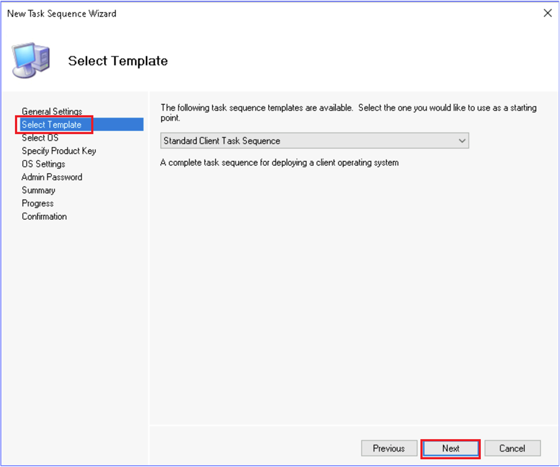

5.  Dans la page **Select os**, sélectionnez **Évaluation de Windows 10
    Entreprise**, puis sélectionnez **Next**.

> 

6.  Dans la page **Spécifier la clé de produit**, sélectionnez **Ne pas
    spécifier de clé de produit pour le moment**, puis sélectionnez
    **Next**.

> 

7.  Sur la page **Paramètres du système d'exploitation**, configurez les
    éléments suivants, puis sélectionnez **Next** :

    - Nom complet:! !!**[User](urn:gd:lg:a:send-vm-keys)!!**

    - Organisation:!\ **!!**

    - Page d'accueil d'Internet Explorer :
      !!**[about:blank](urn:gd:lg:a:send-vm-keys)!!**

> 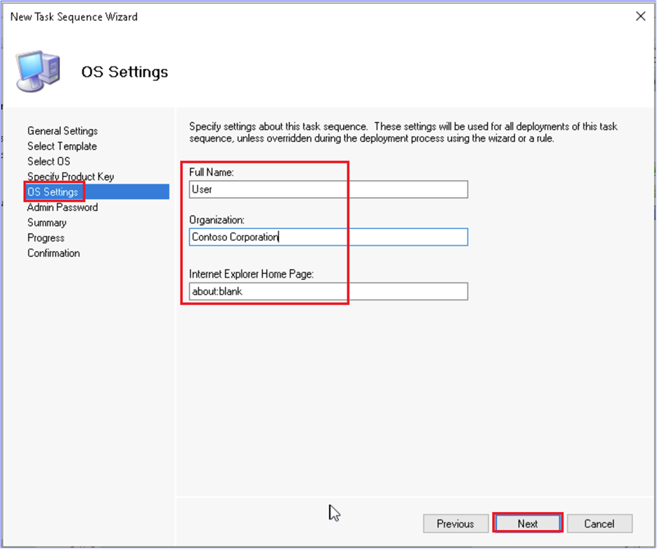

8.  Sur la page **Mot de passe administrateur**, sélectionnez **Utiliser
    le mot de passe administrateur local spécifié**, puis entrez
    !\ **!!** dans les deux
    zones de texte. Sélectionnez **Next**.

> 

9.  Sur la page **Résumé**, passez en revue les informations, puis
    sélectionnez **Next**.

> 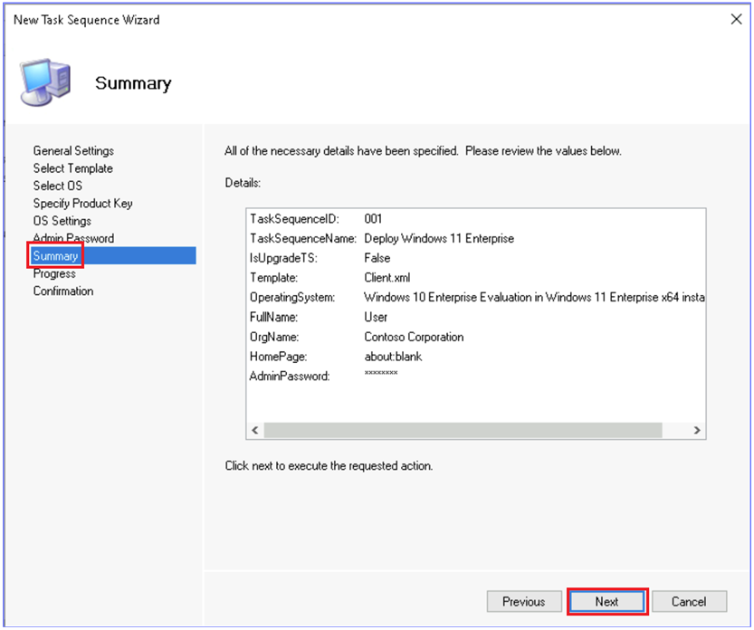

10. Sur la page **Confirmation**, assurez-vous que le processus s'est
    terminé avec succès, puis sélectionnez **Finish**.

> 

11. Dans **Deployment Workbench**, avec **Task sequence** sélectionnées,
    vérifiez que la séquence de tâches **Déployer Windows 11
    Entreprise** s'affiche.

> 

12. Cliquez avec le bouton droit sur la séquence de tâches **Déployer
    Windows 11 Entreprise**, puis sélectionnez **Properties**.

> 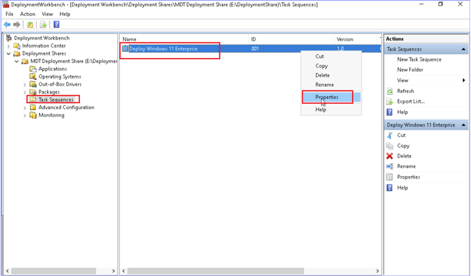

13. Sélectionnez l' onglet **Task sequence**.

14. Développez le nœud **Validation**, puis sélectionnez **Valider**.

15. Sur la page **Properties**., décochez les cases Garantir la
    **mémoire minimale** et **Garantir la vitesse minimale du
    processeur**.

> N'apportez pas d'autres modifications.

16. Dans la fenêtre **Déployer les propriétés de Windows 11
    Entreprise**, sélectionnez **OK.**

> 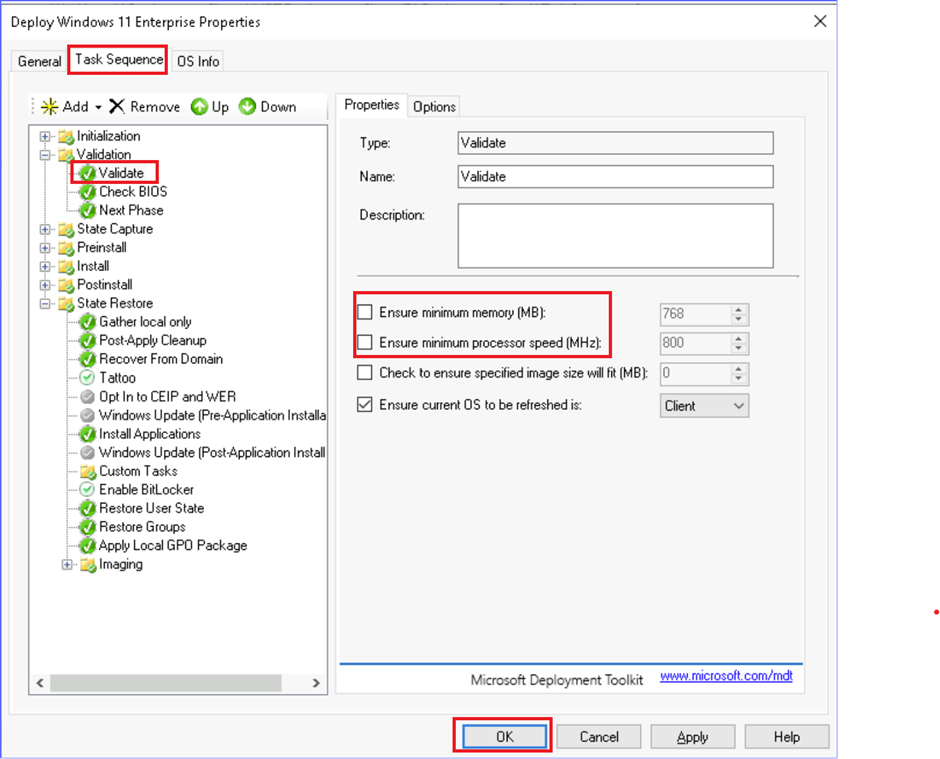

### **Tâche 5 : Configurer les propriétés de partage de déploiement et les paramètres Windows PE**

1.  Dans Deployment Workbench, développez **Deployment Shares** , puis
    sélectionnez **MDT Deployment Share** .

2.  Cliquez avec le bouton droit sur **MDT Deployment Share**, puis
    sélectionnez **Properties**..

> 

3.  Dans la fenêtre **MDT Deployment Share Properties**  sous l' onglet
    **Général**, notez les informations fournies lors de la création du
    partage de déploiement.

> 

4.  Sélectionnez l' onglet **Rules**.

> L'onglet Règles affiche le contenu du fichier CustomSettings.ini. Ces
> valeurs ont également été fournies lors de la création du partage de
> déploiement.
>
> 

5.  Sélectionnez l' onglet **Windows PE**.

> L'onglet Windows PE fournit des options pour la création d'une
> disquette de démarrage Windows PE.

6.  Sous l' onglet **Windows PE**, en regard de **Plate-forme**,
    sélectionnez **x64**.

7.  Dans la section **Personnalisations de Windows PE**, en regard de
    **Taille de l**'**espace de travail**, sélectionnez **64**.

> 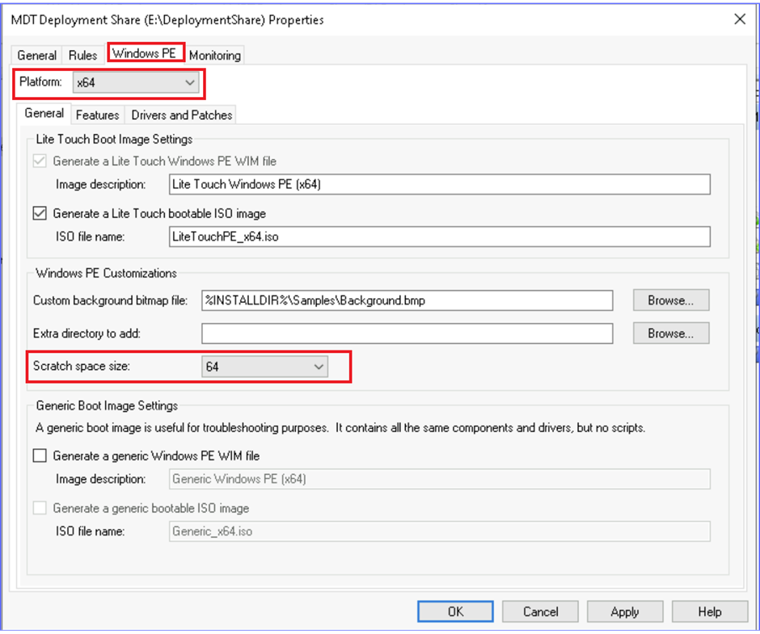

8.  Sélectionnez l' onglet **Features**, puis cochez la case en regard
    des Feature Packs suivants :

    - Applets de commande DISM

    - Windows PowerShell

    - Prise en charge des composants Microsoft Data Access (MDAC/ADO)

> 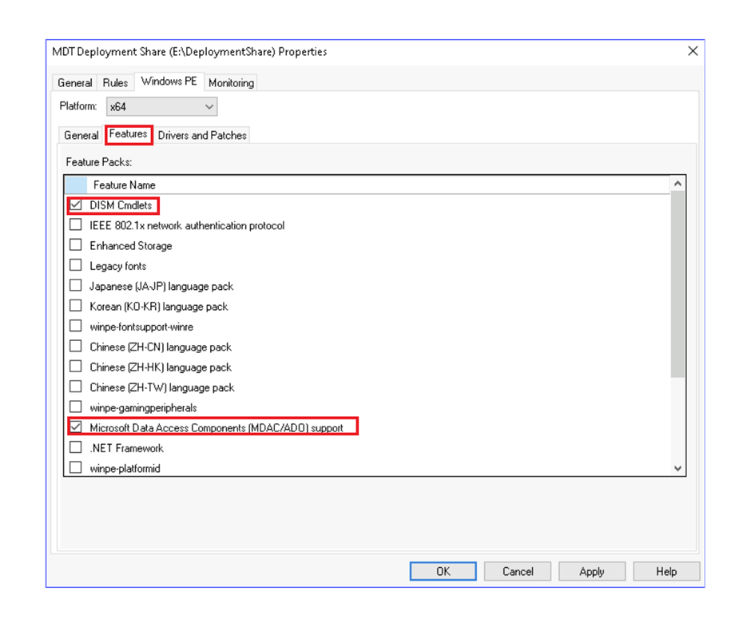
>
> 

9.  Sélectionnez l' onglet **Monitoring**.

10. Sous l' onglet **Monitoring**, cochez la case en regard de
    to **Enable monitoring for this deployment share**

11. Dans la fenêtre **MDT Deployment Share Properties** , sélectionnez
    **OK.**

> 

12. Cliquez avec le bouton droit sur **MDT Deployment Share** puis
    sélectionnez **Update Deployment Share**. L'Assistant Mise à jour du
    partage de déploiement s'ouvre.

> 

13. Dans la page **Options**, sélectionnez **Optimize the boot image
    updating process**, puis sélectionnez **Next**.

> 

14. Sur la page **Résumé**, sélectionnez **Next**.

> 
>
> Le partage de déploiement commence à mettre à jour et à créer les
> fichiers Windows PE. Cela prendra quelques minutes.

15. Sur la page **Confirmation**, assurez-vous que le processus s'est
    terminé avec succès, puis sélectionnez **Finish**.

> 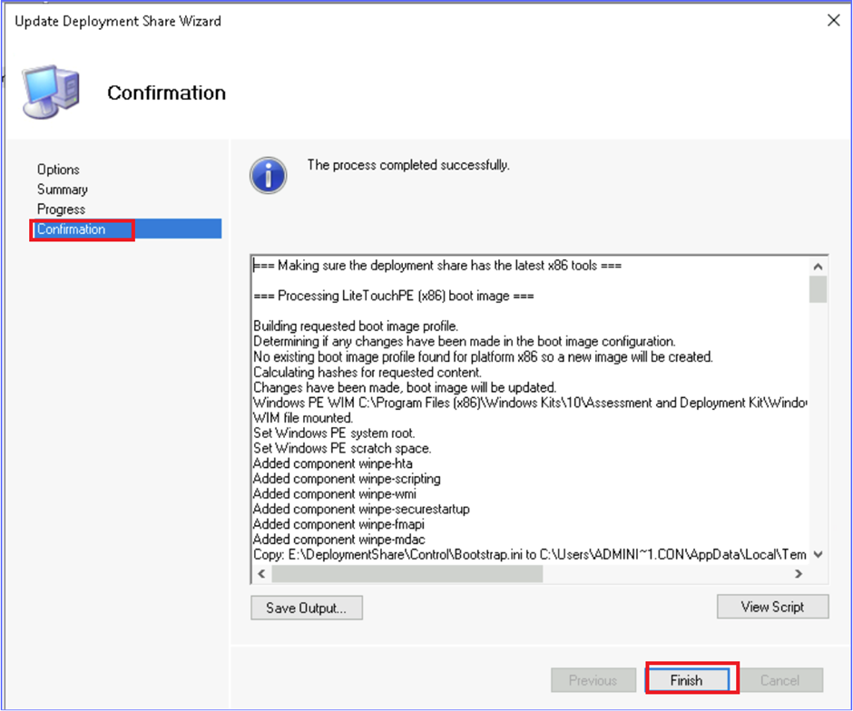

### **Tâche 6 : Déployer Windows 11 à l'aide de MDT**

1.  Sur [**SEA-SVR2**](urn:gd:lg:a:select-vm), dans la barre des tâches,
    sélectionnez **Hyper-V Manager**.

> 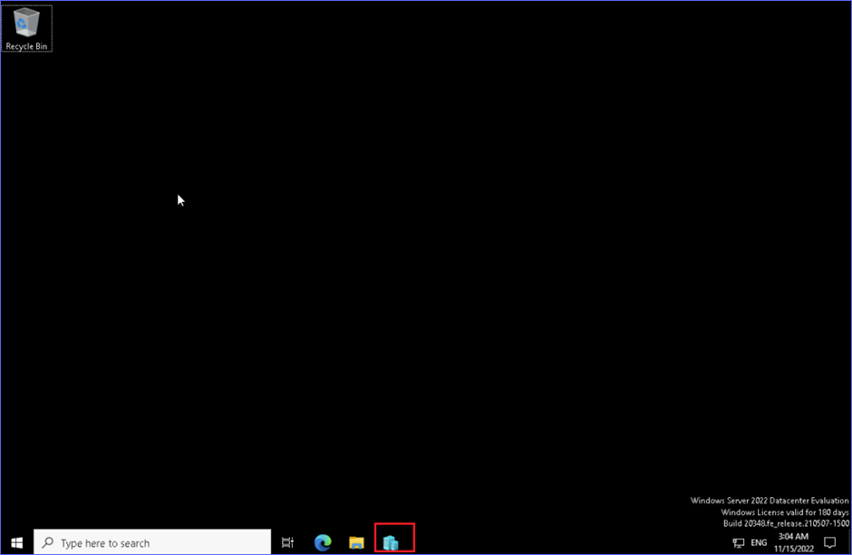

2.  Dans le Hyper-V manager, sélectionnez **Virtual Switch Manager**.

> 

3.  Sélectionnez **Externe** dans la liste, puis cliquez sur **Create
    Virtual Switch**.

> 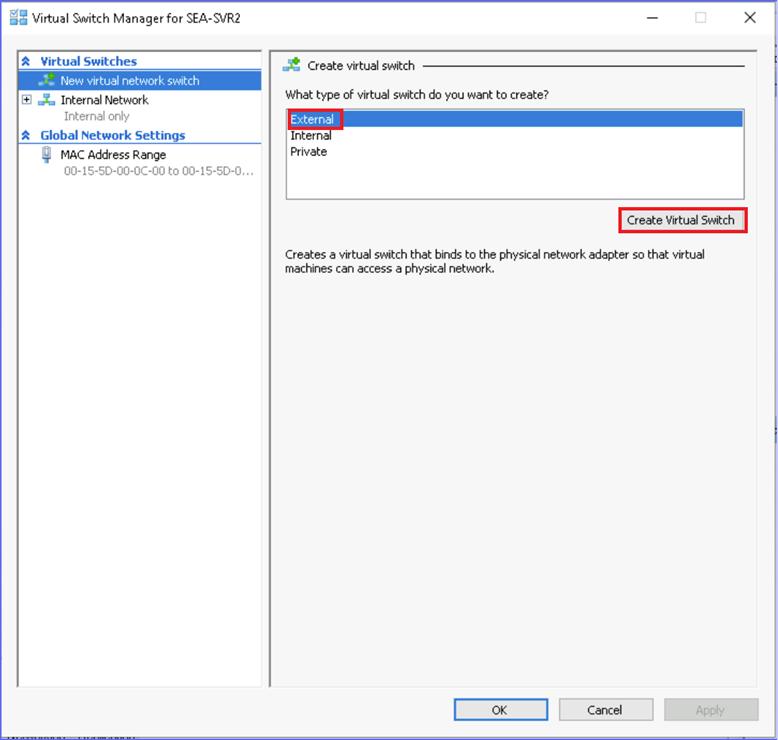

4.  Dans la page **Virtual Switch Properties** , sous **Nom**, entrez
    [**External network**](urn:gd:lg:a:send-vm-keys), sélectionnez
    **OK,** puis électionnez **Yes**.

> 
>
> 

5.  Dans le Hyper-V manager, sélectionnez **SEA-SVR2,** puis dans le
    volet Actions, sélectionnez **New**, puis sélectionnez **Virtual
    Machine**.

> 

6.  Sur la page **Avant de commencer**, sélectionnez **Next**.

> 

7.  Sur la page **Spécifier le nom et l'emplacement**, dans la zone
    **Nom**, tapez !\ **!!**.

8.  Cochez la case à côté de **Stocker la machine virtuelle dans un
    autre emplacement**, puis à côté de Type **Location**
    !!**[E :\Labfiles\VirtualMachines](urn:gd:lg:a:send-vm-keys) !!**.
    Sélectionnez **Next**.

> 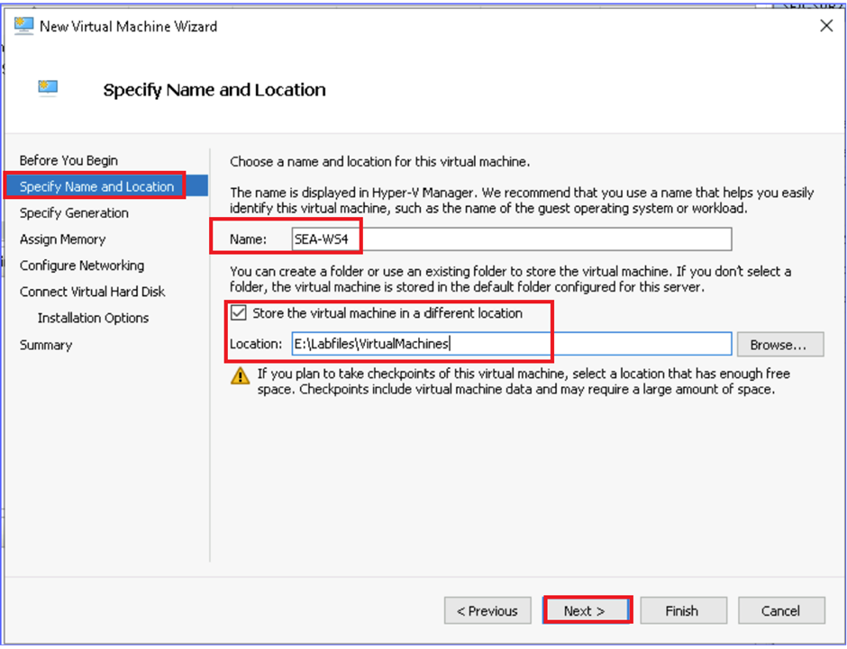

9.  Sur la page **Spécifier la génération**, assurez-vous que la
    **génération 2** est sélectionnée, puis sélectionnez **Next**.

> 

10. Sur la page **Assign Memory**  à côté de **Mémoire de**
    **démarrage,** tapez !\ **!!**
    , puis sélectionnez **Next**.

> 

11. Sur la page **Configurer la mise en réseau**, en regard de
    **Connexion**, sélectionnez **External Network**  puis Selectionnez
    **Next**

> 

12. Sur la page **Connect Virtual Hard Disk** , sélectionnez **Create a
    virtual hard disk**  et entrez ce qui suit, puis cliquez sur
    **Next** :

    - Nom:!\ **!!**

    - Emplacement:!!**[E :\Labfiles\VirtualMachines](urn:gd:lg:a:send-vm-keys)!!**

    - Taille:!\ **!!**

> 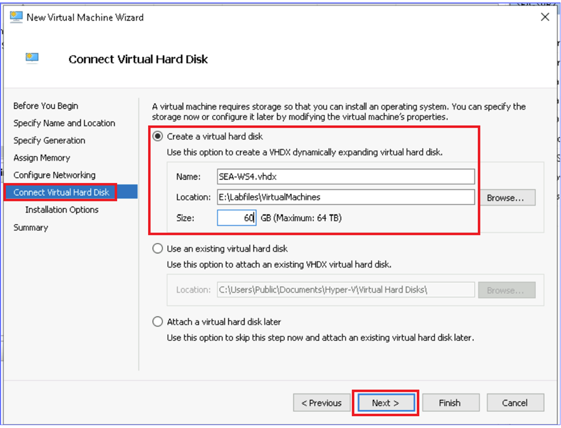

13. Sur la page **Options d'installation**, sélectionnez **Installer un
    système d'exploitation à partir d'un fichier image amorçable** et
    configurez les éléments suivants :

    - Fichier image (.iso) :
      !!**[E :\DeploymentShare\Boot\LiteTouchPE_x64.iso](urn:gd:lg:a:send-vm-keys) !!**

> 

14. Sélectionnez **Next**, puis Selectionnnez **Finish**.

> 

15. Dans le Hyper-V Manager cliquez avec le bouton droit sur
    **SEA-WS4**, puis sélectionnez **Settings**.

> 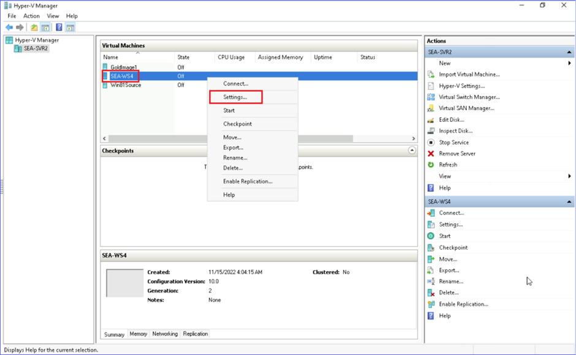

16. Sélectionnez **Security**, puis cochez la case en regard de Activer
    le **module de plate-forme sécurisée**.

> 

17. Sélectionnez **Processeur**, puis remplacez le nombre de processeurs
    virtuels par !\ **!!**.

18. Sélectionnez **OK** pour fermer la boîte de dialogue Paramètres.

> 

19. Dans le Hyper-V Manager, sélectionnez **SEA-WS4**, **Connect**, puis
    **Start**.

> 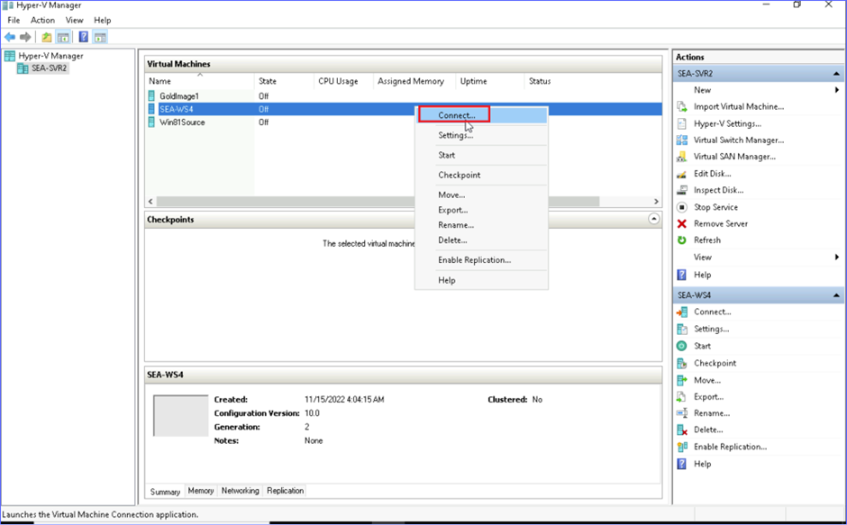
>
> 

20. Au démarrage de l'ordinateur, appuyez sur n'importe quelle touche du
    clavier pour appeler l'Assistant de déploiement MDT. Maximisez la
    fenêtre au besoin.

> 

21. Sur la page **d'accueil**, sélectionnez s **Run the Deployment
    Wizard to install a new Operating System**..

> 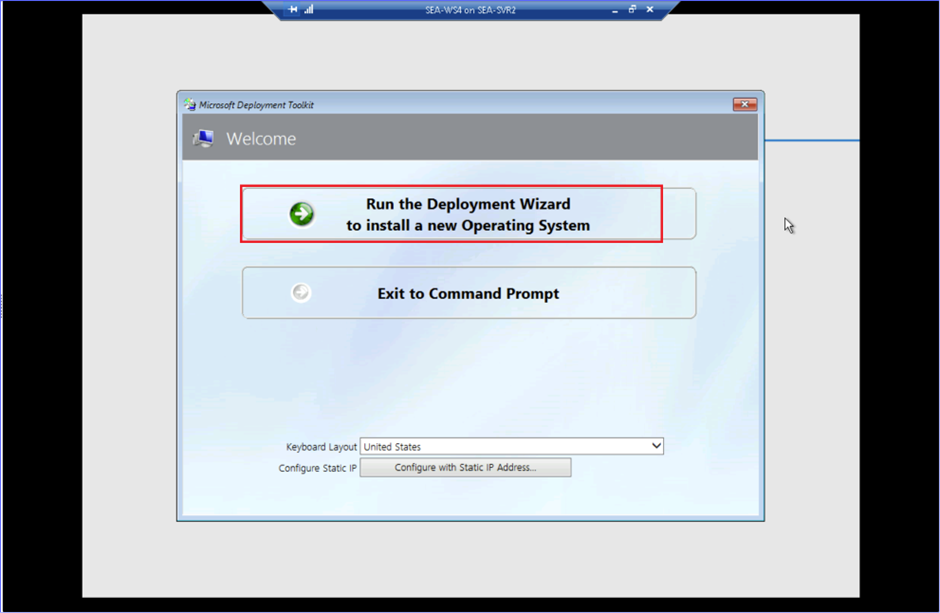

22. Dans la fenêtre **Specify credentials for connecting to network
    shares** ,entrez ce qui suit, puis sélectionnez **OK** :

    - Nom d'utilisateur :
      !!**[Administrator](urn:gd:lg:a:send-vm-keys)!!**

    - Mot de passe:!\ **!!**

    - Domaine:!\

> 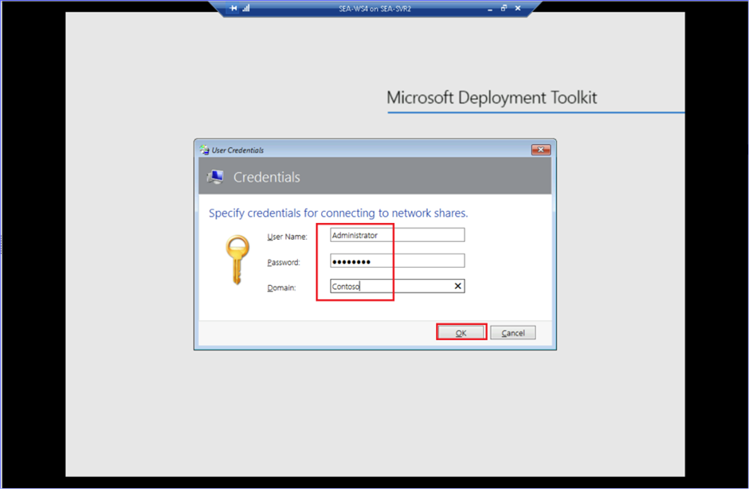

23. Sur la page **Task sequence**, sélectionnez **Déployer Windows 11
    Entreprise,** puis sélectionnez **Next**.

> 

24. Sur la page **Détails de l**'ordinateur, à côté de **Nom de**
    l'**ordinateur,** entrez !\
    **!!** , puis sélectionnez **Next**.

> 

25. Sur la page **Move Data and Settings** , sélectionnez **Next**.

> 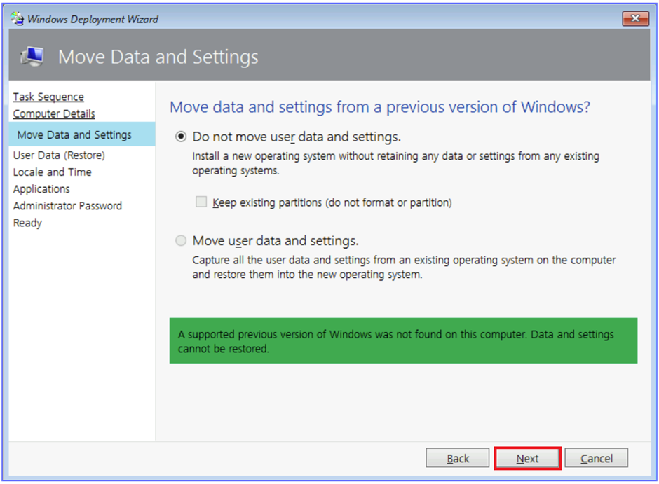

26. Sur la page **User Data (Restore)** sélectionnez **Next**.

> 

27. Sur la page **Paramètres régionaux et heure**, sélectionnez
    **Next**.

> 

28. Sur la page **Applications**, sélectionnez **Next**.

> 

29. Sur la page **Mot de passe administrateur**, entrez
    !\ **!!** dans les deux
    zones de texte, puis sélectionnez **Next**.

> 

30. Sur la page **Prêt**, sélectionnez **Begin**.

> 
>
> L'installation commence. Cela prendra un certain temps et redémarrera
> **SEA-WS4** pendant l'installation si nécessaire.

31. Basculez vers **Deployment Workbench**..

32. Dans Deployment Workbench, développez **Deployment Shares**, puis
    **MDT Deployment Share**.

33. Sélectionnez **Monitoring**, puis dans le volet d'informations,
    double-cliquez sur **SEA-WS4**.

> 
>
> Vérifiez l'état de la surveillance pendant le déploiement.
>
> 

34. Passez à **SEA-WS4**.

35. Une fois l'installation terminée, le poste de travail s'ouvre et
    finalise le déploiement. Dans le résumé du déploiement, sélectionnez
    **Finish**.

> 

36. Arrêtez **SEA-WS4** et fermez la fenêtre Connexion de la machine
    virtuelle.

> 

37. Dans le Hyper-V Manager cliquez avec le bouton droit sur
    **SEA-WS4,** puis sélectionnez **Settings**.

> 

38. Dans les **paramètres de SEA-WS4**, développez **Contrôleur SCSI**,
    puis sélectionnez **DVD Drive**.

39. Dans le volet d'informations, sous **Media**, sélectionnez **None**,
    puis sélectionnez **OK.**

> 

40. Cliquez avec le bouton droit sur **SEA-WS4**, puis sélectionnez
    **Point de contrôle** pour créer un point de contrôle de l'état
    actuel de SEA-WS4.

> 
>
> 

41. Sur [**SEA-SVR2**](urn:gd:lg:a:select-vm), fermez **le Hyper-V
    Manager**  et fermez **Deployment Workbench**.

42. Ouvrez **File explorer**, cliquez avec le bouton droit de la souris
    sur le **DVD Drive D**  puis sélectionnez **Eject**.

> 
>
> 

43. Fermez **File Explorer**  et déconnectez-vous de **SEA-SVR2**.

**Résultats** : Une fois cet exercice terminé, vous aurez utilisé
Microsoft Deployment Toolkit pour créer et déployer un poste de travail
Windows 11.
