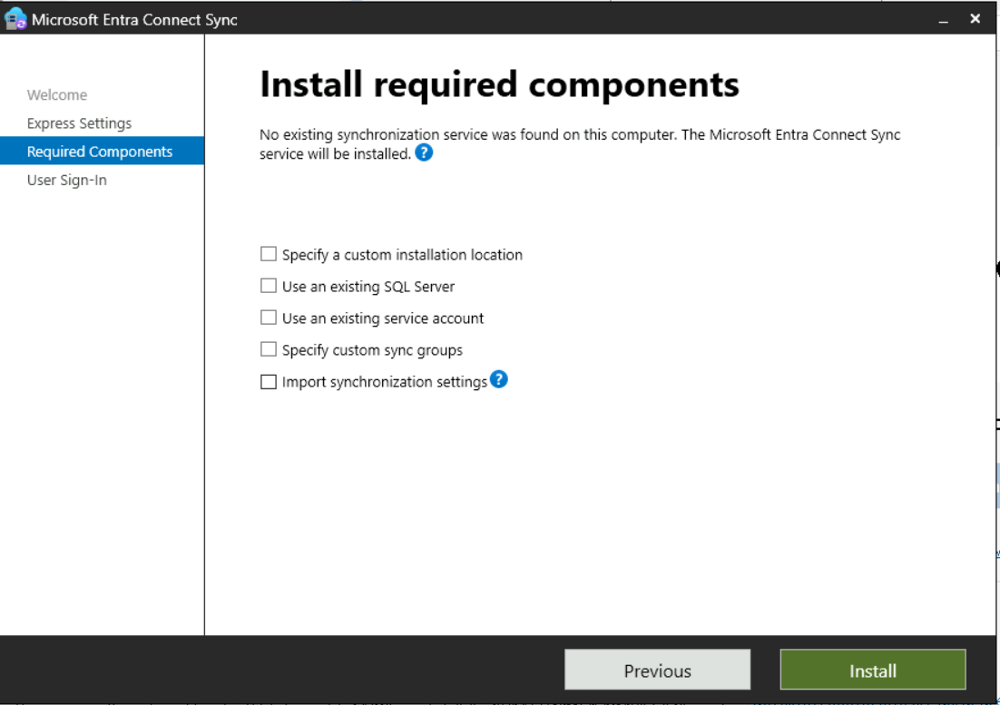
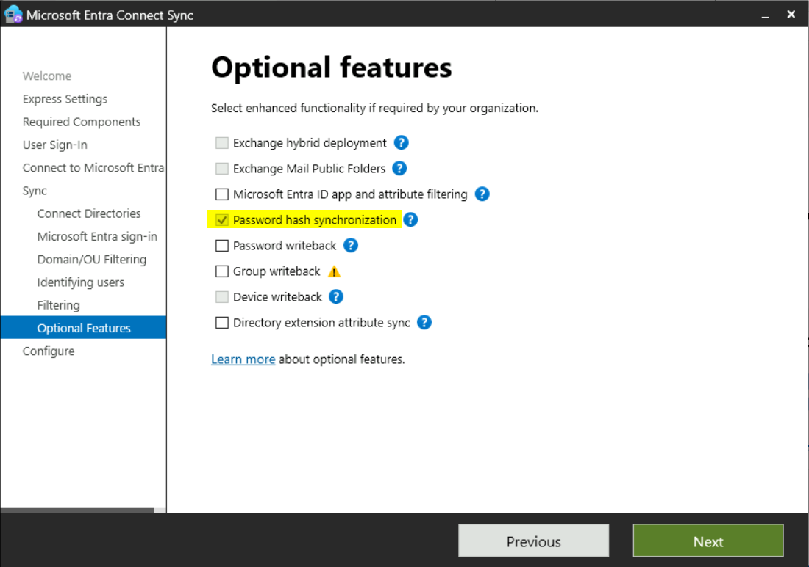
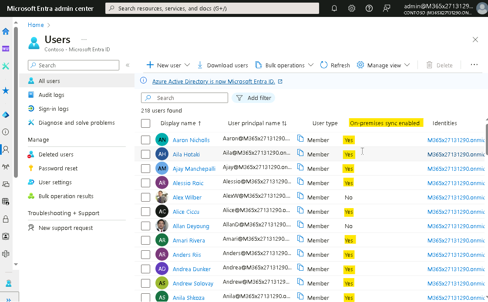

Laboratorio 02 - Sincronizar Identities mediante Microsoft Entra Connect

**Resumen**

En este laboratorio, configuramos la synchronization desde Active
Directory Domain Services a Microsoft Entra ID

**Escenario**

Contoso Corporation de momento está gestionando sus usuarios en AD DS y
Microsoft Entra ID como procesos distintos. Esto puede ser laborioso y
ha resultado en información inconsistente. Se le ha asignado la tarea de
abordar este problema al conectar los dos directorios mediante la
herramienta de Microsoft Entra Connect synchronization.

## Tarea 0: Habilite TLS 1.2 mediante PowerShell script

1.  En **SEA-SVR1**, inicie sesión como **Contoso\Administrator** con la
    contraseña **Pa55w.rd**

2.  En el start menu tecle [**PowerShell**](urn:gd:lg:a:send-vm-keys),
    haga clic derecho en PowerShell y seleccione **run as
    administrator**.

3.  Ejecute el siguiente script en el PowerShell.

**If** (-Not (Test-Path
'HKLM:\SOFTWARE\WOW6432Node\Microsoft\\NETFramework\v4.0.30319'))

{

New-Item 'HKLM:\SOFTWARE\WOW6432Node\Microsoft\\NETFramework\v4.0.30319'
-Force | Out-Null

}

New-ItemProperty -Path
'HKLM:\SOFTWARE\WOW6432Node\Microsoft\\NETFramework\v4.0.30319' -Name
'SystemDefaultTlsVersions' -Value '1' -PropertyType 'DWord' -Force |
Out-Null

New-ItemProperty -Path
'HKLM:\SOFTWARE\WOW6432Node\Microsoft\\NETFramework\v4.0.30319' -Name
'SchUseStrongCrypto' -Value '1' -PropertyType 'DWord' -Force | Out-Null

**If** (-Not (Test-Path
'HKLM:\SOFTWARE\Microsoft\\NETFramework\v4.0.30319'))

{

New-Item 'HKLM:\SOFTWARE\Microsoft\\NETFramework\v4.0.30319' -Force |
Out-Null

}

New-ItemProperty -Path
'HKLM:\SOFTWARE\Microsoft\\NETFramework\v4.0.30319' -Name
'SystemDefaultTlsVersions' -Value '1' -PropertyType 'DWord' -Force |
Out-Null

New-ItemProperty -Path
'HKLM:\SOFTWARE\Microsoft\\NETFramework\v4.0.30319' -Name
'SchUseStrongCrypto' -Value '1' -PropertyType 'DWord' -Force | Out-Null

**If** (-Not (Test-Path
'HKLM:\SYSTEM\CurrentControlSet\Control\SecurityProviders\SCHANNEL\Protocols\TLS
1.2\Server'))

{

New-Item
'HKLM:\SYSTEM\CurrentControlSet\Control\SecurityProviders\SCHANNEL\Protocols\TLS
1.2\Server' -Force | Out-Null

}

New-ItemProperty -Path
'HKLM:\SYSTEM\CurrentControlSet\Control\SecurityProviders\SCHANNEL\Protocols\TLS
1.2\Server' -Name 'Enabled' -Value '1' -PropertyType 'DWord' -Force |
Out-Null

New-ItemProperty -Path
'HKLM:\SYSTEM\CurrentControlSet\Control\SecurityProviders\SCHANNEL\Protocols\TLS
1.2\Server' -Name 'DisabledByDefault' -Value '0' -PropertyType 'DWord'
-Force | Out-Null

**If** (-Not (Test-Path
'HKLM:\SYSTEM\CurrentControlSet\Control\SecurityProviders\SCHANNEL\Protocols\TLS
1.2\Client'))

{

New-Item
'HKLM:\SYSTEM\CurrentControlSet\Control\SecurityProviders\SCHANNEL\Protocols\TLS
1.2\Client' -Force | Out-Null

}

New-ItemProperty -Path
'HKLM:\SYSTEM\CurrentControlSet\Control\SecurityProviders\SCHANNEL\Protocols\TLS
1.2\Client' -Name 'Enabled' -Value '1' -PropertyType 'DWord' -Force |
Out-Null

New-ItemProperty -Path
'HKLM:\SYSTEM\CurrentControlSet\Control\SecurityProviders\SCHANNEL\Protocols\TLS
1.2\Client' -Name 'DisabledByDefault' -Value '0' -PropertyType 'DWord'
-Force | Out-Null

Write-Host 'TLS 1.2 has been enabled. You must restart the Windows
Server for the changes to take affect.' -ForegroundColor Cyan

4.  Reinicie el Windows Server VM.

Tarea 1: Configure el directory synchronization con Microsoft Entra
Connect

1.  En [***SEA-SVR1***](urn:gd:lg:a:select-vm), si es necesario, inicie
    sesión
    como [**Contoso\Administrator**](urn:gd:lg:a:send-vm-keys) con la
    contraseña !\!!

2.  En el taskbar, seleccione **Microsoft Edge**.

3.  En la barra de direcciones,
    introduzca !\!!

4.  En la página Microsoft Entra Connect, seleccione **Download**.

> Microsoft Entra Connect se descarga automáticamente a la
> carpeta **Downloads** en **SEA-SVR1**.
>
> 

5.  Haga clic en **Open file** para el archivo
    descargado **AzureADConnect.msi**.

> 

6.  En el **Microsoft Azure Active Directory Connect** wizard, en la
    página **Welcome to Azure AD Connect**, seleccione la casilla junto
    a **I agree to the license terms and privacy notice** , y
    seleccione **Continue**.

> 

7.  En la página **Express Settings**, seleccione **Customize**.

> 

8.  En la página **Install required components**,
    seleccione **Install**.

> 

9.  En la página **User sign-in**, asegure que está
    seleccionado **Password Hash Synchronization**, y
    seleccione **Next**.

> 

10. En la página **Connect to Azure AD**, en las
    casillas **USERNAME** y **PASSWORD**, introduzca su **Office 365
    Tenant credentials** y seleccione **Next**.

> 

11. En la página **Connect your directories**, asegure que se
    ve **Contoso.com** en **FOREST**, y seleccione **Add Directory**.

> 

12. En la ventana **AD forest account**, seleccione la opción **Create
    New AD Account**, y en el campo **ENTERPRISE ADMIN USERNAME**,
    tecle [**Contoso\Administrator**](urn:gd:lg:a:send-vm-keys), y
    tecle !\!! en el
    campo **PASSWORD**. Seleccione **OK**, y seleccione **Next**.

> 
>
> 

13. En la página **Azure AD sign-in configuration**, asegure que en la
    lista despegable **USER PRINCIPAL NAME**, está seleccionado el
    **userPrincipalName** value.

> 

14. Seleccione **Continue without matching all UPN suffixes to verified
    domains** y luego seleccione **Next**.

15. En la página **Domain and OU filtering**, seleccione **Sync selected
    domains and OUs**.

16. Expanda **Contoso.com**, borre la casilla de verificación junto
    a **Contoso.com** y asegure que se selecciona solo estas
    casillas: **IT**, **Managers**, **Marketing**, **Research**,
    y **Sales**. Seleccione **Next**.

> 

17. En la página **Uniquely identifying your users**,
    seleccione **Next**.

18. En la página **Filter users and devices**, seleccione **Next**.

19. En la página **Optional features**, revise las opciones disponibles,
    pero no haga ningún cambio. Asegure que está seleccionado **Password
    hash synchronization**, y seleccione **Next**.

> 

20. En la página **Ready to configure**, asegure que se
    selecciona **Start the synchronization process when configuration
    completes**, y seleccione **Install**.

> 

21. Cuando termine la configuración, seleccione **Exit**.

> 
>
> **Ojo**: A esa altura, empieza la sincronización de objetos desde su
> Active Directory Domain Services (AD DS) local y Microsoft Entra ID.
> Tiene que esperar unos 3-4 minutos para que se complete este proceso.

22. Cierre todas las ventanas.

Tarea 2: Verifique la synchronization en Microsoft Entra ID

1.  Abre una nueva pestaña en **Microsoft Edge** y navegue a la página
    de usuarios Microsoft Entra admin Center -
    !\!!
    Si le pide iniciar sesión, use los Office 365 Tenant credentials
    desde la pestaña Home del interfaz del Lab.

> 

2.  Verifique que puede ver los usuarios desde su AD DS local. Asegure
    que estos usuarios tienen el valor **Yes** en la
    columna **On-premises sync enabled**.

> 

3.  En el panel de Navigation, expanda **Groups** y seleccione **All
    groups**.

> 

4.  Verifique que ve grupos desde su AD DS () local

> 

5.  Seleccione el grupo **Managers**.

> 

6.  En la página **Managers** group, seleccione **Members** y asegure
    que puede ver usuarios.

> 
>
> 
>
> **Note que no puede agregar o quitar a los usuarios de este grupo, ya
> que tiene su fuente en el AD DS local.**

15. Cierre Microsoft Edge.

**Resultados**: Después de completar este ejercicio, tendrá un Microsoft
Entra Connect configurado exitosamente para sincronizar identity desde
Active Directory Domain Services a Microsoft Entra ID
