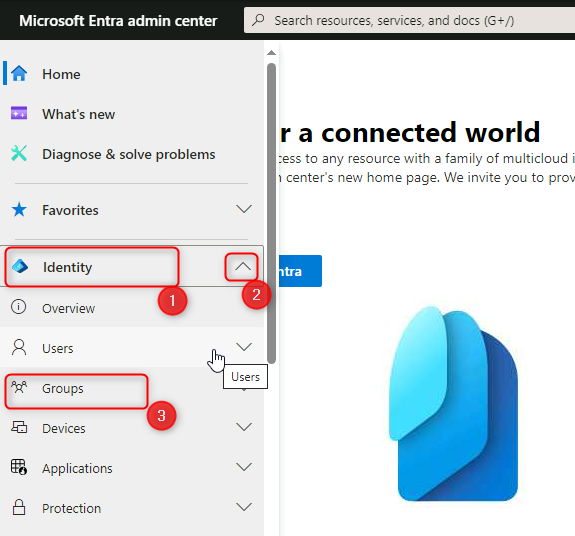
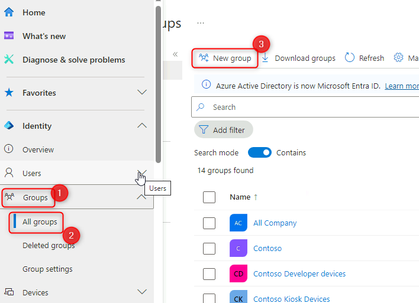
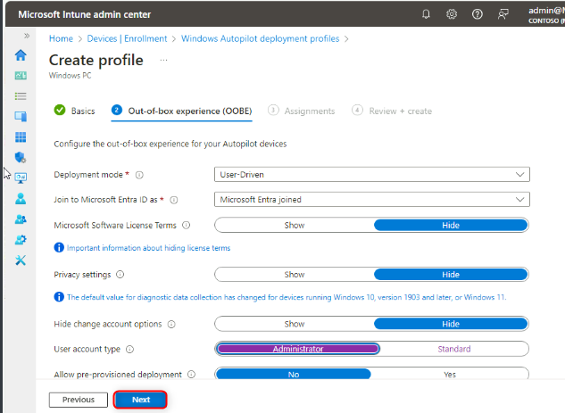
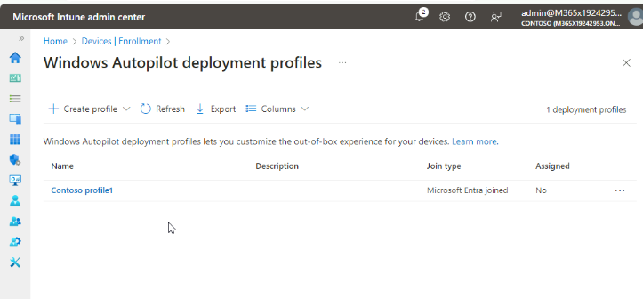
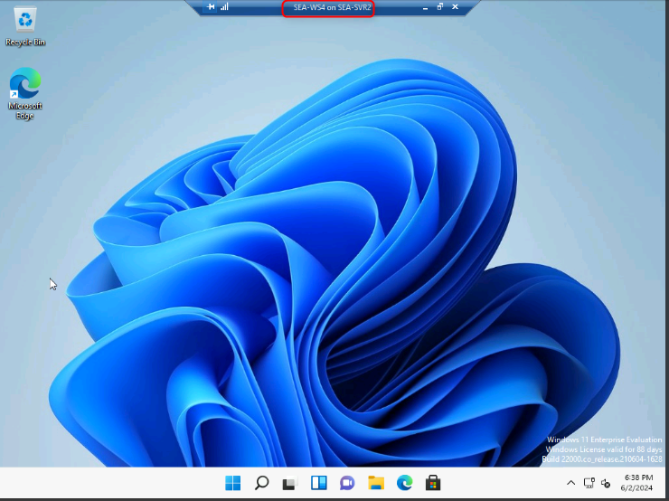
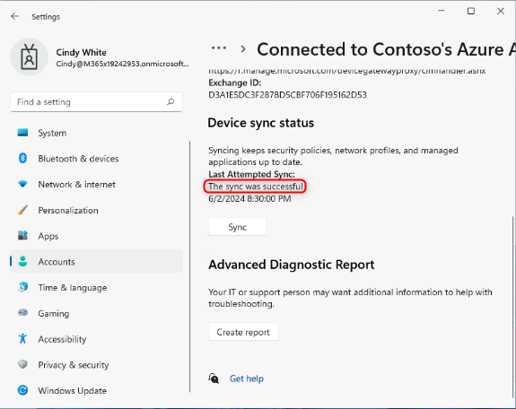

Laboratorio 20: Implementar Windows 11 con Autopilot

**Resumen**

En este laboratorio aprenderá cómo aprovisionar un Windows 11 device con
Autopilot mediante el User-driven mode.

**Prerrequisitos**

Debe completar los siguientes laboratorios antes de este laboratorio:

- Laboratorio 01-Gestionar Identities en Microsoft Entra ID

- Laboratorio 02-Sincronizar Identities mediante Azure AD Connect

- Laboratorio 11-Implementar Windows 11 mediante Microsoft Deployment
  Toolkit

**Escenario**

Contoso IT está planeando la implementación de nuevos dispositivos
Windows 11 mediante Autopilot. Los dispositivos tienen una instalación
predeterminada de Windows 11. Los dispositivos podrián conectar el
dispositivo, encenderlo y responder a preguntas minimal durante el OOBE,
mediante sus credenciales Microsoft Entra ID para iniciar sesión. El
proceso debe inscribirse automáticamente y juntarse en el Entra ID
domain. Se le ha pedido configurar y probar la experiencia con SEA-WS4,
que instaló recientemente y con configuró con Hyper-V.

Tarea 1: Cree un grupo en Microsoft Entra Admin center.

1.  Cambie e inicie sesión
    en [***SEA-SVR1***](urn:gd:lg:a:select-vm) como !!  con la
    contraseña [**Pa55w.rd**](urn:gd:lg:a:send-vm-keys) y
    cierre **Server Manager**.**Contoso\Administrator**!! con la
    contraseña !!!!  y cierre **Server Manager**.

2.  En el taskbar, seleccione **Microsoft Edge**.

3.  En Microsoft Edge, en el address bar, tecle !!﷟HYPERLINK
    "https://entra.microsoft.com"**ttps://entra.microsoft.com**!!, y
    presione **Enter**. Si le pide, inicie sesión con sus
    credenciales.[**admin@M365xXXXXXXXX.onmicrosoft.com**](mailto:admin@M365xXXXXXXXX.onmicrosoft.com)!!
     y la contraseña.

4.  En el panel de navegación, seleccione **Identity.**

5.  En **Identity**, seleccione **Groups**.

> 

6.  En el **Groups | All groups** blade, seleccione **New group**.

> 

7.  En el **New Group** blade, en la lista **Group type**,
    seleccione **Security**.

8.  En el cuadro **Group name**, tecle !!﷟HYPERLINK
    "http://urn:gd:lg:a:send-vm-keys"**IT Devices**!!.

9.  En el cuadro **Group description**, tecle !!﷟HYPERLINK
    "http://urn:gd:lg:a:send-vm-keys"**IT Department Devices**!!.

10. En la lista **Membership type**, seleccione **Dynamic Device**.

11. Seleccione **Add dynamic query**.

> 

12. En el **Dynamic membership rules** blade seleccione **Edit** encima
    del cuadro **Rule syntax**.

> 

13. En el cuadro de texto Edit rule syntax, agregue el siguiente
    membership rule y seleccione **OK**.

14. !!(device.devicePhysicalIDs -any (\_ -contains "\[ZTDId\]"))!!

> 

15. Seleccione **Save** para cerrar **Dynamic membership rules**, y
    seleccione **Create** para crear el grupo.

> 
>
> 
>
> 

Tarea 2: Genere un archivo device-specific comma-separated value (CSV)

1.  Cambie a [***SEA-SVR2***](urn:gd:lg:a:select-vm) e inicie sesión
    como [**Contoso\Administrator**](urn:gd:lg:a:send-vm-keys) con la
    contraseña !!﷟HYPERLINK
    "http://urn:gd:lg:a:send-vm-keys"**Pa55w.rd**!!.

> 

2.  Seleccione **Hyper-V Manager** en el taskbar.

> 

3.  En Virtual Machines, haga clic derecho **SEA-WS4** y
    seleccione **Connect**.

> 

4.  En la ventana **SEA-WS4**, seleccione **Start**. Cuando inicia el
    computer, maximice la ventana.

> 

5.  Inicie sesión
    en **SEA-WS4** como [**Administrator**](urn:gd:lg:a:send-vm-keys) con
    la contraseña !!﷟HYPERLINK
    "http://urn:gd:lg:a:send-vm-keys"**Pa55w.rd**!!.

> 

6.  Haga clic en **Start**, seleccione **Windows Terminal (Admin)**, y
    luego seleccione **Yes** en el prompt **User Account Control**.

> 
>
> 

7.  En el prompt Windows PowerShell command-line, tecle el siguiente
    cmdlet, y luego presione **Enter**:

> !! Install-Script -Name Get-WindowsAutoPilotInfo!!

8.  Recibirá tres prompts. Cada vez,
    tecle [**Y**](urn:gd:lg:a:send-vm-keys), y luego presione **Enter**.

> 

9.  En el prompt Windows PowerShell command-line, tecle el siguiente
    cmdlet, y luego presione **Enter**:

> !!**Set**-ExecutionPolicy *RemoteSigned*!!

10. Cuando se le pide, tecle [**Y**](urn:gd:lg:a:send-vm-keys), y
    presione Enter.

11. En el prompt Windows PowerShell command-line, tecle el siguiente
    cmdlet, y luego presione **Enter**:

> !!Get-WindowsAutoPilotInfo.ps1 -OutputFile C:\Computer.csv!!
>
> 

12. En el prompt Windows PowerShell command-line, tecle el siguiente
    command, prescione **Enter**, y luego revise el siguiente file
    content:

> **type** !!C:\Computer.csv!!
>
> 

13. En el prompt Windows PowerShell command-line, tecle el siguiente
    command, presione **Enter**. Esto copiará el archivo a **SEA-SVR2**:

> copy !!c:\computer.csv \\sea-svr2\labfiles!!
>
> 

14. Cierre el Windows PowerShell command prompt.

Tarea 3: Trabaje con un Windows Autopilot deployment profile

1.  Cambie a [***SEA-SVR1***](urn:gd:lg:a:select-vm).

> 

2.  En **Microsoft Edge**, abra una nueva pestaña y navegue
    a !!﷟HYPERLINK
    "https://intune.microsoft.com"**https://intune.microsoft.com**!! Si
    le pide, inicie sesión con y contraseña
    .[**admin@M365xXXXXXXX.onmicrosoft.com**](mailto:admin@M365xXXXXXXX.onmicrosoft.com)!!.

3.  En el **Microsoft Intune admin center**, seleccione **Devices**.

4.  En la sección **Device enrollment**, seleccione **Enroll devices**.

5.  En el panel de detalles, baje a **Windows Autopilot Deployment
    Program**, y luego selecicone **Devices**.

> 

6.  En el **Windows Autopilot devices** blade en el menu bar,
    seleccione **Import**, seleccione **folder icon** y luego navegue
    a !!﷟HYPERLINK
    "http://urn:gd:lg:a:send-vm-keys"**\\SEA-SVR2\Labfiles**!!,
    seleccione **Computer.csv**, seleccione **Open**, y luego
    seleccione **Import**.

> 
>
> 
>
> 
>
> 
>
> **Ojo**: El proceso de import puede llevar hasta 15 minutos, pero
> normalmente lleva alrededor de 5 minutos.
>
> **Importante**: Después de se complete el proceso, puede que no se vea
> el dispositivo. Si este es el caso, seleccione el botón de **Sync**,
> espere unos minutos, y luego seleccione **Refresh**.

7.  Seleccione **X** para cerrar el **Windows Autopilot devices** blade.

> 

8.  En el Windows enrollment blade, en el panel de detalles,
    seleccione **Deployment Profiles**.

> 

9.  En el **Windows AutoPilot deployment profiles** blade,
    seleccione **Create profile** y seleccione **Windows PC**.

> 

10. En la pestaña **Basics**, en el cuadro de **Name**, tecle
    !!﷟HYPERLINK "http://urn:gd:lg:a:send-vm-keys"**Contoso
    profile1**!!.

11. Para **Convert all targeted devices to
    Autopilot** seleccione **No**, y luego seleccione **Next**.

> 

12. En la pestaña **Out-of-box experience (OOBE)**, asegure que
    el **Deployment mode** está establecido a **User-Driven**.

13. Asegure que **Join to Microsoft Entra ID as** está establecido
    a **Microsoft Entra Joined**.

14. Asegure que se establecen las siguientes opciones:

    - Microsoft Software License Terms: **Hide**

    - Privacy Settings: **Hide**

    - Hide change account options: **Hide**

    - User account type: **Administrator**.

    - Allow pre-provisioned deployment: **No**

    - Language (Region): **Operating system default**

    - Automatically configure keyboard: **Yes**

    - Apply device name template: **No**

15. Seleccione **Next**.

> 

16. En la pestaña **Assignments**, en **Included
    groups** seleccione **Add groups**.

17. Seleccione el **IT Devices** group y haga clic en **Select**.
    Seleccione **Next**.

> 
>
> 
>
> 

18. En el **Review + create** blade, revise la información y
    seleccione **Create**.

> 
>
> 

Tarea 4: Reestablezca el PC

1.  Cambie a [***SEA-SVR2***](urn:gd:lg:a:select-vm). Se debe maximizar
    el **SEA-WS4** computer.

> 

2.  En **SEA-WS4**, seleccione **Start**, tecle !!﷟HYPERLINK
    "http://urn:gd:lg:a:send-vm-keys"**reset**!!  y seleccione **Reset
    this PC**.

> 

3.  En la sección **Reset this PC**, seleccione **Reset PC**.

> 

4.  Seleccione **Remove everything**, y seleccione **Local reinstall**.

> 
>
> 

5.  Seleccione **Next** y luego seleccione **Reset**.

> 
>
> 
>
> **Ojo**: normalmente no se requiere esta tarea para nuevas
> implementaciones de dispositivos físicos. La información de autopilot
> del dispositivo o es proporcionado por el fabricante o se puede
> obtener desde el dispositivo anterior a OOBE. Para los mótivos de este
> laboratorio, debemos iniciar un reestablecimiento para simular un
> nuevo dispositivo OOBE.
>
> **Ojo**: Este proceso puede llevar 45-60 minutos y puede reiniciar
> varias veces durante el proceso. Su instructor puede continuar con el
> siguiente módulo cuando se completa esta tarea. Asegurése de volver a
> completar la tarea 5 durante su próxima sesión del laboratorio.

Tarea 5: Verifique el Autopilot deployment

1.  En la página **Contoso Corp. Sign-in**, introduzca !!﷟HYPERLINK
    "mailto:Cindy@M365x19242953.onmicrosoft.com"**Cindy@M365x19242953.onmicrosoft.com**!!
    y seleccione **Next**.

2.  En la página Password, introduzca !!﷟HYPERLINK
    "mailto:P@55w.rd1234"**P@55w.rd1234**!! y seleccione **Sign in**.

3.  En el **Use Windows Hello with your account**, seleccione **OK**.

> 

4.  En la página **Verify your identity**, seleccione el Text
    verification method.

> 

5.  En la página **Enter code**, introduzca el código que se mandaron a
    través del texto en a su dispositivo móvil y seleccione **Verify**.

> 

6.  En el cuadro de diálogo **Setup up a PIN**, en los campos **New
    PIN** y **Confirm PIN**,
    introduzca [**102938**](urn:gd:lg:a:send-vm-keys), y
    seleccione **OK**.

> 

7.  En la página **All set!**, seleccione **OK**.

8.  Seleccione **Start** y seleccione **Settings**.

> 

9.  Seleccione **Accounts**, y luego seleccione **Access work or
    school**. Verifique que se conecta el dispositivo a Azure AD de
    Contoso.

> 

10. Seleccione **Connected to Contoso's Azure AD** y
    seleccione **Info**.

> 

11. En la página **Managed by Contoso**, baje y seleccione **Sync**.

> 
>
> 

12. En **SEA-WS4**, cierre la ventana de **Settings**.

13. Cambie a [***SEA-SVR1***](urn:gd:lg:a:select-vm).

14. En el Microsoft Entra admin center, seleccione **Identity**,
    seleccione **Devices** y luego seleccione **All devices**.

> 
>
> Note se ve el dispositivo con el nombre comenzando con "**DESKTOP-**".
> También note que el Join Type es **Microsoft Entra ID joined** con
> Cindy White como el owner.

15. Seleccione el Autopilot device. Revise las opciones de gestión a lo
    largo del menu bar de la parte superior.

> Note que puede hacer **Retire, Wipe, Sync,** y **Restart** el
> dispositivo.

16. Seleccione los tres puntitos al final del menu bar y tome nota de
    las capacidades adicionales de gestión.

> 
>
> 
>
> Las capacidades adicionales incluyen Fresh Start, Autopilot Reset,
> Quick scan, Full scan, y también otros más.

17. Cierre Microsoft Edge.

**Resultados**: Después de completar el ejercicio, habrá aprovisionado
un dispositivo Windows 11 con Autopilot mediante User-driven mode.
