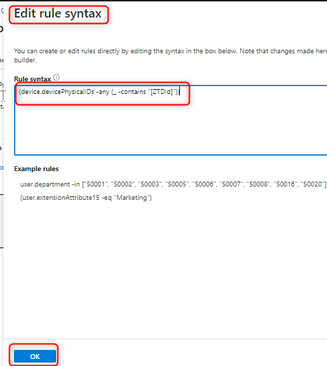
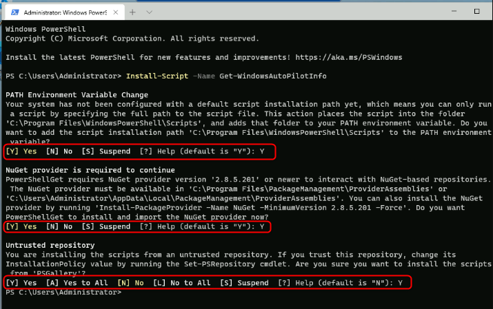
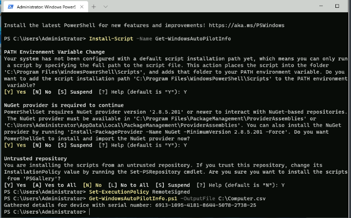
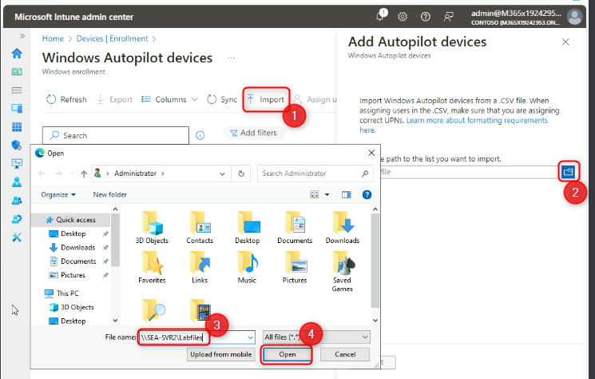
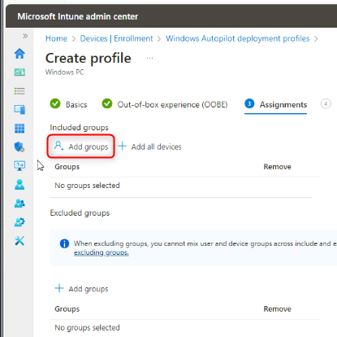
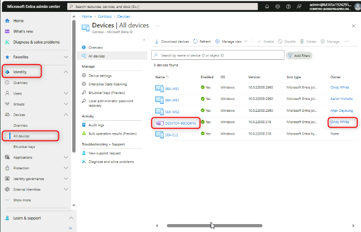

Atelier20 : Déploiement de Windows 11 avec Autopilot

**Résumé**

Dans cet atelier, vous allez apprendre à provisionner un appareil
Windows 11 avec Autopilot à l'aide du mode piloté par l'utilisateur.

**Conditions préalables**

Le(s) Ateliers suivant(s) doit(vent) être complété(s) avant cet atelier:

- Atelier 01-Gestion des identités dans Microsoft Entra ID

- Ateleier 02 : synchronisation des identités à l'aide d'Azure AD
  Connect

- Ateleier 11 : Déploiement de Windows 11 à l'aide de Microsoft
  Deployment Toolkit

**Scénario**

Le service informatique de Contoso prévoit de déployer de nouveaux
appareils Windows 11 à l'aide d'Autopilot. Les appareils ont une
installation par défaut de Windows 11. Les utilisateurs doivent être en
mesure de connecter l'appareil, de l'allumer et de répondre à un minimum
de questions pendant l'OOBE, en utilisant leurs informations
d'identification Microsoft Entra ID pour se connecter. Le processus doit
automatiquement s'inscrire et rejoindre le domaine Entra ID. Vous avez
été invité à configurer et à tester l'expérience à l'aide de SEA-WS4,
que vous avez récemment installé et configuré à l'aide d'Hyper-V.

Tâche 1 : Créer un groupe dans le Microsoft Entra Admin center.

1.  Basculez et connectez-vous à [***SEA-SVR1***](urn:gd:lg:a:select-vm)
    en tant que !! avec le mot de passe
    [**Pa55w.rd**](urn:gd:lg:a:send-vm-keys) et fermez **Server Manager
    Contoso\Administrator**!! avec le mot de passe !!!! et fermez le
    **Server Manager**..

2.  Dans la barre des tâches, sélectionnez **Microsoft Edge**.

3.  Dans Microsoft Edge, dans la barre d'adresse, tapez !! HYPERLINK
    « https://entra.microsoft.com" **tps://entra.microsoft.com**!!, puis
    appuyez sur **Enter**. Si vous y êtes invité, connectez-vous à
    l'aide de votre mot de passe et de votre mot de
    passe.[**admin@M365xXXXXXXXX.onmicrosoft.com**](mailto:admin@M365xXXXXXXXX.onmicrosoft.com) !!
    et le mot de passe.

4.  Dans le volet de navigation, sélectionnez **Identity.**

5.  Sous **Identity**, sélectionnez **Groups**.

> 

6.  Dans le panneau **Groups | All groups** , sélectionnez **New
    group**.

> 

7.  Dans le panneau **New group**, dans la liste **group type** ,
    sélectionnez **Sécurity**.

8.  Dans la zone **group name**, tapez !!HYPERLINK
    « http ://urn :gd :lg :a :send-vm-keys" **IT Devices**!!.

9.  Dans la zone **Group Description**, tapez !!HYPERLINK
    « http ://urn :gd :lg :a :send-vm-keys"**IT Department Devices**!!.

10. Dans la liste **Type d'adhésion** , sélectionnez **Dynamic Device**.

11. Sélectionnez **Add dynamic query**.

> 

12. Dans le panneau **Règles d'adhésion dynamiques**, sélectionnez
    **Modifier** au-dessus de la zone **Rule syntax** .

> 

13. Dans la zone de texte Modifier la syntaxe de la règle, ajoutez la
    règle d'appartenance simple suivante et sélectionnez **OK.**

14. !!(device.devicePhysicalIDs -any (\_ -contains « \[ZTDId\] »)) !!

> 

15. Sélectionnez **Save** pour fermer les **Règles d'adhésion
    dynamiques**, puis sélectionnez **Create** pour créer le groupe.

> 
>
> 
>
> 

Tâche 2 : Générer un fichier device-specific comma-separated value (CSV)

1.  Passez à [***SEA-SVR2***](urn:gd:lg:a:select-vm) et connectez-vous
    en tant que [**Contoso\Administrator**](urn:gd:lg:a:send-vm-keys)
    avec le mot de passe de !!HYPERLINK
    « http ://urn :gd :lg :a :send-vm-keys"**Pa55w.rd** !!.

> 

2.  Sélectionnez **Hyper-V Manager**  dans la barre des tâches.

> 

3.  Sous Machines virtuelles, cliquez avec le bouton droit sur
    **SEA-WS4** et sélectionnez **connect**.

> 

4.  Dans la fenêtre **SEA-WS4**, sélectionnez **Start**. Lorsque
    l'ordinateur démarre, agrandissez la fenêtre.

> 

5.  Connectez-vous à **SEA-WS4** en tant
    qu'[**administrateur**](urn:gd:lg:a:send-vm-keys) avec le mot de
    passe de !!HYPERLINK
    « http ://urn :gd :lg :a :send-vm-keys"**Pa55w.rd** !!.

> 

6.  Cliquez avec le bouton droit sur **Start**, sélectionnez **Windows
    Terminal (Admin)**, puis sélectionnez **Yes** à l' invite de **User
    Account Control** .

> 
>
> 

7.  Àu prompt de ligne de commande Windows PowerShell, tapez l'applet de
    commande suivante, puis appuyez sur **Enter** :

> !! Install-Script -Name Get-WindowsAutoPilotInfo!!

8.  Vous recevrez trois Prompts. À chaque fois, tapez
    [**Y**](urn:gd:lg:a:send-vm-keys), puis appuyez sur **Enter**.

> 

9.  Au prompt de ligne de commande Windows PowerShell, tapez l'applet de
    commande suivante, puis appuyez sur **Enter** :

> !!**Set**-ExecutionPolicy *RemoteSigned*!!

10. Lorsque vous y êtes invité, tapez [**Y**](urn:gd:lg:a:send-vm-keys),
    puis appuyez sur Entrée.

11. À l'invite de ligne de commande Windows PowerShell, tapez l'applet
    de commande suivante, puis appuyez sur **Enter** :

> !!Get-WindowsAutoPilotInfo.ps1 -OutputFile C :\Computer.csv !!
>
> 

12. Au prompt de ligne de commande Windows PowerShell, tapez la commande
    suivante, appuyez sur **Enter**, puis examinez le contenu du fichier
    :

13. **tapez** !!C :\Computer.csv !!

> 

14. À l'invite de ligne de commande Windows PowerShell, tapez la
    commande suivante, appuyez sur **Enter**. Cela copiera le fichier
    dans **SEA-SVR2** :

15. copy !!c:\computer.csv \\sea-svr2\labfiles!!

> 

16. Fermez le prompt de commande Windows PowerShell.

Tâche 3 : Utiliser un profil de déploiement Windows Autopilot

1.  Passez à [***SEA-SVR1***](urn:gd:lg:a:select-vm).

> 

2.  Dans **Microsoft Edge**, ouvrez un nouvel onglet et accédez à !!LIEN
    HYPERTEXTE
    « https://intune.microsoft.com"**https://intune.microsoft.com** !!
    Si vous y êtes invité, connectez-vous à l'aide d'un mot de
    passe.[**admin@M365xXXXXXXX.onmicrosoft.com**](mailto:admin@M365xXXXXXXX.onmicrosoft.com) !!
    et mot de passe.

3.  Dans le **Microsoft Intune admin center**, sélectionnez **Devices**.

4.  Dans la section **Device enrollment** , sélectionnez **Inscrire
    l'appareil**.

5.  Dans le volet d'informations, faites défiler jusqu'à Programme de
    **Windows Autopilot Deployment Program**, puis sélectionnez
    **Devices**.

> 

6.  Dans le panneau **Windows Autopilot devices**  de la barre de menus,
    sélectionnez **Import**, sélectionnez **folder icon,** puis accédez
    à !!HYPERLINK
    « http ://urn :gd :lg :a :send-vm-keys"**\\SEA-SVR2\Labfiles** !!,
    sélectionnez **Computer.csv**, **Open**, puis sélectionnez
    **Import**.

> 
>
> 
>
> 
>
> 
>
> **Remarque** : Le processus d'importation peut prendre jusqu'à 15
> minutes, mais prend normalement environ 5 minutes.
>
> **Important** : Une fois le processus terminé, il se peut que
> l'appareil ne s'affiche pas. Si c'est le cas, sélectionnez le bouton
> **Sync**, patientez quelques minutes, puis sélectionnez **Refresh**.

7.  Sélectionnez **X** pour fermer le panneau **Windows Autopilot
    devices** .

> 

8.  Dans le panneau Inscription Windows, dans le volet d'informations,
    sélectionnez **Deployment Profiles**.

> 

9.  Dans le panneau **Windows AutoPilot deployment profiles** ,
    sélectionnez **Create profile**, puis sélectionnez **Windows PC**.

> 

10. Dans l' onglet **bacis**, dans la zone de texte **Name**, tapez
    !!HYPERLINK « http ://urn :gd :lg :a :send-vm-keys"**Contoso
    profile1** !!.

11. Pour **Convertir tous les appareils ciblés en Autopilot**,
    sélectionnez **No**, puis sélectionnez **Next**.

> 

12. Dans l' onglet **Out-of-box experience (OOBE)** **assurez-vous** que
    le **Deployment mode**  est défini sur **User-Driven**.

13. Assurez-vous que **Join to Microsoft Entra ID as**  défini sur
    **Microsoft Entra joined**.

14. Assurez-vous que les options suivantes sont définies :

    - Termes du contrat de licence logiciel Microsoft : **Hide**

    - Paramètres de confidentialité : **Hide**

    - Masquer les options de modification de compte : **Hide**

    - Type de compte utilisateur : **Administrator**.

    - Autoriser le déploiement pré-provisionné : **No**

    - Langue (région) : **Operating system default**

    - Configurer automatiquement le clavier : **yes**

    - Appliquer le modèle de nom de périphérique : **No**

15. Sélectionnez **Next**.

> 

16. Sous l' onglet **Assignments** sous **Included Groups**,
    sélectionnez **Add groups**.

17. Sélectionnez le groupe **IT Devices**  et cliquez sur **Select**.
    Sélectionnez **Next**.

> 
>
> 
>
> 

18. Dans le panneau **Review + create** , passez en revue les
    informations, puis sélectionnez **Create**.

> 
>
> 

Tâche 4 : Réinitialiser le PC

1.  Passez à [***SEA-SVR2***](urn:gd:lg:a:select-vm). L' ordinateur
    **SEA-WS4** doit encore être maximisé.

> 

2.  Sur **SEA-WS4**, sélectionnez **Start**, tapez !!HYPERLINK
    « http ://urn :gd :lg :a :send-vm-keys"**reset**!!  !! et
    sélectionnez **Reset this PC**.

> 

3.  Dans la section **Reset this PC**, sélectionnez **Reset PC**.

> 

4.  Sélectionnez **Remove everything** puis Sélectionnez **Local
    reinstall**.

> 
>
> 

5.  Sélectionnez **Next**, puis **Reset**.

> 
>
> 
>
> **Remarque** : Normalement, cette tâche n'est pas requise pour le
> nouveau déploiement d'appareils physiques. Les informations du pilote
> automatique de l'appareil sont soit fournies par le fabricant, soit
> peuvent être obtenues à partir de l'appareil avant l'OOBE. Pour les
> besoins de cet atelier, nous devons lancer une réinitialisation pour
> simuler un nouvel OOBE de dispositif.
>
> **Remarque** : Ce processus peut prendre 45 à 60 minutes et
> redémarrera plusieurs fois au cours du processus. Votre instructeur
> peut passer au module suivant pendant que cette tâche est terminée.
> Assurez-vous de revenir pour terminer la tâche 5 lors de votre
> prochaine séance de laboratoire.

Tâche 5 : Vérifier le déploiement d'Autopilot

1.  Sur la **Contoso Corp. Sign-in Page** ,entrez !!HYPERLINK
    « mailto:Cindy@M365x19242953.onmicrosoft.com"**Cindy@M365x19242953.onmicrosoft.com** !!et
    sélectionnez **Next**.

2.  Sur la page Mot de passe, entrez !!HYPERLINK
    "mailto :P@55w.rd1234"**P@55w.rd1234** !! et sélectionnez **Sigh
    in**.

3.  Dans **Utiliser Windows Hello avec votre compte**, sélectionnez
    **OK.**

> 

4.  Sur la page **Vérifier votre identité**, sélectionnez la méthode de
    vérification par texte.

> 

5.  Sur la page **Enter code**, entrez le code qui a été envoyé par SMS
    à votre appareil mobile, puis sélectionnez **Verify**

> 

6.  Dans la boîte de dialogue **Setup up a PIN** , dans les champs **New
    PIN** et **Confirm PIN**  entrez
    [**102938**](urn:gd:lg:a:send-vm-keys), puis sélectionnez **OK**.

> 

7.  Sur le **All set!** **!** , sélectionnez **OK.**

8.  Sélectionnez **Start**, puis **Setting**.

> 

9.  Sélectionnez **Accounts** puis Sélectionnez **Access work or
    school**.. Vérifiez que l'appareil est connecté à Azure AD de
    Contoso.

> 

10. Sélectionnez **Connected to Contoso's Azure AD** , puis sélectionnez
    **Info**.

> 

11. Dans la page **Managed by Contoso**  faites défiler l'écran vers le
    bas, puis sélectionnez **Sync**.

> 
>
> 

12. Sur **SEA-WS4**, fermez la fenêtre **Settings**.

13. Passez à [***SEA-SVR1***](urn:gd:lg:a:select-vm).

14. Dans le centre d'administration Microsoft Entra, sélectionnez
    **Identity**, sélectionnez **devices**, puis sélectionnez **All
    device**

> Notez que le nouveau périphérique s'affiche avec un nom commençant
> avec "**DESKTOP-**" . Notez également que le type de connexion est
> **Microsoft Entra ID joined** ave**c** Cindy White comme propriétaire.

15. Sélectionnez l'appareil Autopilot. Passez en revue les options de
    gestion dans la barre de menu supérieure.

> Notez que vous pouvez **mettre hors service, effacer, synchroniser**
> et **Restart** l'appareil.

16. Sélectionnez l'ellipse à la fin de la barre de menus et notez les
    fonctionnalités de gestion supplémentaires.

> 
>
> 
>
> Les capacités supplémentaires incluent le nouveau départ, la
> réinitialisation du pilote automatique, l'analyse rapide, l'analyse
> complète, etc.

17. Fermez Microsoft Edge.

**Résultats** : Une fois cet exercice terminé, vous aurez configuré un
appareil Windows 11 avec Autopilot à l'aide du mode piloté par
l'utilisateur.
