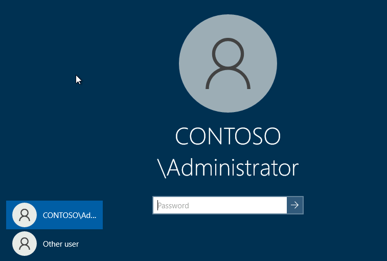
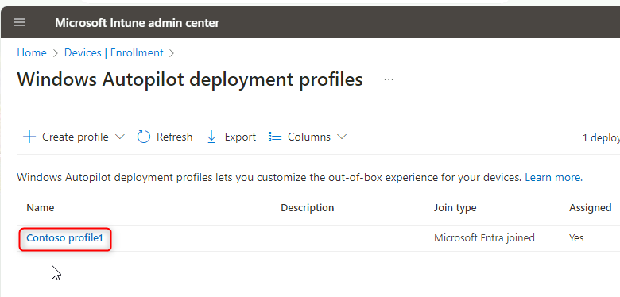
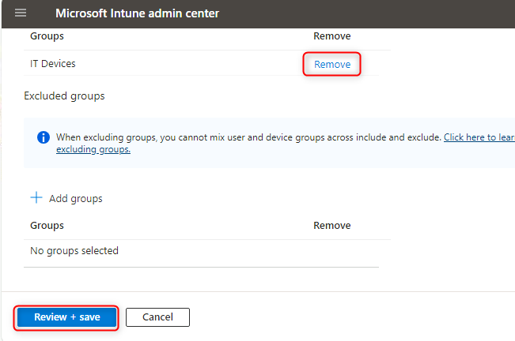
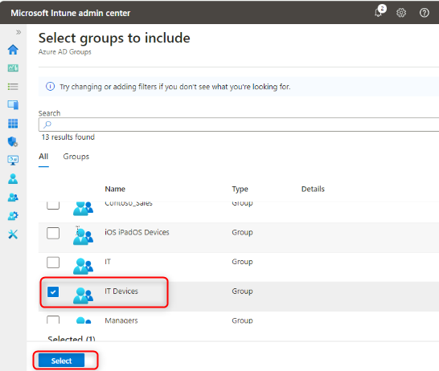
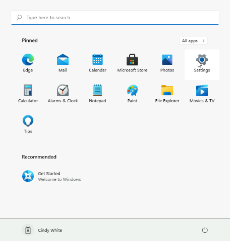

Atelier 21 : Actualisation de Windows avec la réinitialisation du pilote
automatique et le mode de déploiement automatique.

**Résumé**

Dans cet atelier, vous allez apprendre à effectuer une réinitialisation
à distance de l'Autopilot.

**Conditions préalables**

Le(s) Ateliers suivant(s) doit(vent) être complété(s) avant cet atelier:

- Atelier 01-Gestion des identités dans Microsoft Entra ID

- Atelier 02 : synchronisation des identités à l'aide d'Azure AD Connect

- Atelier 21 : Déploiement de Windows 11 à l'aide de Microsoft
  Deployment Toolkit

- Atelier 20 - Déploiement de Windows 11 avec Autopilot

**Scénario**

SEA-WS4 a été déployé à l'aide de Windows Autopilot. Vous devez tester
un autre scénario de provisionnement qui implique la réinitialisation
d'Autopilot. Vous allez créer un profil de déploiement configuré avec le
mode de déploiement automatique de Windows Autopilot.

Tâche 1 : Configurer un profil de déploiement Windows Autopilot à
déploiement automatique

1.  Passez à [***SEA-SVR1***](urn:gd:lg:a:select-vm).

> 

2.  Dans **Microsoft Edge**, ouvrez un nouvel onglet et accédez à
    [**https://intune.microsoft.com**](https://intune.microsoft.com). Si
    vous y êtes invité, connectez-vous à l'aide [**de
    admin@M365xXXXXXXXX.onmicrosoft.com**](mailto:admin@M365xXXXXXXXX.onmicrosoft.com)
    et de paswword.

3.  Dans le **Microsoft Intune admin center** sélectionnez **Devices**.

> 

4.  Dans la section **Device onboarding** , sélectionnez
    **Inscription**.

> 

5.  Dans le panneau Inscription Windows, dans le volet d'informations,
    sélectionnez select **Deployment Profiles**.

> 

6.  Dans le panneau **Windows AutoPilot deployment profiles** ,
    sélectionnez **Contoso profile 1** puis **Properties.**

> 
>
> 
>
> 

7.  Faites défiler jusqu'à **Assignments**  puis sélectionnez **Edit**.

> 

8.  À côté de **IT Devices**, sélectionnez **Remove**.

> 

9.  Sélectionnez **Review and save** , puis Sélectionnez **Save**.

> 

10. Fermer le **Contoso Profile 1|Properties** .

11. Dans le panneau **Windows AutoPilot deployment profiles** ,
    sélectionnez **Createprofile**, puis **Windows PC**.

> 

12. Sous l' onglet **Basics**, dans la zone de texte **Name**, tapez
    [**le profil Contoso 2**](urn:gd:lg:a:send-vm-keys).

13. Pour **Convert all targeted devices to Autopilot**, sélectionnez
    **No**, puis sélectionnez **Next**.

> 

14. Dans l' onglet **Out-of-box experience (OOBE)** **assurez-vous** que
    le **Deployment mode**  est défini sur **Self-Deploying**.

> 

15. Assurez-vous que les options suivantes sont définies :

    - Langue (région) : **Operating system default**

    - Configurer automatiquement le clavier : **Yes**

    - Appliquer le modèle de nom de périphérique :Y**es**

    - Entrez un nom :
      [**Contoso- %RAND :2 %**](urn:gd:lg:a:send-vm-keys)

> 

16. Sélectionnez **Next**.

17. Sous l' onglet **Assignments**, sous **included Groups**,
    sélectionnez **Add groups**.

> 

18. Sélectionnez le groupe **IT Devices** et cliquez sur **Select**.
    Sélectionnez **Next**.

> 
>
> 

19. Dans le panneau **Review + create** , passez en revue les
    informations, puis sélectionnez **Create**.

> 

Tâche 2 : Effectuer une réinitialisation de l'Autopilot

1.  Dans le **Microsoft Intune admin center**, sélectionnez **Devices**,
    puis sélectionnez **All devices**

2.  Sélectionnez l'Autopilot PC (commence par le nom DESKTOP).

> 

3.  Dans la barre de menus, sélectionnez l'ellipse, puis sélectionnez
    **Autopilot Reset**.

> 

4.  À l'invite du message, sélectionnez **Yes**.

> 

5.  Passez à [***SEA-SVR2***](urn:gd:lg:a:select-vm) et agrandissez la
    fenêtre **SEA-WS4**.

> **Remarque** : SEA-WS4 doit toujours être en cours d'exécution à
> partir du laboratoire précédent
>
> **Remarque** : Mettez à jour l'appareil vers la dernière version, puis
> cliquez sur redémarrer.

6.  Redémarrez **SEA-WS4**.

> 
>
> **Remarque** : Ce processus peut prendre 30 minutes et redémarrera
> plusieurs fois au cours du processus. Votre instructeur peut passer au
> module suivant pendant que cette tâche est terminée. Assurez-vous de
> revenir pour terminer la tâche 3 lors de votre prochaine séance de
> laboratoire.

Tâche 3 : Vérifier le déploiement d'Autopilot

1.  Sur la page de connexion, saisissez
    [**Cindy@M365x19242953.onmicrosoft.com**](mailto:Cindy@M365x19242953.onmicrosoft.com)
    avec le mot de passe [**P@55w.rd1234**](mailto:P@55w.rd1234).

2.  Dans **Utiliser Windows Hello avec votre compte**, sélectionnez
    **OK.**

> 

3.  Sur la page **Verify your identity**, sélectionnez la méthode de
    vérification par texte.

4.  Sur la page **Enter** **code**, entrez le code qui a été envoyé par
    SMS à votre appareil mobile, puis sélectionnez **Verify**.

> 

5.  Dans la boîte de **Setup up a PIN** , dans les champs **New PIN** et
    **Confirm PIN**, entrez [**102938**](urn:gd:lg:a:send-vm-keys), puis
    sélectionnez **OK**.

> 

6.  Sur la page **Tout est prêt ! !** , sélectionnez **OK.**

7.  Sélectionnez **Start**, puis Sélectionnez **Settings**.

> 

8.  Sélectionnez **Accounts**, puis **Access work or school**. Vérifiez
    que l'appareil est connecté à Azure AD de Contoso.

> 

9.  Sélectionnez **Connected to Contoso's Azure AD** , puis I
    Sélectionnez **info.**

> 

10. Dans la page **Managed by contoso** , faites défiler l'écran vers le
    bas, puis sélectionnez **Sync**.

> 

11. Sur **SEA-WS4**, fermez la fenêtre **Settings**.

12. Arrêtez **SEA-WS4** et fermez la fenêtre **SEA-WS4**.

13. Sur [***SEA-SVR2***](urn:gd:lg:a:select-vm), fermez le Gestionnaire
    Hyper-V.

**Résultats** : Une fois cet exercice terminé, vous aurez configuré un
appareil Windows 11 avec la réinitialisation Autopilot à l'aide du mode
de déploiement automatique.
